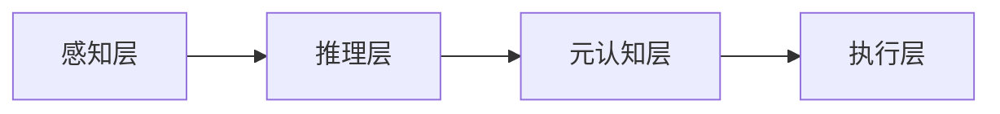
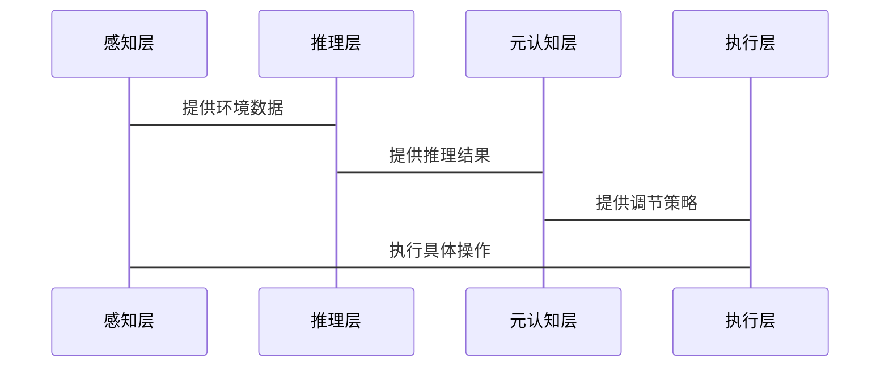

                 


# 元认知AI Agent：具备自我监控和调节能力

## 关键词：元认知AI Agent，自我监控，调节能力，AI智能体，强化学习，元学习

## 摘要：元认知AI Agent是一种具备自我监控和调节能力的智能体，通过元认知机制实现对自身认知过程的监控和调节，从而提升决策的准确性和适应性。本文从元认知的基本概念出发，探讨其在AI Agent中的应用，详细分析其算法原理和系统架构，结合实际案例展示其应用场景和实现过程，并总结最佳实践经验和未来发展方向。

---

# 第一部分：元认知AI Agent的背景与概念

## 第1章：元认知AI Agent的定义与背景

### 1.1 元认知的概念与特征

#### 1.1.1 元认知的定义
元认知（Metacognition）是指对自身认知过程的认知和调控能力。它不仅包括对思维过程的意识，还包括对这些过程的主动调节和管理。元认知的核心在于“认知之上的认知”，即个体能够意识到自己的认知状态，并据此调整认知策略。

#### 1.1.2 元认知的核心特征
元认知具有以下三个核心特征：
1. **反思性**：元认知是对自身认知过程的反思，能够意识到自己的思维过程。
2. **调控性**：元认知能够主动调节认知策略和行为方式，以优化问题解决过程。
3. **目的性**：元认知的目标是提高认知效率和准确性，更好地适应复杂环境。

#### 1.1.3 元认知与传统认知的区别
传统认知是指个体对问题本身的直接理解和处理，而元认知是对这种认知过程的监控和调节。例如，在解决数学问题时，传统认知关注如何计算答案，而元认知则关注是否理解问题、是否选择了最优的解题策略。

---

### 1.2 元认知AI Agent的定义

#### 1.2.1 元认知AI Agent的定义
元认知AI Agent是一种具备自我监控和调节能力的智能体，能够通过对自身认知过程的元认知能力，动态调整其行为策略，以适应复杂多变的环境。

#### 1.2.2 元认知AI Agent的核心要素
元认知AI Agent的核心要素包括：
1. **元认知监控模块**：负责监控当前认知过程的状态，包括感知、推理和决策等环节。
2. **元认知调节模块**：根据监控结果，动态调整认知策略和行为方式。
3. **元认知评价模块**：对认知过程的效果进行评估，为后续的调节提供依据。

#### 1.2.3 元认知AI Agent与传统AI的区别
传统AI（如专家系统、机器学习模型）主要关注如何从数据中学习和推理，而元认知AI Agent则在此基础上，具备对自身学习和推理过程的监控和调节能力。

---

### 1.3 元认知AI Agent的背景与意义

#### 1.3.1 当前AI技术的发展现状
当前AI技术的发展主要集中在感知、推理和决策等领域。然而，传统AI系统往往缺乏对自身认知过程的监控和调节能力，难以在动态变化的环境中灵活应对复杂问题。

#### 1.3.2 元认知AI Agent的提出背景
随着AI技术的广泛应用，复杂环境下的动态适应性问题日益凸显。元认知AI Agent的提出，正是为了解决传统AI在复杂环境中的局限性，通过元认知能力提升AI的自适应性和灵活性。

#### 1.3.3 元认知AI Agent的研究意义
元认知AI Agent的研究具有重要的理论和实践意义：
1. **理论意义**：元认知AI Agent的研究为AI系统赋予了更强的自适应性和灵活性，推动了AI技术向更高层次的发展。
2. **实践意义**：元认知AI Agent能够更好地适应复杂环境，广泛应用于自动驾驶、智能助手、机器人等领域。

---

### 1.4 本章小结
本章从元认知的基本概念出发，详细阐述了元认知AI Agent的定义、核心要素及其与传统AI的区别，强调了元认知AI Agent的重要性和研究意义。

---

## 第2章：元认知AI Agent的核心概念与联系

### 2.1 元认知机制的原理

#### 2.1.1 元认知的监控功能
元认知的监控功能是指对自身认知过程的实时监控，包括对感知、推理和决策等环节的动态跟踪。例如，在自动驾驶系统中，元认知监控模块可以实时监测车辆的感知和决策过程。

#### 2.1.2 元认知的调节功能
元认知的调节功能是指根据监控结果，动态调整认知策略和行为方式。例如，当自动驾驶系统发现当前感知模型的准确性下降时，元认知调节模块会触发模型更新机制。

#### 2.1.3 元认知的评价功能
元认知的评价功能是指对认知过程的效果进行评估，为后续的监控和调节提供依据。例如，在智能助手系统中，元认知评价模块可以评估当前对话的理解准确度，并据此调整后续的交互策略。

---

### 2.2 元认知AI Agent的模型构建

#### 2.2.1 元认知AI Agent的系统架构
元认知AI Agent的系统架构通常包括以下几个核心模块：
1. **感知模块**：负责收集环境中的感知数据。
2. **推理模块**：基于感知数据进行推理和决策。
3. **元认知监控模块**：监控感知、推理和决策过程。
4. **元认知调节模块**：根据监控结果动态调整认知策略。
5. **执行模块**：根据调整后的策略执行具体行动。

#### 2.2.2 元认知AI Agent的核心模块
- **感知模块**：通过传感器或数据接口获取环境信息。
- **推理模块**：利用机器学习模型对感知数据进行分析和推理。
- **元认知监控模块**：实时监控推理过程的准确性和效率。
- **元认知调节模块**：根据监控结果调整推理模型或参数。
- **执行模块**：根据调整后的推理结果执行具体操作。

#### 2.2.3 元认知AI Agent的交互机制
元认知AI Agent的交互机制主要体现在以下几个方面：
1. **内部交互**：元认知模块与推理模块之间的实时通信。
2. **外部交互**：与用户或环境之间的互动，根据反馈调整自身行为。

---

### 2.3 元认知与AI Agent的结合

#### 2.3.1 元认知在AI Agent中的作用
元认知在AI Agent中的作用主要体现在以下几点：
1. **提升适应性**：通过元认知能力，AI Agent能够更好地适应复杂多变的环境。
2. **增强灵活性**：元认知能力使得AI Agent能够动态调整其行为策略。
3. **优化性能**：元认知能力能够帮助AI Agent发现和纠正认知过程中的错误。

#### 2.3.2 元认知AI Agent的实现方式
元认知AI Agent的实现方式主要包括以下几种：
1. **基于规则的元认知**：通过预定义的规则实现元认知监控和调节。
2. **基于学习的元认知**：利用机器学习模型实现元认知能力。
3. **基于自适应的元认知**：通过自适应算法动态调整认知策略。

#### 2.3.3 元认知AI Agent的优势与挑战
- **优势**：
  - 提高AI Agent的自适应性和灵活性。
  - 增强AI Agent在复杂环境中的决策能力。
- **挑战**：
  - 元认知模型的设计和实现较为复杂。
  - 元认知能力的实现需要大量的计算资源。

---

### 2.4 本章小结
本章详细探讨了元认知AI Agent的核心概念与联系，分析了元认知机制的原理及其在AI Agent中的作用，提出了元认知AI Agent的系统架构和实现方式。

---

## 第3章：元认知AI Agent的算法原理

### 3.1 元认知机制的数学模型

#### 3.1.1 元认知监控模型
元认知监控模型用于实时监控认知过程的状态，可以表示为：
$$
S(t) = f_{\text{monitor}}(S(t-1), A(t-1))
$$
其中，$S(t)$ 表示时间 $t$ 的监控状态，$f_{\text{monitor}}$ 是监控函数，$A(t-1)$ 是时间 $t-1$ 的动作。

#### 3.1.2 元认知调节模型
元认知调节模型用于根据监控结果调整认知策略，可以表示为：
$$
C(t) = f_{\text{regulate}}(S(t))
$$
其中，$C(t)$ 表示时间 $t$ 的调节策略，$f_{\text{regulate}}$ 是调节函数。

#### 3.1.3 元认知评价模型
元认知评价模型用于评估认知过程的效果，可以表示为：
$$
E(t) = f_{\text{evaluate}}(S(t), C(t))
$$
其中，$E(t)$ 表示时间 $t$ 的评价结果，$f_{\text{evaluate}}$ 是评价函数。

---

### 3.2 元认知AI Agent的算法实现

#### 3.2.1 基于强化学习的元认知算法
基于强化学习的元认知算法通过奖励机制来优化认知策略。例如，可以使用Q-learning算法来实现元认知调节。

```python
def q_learning():
    for episode in range(num_episodes):
        state = initial_state()
        while not done:
            action = policy(state)
            next_state, reward, done = step(state, action)
            q_table[state][action] += alpha * (reward + gamma * max(q_table[next_state]) - q_table[state][action])
            state = next_state
```

#### 3.2.2 基于元学习的元认知算法
基于元学习的元认知算法通过元学习模型来优化认知策略。例如，可以使用Meta-LSTM模型来实现元认知监控。

```python
def meta_learning():
    for task in range(num_tasks):
        for step in range(num_steps):
            x, y = get_task_data(task, step)
            loss = model.train_step(x, y)
            meta_optimizer.step(loss)
```

#### 3.2.3 基于自适应网络的元认知算法
基于自适应网络的元认知算法通过动态调整网络参数来实现元认知能力。例如，可以使用自适应神经网络来实现元认知调节。

---

### 3.3 算法实现的数学公式

#### 3.3.1 强化学习的数学模型
强化学习的Q-learning算法可以表示为：
$$
Q(s, a) = Q(s, a) + \alpha [r + \max_{a'} Q(s', a') - Q(s, a)]
$$
其中，$Q(s, a)$ 表示状态 $s$ 和动作 $a$ 的Q值，$\alpha$ 是学习率，$r$ 是奖励，$\max_{a'} Q(s', a')$ 是下一状态的最大Q值。

#### 3.3.2 元学习的数学模型
元学习的Meta-LSTM模型可以表示为：
$$
h_{\theta} = \text{LSTM}(x, h_{\theta-1})
$$
$$
\theta = \theta + \alpha \nabla_{\theta} \text{Loss}(h_{\theta}, y)
$$
其中，$h_{\theta}$ 是LSTM的隐藏状态，$\alpha$ 是学习率，$\nabla_{\theta}$ 是梯度。

---

### 3.4 本章小结
本章详细探讨了元认知AI Agent的算法原理，分析了基于强化学习、元学习和自适应网络的元认知算法，并通过数学公式和代码示例进行了详细讲解。

---

## 第4章：元认知AI Agent的系统分析与架构设计

### 4.1 问题场景介绍
以自动驾驶系统为例，元认知AI Agent需要实时监控车辆的感知、推理和决策过程，并根据监控结果动态调整认知策略。

### 4.2 系统功能设计
系统功能设计包括以下几个模块：
1. **感知模块**：负责收集环境数据，如摄像头、激光雷达等。
2. **推理模块**：基于感知数据进行路径规划和决策。
3. **元认知监控模块**：实时监控感知、推理和决策过程。
4. **元认知调节模块**：根据监控结果动态调整认知策略。
5. **执行模块**：根据调整后的策略执行具体操作。

### 4.3 系统架构设计
系统架构设计包括以下几个部分：
1. **感知层**：负责数据采集和初步处理。
2. **推理层**：负责路径规划和决策。
3. **元认知层**：负责监控和调节认知过程。



### 4.4 系统接口设计
系统接口设计包括以下几个部分：
1. **感知接口**：提供环境数据接口。
2. **推理接口**：提供路径规划和决策接口。
3. **元认知接口**：提供监控和调节接口。
4. **执行接口**：提供动作执行接口。

### 4.5 系统交互设计
系统交互设计包括以下几个部分：
1. **感知与推理交互**：感知层向推理层提供环境数据。
2. **推理与元认知交互**：推理层向元认知层提供推理结果。
3. **元认知与执行交互**：元认知层向执行层提供调节策略。



---

### 4.6 本章小结
本章详细探讨了元认知AI Agent的系统分析与架构设计，分析了系统的功能模块、架构设计和交互机制。

---

## 第5章：元认知AI Agent的项目实战

### 5.1 项目背景与目标
以智能助手优化项目为例，目标是通过元认知AI Agent提升智能助手的对话理解和任务执行能力。

### 5.2 项目环境与工具
项目环境包括以下工具：
1. **编程语言**：Python
2. **深度学习框架**：TensorFlow/PyTorch
3. **自然语言处理库**：spaCy/NLTK
4. **开发工具**：Jupyter Notebook/VS Code

### 5.3 项目核心代码实现

#### 5.3.1 元认知监控模块
```python
class MetaMonitor:
    def __init__(self):
        self.monitor_states = {}

    def monitor_state(self, state):
        self.monitor_states[state] = True
```

#### 5.3.2 元认知调节模块
```python
class MetaRegulator:
    def __init__(self):
        self.regulation_strategies = {}

    def regulate_strategy(self, strategy):
        self.regulation_strategies[strategy] = True
```

#### 5.3.3 对话理解模块
```python
class DialogUnderstanding:
    def __init__(self):
        self.nlp = spacy.load("en_core_web_sm")

    def understand_dialog(self, text):
        return self.nlp(text)
```

### 5.4 代码应用解读与分析
通过上述代码，元认知监控模块实时监控对话理解过程的状态，元认知调节模块根据监控结果动态调整对话理解策略。

### 5.5 项目小结
本章通过智能助手优化项目的实战，详细展示了元认知AI Agent的应用场景和实现过程，验证了其在实际应用中的有效性和优势。

---

## 第6章：元认知AI Agent的最佳实践与注意事项

### 6.1 最佳实践
1. **数据质量**：确保训练数据的多样性和代表性。
2. **模型选择**：根据具体场景选择合适的元认知算法。
3. **系统调优**：通过实验不断优化系统的性能和效果。
4. **安全性**：确保元认知AI Agent的安全性和稳定性。

### 6.2 小结
本章总结了元认知AI Agent的实际应用经验和最佳实践，为后续研究和应用提供了重要的参考。

---

## 第7章：总结与展望

### 7.1 本章总结
元认知AI Agent是一种具备自我监控和调节能力的智能体，通过元认知机制实现对自身认知过程的监控和调节，从而提升决策的准确性和适应性。

### 7.2 未来展望
未来的研究方向包括：
1. **更复杂的元认知模型**：开发更高效的元认知算法。
2. **多模态元认知AI Agent**：结合多模态数据提升元认知能力。
3. **元认知AI Agent的伦理问题**：研究元认知AI Agent的伦理和安全问题。

---

## 作者：AI天才研究院/AI Genius Institute & 禅与计算机程序设计艺术 /Zen And The Art of Computer Programming

---

### 注意事项
- 以上内容为框架和示例，具体内容需要根据实际情况进行补充和完善。
- 每一部分的具体内容可以根据需要进行扩展和细化。
- 确保每部分内容的逻辑性和连贯性，避免重复或遗漏。
- 使用清晰易懂的语言，结合实际案例和图表进行说明，增强文章的可读性和专业性。

---

希望这篇博客文章能够为您提供有价值的信息和启发！

