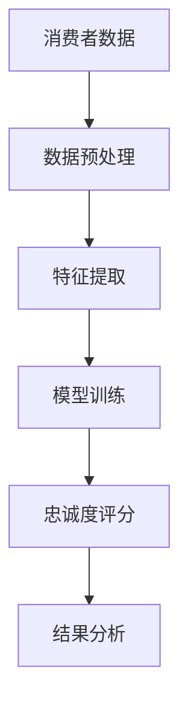
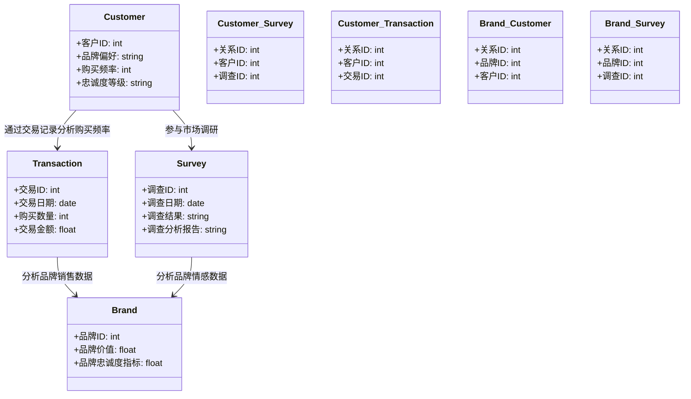
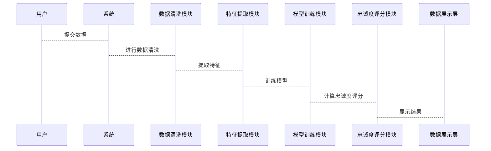

                 


# 如何评估企业的品牌忠诚度价值

> 关键词：品牌忠诚度，品牌价值，客户忠诚度，数据分析，评估方法，企业战略

> 摘要：品牌忠诚度是企业在市场竞争中保持长期优势的重要因素。本文从品牌忠诚度的定义、核心概念、评估方法与工具、系统分析与架构设计、项目实战案例分析、最佳实践与策略、未来趋势与挑战等方面进行详细探讨，帮助企业在复杂市场环境中有效评估和提升品牌忠诚度价值。

----------------------------------------------------------------

## 引言

### 1.1 问题背景与重要性

品牌忠诚度是企业在市场竞争中保持长期优势的重要因素。在当前快速变化的市场环境中，消费者的选择日益多样化，企业如何评估和提升品牌忠诚度成为一项关键挑战。品牌忠诚度不仅关系到企业的市场份额和收入，还影响企业的长期发展和品牌价值。本文将从理论和实践两个角度，系统地探讨如何评估企业品牌忠诚度价值。

### 1.2 核心内容与目标

本文旨在通过分析品牌忠诚度的定义、核心概念、评估方法与工具、系统分析与架构设计、项目实战案例分析、最佳实践与策略、未来趋势与挑战等方面，帮助读者全面了解品牌忠诚度价值的评估方法，并提供实用的技术和工具支持。

### 1.3 本文结构

本文分为以下几个部分：
1. 品牌忠诚度价值评估的背景与核心概念
2. 品牌忠诚度价值评估的方法与工具
3. 品牌忠诚度价值评估的系统分析与架构设计
4. 品牌忠诚度价值评估的项目实战与案例分析
5. 品牌忠诚度价值评估的最佳实践与策略
6. 品牌忠诚度价值评估的未来趋势与挑战

## 第1章：品牌忠诚度价值评估的背景与核心概念

### 1.1 品牌忠诚度的定义与内涵

#### 1.1.1 品牌忠诚度的定义

品牌忠诚度是指消费者在面对多个品牌选择时，持续选择某个品牌产品或服务的程度。忠诚的消费者不仅会重复购买同一品牌的产品，还会在品牌推出新产品时尝试，甚至在品牌出现问题时仍愿意给予第二次机会。

#### 1.1.2 品牌忠诚度的核心要素

品牌忠诚度的核心要素包括：
- **情感忠诚**：消费者对品牌的情感认同和品牌偏好。
- **行为忠诚**：消费者在实际购买行为中持续选择该品牌。
- **态度忠诚**：消费者在品牌忠诚度调查中的积极态度和评价。

#### 1.1.3 品牌忠诚度的分类与层次

品牌忠诚度可以分为以下几类：
- **无品牌忠诚**：消费者对品牌无特定偏好，选择基于价格和可用性。
- **低品牌忠诚**：消费者在特定情况下选择某个品牌，但对其他品牌持开放态度。
- **中等品牌忠诚**：消费者在大多数情况下选择某个品牌，但在特定情况下可能转换。
- **高品牌忠诚**：消费者在大多数情况下坚持选择某个品牌，并在品牌出现问题时仍愿意尝试修复。

### 1.2 企业品牌忠诚度价值评估的背景

#### 1.2.1 当前市场竞争环境的变化

当前市场竞争日益激烈，消费者的选择更加多样化。企业需要通过品牌忠诚度评估来识别高价值客户，优化市场策略，提高客户保留率和满意度。

#### 1.2.2 消费者行为的演变

消费者行为从单纯的购买决策向体验式消费转变，消费者更注重品牌与自身价值观的契合，品牌忠诚度的评估需要考虑消费者的情感因素和体验。

#### 1.2.3 企业品牌忠诚度价值的重要性

品牌忠诚度高的消费者通常具有更高的生命周期价值，为企业带来更多的收入和利润。此外，忠诚的消费者还会为企业提供免费的口碑推广，降低市场推广成本。

### 1.3 问题背景与问题描述

#### 1.3.1 企业品牌忠诚度价值评估的核心问题

企业品牌忠诚度价值评估的核心问题是如何准确测量和量化消费者对品牌的情感和行为忠诚度，并将其与企业的市场表现和财务指标相结合，制定有效的市场策略。

#### 1.3.2 问题的边界与外延

品牌忠诚度评估的边界包括消费者行为数据、市场调研数据和企业内部数据。外延则包括品牌忠诚度的影响因素、品牌忠诚度的提升策略以及品牌忠诚度与企业绩效的关系。

#### 1.3.3 问题解决的目标与意义

通过品牌忠诚度评估，企业可以识别高价值客户，优化市场策略，提高客户保留率和满意度，从而提升企业的品牌价值和市场竞争力。

## 第2章：品牌忠诚度价值评估的核心概念与联系

### 2.1 核心概念原理

#### 2.1.1 品牌忠诚度的形成机制

品牌忠诚度的形成机制包括品牌认知、品牌情感、品牌满意度、品牌信任和品牌承诺等因素。消费者在购买过程中，通过对品牌各方面的认知和体验，逐步形成对品牌的忠诚度。

#### 2.1.2 品牌价值的构成要素

品牌价值由品牌知名度、品牌声誉、品牌认知度、品牌忠诚度和品牌联想等多个要素构成。这些要素相互作用，共同影响品牌的价值和市场表现。

#### 2.1.3 忠诚度与品牌价值的关系

品牌忠诚度是品牌价值的重要组成部分。高忠诚度的消费者会为企业带来持续的收入和利润，同时减少营销成本和客户获取成本。

### 2.2 核心概念属性特征对比

#### 2.2.1 品牌忠诚度与品牌知名度的对比

- **品牌忠诚度**：消费者对品牌的持续选择意愿。
- **品牌知名度**：消费者对品牌的认知和记忆程度。

#### 2.2.2 品牌忠诚度与客户满意度的对比

- **品牌忠诚度**：消费者对品牌的持续选择意愿。
- **客户满意度**：消费者对产品或服务的满意程度。

#### 2.2.3 品牌忠诚度与客户生命周期价值的对比

- **品牌忠诚度**：影响客户在生命周期中的购买频率和购买金额。
- **客户生命周期价值**：客户在企业生命周期中为企业带来的总收入。

### 2.3 ER实体关系图架构

以下是品牌忠诚度评估的ER实体关系图：

```mermaid
er
  Customer
  - 客户ID
  - 品牌偏好
  - 购买频率
  - 忠诚度等级
  Brand
  - 品牌ID
  - 品牌价值
  - 品牌忠诚度指标
  Transaction
  - 交易ID
  - 交易日期
  - 购买数量
  - 交易金额
  Survey
  - 调查ID
  - 调查日期
  - 调查结果
  - 调查分析报告
  Customer_Survey
  - 关系ID
  - 客户ID
  - 调查ID
  Customer_Transaction
  - 关系ID
  - 客户ID
  - 交易ID
  Brand_Customer
  - 关系ID
  - 品牌ID
  - 客户ID
  Brand_Survey
  - 关系ID
  - 品牌ID
  - 调查ID
```

## 第3章：品牌忠诚度价值评估的方法与工具

### 3.1 品牌忠诚度评估的主要方法

#### 3.1.1 基于消费者行为数据的分析

消费者行为数据包括购买频率、购买金额、品牌偏好等。通过分析这些数据，可以评估消费者对品牌的忠诚度。

#### 3.1.2 基于市场调研的分析

市场调研包括问卷调查、焦点小组讨论、深度访谈等方法，可以获取消费者对品牌的情感和态度。

#### 3.1.3 基于情感分析的文本挖掘

通过对消费者评论和社交媒体数据的情感分析，可以评估消费者对品牌的忠诚度。

### 3.2 数据分析工具与技术

#### 3.2.1 数据收集工具

- **问卷调查工具**：如SurveyMonkey、Google Forms。
- **数据抓取工具**：如BeautifulSoup、Scrapy。
- **社交媒体API**：如Twitter API、Facebook Graph API。

#### 3.2.2 数据分析工具

- **统计分析工具**：如SPSS、R、Python。
- **文本挖掘工具**：如NLTK、TextBlob、Gensim。
- **情感分析工具**：如Afinn、SentimentAnalyzer。

#### 3.2.3 数据可视化工具

- **数据可视化工具**：如Tableau、Power BI、ECharts。

### 3.3 品牌忠诚度评估框架

以下是品牌忠诚度评估框架：



### 3.4 案例分析：某电商平台的品牌忠诚度评估

#### 3.4.1 案例背景

某电商平台希望通过评估品牌忠诚度，优化客户保留策略。

#### 3.4.2 数据收集

收集过去一年的消费者购买数据、评论数据和市场调研数据。

#### 3.4.3 数据分析

使用Python进行数据清洗、特征提取和建模，计算出每个客户的忠诚度评分。

#### 3.4.4 结果分析

根据忠诚度评分，将客户分为高忠诚度、中忠诚度和低忠诚度三类，制定相应的营销策略。

## 第4章：品牌忠诚度价值评估的系统分析与架构设计

### 4.1 系统分析

#### 4.1.1 问题场景介绍

企业需要一个系统来自动化收集、处理和分析品牌忠诚度数据，提供实时的忠诚度评分和策略建议。

#### 4.1.2 项目介绍

本项目旨在开发一个品牌忠诚度评估系统，帮助企业在竞争激烈的市场中保持优势。

### 4.2 系统功能设计

#### 4.2.1 领域模型

以下是品牌忠诚度评估系统的领域模型：



#### 4.2.2 系统架构设计

以下是品牌忠诚度评估系统的架构图：


#### 4.2.3 系统接口设计

系统接口设计包括数据接口和用户接口。数据接口用于与其他系统的数据交互，用户接口提供友好的操作界面。

#### 4.2.4 系统交互设计

以下是系统交互的序列图：



### 4.3 系统实现

#### 4.3.1 环境安装

需要安装Python、Pandas、Scikit-learn、NLTK等工具。

#### 4.3.2 核心实现代码

以下是品牌忠诚度评估的Python代码：

```python
import pandas as pd
from sklearn.preprocessing import StandardScaler
from sklearn.model_selection import train_test_split
from sklearn.ensemble import RandomForestClassifier
from sklearn.metrics import accuracy_score

# 数据预处理
data = pd.read_csv('customer_data.csv')
data = data.dropna()
data = pd.get_dummies(data)
data = StandardScaler().fit_transform(data)

# 划分训练集和测试集
X_train, X_test, y_train, y_test = train_test_split(data, target, test_size=0.2)

# 模型训练
model = RandomForestClassifier()
model.fit(X_train, y_train)

# 模型预测
y_pred = model.predict(X_test)

# 模型评估
print('准确率:', accuracy_score(y_test, y_pred))
```

#### 4.3.3 代码解读

该代码使用随机森林模型进行品牌忠诚度分类，数据预处理包括数据清洗、特征工程和标准化。模型训练后，使用测试数据进行预测，并计算准确率。

## 第5章：品牌忠诚度价值评估的项目实战与案例分析

### 5.1 项目实战

#### 5.1.1 需求分析

某电商平台需要评估品牌忠诚度，优化客户保留策略。

#### 5.1.2 系统设计

基于前面的系统架构设计，开发一个品牌忠诚度评估系统。

#### 5.1.3 实现步骤

1. 数据收集：收集消费者购买数据、评论数据和市场调研数据。
2. 数据预处理：清洗数据，提取特征。
3. 模型训练：使用随机森林模型进行忠诚度分类。
4. 结果分析：根据忠诚度评分制定营销策略。

#### 5.1.4 系统测试

对系统进行功能测试、性能测试和用户测试，确保系统稳定运行。

#### 5.1.5 案例分析

通过实际案例分析，验证系统的有效性和准确性。

### 5.2 案例分析

#### 5.2.1 案例背景

某电商平台希望通过评估品牌忠诚度，优化客户保留策略。

#### 5.2.2 数据收集

收集过去一年的消费者购买数据、评论数据和市场调研数据。

#### 5.2.3 数据分析

使用Python进行数据清洗、特征提取和建模，计算出每个客户的忠诚度评分。

#### 5.2.4 结果分析

根据忠诚度评分，将客户分为高忠诚度、中忠诚度和低忠诚度三类，制定相应的营销策略。

## 第6章：品牌忠诚度价值评估的最佳实践与策略

### 6.1 最佳实践

#### 6.1.1 数据收集与处理的最佳实践

- 数据清洗：去除无效数据，处理缺失值。
- 特征工程：提取关键特征，进行特征选择。
- 数据标准化：对数据进行标准化处理，确保模型训练的准确性。

#### 6.1.2 模型选择与优化

- 模型选择：根据数据特点选择合适的模型，如随机森林、逻辑回归等。
- 模型优化：通过调整超参数，优化模型性能。
- 模型评估：使用准确率、召回率、F1分数等指标评估模型性能。

#### 6.1.3 系统设计与实现

- 系统架构设计：合理设计系统架构，确保系统的可扩展性和可维护性。
- 系统接口设计：设计合理的接口，确保系统之间的数据交互流畅。
- 系统交互设计：设计友好的用户界面，提升用户体验。

### 6.2 提升品牌忠诚度的策略

#### 6.2.1 提升品牌忠诚度的策略

- 提供优质的客户服务，增强客户满意度。
- 定期推出优惠活动，吸引客户购买。
- 建立客户忠诚度计划，如积分制度、会员制度等。

#### 6.2.2 制定长期的品牌忠诚度提升计划

- 长期计划：制定品牌忠诚度提升的中长期计划，确保品牌忠诚度的持续提升。
- 短期计划：制定短期促销活动，快速提升品牌知名度和客户忠诚度。

#### 6.2.3 监测与评估

- 定期监测品牌忠诚度的变化，评估品牌忠诚度提升计划的效果。
- 根据监测结果，调整品牌忠诚度提升策略。

### 6.3 小结

通过最佳实践和策略，企业可以有效提升品牌忠诚度，增强市场竞争力。

## 第7章：品牌忠诚度价值评估的未来趋势与挑战

### 7.1 未来趋势

#### 7.1.1 技术驱动的评估方法

- AI与大数据分析：通过AI和大数据技术，提高品牌忠诚度评估的准确性和实时性。
- 自然语言处理：通过自然语言处理技术，分析消费者评论，评估品牌情感和忠诚度。

#### 7.1.2 可持续品牌忠诚度

- 绿色消费：消费者越来越关注品牌的环保和社会责任，这将成为品牌忠诚度的重要因素。
- 可持续发展：企业需要通过可持续发展策略，提升品牌忠诚度。

### 7.2 挑战

#### 7.2.1 数据隐私与安全

随着数据的收集和分析越来越广泛，数据隐私和安全问题日益突出。企业需要采取有效的数据保护措施，确保消费者数据的安全。

#### 7.2.2 技术复杂性

品牌忠诚度评估涉及多种技术，如大数据分析、机器学习、自然语言处理等。技术的复杂性对企业技术团队的能力提出了更高的要求。

#### 7.2.3 市场环境的变化

市场环境的变化，如经济波动、政策变化等，都会影响品牌忠诚度的评估和提升。

### 7.3 应对策略

#### 7.3.1 技术创新

企业需要不断创新技术，采用最新的数据分析和机器学习算法，提高品牌忠诚度评估的准确性和效率。

#### 7.3.2 数据安全

企业需要加强数据安全措施，确保消费者数据的安全，避免数据泄露和滥用。

#### 7.3.3 战略调整

企业需要根据市场环境的变化，及时调整品牌忠诚度提升策略，确保品牌忠诚度的持续提升。

## 第8章：附录

### 8.1 常用工具与资源

- 数据收集工具：SurveyMonkey、Google Forms、BeautifulSoup、Scrapy。
- 数据分析工具：Python、R、SPSS、Tableau、Power BI。
- 自然语言处理工具：NLTK、TextBlob、Gensim。

### 8.2 术语表

- 品牌忠诚度：消费者对品牌的持续选择意愿。
- 品牌价值：品牌为企业带来的经济价值。
- 情感分析：通过文本挖掘技术，分析消费者评论中的情感倾向。

### 8.3 参考文献

- 书籍：《品牌管理》作者：某某。
- 网站：某某网站，品牌忠诚度评估方法。
- 学术论文：某某作者，品牌忠诚度与企业绩效的关系。

## 结语

品牌忠诚度是企业在市场竞争中保持长期优势的重要因素。通过本文的系统分析和实践案例，读者可以深入了解品牌忠诚度价值的评估方法，并掌握相关的技术和工具。未来，随着技术的不断发展，品牌忠诚度评估将更加精准和智能化，为企业提供更有力的支持。

## 作者

作者：AI天才研究院/AI Genius Institute  
禅与计算机程序设计艺术/Zen And The Art of Computer Programming  

---

本文结合了技术深度和实践应用，系统地探讨了品牌忠诚度价值的评估方法。通过详细的理论分析、工具推荐、系统设计和案例分析，为企业提供了实用的指导和参考。希望本文能帮助企业在复杂多变的市场环境中，有效评估和提升品牌忠诚度价值，实现长期的市场竞争优势。

