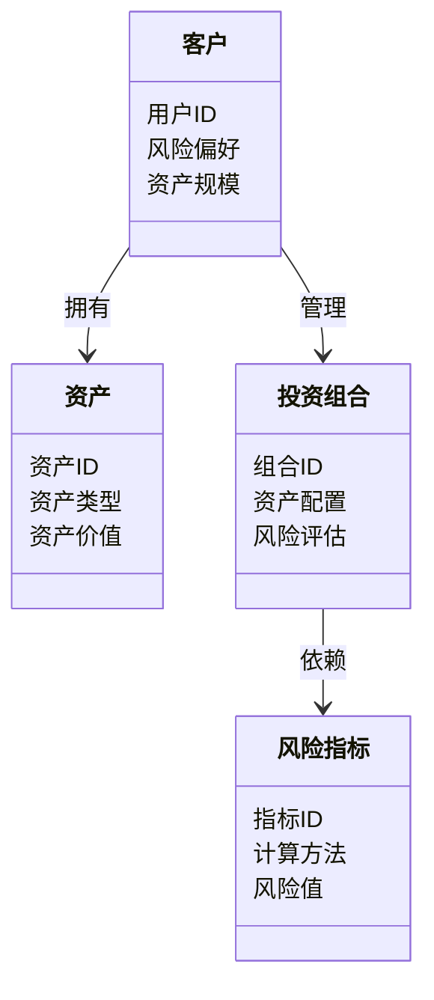
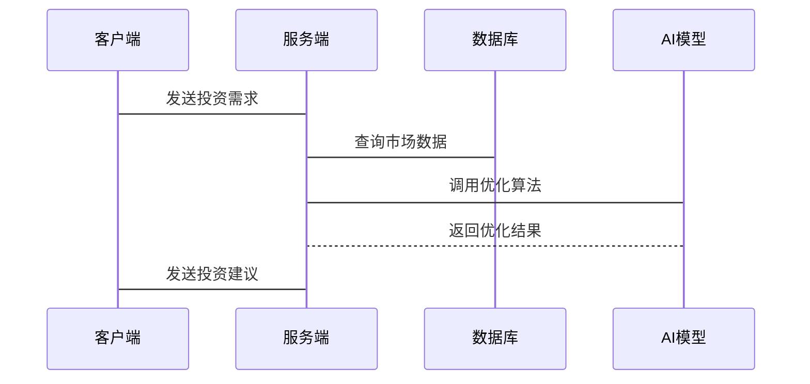

                 


# 构建全方位的AI驱动财富管理平台

> 关键词：人工智能、财富管理、系统架构、机器学习、算法模型、风险管理

> 摘要：本文详细探讨了如何构建一个基于人工智能的全方位财富管理平台，涵盖了从数据收集与处理、算法选择与实现、系统架构设计到平台实现与优化的全过程。文章首先介绍了财富管理行业的背景与AI技术的结合，随后深入分析了AI驱动财富管理的核心概念与算法模型，接着详细讲解了系统架构设计与实现，最后通过实际案例展示了平台的实现过程。文章不仅提供了理论指导，还通过代码示例和系统设计图展示了具体的实现方法，为读者提供了全面的技术参考。

---

# 第一部分：AI驱动财富管理平台的背景与意义

## 第1章：财富管理行业的数字化转型

### 1.1 财富管理行业的现状与挑战

#### 1.1.1 传统财富管理模式的局限性

传统的财富管理模式依赖于人工分析和经验判断，存在效率低、风险高、个性化不足等问题。例如，投资顾问需要手动分析市场数据，难以实时应对市场波动；客户的需求多样化，但传统服务难以提供个性化的解决方案。

#### 1.1.2 数字化转型的必要性

随着科技的进步，数字化转型成为财富管理行业提升效率、降低成本、增强客户体验的关键。通过引入AI技术，可以实现数据的自动化分析、实时监控和智能决策，从而提高服务质量和效率。

#### 1.1.3 AI技术在财富管理中的应用前景

AI技术可以通过机器学习模型预测市场趋势、优化投资组合、识别风险，并通过自然语言处理技术为客户提供个性化的财务建议。AI的应用不仅提高了服务效率，还能够帮助客户做出更科学的投资决策。

### 1.2 AI驱动财富管理的定义与目标

#### 1.2.1 AI驱动财富管理的核心概念

AI驱动的财富管理是指利用人工智能技术，通过数据采集、分析和建模，为客户提供智能化的财富管理服务。核心在于通过算法模型实现自动化、个性化的投资决策和风险管理。

#### 1.2.2 AI驱动财富管理的目标与价值

目标是通过AI技术实现财富管理的智能化、自动化和个性化，为客户提供高效、精准的服务。价值体现在提高投资收益、降低风险、提升客户满意度和降低运营成本。

#### 1.2.3 平台构建的意义与社会影响

构建AI驱动的财富管理平台不仅能够提升金融服务的质量，还能够推动金融行业的数字化转型，促进金融科技的创新发展。

---

## 第2章：AI驱动财富管理的核心要素

### 2.1 数据：AI驱动的核心资源

#### 2.1.1 数据的来源与分类

数据来源包括市场数据（如股票价格、指数数据）、客户数据（如资产配置、风险偏好）和外部数据（如新闻、经济指标）。数据需要分类处理，分为结构化数据和非结构化数据。

#### 2.1.2 数据的清洗与预处理

数据清洗包括去除噪声数据、填补缺失值、处理异常值等。预处理步骤包括数据标准化、特征提取和数据增强。

#### 2.1.3 数据安全与隐私保护

数据安全是AI驱动平台的重要组成部分，需要通过加密技术、访问控制和数据脱敏等手段保护数据隐私。

### 2.2 算法：AI驱动的决策引擎

#### 2.2.1 机器学习算法在财富管理中的应用

常用的机器学习算法包括线性回归、支持向量机（SVM）、随机森林和梯度提升树（如XGBoost、LightGBM）。这些算法可以用于市场预测、客户画像和风险评估。

#### 2.2.2 深度学习模型的优势与挑战

深度学习模型如神经网络、LSTM在处理非结构化数据（如新闻、语音）方面具有优势，但训练时间长、需要大量数据和计算资源是其挑战。

#### 2.2.3 算法可解释性的重要性

算法的可解释性是AI在金融领域应用的关键，模型需要能够解释其决策过程，以满足监管要求和客户信任。

### 2.3 平台：AI驱动的系统架构

#### 2.3.1 平台的组成与功能模块

AI驱动财富管理平台通常包括数据采集模块、模型训练模块、用户交互模块和风险管理模块。

#### 2.3.2 平台的扩展性与可维护性

平台设计需要考虑模块化、可扩展性和可维护性，以便在业务扩展时能够快速部署新功能。

#### 2.3.3 平台的用户体验设计

用户体验设计包括界面友好性、操作便捷性和个性化服务，以提升客户的使用体验和满意度。

---

## 第3章：机器学习算法在财富管理中的应用

### 3.1 监督学习算法

#### 3.1.1 线性回归模型

线性回归模型用于预测连续型变量，例如股票价格预测。其数学公式为：

$$ y = \beta_0 + \beta_1x + \epsilon $$

其中，$y$ 是目标变量，$x$ 是自变量，$\beta_0$ 是截距，$\beta_1$ 是回归系数，$\epsilon$ 是误差项。

#### 3.1.2 支持向量机（SVM）

SVM用于分类问题，例如客户风险分类。其核心思想是通过寻找最优超平面将数据分为两类。

#### 3.1.3 随机森林与梯度提升树

随机森林是一种基于决策树的集成学习方法，适用于特征重要性分析和分类/回归问题。梯度提升树（如XGBoost）通过不断优化基模型来提高预测性能。

### 3.2 非监督学习算法

#### 3.2.1 K-means聚类

K-means聚类用于客户分群，例如将客户按资产规模或风险偏好进行分群。

#### 3.2.2 主成分分析（PCA）

PCA用于降维，例如在处理高维数据时提取主要特征，减少计算复杂度。

#### 3.2.3 层次聚类

层次聚类用于构建客户分层结构，例如从高净值客户到一般客户的层次化分群。

### 3.3 强化学习算法

#### 3.3.1 Q-learning算法

Q-learning用于动态决策问题，例如在市场变化中调整投资组合。

#### 3.3.2 Deep Q-Network（DQN）

DQN是一种基于深度神经网络的强化学习方法，适用于复杂的非线性决策问题。

#### 3.3.3 策略梯度方法

策略梯度方法用于优化策略直接，适用于需要实时调整的交易策略。

---

## 第4章：数学模型与公式解析

### 4.1 线性回归模型

#### 4.1.1 线性回归的数学公式

线性回归模型的损失函数可以表示为：

$$ L = \frac{1}{2n}\sum_{i=1}^{n}(y_i - (\beta_0 + \beta_1x_i))^2 $$

其中，$n$ 是样本数量，$(x_i, y_i)$ 是第i个样本的特征和目标值。

#### 4.1.2 梯度下降算法

梯度下降算法用于优化模型参数，其更新规则为：

$$ \beta_0 := \beta_0 - \alpha \frac{\partial L}{\partial \beta_0} $$

$$ \beta_1 := \beta_1 - \alpha \frac{\partial L}{\partial \beta_1} $$

其中，$\alpha$ 是学习率，$\frac{\partial L}{\partial \beta_0}$ 和 $\frac{\partial L}{\partial \beta_1}$ 是损失函数对$\beta_0$和$\beta_1$的偏导数。

### 4.2 支持向量机（SVM）

#### 4.2.1 SVM的优化

SVM的目标是最小化 hinge损失函数，同时最大化分类间隔：

$$ \min_{\theta, \alpha} \frac{1}{2}\|\theta\|^2 + C\sum_{i=1}^{n}\xi_i $$

其中，$\theta$ 是模型参数，$\xi_i$ 是松弛变量，$C$ 是惩罚参数。

---

## 第5章：系统分析与架构设计

### 5.1 问题场景介绍

财富管理平台需要处理大量的市场数据、客户数据和交易数据，同时需要实时监控市场变化，提供个性化的投资建议。

### 5.2 项目介绍

平台旨在通过AI技术实现智能化的财富管理服务，包括投资组合优化、风险管理、客户画像和智能投顾。

### 5.3 系统功能设计

#### 5.3.1 领域模型设计

领域模型包括客户、资产、投资组合、风险指标等实体，以及它们之间的关系。

**领域模型图：**



### 5.4 系统架构设计

#### 5.4.1 系统架构图

```mermaid
containerDiagram

    客户端
    服务端
    数据库

    客户端 --> 服务端: 请求处理
    服务端 --> 数据库: 数据查询/存储
    服务端 --> AI模型: 模型调用
```

#### 5.4.2 系统接口设计

平台需要提供API接口，包括数据接口（如市场数据接口）和功能接口（如投资组合优化接口）。

#### 5.4.3 系统交互流程

**系统交互流程图：**



### 5.5 系统实现

#### 5.5.1 环境安装

需要安装Python、Jupyter Notebook、TensorFlow、Keras、Scikit-learn等工具。

#### 5.5.2 系统核心实现

实现投资组合优化算法，如使用遗传算法或粒子群优化算法。

#### 5.5.3 代码实现与解读

```python
import numpy as np
from sklearn.model_selection import train_test_split
from sklearn.linear_model import LinearRegression
from sklearn.metrics import mean_squared_error

# 数据准备
X = np.random.rand(100, 1)
y = 2 * X + 1 + np.random.randn(100, 1)

# 数据分割
X_train, X_test, y_train, y_test = train_test_split(X, y, test_size=0.2)

# 模型训练
model = LinearRegression()
model.fit(X_train, y_train)

# 模型预测
y_pred = model.predict(X_test)

# 模型评估
mse = mean_squared_error(y_test, y_pred)
print(f"均方误差: {mse}")
```

---

## 第6章：项目实战

### 6.1 环境安装

安装必要的库和工具，如Python、Pip、TensorFlow、Keras、Jupyter Notebook等。

### 6.2 系统核心实现

实现投资组合优化功能，包括数据预处理、模型训练和结果展示。

### 6.3 代码实现与解读

```python
import pandas as pd
import numpy as np
from sklearn.preprocessing import MinMaxScaler
from tensorflow.keras.models import Sequential
from tensorflow.keras.layers import LSTM, Dense, Dropout

# 数据加载
data = pd.read_csv('stock_data.csv')

# 数据预处理
scaler = MinMaxScaler()
data_scaled = scaler.fit_transform(data['close'].values.reshape(-1, 1))

# 数据分割
train_size = int(len(data_scaled) * 0.8)
X_train = data_scaled[:train_size]
y_train = data_scaled[1:train_size+1]
X_test = data_scaled[train_size:]
y_test = data_scaled[train_size+1:]

# 模型构建
model = Sequential()
model.add(LSTM(units=50, return_sequences=True, input_shape=(1, 1)))
model.add(LSTM(units=50, return_sequences=False))
model.add(Dense(1))

model.compile(loss='mean_squared_error', optimizer='adam')

# 模型训练
model.fit(X_train.reshape(X_train.shape[0], 1, 1), y_train, epochs=50, batch_size=32)

# 模型预测
X_test_pred = model.predict(X_test.reshape(X_test.shape[0], 1, 1))
y_pred = scaler.inverse_transform(X_test_pred)
y_true = scaler.inverse_transform(y_test.reshape(-1, 1))

# 结果对比
print('预测值:', y_pred[0])
print('真实值:', y_true[0])
```

### 6.4 实际案例分析

通过实际案例分析，展示平台在投资组合优化、风险管理等方面的应用效果。

### 6.5 项目小结

总结项目实现的过程，指出存在的问题和改进方向。

---

## 第7章：最佳实践、小结、注意事项、拓展阅读

### 7.1 最佳实践

- 数据预处理是关键，确保数据质量和完整性。
- 选择合适的算法，避免过度拟合。
- 注重模型的可解释性和实用性。

### 7.2 小结

本文详细介绍了构建AI驱动财富管理平台的全过程，从背景分析到系统实现，提供了丰富的技术细节和实际案例。

### 7.3 注意事项

- 数据隐私和安全是需要重点关注的方面。
- 模型的实时性和稳定性需要在设计阶段充分考虑。
- 保持对市场变化的敏感性，及时调整模型和策略。

### 7.4 拓展阅读

推荐阅读《机器学习实战》、《深度学习入门》等书籍，了解最新的AI技术动态。

---

# 作者：AI天才研究院/AI Genius Institute & 禅与计算机程序设计艺术/Zen And The Art of Computer Programming

---

**注**：以上内容为示例，实际撰写时需要根据具体需求进行调整和补充。

