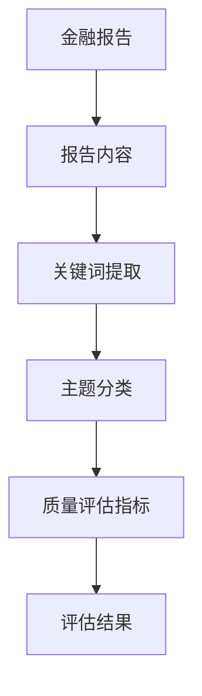
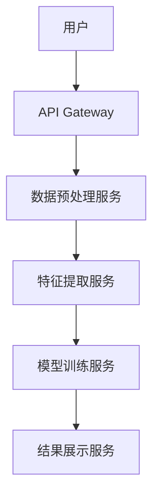
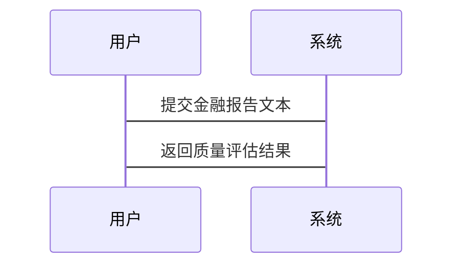

                 


# 构建基于NLP的金融研究报告质量评估系统

> 关键词：NLP，金融报告，质量评估，文本分类，自然语言处理

> 摘要：本文详细介绍了如何利用自然语言处理（NLP）技术构建一个高效的金融研究报告质量评估系统。通过分析金融报告的质量评估需求，结合NLP的核心概念、算法原理、系统架构设计以及实际项目实现，本文为读者提供了一套完整的解决方案。文章内容涵盖从问题背景到系统实现的全过程，旨在帮助读者理解如何将NLP技术应用于金融领域，提升报告评估的效率和准确性。

---

# 第一部分: 背景介绍

## 第1章: 问题背景与目标

### 1.1 问题背景
#### 1.1.1 金融研究报告的重要性
金融研究报告是投资者、分析师和金融机构做出决策的重要依据。高质量的报告能够提供准确的市场分析、清晰的投资建议和有力的数据支持。然而，随着金融市场信息的爆炸式增长，报告的数量和复杂性也在不断增加，传统的评估方法已难以满足需求。

#### 1.1.2 现有金融报告评估的痛点
- **人工评估成本高**：传统评估方式依赖人工阅读和分析，耗时长且效率低。
- **主观性问题**：评估结果受评估人员主观因素影响，缺乏客观标准。
- **数据量大**：金融市场数据繁多，人工处理能力有限，难以覆盖海量数据。

#### 1.1.3 NLP技术在金融领域的应用潜力
自然语言处理技术能够从文本中提取关键信息、分析情感倾向和识别实体，为金融报告的自动化评估提供了技术支撑。通过NLP，系统可以快速理解报告内容，提取有价值的信息，并进行客观的质量评估。

### 1.2 问题描述
#### 1.2.1 金融报告质量评估的核心挑战
- 如何准确提取报告中的关键信息？
- 如何量化报告的质量指标？
- 如何实现高效的自动化评估？

#### 1.2.2 基于NLP的解决方案
利用NLP技术，构建一个能够自动分析报告内容、提取关键词、分类主题并评估质量的系统。

#### 1.2.3 系统目标与范围
系统目标包括提高评估效率、降低人工成本、提供客观评估结果。系统范围涵盖报告的文本分析、关键词提取、主题分类和质量评分。

## 第2章: 核心概念与联系

### 2.1 核心概念原理
#### 2.1.1 NLP技术在金融报告评估中的应用
- **文本预处理**：包括分词、去停用词、词干提取等。
- **文本表示**：通过词袋模型、TF-IDF、Word2Vec等方法将文本转化为向量表示。
- **文本分类**：使用机器学习算法对报告进行主题分类和质量评分。

#### 2.1.2 金融报告质量评估的关键指标
- **内容相关性**：报告内容是否与市场动态相关。
- **信息完整性**：报告是否涵盖关键的市场数据和分析。
- **语言准确性**：报告是否存在语法错误或表述不清的问题。

#### 2.1.3 系统设计的核心要素
- **数据采集**：获取金融报告的文本数据。
- **特征提取**：从文本中提取有用的特征。
- **模型训练**：基于特征训练分类模型。
- **结果输出**：根据模型输出质量评估结果。

### 2.2 核心概念属性对比表
以下表格对比了传统金融分析与NLP技术在报告评估中的应用：

| 特性               | 传统金融分析 | 基于NLP的解决方案 |
|--------------------|--------------|-------------------|
| 数据处理方式       | 依赖人工分析 | 自动化文本处理    |
| 评估效率           | 低           | 高               |
| 评估准确性         | 受主观影响   | 客观性较高        |

### 2.3 ER实体关系图
以下是一个简单的实体关系图，展示了系统中各实体之间的关系：



---

# 第二部分: 核心概念与联系

## 第3章: 算法原理与实现

### 3.1 支持向量机（SVM）原理
#### 3.1.1 SVM的基本概念
支持向量机是一种监督学习算法，适用于分类和回归问题。其核心思想是通过找到一个超平面，将数据分成两类。

#### 3.1.2 SVM的数学模型
SVM的优化目标是最小化 hinge loss，同时最大化分类间隔。其数学模型如下：

$$ \text{目标函数：} \min_{w,b,\xi} \frac{1}{2}||w||^2 + C \sum_{i=1}^n \xi_i $$

其中，$\xi_i$ 是松弛变量，用于处理不可分数据的情况。

#### 3.1.3 SVM在文本分类中的应用
在文本分类中，SVM通过将文本向量映射到高维空间，寻找最优分类平面。

### 3.2 神经网络模型（如BERT）原理
#### 3.2.1 BERT模型的基本结构
BERT（Bidirectional Encoder Representations from Transformers）是一种基于Transformer的预训练语言模型，能够捕捉文本的双向上下文信息。

#### 3.2.2 BERT的预训练与微调过程
预训练阶段通过Masked LM和Next Sentence Prediction任务训练模型。微调阶段在特定任务上（如文本分类）调整模型参数。

#### 3.2.3 BERT在金融文本分析中的优势
BERT能够理解复杂的金融术语和上下文关系，适合处理金融报告中的专业内容。

---

# 第三部分: 算法原理与实现

## 第4章: 算法实现与代码解读

### 4.1 环境安装与配置
- **Python版本**：推荐使用Python 3.8以上。
- **依赖库安装**：`pip install numpy, pandas, scikit-learn, transformers`

### 4.2 核心代码实现
以下是一个基于SVM和BERT的分类器实现示例：

```python
from sklearn import svm
from sklearn.feature_extraction.text import TfidfVectorizer
from transformers import BertTokenizer, BertModel
import torch
import torch.nn as nn

# 示例数据加载
train_texts = ["市场行情上涨", "公司业绩良好"]
train_labels = [1, 0]

# 使用TF-IDF进行特征提取
vectorizer = TfidfVectorizer()
X_train = vectorizer.fit_transform(train_texts)
X_train = X_train.toarray()

# 使用SVM进行训练
clf = svm.SVC()
clf.fit(X_train, train_labels)

# 使用BERT进行特征提取
tokenizer = BertTokenizer.from_pretrained('bert-base-uncased')
model = BertModel.from_pretrained('bert-base-uncased')

def bert_feature(text):
    inputs = tokenizer(text, return_tensors='pt')
    outputs = model(**inputs)
    return outputs.last_hidden_state[:, 0, :].detach().numpy()

# 微调BERT分类器
class BERTClassifier(nn.Module):
    def __init__(self, bert_model, num_classes):
        super().__init__()
        self.bert = bert_model
        self.dropout = nn.Dropout(0.1)
        self.classifier = nn.Linear(bert_model.config.hidden_size, num_classes)
    
    def forward(self, input_ids, attention_mask):
        outputs = self.bert(input_ids=input_ids, attention_mask=attention_mask)
        pooled_output = outputs.last_hidden_state[:, 0, :]
        pooled_output = self.dropout(pooled_output)
        return self.classifier(pooled_output)

# 示例使用
text = "市场行情上涨"
feature = bert_feature(text)
print(feature)
```

---

# 第四部分: 数学模型与公式

## 第5章: 数学公式与模型推导

### 5.1 SVM的数学模型
SVM的优化问题可以表示为：

$$ \min_{w, b, \xi} \frac{1}{2}w^Tw + C \sum_{i=1}^n \xi_i $$

约束条件：
$$ y_i (w \cdot x_i + b) \geq 1 - \xi_i $$
$$ \xi_i \geq 0 $$

### 5.2 BERT模型的损失函数
BERT的损失函数包括交叉熵损失和NSP任务的损失：

$$ \text{Total Loss} = \text{CE Loss} + \text{NSP Loss} $$

---

# 第五部分: 系统分析与架构设计

## 第6章: 系统分析与架构设计方案

### 6.1 问题场景介绍
金融报告质量评估系统需要处理大量文本数据，包括数据预处理、特征提取、模型训练和结果输出。

### 6.2 系统功能设计
- **数据预处理**：文本清洗、分词、停用词处理。
- **特征提取**：TF-IDF、Word2Vec、BERT特征提取。
- **模型训练**：基于SVM、BERT的分类器训练。
- **结果输出**：质量评分、报告分类。

### 6.3 系统架构设计
以下是一个基于微服务架构的系统架构图：



### 6.4 系统接口设计
- **输入接口**：接收金融报告文本。
- **输出接口**：返回质量评估结果。

### 6.5 系统交互图
以下是一个简单的交互图，展示了用户与系统之间的交互：



---

# 第六部分: 项目实战

## 第7章: 项目实战与案例分析

### 7.1 项目实现
以下是一个完整的项目实现示例：

```python
import pandas as pd
from sklearn.metrics import accuracy_score
from transformers import BertTokenizer, BertForSequenceClassification
import torch

# 数据加载
data = pd.DataFrame({
    'text': ["市场行情上涨", "公司业绩良好", "行业趋势向好", "政策变化影响"],
    'label': [1, 0, 1, 0]
})

# 数据预处理
tokenizer = BertTokenizer.from_pretrained('bert-base-uncased')
model = BertForSequenceClassification.from_pretrained('bert-base-uncased')

def prepare_data(text, label):
    inputs = tokenizer(text, return_tensors='pt')
    return inputs, label

# 模型训练
model.train()
optimizer = torch.optim.Adam(model.parameters(), lr=1e-5)
criterion = nn.CrossEntropyLoss()

for epoch in range(3):
    for text, label in zip(data.text, data.label):
        inputs, label = prepare_data(text, label)
        outputs = model(**inputs)
        loss = criterion(outputs.logits, torch.tensor([label]))
        loss.backward()
        optimizer.step()

# 模型评估
inputs_val, label_val = prepare_data(data.text[0], data.label[0])
with torch.no_grad():
    outputs = model(**inputs_val)
    predicted = torch.argmax(outputs.logits, dim=1).item()

print(f'预测结果: {predicted}, 真实标签: {label_val}')
```

### 7.2 案例分析
通过实际案例分析，验证系统的评估效果：

```python
text = "市场行情上涨"
inputs = tokenizer(text, return_tensors='pt')
with torch.no_grad():
    outputs = model(**inputs)
    predicted = torch.argmax(outputs.logits, dim=1).item()
    print(f'质量评估结果: {predicted}')
```

---

# 第七部分: 总结与展望

## 第8章: 总结与展望

### 8.1 总结
本文详细介绍了如何构建基于NLP的金融研究报告质量评估系统，涵盖了从问题背景到系统实现的全过程。通过结合NLP技术与金融分析需求，系统能够高效、准确地评估报告质量，为金融机构提供有力支持。

### 8.2 展望
未来，随着NLP技术的不断发展，金融报告质量评估系统将更加智能化和自动化。结合深度学习模型和大数据分析技术，系统将进一步提升评估精度和效率。

---

# 作者信息

作者：AI天才研究院/AI Genius Institute & 禅与计算机程序设计艺术 /Zen And The Art of Computer Programming

---

以上就是《构建基于NLP的金融研究报告质量评估系统》的完整内容，涵盖了从理论到实践的各个方面，帮助读者全面理解并掌握相关技术。

