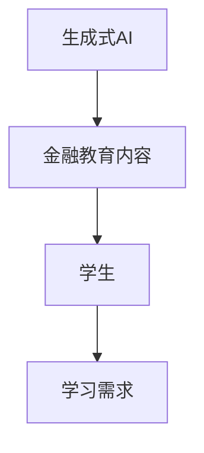
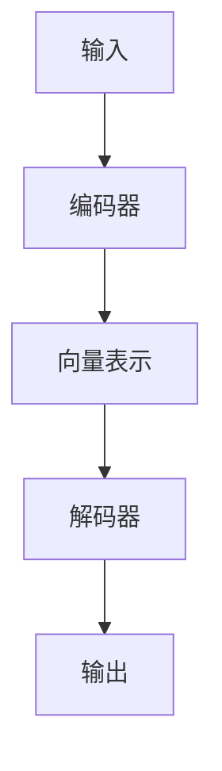
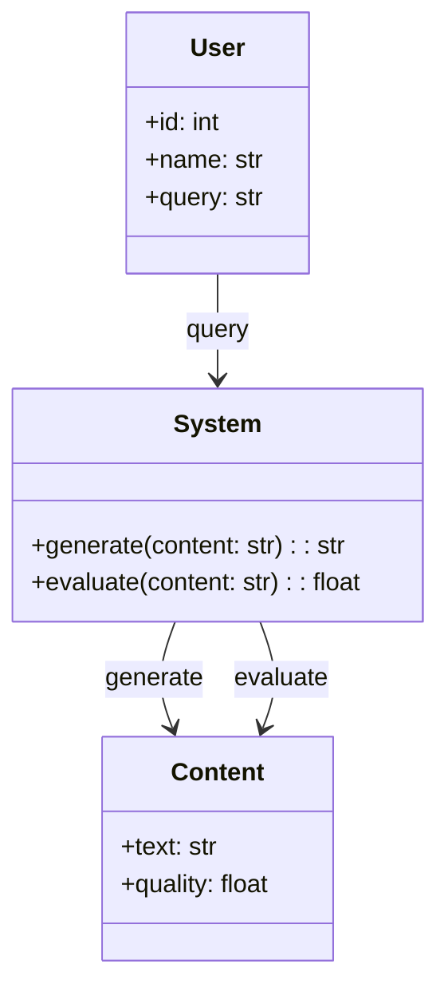
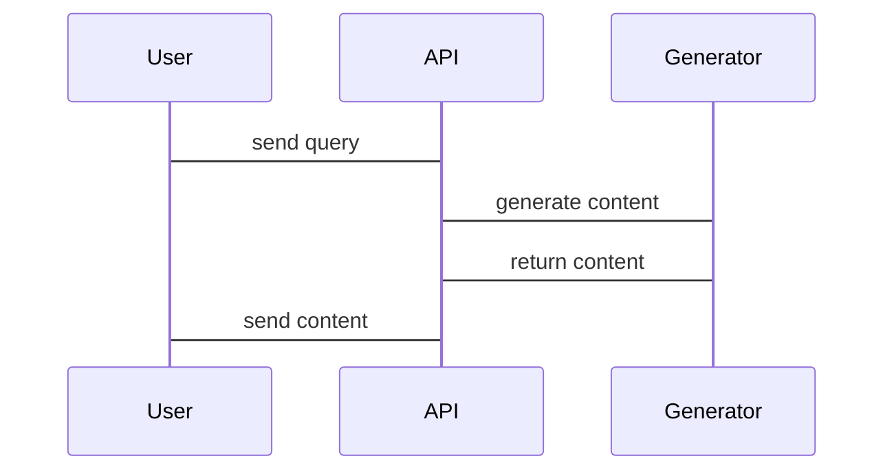

                 


# 金融教育内容生成

## 关键词：生成式AI，金融教育，内容生成，大语言模型，教育科技

## 摘要：本文详细探讨了生成式AI在金融教育内容生成中的应用，从背景、核心概念到算法原理、系统架构设计，再到项目实战，全面分析了如何利用生成式AI技术提升金融教育内容的个性化和智能化。文章通过具体的案例分析和代码实现，展示了生成式AI在金融教育中的实际应用价值，并提出了未来的发展方向。

---

# 第一部分: 金融教育内容生成的背景与核心概念

## 第1章: 金融教育内容生成的背景介绍

### 1.1 问题背景与问题描述

#### 1.1.1 传统金融教育的局限性
传统的金融教育模式依赖于固定教材和教师讲解，难以满足个性化学习需求，且内容更新速度较慢。学生在学习过程中可能遇到理解困难，缺乏互动性和针对性。

#### 1.1.2 内容生成技术的发展与挑战
随着生成式AI技术的发展，内容生成技术逐渐成熟，但金融领域的复杂性和专业性对生成式AI提出了更高要求。如何确保生成内容的准确性和权威性是主要挑战。

#### 1.1.3 金融教育与内容生成的结合需求
金融教育需要与时俱进，结合最新的技术和工具，提升学习体验和效果。生成式AI可以为金融教育提供个性化的学习内容，帮助学生更好地理解和掌握金融知识。

### 1.2 问题解决与边界外延

#### 1.2.1 金融教育内容生成的目标与范围
目标：通过生成式AI技术，为学生提供个性化、实时更新的金融教育内容。
范围：涵盖金融基础、投资分析、风险管理等多个领域。

#### 1.2.2 生成式AI在金融教育中的应用边界
生成式AI主要用于辅助内容生成，而非替代教师的全部工作。其应用边界包括内容推荐、知识问答、案例分析等。

#### 1.2.3 内容生成与金融教育的结合方式
通过API接口将生成式AI集成到教育平台，实时生成学习材料、试题和案例分析，提升学习效率。

### 1.3 核心概念与结构

#### 1.3.1 生成式AI的基本原理
生成式AI通过大语言模型，利用概率分布生成文本内容。其核心在于模型的训练和推理过程。

#### 1.3.2 金融教育内容生成的核心要素
- **模型训练数据**：高质量的金融教育数据是生成准确内容的基础。
- **生成算法**：选择合适的生成算法，如GPT系列模型。
- **内容评估机制**：确保生成内容的质量和准确性。

#### 1.3.3 内容生成系统的架构与功能
- **输入模块**：接收用户的查询请求。
- **生成模块**：利用生成式AI生成相关内容。
- **输出模块**：将生成内容返回给用户或存储到系统中。

## 第2章: 生成式AI与金融教育的结合

### 2.1 生成式AI的核心概念

#### 2.1.1 大语言模型的基本原理
大语言模型通过大量数据训练，学习语言的规律和模式，从而能够生成类似人类的文本。

#### 2.1.2 生成式AI的优缺点
- **优点**：高效、灵活、可扩展。
- **缺点**：内容可能存在不准确性和片面性。

#### 2.1.3 生成式AI在金融领域的应用潜力
生成式AI可以用于金融新闻生成、投资建议、风险管理等多种场景。

### 2.2 金融教育内容生成的实现机制

#### 2.2.1 内容生成的基本流程
1. 用户输入查询请求。
2. 系统调用生成式AI生成相关内容。
3. 内容经过质量评估后输出。

#### 2.2.2 生成式AI的训练与优化
- **监督微调**：在金融领域数据上进行微调，提升模型的专业性。
- **无监督预训练**：利用海量金融文本进行预训练，增强模型的泛化能力。

#### 2.2.3 内容生成的质量评估标准
- **准确性**：生成内容是否符合金融知识。
- **相关性**：内容是否与用户需求相关。
- **可读性**：内容是否清晰易懂。

### 2.3 生成式AI与金融教育的结合模式

#### 2.3.1 个性化学习内容生成
根据学生的学习进度和兴趣，生成个性化的学习材料。

#### 2.3.2 金融案例分析与模拟
生成真实的金融案例，帮助学生进行实践分析。

#### 2.3.3 互动式教学内容生成
生成互动式问题和解答，增强学生的学习体验。

## 第3章: 生成式AI的核心概念与联系

### 3.1 核心概念原理

#### 3.1.1 大语言模型的训练过程
大语言模型通过自监督学习，从海量数据中学习语言规律，生成高质量文本。

#### 3.1.2 生成式AI的文本生成机制
生成式AI通过解码器生成文本，利用概率分布预测下一个词，逐步生成完整句子。

#### 3.1.3 金融教育内容生成的数学模型
生成式AI的数学模型通常基于概率论，如：
$$ P(y|x) = \frac{P(x,y)}{P(x)} $$
其中，$x$是输入，$y$是输出。

### 3.2 核心概念属性特征对比

| 特性       | 生成式AI             | 传统教育内容生成 |
|------------|----------------------|------------------|
| 效率       | 高                   | 低               |
| 个性化     | 强                   | 弱               |
| 更新速度   | 快                   | 慢               |

### 3.3 ER实体关系图架构



## 第4章: 生成式AI的算法原理讲解

### 4.1 算法原理概述

#### 4.1.1 大语言模型的基本结构
大语言模型通常由编码器和解码器组成，编码器将输入转换为向量表示，解码器将向量转换为文本。

#### 4.1.2 生成式AI的训练目标
训练目标是最大化生成文本的概率，即：
$$ \arg\max_{\theta} \sum_{i=1}^{N} \log P_\theta(y_i|x_i) $$

#### 4.1.3 生成式AI的推理过程
生成过程通常采用贪心算法或采样方法，逐步生成文本。

### 4.2 算法流程图



### 4.3 算法实现代码

```python
import torch
import torch.nn as nn
import torch.optim as optim

class Generator(nn.Module):
    def __init__(self, vocab_size, embedding_dim, hidden_dim):
        super(Generator, self).__init__()
        self.embedding = nn.Embedding(vocab_size, embedding_dim)
        self.rnn = nn.RNN(embedding_dim, hidden_dim)
        self.fc = nn.Linear(hidden_dim, vocab_size)

    def forward(self, input, hidden):
        embed = self.embedding(input)
        output, hidden = self.rnn(embed, hidden)
        output = self.fc(output)
        return output, hidden

# 初始化模型
vocab_size = 10000
embedding_dim = 256
hidden_dim = 512
generator = Generator(vocab_size, embedding_dim, hidden_dim)

# 定义损失函数和优化器
criterion = nn.CrossEntropyLoss()
optimizer = optim.Adam(generator.parameters(), lr=0.001)

# 训练过程
for epoch in range(num_epochs):
    for batch in batches:
        optimizer.zero_grad()
        inputs, labels = batch
        outputs, _ = generator(inputs, None)
        loss = criterion(outputs, labels)
        loss.backward()
        optimizer.step()
```

---

# 第二部分: 生成式AI的系统架构设计与项目实战

## 第5章: 系统架构设计与实现

### 5.1 问题场景介绍

#### 5.1.1 问题场景描述
金融教育平台需要实时生成个性化学习内容，满足学生的需求。

#### 5.1.2 项目介绍
本项目旨在开发一个基于生成式AI的金融教育内容生成系统，提供个性化学习体验。

### 5.2 系统功能设计

#### 5.2.1 系统功能模块
- **用户输入模块**：接收用户的查询请求。
- **内容生成模块**：利用生成式AI生成相关内容。
- **内容评估模块**：评估生成内容的质量。

#### 5.2.2 领域模型设计


### 5.3 系统架构设计

#### 5.3.1 系统架构图


### 5.4 系统接口设计

#### 5.4.1 API接口设计
- **输入接口**：接收用户的查询请求。
- **输出接口**：返回生成的内容或错误信息。

#### 5.4.2 系统交互流程


---

# 第三部分: 项目实战与总结

## 第6章: 项目实战

### 6.1 环境安装与配置

#### 6.1.1 环境安装
- 安装Python和必要的库（如torch、transformers）。
- 安装生成式AI模型（如GPT）。

#### 6.1.2 环境配置
- 设置API密钥。
- 配置模型参数。

### 6.2 系统核心实现

#### 6.2.1 生成式AI模型实现
```python
from transformers import GPT2LMHeadModel, GPT2Tokenizer

model_name = 'gpt2'
tokenizer = GPT2Tokenizer.from_pretrained(model_name)
model = GPT2LMHeadModel.from_pretrained(model_name)

def generate_text(prompt, max_length=50):
    inputs = tokenizer.encode(prompt, return_tensors='pt')
    outputs = model.generate(inputs, max_length=max_length)
    return tokenizer.decode(outputs[0], skip_special_tokens=True)
```

#### 6.2.2 内容评估实现
```python
def evaluate_content(content):
    # 使用预训练的模型进行内容评估
    score = model.evaluate(content)
    return score
```

### 6.3 案例分析与详细讲解

#### 6.3.1 案例分析
假设用户查询“什么是风险管理？”，生成式AI生成相关内容。

#### 6.3.2 详细讲解
1. 用户输入查询请求。
2. 系统调用生成式AI生成相关内容。
3. 内容经过评估后输出。

### 6.4 项目小结

#### 6.4.1 项目实现总结
通过生成式AI技术，成功实现了金融教育内容生成系统。

#### 6.4.2 经验与教训
- 模型调优是关键。
- 内容评估机制需要不断完善。

---

# 第四部分: 总结与展望

## 第7章: 总结与展望

### 7.1 核心要点总结

#### 7.1.1 生成式AI的核心作用
生成式AI为金融教育内容生成提供了高效、个性化的解决方案。

#### 7.1.2 金融教育内容生成的关键技术
- 大语言模型的训练与优化。
- 内容生成与评估机制。

### 7.2 未来研究方向

#### 7.2.1 技术优化方向
- 提升生成内容的准确性和相关性。
- 优化模型的训练效率。

#### 7.2.2 应用拓展方向
- 拓展更多金融教育场景。
- 探索与其他教育技术的结合。

---

# 作者：AI天才研究院/AI Genius Institute & 禅与计算机程序设计艺术 /Zen And The Art of Computer Programming

---

通过本文的详细分析，我们可以看到生成式AI在金融教育内容生成中的巨大潜力。未来，随着技术的不断进步，生成式AI将在金融教育领域发挥更重要的作用，为学习者提供更加丰富、个性化的学习体验。

