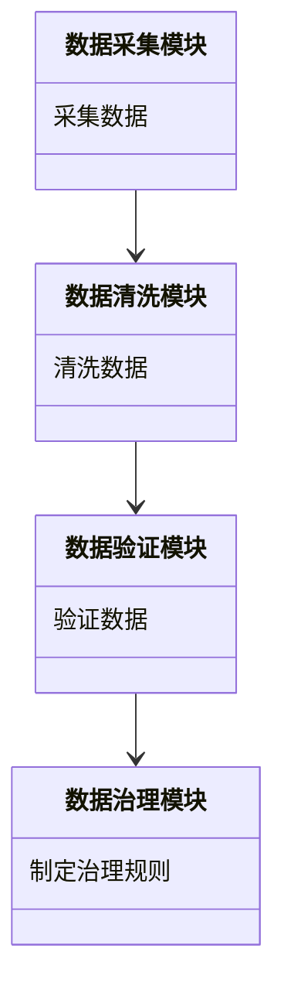
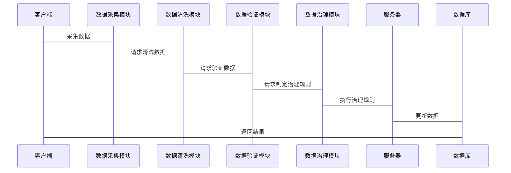

                 


# AI Agent在企业数据质量管理与治理自动化中的应用

> 关键词：AI Agent, 数据质量管理, 治理自动化, 企业数据管理, 强化学习

> 摘要：本文深入探讨了AI Agent在企业数据质量管理与治理自动化中的应用，系统介绍了AI Agent的基本原理、数据质量管理的关键技术、AI Agent与数据质量管理的结合、算法实现、系统架构设计、项目实战以及最佳实践。通过对AI Agent在数据质量管理中的应用进行详细分析，展示了如何利用AI技术实现数据治理的自动化，为企业数据管理提供高效的解决方案。

---

# 第一部分: AI Agent与企业数据质量管理概述

## 第1章: AI Agent与数据质量管理概述

### 1.1 AI Agent的基本概念

#### 1.1.1 AI Agent的定义与特点
AI Agent（智能代理）是指能够感知环境、自主决策并执行任务的智能系统。其特点包括：
- **自主性**：能够在无外部干预的情况下执行任务。
- **反应性**：能够实时感知环境并做出反应。
- **目标导向**：基于目标驱动行为。
- **学习能力**：能够通过经验改进性能。

#### 1.1.2 AI Agent的核心功能与模块
AI Agent的核心功能包括：
- **感知**：通过传感器或数据输入获取环境信息。
- **推理**：基于知识库和推理规则进行逻辑推理。
- **规划**：制定行动计划以实现目标。
- **执行**：执行具体任务并输出结果。

AI Agent的模块组成如下：
1. **感知模块**：负责数据采集与环境建模。
2. **推理模块**：基于知识库进行逻辑推理。
3. **规划模块**：制定行动计划。
4. **执行模块**：执行具体任务并反馈结果。

#### 1.1.3 AI Agent在企业中的应用场景
AI Agent在企业中的应用场景包括：
- **自动化决策**：如供应链管理中的库存优化。
- **智能客服**：通过对话系统提供个性化服务。
- **数据治理**：通过AI Agent实现数据质量管理的自动化。

### 1.2 数据质量管理的基本概念

#### 1.2.1 数据质量管理的定义
数据质量管理（Data Quality Management）是指通过技术手段确保数据的准确性、完整性、一致性和及时性。其核心目标是提高数据的质量，使其满足业务需求。

#### 1.2.2 数据质量管理的关键维度
数据质量管理的关键维度包括：
1. **准确性**：数据是否真实反映实际情况。
2. **完整性**：数据是否完整无缺失。
3. **一致性**：数据在不同系统中是否一致。
4. **及时性**：数据是否及时更新。

#### 1.2.3 数据质量管理的挑战与解决方案
数据质量管理的挑战包括：
- 数据来源复杂，导致数据不一致。
- 数据清洗和标准化工作量大且复杂。
- 数据质量标准难以统一。

解决方案包括：
- 引入AI技术实现数据清洗和标准化的自动化。
- 通过机器学习模型预测数据质量。
- 建立统一的数据质量管理平台。

### 1.3 AI Agent与数据质量管理的结合

#### 1.3.1 数据质量管理的智能化需求
随着企业数据量的快速增长，传统的人工数据质量管理方式效率低下，难以满足企业需求。智能化数据质量管理成为必然趋势。

#### 1.3.2 AI Agent在数据质量管理中的角色
AI Agent在数据质量管理中的角色包括：
- **数据清洗**：通过AI算法自动识别和修复数据中的错误。
- **数据验证**：通过推理和验证确保数据的准确性。
- **数据治理规则的动态优化**：根据业务需求动态调整数据治理规则。

#### 1.3.3 数据治理自动化的概念与目标
数据治理自动化是指通过技术手段实现数据治理的自动化，其目标是提高数据治理的效率和效果。AI Agent在数据治理自动化中的作用是关键。

## 第2章: AI Agent的核心原理与技术

### 2.1 AI Agent的基本原理

#### 2.1.1 任务建模与目标设定
任务建模是AI Agent工作的基础。通过任务建模，AI Agent能够明确目标并制定行动计划。目标设定需要考虑优先级和可行性。

#### 2.1.2 知识表示与推理机制
知识表示是AI Agent进行推理的基础。常见的知识表示方法包括逻辑推理和语义网络。推理机制包括基于规则的推理和基于模型的推理。

#### 2.1.3 行为规划与执行
行为规划是AI Agent的核心功能之一。通过行为规划，AI Agent能够制定行动计划并执行任务。行为规划的方法包括基于搜索和基于模型的方法。

### 2.2 数据质量管理中的AI Agent技术

#### 2.2.1 数据清洗与标准化的AI Agent实现
数据清洗和标准化是数据质量管理的重要步骤。通过AI Agent，可以实现数据的自动清洗和标准化。例如，通过机器学习模型识别重复数据并进行去重。

#### 2.2.2 数据验证与校正的自动化方法
数据验证和校正是通过AI Agent实现的。通过自然语言处理技术，AI Agent能够识别数据中的错误并进行校正。

#### 2.2.3 数据治理规则的动态优化
数据治理规则需要根据业务需求进行动态优化。通过强化学习，AI Agent能够根据反馈调整数据治理规则，以提高数据质量。

### 2.3 AI Agent的算法与模型

#### 2.3.1 强化学习在AI Agent中的应用
强化学习是一种通过试错机制优化行为的算法。在数据质量管理中，强化学习可以用于优化数据清洗和标准化的过程。

#### 2.3.2 监督学习与无监督学习的结合
监督学习和无监督学习在数据质量管理中各有优势。通过结合这两种学习方法，可以实现更高效的数据清洗和校正。

#### 2.3.3 深度学习模型在数据质量管理中的应用
深度学习模型在数据质量管理中的应用包括图像识别、自然语言处理和异常检测等。

### 2.4 本章小结

#### 2.4.1 AI Agent的核心技术总结
AI Agent的核心技术包括任务建模、知识表示、行为规划和执行。

#### 2.4.2 数据质量管理中的AI Agent实现路径
通过AI Agent实现数据质量管理的自动化，需要结合多种AI技术，如强化学习、监督学习和深度学习。

#### 2.4.3 本书的技术路线框架
本书的技术路线框架包括AI Agent的基本原理、数据质量管理的核心技术、AI Agent与数据质量管理的结合、算法实现、系统架构设计、项目实战以及最佳实践。

---

# 第二部分: 数据质量管理的系统分析与架构设计

## 第3章: 数据质量管理的系统分析与架构设计

### 3.1 数据质量管理的系统分析

#### 3.1.1 数据质量管理的目标与范围
数据质量管理的目标是提高数据质量，范围包括数据清洗、数据验证和数据治理。

#### 3.1.2 数据质量管理的关键问题与挑战
数据质量管理的关键问题包括数据冗余、数据不一致和数据缺失。挑战包括数据量大、数据类型复杂和数据安全。

#### 3.1.3 数据质量管理的业务价值
数据质量管理的业务价值包括提高数据准确性、降低数据成本和提高数据利用率。

### 3.2 数据质量管理的系统架构设计

#### 3.2.1 系统功能模块划分
数据质量管理系统的功能模块包括：
1. 数据采集模块：负责数据的采集和预处理。
2. 数据清洗模块：负责数据的清洗和标准化。
3. 数据验证模块：负责数据的验证和校正。
4. 数据治理模块：负责数据治理规则的制定和执行。

#### 3.2.2 系统组件之间的关系
系统组件之间的关系包括数据流、功能调用和反馈机制。

#### 3.2.3 系统功能设计（领域模型 Mermaid 类图）


#### 3.2.4 系统架构设计（Mermaid 架构图）


#### 3.2.5 系统接口设计
系统接口设计包括数据采集接口、数据清洗接口、数据验证接口和数据治理接口。

#### 3.2.6 系统交互设计（Mermaid 序列图）


### 3.3 数据质量管理系统的实现细节

#### 3.3.1 数据采集与预处理
数据采集模块负责从多个数据源采集数据，并进行预处理，包括数据格式转换和数据去重。

#### 3.3.2 数据清洗与标准化
数据清洗模块通过机器学习模型识别数据中的错误，并进行清洗和标准化。

#### 3.3.3 数据验证与校正
数据验证模块通过自然语言处理技术进行数据验证，并对错误数据进行校正。

#### 3.3.4 数据治理与优化
数据治理模块根据业务需求制定治理规则，并通过AI Agent动态优化数据治理规则。

### 3.4 本章小结

#### 3.4.1 数据质量管理系统的总体架构
数据质量管理系统的总体架构包括数据采集模块、数据清洗模块、数据验证模块和数据治理模块。

#### 3.4.2 系统组件之间的关系与交互
系统组件之间的关系包括数据流、功能调用和反馈机制。

#### 3.4.3 系统架构设计的关键点
系统架构设计的关键点包括模块划分、接口设计和交互流程优化。

---

## 第4章: AI Agent在数据质量管理中的实现

### 4.1 AI Agent在数据质量管理中的应用场景

#### 4.1.1 数据清洗与标准化
AI Agent可以通过强化学习算法实现数据清洗和标准化的自动化。

#### 4.1.2 数据验证与校正
通过自然语言处理技术，AI Agent可以实现数据验证和校正的自动化。

#### 4.1.3 数据治理规则的动态优化
通过强化学习，AI Agent可以根据反馈动态优化数据治理规则。

### 4.2 AI Agent的算法实现

#### 4.2.1 强化学习算法实现
强化学习算法实现包括状态定义、动作选择和奖励机制。

#### 4.2.2 监督学习与无监督学习的结合
监督学习与无监督学习的结合可以通过集成学习方法实现。

#### 4.2.3 深度学习模型的实现
深度学习模型的实现包括神经网络的构建、训练和优化。

### 4.3 AI Agent在数据质量管理中的应用案例

#### 4.3.1 数据清洗与标准化案例
通过AI Agent实现某企业客户数据的清洗和标准化，提高了数据质量。

#### 4.3.2 数据验证与校正案例
通过AI Agent实现某企业订单数据的验证和校正，减少了数据错误。

#### 4.3.3 数据治理规则的动态优化案例
通过AI Agent实现某企业数据治理规则的动态优化，提高了数据治理效率。

### 4.4 本章小结

#### 4.4.1 AI Agent在数据质量管理中的核心应用
AI Agent在数据质量管理中的核心应用包括数据清洗与标准化、数据验证与校正和数据治理规则的动态优化。

#### 4.4.2 数据质量管理中的AI Agent实现的关键点
数据质量管理中的AI Agent实现的关键点包括算法选择、模型优化和系统集成。

#### 4.4.3 AI Agent在数据质量管理中的价值
AI Agent在数据质量管理中的价值体现在提高数据治理效率、降低数据成本和提高数据准确性。

---

## 第5章: 数据质量管理系统的项目实战

### 5.1 项目背景与目标

#### 5.1.1 项目背景
某企业希望通过数据质量管理提高数据准确性，降低数据成本。

#### 5.1.2 项目目标
实现数据清洗、数据验证和数据治理的自动化。

### 5.2 项目环境与工具安装

#### 5.2.1 系统环境要求
操作系统：Windows 10或更高版本，Linux或macOS。
硬件要求：CPU：4核及以上，内存：8GB及以上，显卡：支持CUDA加速（可选）。
软件要求：Python 3.8或更高版本，Jupyter Notebook，TensorFlow，Keras，Scikit-learn。

#### 5.2.2 开发工具安装
安装Python和相关库：
```bash
pip install numpy
pip install pandas
pip install scikit-learn
pip install tensorflow
pip install keras
```

#### 5.2.3 数据准备
准备需要清洗和验证的数据集，例如客户数据、订单数据和产品数据。

### 5.3 项目核心实现

#### 5.3.1 数据采集模块实现
数据采集模块实现从数据库中读取数据，并进行预处理：
```python
import pandas as pd

# 数据采集
data = pd.read_sql("SELECT * FROM customer_data", con=connection)
# 数据预处理
data.drop_duplicates(inplace=True)
data.dropna(inplace=True)
```

#### 5.3.2 数据清洗模块实现
数据清洗模块实现数据的清洗和标准化：
```python
from sklearn.preprocessing import StandardScaler

# 数据清洗
scaler = StandardScaler()
cleaned_data = scaler.fit_transform(data[['age', 'income']])
```

#### 5.3.3 数据验证模块实现
数据验证模块实现数据的验证和校正：
```python
from sklearn.metrics import accuracy_score

# 数据验证
predicted_labels = model.predict(cleaned_data)
accuracy = accuracy_score(true_labels, predicted_labels)
```

#### 5.3.4 数据治理模块实现
数据治理模块实现数据治理规则的制定和执行：
```python
def update_governance_rule(rule, new_params):
    rule.model_params = new_params
    return rule

# 动态优化治理规则
new_rule = update_governance_rule(current_rule, optimized_params)
```

### 5.4 项目实战总结

#### 5.4.1 项目实现的关键步骤
项目实现的关键步骤包括数据采集、数据清洗、数据验证和数据治理。

#### 5.4.2 项目实现的经验与教训
项目实现的经验包括：
- 数据预处理是数据质量管理的关键步骤。
- 强化学习在数据治理规则优化中的应用效果显著。
- 数据可视化有助于更好地理解和分析数据。

项目实现的教训包括：
- 数据清洗和标准化的复杂性高于预期。
- 数据验证和校正需要更多的领域知识。

#### 5.4.3 项目实现的最佳实践
最佳实践包括：
- 数据采集阶段要确保数据的完整性和准确性。
- 数据清洗和标准化要结合领域知识。
- 数据验证和校正要结合业务需求。
- 数据治理规则要根据反馈动态优化。

---

## 第6章: 数据质量管理的最佳实践与未来展望

### 6.1 数据质量管理的最佳实践

#### 6.1.1 数据质量管理的实施策略
数据质量管理的实施策略包括：
- 建立数据质量管理团队。
- 制定数据质量管理标准。
- 实施数据质量管理工具。

#### 6.1.2 数据质量管理的实施步骤
数据质量管理的实施步骤包括：
1. 数据需求分析。
2. 数据采集与预处理。
3. 数据清洗与标准化。
4. 数据验证与校正。
5. 数据治理与优化。

#### 6.1.3 数据质量管理的常见误区
数据质量管理的常见误区包括：
- 忽视数据清洗和标准化的重要性。
- 数据验证和校正过于依赖规则，忽视数据语义。
- 数据治理规则过于僵化，缺乏动态优化。

### 6.2 数据质量管理的未来展望

#### 6.2.1 AI Agent在数据质量管理中的未来发展
AI Agent在数据质量管理中的未来发展包括：
- 更加智能化的数据治理规则优化。
- 基于强化学习的数据清洗和标准化。
- 自然语言处理在数据验证中的应用。

#### 6.2.2 数据质量管理的技术趋势
数据质量管理的技术趋势包括：
- 增强学习在数据质量管理中的应用。
- 大模型在数据质量管理中的应用。
- 跨平台数据质量管理工具的发展。

#### 6.2.3 数据质量管理的行业应用前景
数据质量管理的行业应用前景包括：
- 金融行业的数据质量管理。
- 零售行业的数据质量管理。
- 制造业的数据质量管理。

### 6.3 本章小结

#### 6.3.1 数据质量管理的最佳实践总结
数据质量管理的最佳实践包括建立数据质量管理团队、制定数据质量管理标准和实施数据质量管理工具。

#### 6.3.2 数据质量管理的未来发展方向
数据质量管理的未来发展方向包括智能化数据治理规则优化、增强学习在数据质量管理中的应用和大模型在数据质量管理中的应用。

#### 6.3.3 数据质量管理的价值与意义
数据质量管理的价值与意义体现在提高数据质量、降低数据成本和提高数据利用率。

---

# 第三部分: 总结与展望

## 第7章: 总结与展望

### 7.1 本章总结
通过本文的探讨，我们了解了AI Agent在企业数据质量管理与治理自动化中的应用。AI Agent通过其智能化和自动化的能力，能够显著提高数据质量管理的效率和效果。

### 7.2 未来展望
随着AI技术的不断发展，AI Agent在数据质量管理中的应用将更加广泛和深入。未来，AI Agent将更加智能化，能够更好地满足企业的数据质量管理需求。

---

# 作者：AI天才研究院/AI Genius Institute & 禅与计算机程序设计艺术 /Zen And The Art of Computer Programming

