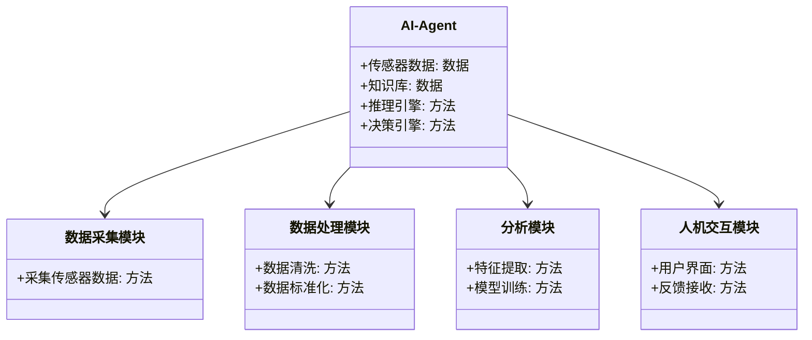

                 


# AI Agent在智能健康监测中的实践

## 关键词：AI Agent, 智能健康监测, 健康数据采集, 机器学习, 深度学习, 系统设计, 项目实战

## 摘要：  
本文探讨了AI Agent在智能健康监测中的应用，详细介绍了其核心概念、算法原理、系统设计与项目实战。通过分析健康数据采集、处理与预测模型，展示了如何利用AI技术提升健康监测的精准性与效率。文章结合实际案例，详细讲解了系统架构与实现过程，为读者提供全面的技术指导。

---

## 第一章：AI Agent与智能健康监测概述

### 1.1 AI Agent的基本概念  
AI Agent（智能体）是指能够感知环境、自主决策并执行任务的智能系统。它具备感知、推理、规划、学习和交互等核心能力。AI Agent在智能健康监测中的应用，主要体现在数据采集、分析和决策支持等方面。

#### 1.1.1 AI Agent的定义与特点  
- **定义**：AI Agent是具有自主性的智能实体，能够根据环境信息做出决策并执行任务。  
- **特点**：  
  1. 智能性：通过学习和推理，适应复杂环境。  
  2. 主动性：无需外部指令，自主执行任务。  
  3. 反应性：实时感知并响应环境变化。  
  4. 社会性：能够与其他系统或用户进行交互与协作。  

#### 1.1.2 AI Agent的核心功能与类型  
- **核心功能**：  
  - 数据采集与处理：通过传感器或其他数据源获取信息。  
  - 知识表示与推理：利用知识库进行逻辑推理。  
  - 决策与规划：基于推理结果制定行动方案。  
  - 人机交互：与用户或系统进行信息交换。  
- **类型**：  
  1. **反应式AI Agent**：基于当前感知做出实时反应。  
  2. **认知式AI Agent**：具备复杂推理和规划能力。  
  3. **协作式AI Agent**：与其他Agent或系统协同工作。  

#### 1.1.3 AI Agent在健康监测中的优势  
- 提高监测效率：通过自动化数据采集与分析，减少人工干预。  
- 实时性：快速响应用户的健康状况变化。  
- 个性化服务：根据用户特征提供定制化健康建议。  

---

### 1.2 智能健康监测的背景与需求  

#### 1.2.1 健康监测的现状与挑战  
- 随着人口老龄化加剧，慢性病发病率上升，传统健康监测手段存在效率低、成本高等问题。  
- 传统的健康监测依赖于医院或专业设备，难以实现连续性与实时性。  

#### 1.2.2 智能健康监测的定义与目标  
- **定义**：利用人工智能、物联网等技术，实现对人体健康状况的实时监测与预警。  
- **目标**：  
  - 提供连续、实时的健康数据监测。  
  - 通过数据分析，提前发现健康问题。  
  - 提供个性化健康建议，帮助用户改善生活习惯。  

#### 1.2.3 AI Agent在健康监测中的角色  
- 数据采集：通过传感器获取生理数据（如心率、体温、血压等）。  
- 数据分析：利用AI算法对数据进行处理与预测。  
- 决策支持：根据分析结果提供健康建议或触发预警机制。  

---

## 第二章：AI Agent的核心原理  

### 2.1 AI Agent的感知与决策机制  

#### 2.1.1 感知层：数据采集与处理  
- **数据采集**：通过多种传感器（如心率传感器、温度传感器）获取生理数据。  
- **数据预处理**：清洗数据，去除噪声与异常值。  
- **数据融合**：将多源数据（如心率、血压）进行整合，提高准确性。  

#### 2.1.2 决策层：基于数据的推理与判断  
- **推理方法**：  
  1. 基于规则的推理：根据预设规则进行判断。  
  2. 基于机器学习的推理：利用训练好的模型进行预测。  
- **决策机制**：  
  - 单点决策：基于当前数据做出决策。  
  - 综合决策：结合历史数据与上下文信息进行判断。  

#### 2.1.3 执行层：决策的实施与反馈  
- **执行方式**：  
  1. 发出警报：当检测到异常数据时，触发预警机制。  
  2. 提供建议：根据分析结果，向用户推送健康建议。  
- **反馈机制**：  
  - 用户反馈：收集用户的反馈信息，用于优化决策模型。  
  - 系统反馈：根据执行结果调整后续行为。  

---

### 2.2 AI Agent的多模态数据处理  

#### 2.2.1 多模态数据的定义与特点  
- **定义**：多模态数据指来自不同传感器或数据源的多种类型数据（如文本、图像、语音、生理数据等）。  
- **特点**：  
  - 信息丰富：多模态数据能够提供更全面的健康信息。  
  - 复杂性高：数据类型多样，处理难度较大。  

#### 2.2.2 数据融合方法  
- **特征提取**：  
  - 对多模态数据进行降维处理，提取关键特征。  
  - 使用主成分分析（PCA）或自动编码器（AE）进行特征提取。  
- **数据融合**：  
  - 基于加权融合：根据数据的重要性进行加权。  
  - 基于模型融合：利用集成学习方法融合多种数据源的信息。  

#### 2.2.3 数据处理的挑战与解决方案  
- **挑战**：  
  - 数据异构性：不同数据类型难以直接融合。  
  - 数据冗余：过多的数据可能导致计算复杂度增加。  
- **解决方案**：  
  - 数据标准化：统一不同数据源的格式与尺度。  
  - 数据清洗：去除噪声与错误数据。  

---

## 第三章：健康监测数据的采集与预处理  

### 3.1 数据采集技术  

#### 3.1.1 传感器技术：生理数据采集  
- **常见传感器**：  
  - 心率传感器：监测心率变化。  
  - 体温传感器：测量体温。  
  - 血压传感器：监测血压值。  
- **无线传输**：  
  - 使用蓝牙、Wi-Fi等技术将数据传输到终端设备。  

#### 3.1.2 数据采集的准确性与实时性  
- **准确性**：传感器的精度直接影响监测结果。  
- **实时性**：数据采集的延迟会影响实时监测的效果。  

#### 3.1.3 数据存储与管理  
- **存储方式**：  
  - 本地存储：将数据保存在终端设备中。  
  - 云端存储：将数据上传至云服务器，便于后续分析。  

---

### 3.2 数据预处理方法  

#### 3.2.1 数据清洗：异常值与噪声处理  
- **异常值检测**：  
  - 使用统计方法（如Z-score）或机器学习方法（如孤立森林）检测异常值。  
- **噪声处理**：  
  - 使用滑动平均法（Moving Average）或中位数滤波器去除噪声。  

#### 3.2.2 数据标准化与归一化  
- **标准化**：  
  - 将数据转换为均值为0，标准差为1的分布。  
  - 公式：$z = \frac{x - \mu}{\sigma}$，其中$\mu$为均值，$\sigma$为标准差。  
- **归一化**：  
  - 将数据缩放到0到1的范围。  
  - 公式：$x' = \frac{x - \min}{\max - \min}$。  

#### 3.2.3 时间序列数据的处理与分析  
- **时间序列分析**：  
  - 使用滑动窗口方法分析短期趋势。  
  - 使用ARIMA模型预测长期趋势。  

---

## 第四章：健康评估与预测模型  

### 4.1 常见的健康评估算法  

#### 4.1.1 机器学习算法  
- **线性回归**：用于预测连续型变量（如血压）。  
  - 公式：$y = \beta_0 + \beta_1x + \epsilon$。  
- **支持向量机（SVM）**：用于分类任务（如健康与疾病分类）。  
  - 核函数：$K(x, y) = (x \cdot y + 1)^2$。  
- **随机森林**：用于分类与回归任务，具有较高的鲁棒性。  

#### 4.1.2 深度学习模型  
- **卷积神经网络（CNN）**：用于处理图像数据（如心电图）。  
- **循环神经网络（RNN）**：用于处理时间序列数据（如心率变化）。  
- **长短期记忆网络（LSTM）**：适用于时间序列的长程依赖建模。  

---

### 4.2 健康预测模型的构建  

#### 4.2.1 数据特征的选择与提取  
- **特征选择**：  
  - 使用相关性分析或Lasso回归选择重要特征。  
- **特征提取**：  
  - 使用主成分分析（PCA）提取主成分。  

#### 4.2.2 模型训练与优化  
- **训练方法**：  
  - 分割数据集为训练集、验证集与测试集。  
  - 使用交叉验证评估模型性能。  
- **优化方法**：  
  - 调整超参数（如学习率、批次大小）进行网格搜索优化。  

#### 4.2.3 模型评估与调优  
- **评估指标**：  
  - 分类任务：准确率、召回率、F1值。  
  - 回归任务：均方误差（MSE）、R²值。  
- **调优方法**：  
  - 使用早停法（Early Stopping）防止过拟合。  
  - 增加正则化项（如L2正则化）降低模型复杂度。  

---

## 第五章：系统设计与架构  

### 5.1 系统功能设计  

#### 5.1.1 领域模型（Mermaid 类图）  


---

### 5.2 系统架构设计（Mermaid 架构图）  


---

## 第六章：项目实战  

### 6.1 项目介绍  

#### 6.1.1 项目背景  
- 开发一个基于AI Agent的智能健康监测系统，实现心率、体温、血压的实时监测与预警。  

---

### 6.2 系统实现  

#### 6.2.1 环境配置  
- **开发工具**：Python 3.8、PyTorch 1.9、Flask 2.0。  
- **依赖安装**：  
  ```bash
  pip install torch flask numpy scikit-learn
  ```

#### 6.2.2 核心代码实现  

##### 数据采集模块  
```python
import numpy as np

def collect_data(sensor_type):
    # 模拟传感器数据采集
    np.random.seed(42)
    if sensor_type == 'heart_rate':
        data = np.random.normal(75, 5, 100)
    elif sensor_type == 'temperature':
        data = np.random.normal(36.5, 0.2, 100)
    return data
```

##### 数据处理模块  
```python
from sklearn.preprocessing import StandardScaler

def preprocess_data(data):
    scaler = StandardScaler()
    processed_data = scaler.fit_transform(data.reshape(-1, 1))
    return processed_data
```

##### 分析模块  
```python
import torch
import torch.nn as nn

class HealthPredictor(nn.Module):
    def __init__(self, input_size, hidden_size, output_size):
        super(HealthPredictor, self).__init__()
        self.fc1 = nn.Linear(input_size, hidden_size)
        self.fc2 = nn.Linear(hidden_size, output_size)
    
    def forward(self, x):
        x = torch.relu(self.fc1(x))
        x = self.fc2(x)
        return x

# 训练模型
model = HealthPredictor(input_size=1, hidden_size=10, output_size=1)
criterion = nn.MSELoss()
optimizer = torch.optim.Adam(model.parameters(), lr=0.01)
```

##### 人机交互模块  
```python
from flask import Flask, jsonify

app = Flask(__name__)

@app.route('/api/health监测', methods=['POST'])
def predict_health():
    data = request.json['data']
    processed_data = preprocess_data(np.array(data))
    prediction = model(torch.FloatTensor(processed_data))
    return jsonify({'prediction': prediction.item()})

if __name__ == '__main__':
    app.run(debug=True)
```

---

## 第七章：总结与展望  

### 7.1 总结  
本文详细探讨了AI Agent在智能健康监测中的应用，从数据采集、处理到模型构建，再到系统设计与实现，为读者提供了全面的技术指导。通过实际案例，展示了如何利用AI技术提升健康监测的效率与准确性。

### 7.2 未来展望  
随着AI技术的不断发展，AI Agent在健康监测中的应用将更加广泛。未来的研究方向包括：  
1. 更高效的多模态数据处理方法。  
2. 更精准的健康预测模型。  
3. 更人性化的交互方式。  

### 7.3 最佳实践 Tips  
- 在数据采集阶段，确保传感器的高精度与低延迟。  
- 在模型训练阶段，采用交叉验证防止过拟合。  
- 在系统部署阶段，考虑数据安全与隐私保护。  

---

## 作者：AI天才研究院 & 禅与计算机程序设计艺术

