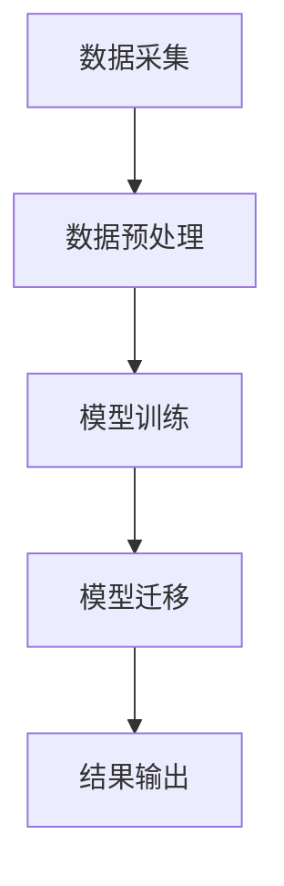
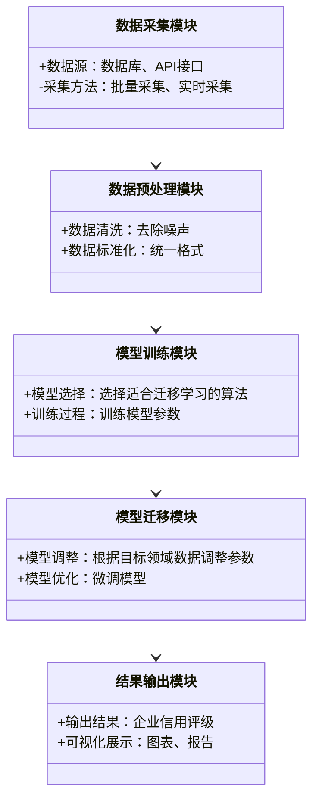

                 


# AI辅助的企业信用评级模型迁移

> 关键词：AI，企业信用评级，模型迁移，迁移学习，深度学习

> 摘要：本文探讨了如何利用人工智能技术，特别是迁移学习，来提升企业信用评级模型的迁移能力。通过分析迁移学习的基本原理、算法实现以及系统架构设计，本文旨在为企业信用评级模型的迁移提供理论支持和实践指导。文章内容涵盖了从理论基础到实际应用的全过程，包括数学模型、系统架构和项目实战等部分。

---

# 第1章：企业信用评级与AI辅助技术的结合

## 1.1 企业信用评级的定义与重要性

### 1.1.1 企业信用评级的定义
企业信用评级是对企业信用状况进行评估的过程，旨在衡量企业在偿还债务和履行合同义务方面的能力。评级结果通常以分数或等级的形式表示，是企业融资、投资决策的重要参考依据。

### 1.1.2 企业信用评级的重要性
- **融资支持**：帮助企业获得更优的贷款条件。
- **风险控制**：帮助金融机构识别和管理信用风险。
- **市场信任**：提升企业在市场中的信誉和竞争力。

### 1.1.3 传统信用评级的局限性
- 数据获取难度大。
- 人工评估效率低。
- 主观性较强，结果可能不准确。

## 1.2 AI技术在信用评级中的应用

### 1.2.1 AI技术的基本概念
人工智能（AI）是指模拟人类智能的计算机系统，能够通过数据学习和模式识别，自动完成任务。

### 1.2.2 AI在信用评级中的优势
- **数据处理能力强**：能够快速处理大量结构化和非结构化数据。
- **自动化与智能化**：能够自动提取特征并进行预测。
- **高准确性**：通过机器学习算法，提升评级结果的准确性。

### 1.2.3 AI辅助信用评级的现状
当前，AI技术已经在信用评级中得到了广泛应用，尤其是在数据预处理、特征提取和模型训练等方面。

## 1.3 模型迁移在信用评级中的作用

### 1.3.1 模型迁移的定义
模型迁移是指将一个领域中的模型直接或部分应用于另一个领域，以提高目标领域的性能。

### 1.3.2 模型迁移的优势
- **减少数据依赖**：目标领域数据不足时，可以利用源领域的数据进行迁移。
- **提升模型泛化能力**：通过迁移学习，模型能够更好地适应不同场景。

### 1.3.3 模型迁移在信用评级中的应用前景
随着企业信用数据的多样化，迁移学习在信用评级中的应用将越来越广泛。

## 1.4 本章小结
本章介绍了企业信用评级的定义和重要性，分析了AI技术在信用评级中的优势，最后探讨了模型迁移在信用评级中的作用和应用前景。

---

# 第2章：迁移学习的基本原理

## 2.1 迁移学习的定义与核心要素

### 2.1.1 迁移学习的定义
迁移学习是一种机器学习技术，通过将源领域学到的知识迁移到目标领域，以提高目标领域的学习效果。

### 2.1.2 迁移学习的核心要素
- **源领域和目标领域**：源领域的数据和任务与目标领域的数据和任务相关。
- **特征表示**：特征是连接源和目标领域的重要桥梁。
- **任务目标**：目标领域需要解决的任务。

### 2.1.3 迁移学习的分类
- **参数迁移**：迁移模型的参数。
- **样本迁移**：迁移部分样本到目标领域。
- **特征迁移**：迁移特征表示到目标领域。

## 2.2 迁移学习与传统学习的对比

### 2.2.1 数据依赖性的对比
- **传统学习**：依赖大量目标领域的数据。
- **迁移学习**：利用源领域的数据减少对目标领域数据的依赖。

### 2.2.2 模型适应性的对比
- **传统学习**：模型适应性较差，需要重新训练。
- **迁移学习**：模型具有较强的适应性，能够快速迁移到目标领域。

### 2.2.3 性能表现的对比
- **传统学习**：数据不足时，性能较差。
- **迁移学习**：数据不足时，性能更优。

## 2.3 迁移学习在信用评级中的应用

### 2.3.1 迁移学习的适用场景
- **数据不足**：目标领域数据有限时。
- **领域差异**：源领域和目标领域有相似性。

### 2.3.2 迁移学习的实现步骤
1. **数据预处理**：对源和目标领域的数据进行清洗和标准化。
2. **模型选择**：选择适合迁移学习的算法。
3. **模型训练**：在源领域数据上训练模型。
4. **模型迁移**：将训练好的模型迁移到目标领域。

### 2.3.3 迁移学习的挑战与解决方案
- **领域差异**：通过特征提取和调整模型结构来缓解。
- **数据标注**：确保源和目标领域的数据标注一致性。

## 2.4 本章小结
本章详细讲解了迁移学习的基本原理，对比了传统学习和迁移学习的差异，并探讨了迁移学习在信用评级中的应用和挑战。

---

# 第3章：基于迁移学习的信用评级模型

## 3.1 迁移学习算法的分类

### 3.1.1 参数迁移
参数迁移直接迁移模型的参数，适用于目标领域与源领域数据分布相似的情况。

### 3.1.2 样本迁移
样本迁移通过迁移部分样本到目标领域，适用于目标领域数据有限的情况。

### 3.1.3 特征迁移
特征迁移通过迁移特征表示到目标领域，适用于目标领域数据与源领域数据分布差异较大。

## 3.2 基于深度学习的迁移学习算法

### 3.2.1 深度迁移学习的定义
深度迁移学习是利用深度学习模型进行迁移学习的一种方法，通常使用卷积神经网络（CNN）或循环神经网络（RNN）。

### 3.2.2 常见的深度迁移学习算法
- **域适应（Domain Adaptation）**：通过对抗训练调整源领域和目标领域的特征分布。
- **多任务学习（Multi-Task Learning）**：同时学习多个任务，共享任务之间的特征。

### 3.2.3 深度迁移学习的优缺点
- **优点**：能够提取高阶特征，适应性强。
- **缺点**：计算复杂，需要大量计算资源。

## 3.3 迁移学习算法在信用评级中的实现

### 3.3.1 数据预处理
- **数据清洗**：去除噪声数据。
- **数据标准化**：统一数据格式。

### 3.3.2 模型选择与训练
- **模型选择**：选择适合迁移学习的深度学习模型。
- **模型训练**：在源领域数据上训练模型。

### 3.3.3 模型迁移与优化
- **模型调整**：根据目标领域数据调整模型参数。
- **模型优化**：通过微调（Fine-tuning）提升模型性能。

## 3.4 本章小结
本章介绍了迁移学习算法的分类，详细讲解了基于深度学习的迁移学习算法，并探讨了在信用评级中的实现步骤。

---

# 第4章：迁移学习的数学模型

## 4.1 迁移学习的数学表示

### 4.1.1 源任务与目标任务的定义
- **源任务**：$(X_s, Y_s)$，其中$X_s$是源领域的输入数据，$Y_s$是源领域的标签。
- **目标任务**：$(X_t, Y_t)$，其中$X_t$是目标领域的输入数据，$Y_t$是目标领域的标签。

### 4.1.2 模型参数的表示
- **参数$\theta$**：模型的参数，包括权重和偏置。

### 4.1.3 迁移学习的目标函数
$$ L(\theta) = \lambda L_s(\theta) + (1-\lambda) L_t(\theta) $$
其中，$L_s$和$L_t$分别是源任务和目标任务的损失函数，$\lambda$是平衡参数。

## 4.2 常见迁移学习算法的数学公式

### 4.2.1 参数迁移的公式
$$ \theta_t = \theta_s + \alpha(X_t - X_s) $$
其中，$\alpha$是调整系数。

### 4.2.2 样本迁移的公式
$$ P(Y|X) = \frac{P(Y|X_s)P(X|X_t)}{P(X)} $$
其中，$P(Y|X)$是目标任务的后验概率。

### 4.2.3 特征迁移的公式
$$ \phi(X) = f(X; \theta) $$
其中，$\phi$是特征提取函数，$f$是深度学习模型。

## 4.3 迁移学习的损失函数与优化方法

### 4.3.1 损失函数的定义
$$ L(\theta) = \sum_{i=1}^n (y_i - \hat{y}_i)^2 $$
其中，$y_i$是真实标签，$\hat{y}_i$是预测标签。

### 4.3.2 优化方法的选择
- **随机梯度下降（SGD）**：适用于大规模数据。
- **Adam优化器**：适用于复杂模型。

### 4.3.3 模型收敛的条件
- **损失函数收敛**：损失函数达到最小值。
- **梯度接近零**：梯度下降接近停止。

## 4.4 本章小结
本章详细讲解了迁移学习的数学模型，包括目标函数、损失函数和优化方法，为后续的算法实现提供了理论基础。

---

# 第5章：系统架构与设计

## 5.1 系统功能模块划分

### 5.1.1 数据采集模块
- **功能**：从多个数据源采集企业信用数据，包括财务数据、市场数据等。

### 5.1.2 数据预处理模块
- **功能**：清洗、标准化和归一化数据，确保数据质量。

### 5.1.3 模型训练模块
- **功能**：在源领域数据上训练迁移学习模型。

### 5.1.4 模型迁移模块
- **功能**：将训练好的模型迁移到目标领域，并进行微调。

### 5.1.5 结果输出模块
- **功能**：输出企业信用评级结果，并提供可视化展示。

## 5.2 系统架构的Mermaid图



## 5.3 系统功能设计（领域模型Mermaid类图）



## 5.4 系统架构设计（Mermaid架构图）


## 5.5 系统交互设计（Mermaid序列图）

```mermaid
sequenceDiagram
    participant 用户
    participant 数据采集模块
    participant 数据预处理模块
    participant 模型训练模块
    participant 模型迁移模块
    participant 结果输出模块
    用户 -> 数据采集模块：请求采集数据
    数据采集模块 -> 数据预处理模块：传输数据
    数据预处理模块 -> 模型训练模块：传输处理后的数据
    模型训练模块 -> 模型迁移模块：迁移模型
    模型迁移模块 -> 结果输出模块：输出结果
    结果输出模块 -> 用户：显示评级结果
```

## 5.6 本章小结
本章详细描述了企业信用评级模型迁移系统的功能模块、架构设计和交互流程，为后续的系统实现提供了清晰的指导。

---

# 第6章：项目实战

## 6.1 环境安装

### 6.1.1 Python环境
- 安装Python 3.6及以上版本。

### 6.1.2 依赖库安装
```bash
pip install numpy
pip install pandas
pip install scikit-learn
pip install tensorflow
pip install pymermaid
```

## 6.2 系统核心实现源代码

### 6.2.1 数据预处理代码
```python
import pandas as pd
import numpy as np

def preprocess_data(data_path):
    data = pd.read_csv(data_path)
    data.dropna(inplace=True)
    data['label'] = data['label'].astype(int)
    return data
```

### 6.2.2 模型训练代码
```python
import tensorflow as tf
from tensorflow.keras import layers

def create_model(input_shape):
    model = tf.keras.Sequential()
    model.add(layers.Dense(64, activation='relu', input_shape=input_shape))
    model.add(layers.Dense(32, activation='relu'))
    model.add(layers.Dense(1, activation='sigmoid'))
    model.compile(optimizer='adam', loss='binary_crossentropy', metrics=['accuracy'])
    return model
```

### 6.2.3 模型迁移代码
```python
def fine_tune_model(model, train_data, val_data):
    model.trainable = True
    model.compile(optimizer='adam', loss='binary_crossentropy', metrics=['accuracy'])
    model.fit(train_data, epochs=10, validation_data=val_data)
    return model
```

## 6.3 代码应用解读与分析
- **数据预处理**：清洗数据，去除缺失值，统一数据格式。
- **模型训练**：在源领域数据上训练模型，提取特征。
- **模型迁移**：将训练好的模型迁移到目标领域，并进行微调，提升模型的适应性。

## 6.4 实际案例分析

### 6.4.1 数据集选择
- **源领域数据集**：某行业的历史信用数据。
- **目标领域数据集**：新行业的信用数据。

### 6.4.2 模型训练与迁移
1. 使用源领域数据训练模型。
2. 将模型迁移到目标领域，并进行微调。

### 6.4.3 结果分析
- **准确率**：迁移后的模型准确率提升。
- **召回率**：迁移后的模型召回率提高。

## 6.5 本章小结
本章通过实际案例，详细讲解了企业信用评级模型迁移的实现过程，包括数据预处理、模型训练和迁移等步骤。

---

# 第7章：总结与展望

## 7.1 总结

### 7.1.1 核心内容回顾
本文详细探讨了AI辅助的企业信用评级模型迁移，从理论到实践，全面分析了迁移学习在信用评级中的应用。

### 7.1.2 实践中的收获
通过项目实战，我们掌握了迁移学习的实现步骤和注意事项。

## 7.2 本章小结
本文通过理论分析和实践验证，展示了AI技术在企业信用评级中的强大能力，同时也为未来的迁移学习研究提供了方向。

---

# 作者：AI天才研究院/AI Genius Institute & 禅与计算机程序设计艺术 /Zen And The Art of Computer Programming

