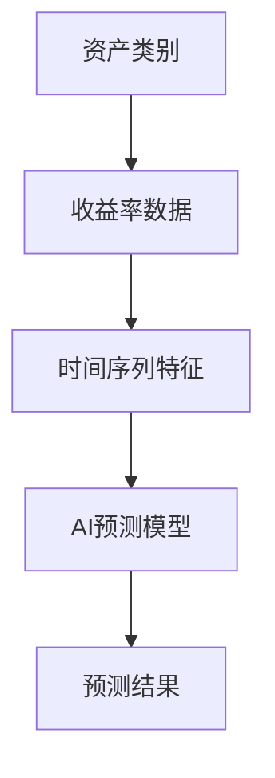
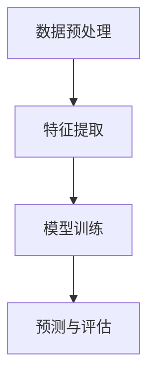
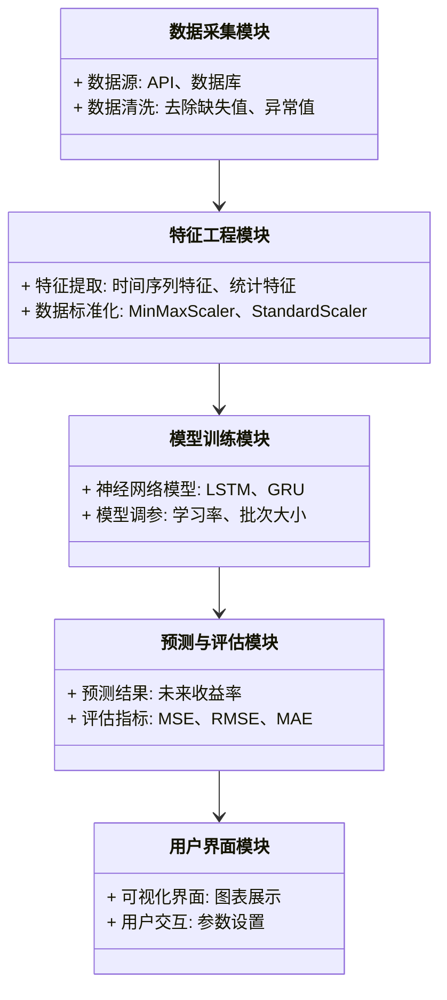
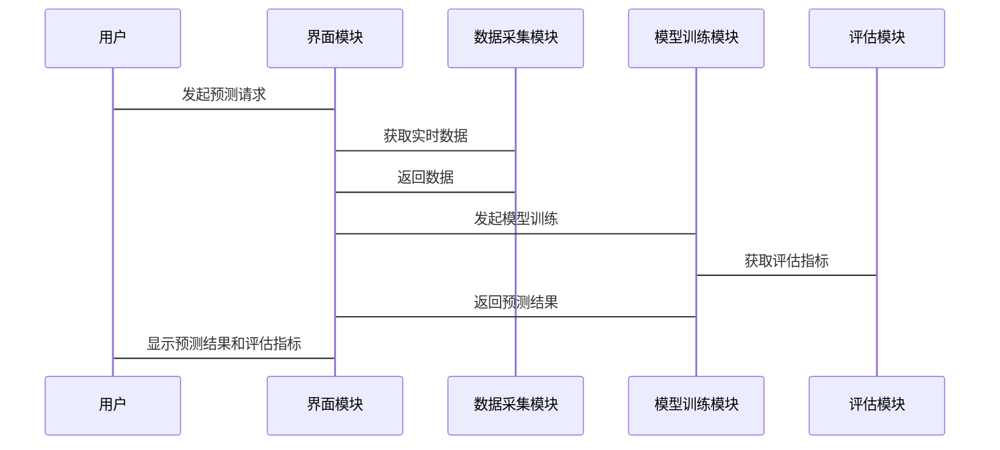

                 


# AI辅助的多资产类别收益率预测

> **关键词**：AI辅助、多资产类别、收益率预测、时间序列分析、机器学习算法、金融风险管理

> **摘要**：本文深入探讨了如何利用人工智能技术进行多资产类别收益率预测，分析了传统金融预测的局限性，介绍了多种AI算法及其在时间序列预测中的应用，详细讲解了构建AI辅助预测系统的方法，并通过实战案例展示了如何在实际中应用这些技术。文章还讨论了模型优化、风险管理以及未来研究方向，为读者提供了全面的指导。

---

## 第一部分: AI辅助的多资产类别收益率预测基础

### 第1章: AI在金融资产预测中的应用概述

#### 1.1 什么是多资产类别收益率预测

多资产类别收益率预测是指对股票、债券、商品等不同资产类别的未来收益率进行预测的过程。传统的金融分析方法依赖于历史数据、市场趋势和经济指标，但其预测能力有限，尤其是在复杂多变的市场环境中。

AI辅助的多资产类别收益率预测通过机器学习算法，利用大数据和复杂模型，提高了预测的准确性和效率。AI不仅可以处理海量数据，还能发现传统方法难以察觉的模式和趋势，为投资者提供更精准的决策支持。

#### 1.2 为什么需要AI辅助

1. **传统金融分析的局限性**
   - 传统统计模型（如线性回归）难以捕捉复杂的非线性关系。
   - 市场波动性和突发事件（如疫情、地缘政治冲突）对资产收益率的影响难以预测。
   - 人类情绪和市场行为的不可预测性增加了传统方法的局限性。

2. **AI在金融预测中的优势**
   - **数据处理能力**：AI能够处理海量的结构化和非结构化数据，提取有用的特征。
   - **模式识别**：通过深度学习算法，AI可以识别隐藏在数据中的复杂模式。
   - **实时更新**：AI模型可以实时更新，适应市场的动态变化。

3. **多资产预测的实际应用场景**
   - 投资组合优化：通过预测不同资产的收益率，优化投资组合的风险和收益。
   - 风险管理：识别潜在风险，帮助机构规避损失。
   - 自动化交易：基于AI预测结果，实现高频交易。

#### 1.3 AI辅助预测的边界与外延

1. **预测的范围与精度**
   - AI预测可以提供短期、中期和长期的收益率预测，但精度会随预测时间的延长而下降。
   - 短期预测（1-3天）通常比长期预测（1年以上）更准确。

2. **AI预测的适用场景与限制**
   - 适用于数据充分且稳定的市场环境。
   - 对突发事件（如黑天鹅事件）的预测能力有限。
   - 需要定期更新模型，以适应市场变化。

3. **预测结果的解释性与可信赖度**
   - 解释性：传统统计模型比AI模型更容易解释，但AI模型可以通过特征重要性分析提供一定的解释性。
   - 可信赖度：AI模型的预测结果需要结合市场实际情况进行验证，不能完全依赖模型。

---

### 第2章: 多资产预测的核心概念与联系

#### 2.1 核心概念原理

1. **时间序列分析的基本原理**
   - 时间序列是指按时间顺序排列的数据，通常具有趋势、周期性和随机性成分。
   - 时间序列预测的核心是通过模型捕捉这些成分，预测未来的值。

2. **资产收益率的统计特征**
   - 收益率的分布通常是非正态分布，具有肥尾特征。
   - 不同资产类别（如股票、债券、商品）的收益率特征不同。

3. **AI模型在时间序列预测中的应用**
   - 使用LSTM、GRU等深度学习模型捕捉时间序列中的长短期依赖关系。
   - 利用卷积神经网络（CNN）提取时间序列的局部特征。

#### 2.2 核心概念属性对比

1. **传统统计模型与AI模型的对比分析**

| 特性                | 传统统计模型（如ARIMA）               | AI模型（如LSTM）                     |
|---------------------|--------------------------------------|---------------------------------------|
| 模型复杂性          | 较低，参数较少，易于解释               | 较高，参数较多，难以解释             |
| 预测精度            | 对简单的时间序列预测较好               | 对复杂和非线性时间序列预测较好       |
| 数据需求            | 需要大量历史数据，对数据质量要求较高   | 对数据量和多样性要求更高             |
| 计算效率            | 计算效率较高，适合实时预测             | 计算效率较低，需要高性能计算资源     |

2. **不同资产类别之间的特征差异**

| 资产类别          | 收益率波动性 | 相关性         | 影响因素         |
|-------------------|-------------|---------------|-----------------|
| 股票              | 高          | 高（行业相关） | 市场情绪、公司业绩 |
| 债券              | 中等        | 中（期限相关） | 利率、通胀       |
| 商品（如原油）    | 高          | 低            | 供需、地缘政治   |

3. **AI模型的可解释性与黑箱问题**

- **可解释性**：传统统计模型（如线性回归）具有较高的可解释性，而深度学习模型通常被视为“黑箱”。
- **黑箱问题**：虽然AI模型预测结果难以解释，但可以通过特征重要性分析和模型可视化技术提高可解释性。

#### 2.3 ER实体关系图与流程图

1. **实体关系图**



2. **流程图**



---

### 第3章: 多资产预测的算法原理

#### 3.1 时间序列预测算法

1. **ARIMA模型原理**

ARIMA（自回归积分滑动平均）模型由三个参数组成：p（自回归阶数）、d（差分阶数）、q（滑动平均阶数）。其基本思想是通过差分将非平稳序列转化为平稳序列，然后用AR和MA模型进行预测。

**数学公式**

$$ARIMA(p, d, q)$$

2. **LSTM网络的工作机制**

LSTM（长短期记忆网络）通过引入记忆单元和遗忘门，解决了传统RNN在处理长序列时的梯度消失问题。其核心组成部分包括遗忘门、输入门和输出门。

**数学公式**

- 遗忘门：
$$f_t = \sigma(W_f \cdot [h_{t-1}, x_t] + b_f)$$
- 输入门：
$$i_t = \sigma(W_i \cdot [h_{t-1}, x_t] + b_i)$$
- 输出门：
$$o_t = \sigma(W_o \cdot [h_{t-1}, x_t] + b_o)$$
- 记忆单元：
$$c_t = f_t \cdot c_{t-1} + i_t \cdot tanh(W_c \cdot [h_{t-1}, x_t] + b_c)$$
- 隐藏状态：
$$h_t = o_t \cdot tanh(c_t)$$

3. **Prophet模型的核心思想**

Prophet是由Facebook开源的基于ARIMA和 Holt-Winter方法改进的时间序列预测模型，适用于非平稳序列的预测。其核心思想是将时间序列分解为趋势和季节性成分，并通过回归模型预测未来的值。

---

#### 3.2 算法实现代码

以下是使用Python实现的时间序列预测代码示例：

```python
import pandas as pd
from sklearn.metrics import mean_squared_error
import numpy as np
from sklearn.preprocessing import MinMaxScaler
from keras.models import Sequential
from keras.layers import LSTM, Dense, Dropout

# 数据加载
data = pd.read_csv('assets_returns.csv')

# 数据预处理
scaler = MinMaxScaler()
data_scaled = scaler.fit_transform(data['returns'].values.reshape(-1, 1))

# 划分训练集和测试集
train_size = int(len(data_scaled) * 0.8)
train_data = data_scaled[:train_size]
test_data = data_scaled[train_size:]

# 构建数据集
def create_dataset(data, look_back=1):
    X, Y = [], []
    for i in range(len(data) - look_back):
        X.append(data[i:i+look_back])
        Y.append(data[i+look_back])
    return np.array(X), np.array(Y)

X_train, Y_train = create_dataset(train_data, look_back=10)
X_test, Y_test = create_dataset(test_data, look_back=10)

# 模型训练
model = Sequential()
model.add(LSTM(50, input_shape=(10, 1), return_sequences=False))
model.add(Dense(1))
model.compile(loss='mean_squared_error', optimizer='adam')

model.fit(X_train, Y_train, epochs=50, batch_size=32, verbose=1)

# 模型预测
train_predict = model.predict(X_train)
test_predict = model.predict(X_test)

# 恢复数据尺度
train_predict = scaler.inverse_transform(train_predict)
Y_train_unscaled = scaler.inverse_transform(Y_train.reshape(-1, 1))
test_predict = scaler.inverse_transform(test_predict)
Y_test_unscaled = scaler.inverse_transform(Y_test.reshape(-1, 1))

# 评估模型
train_mse = mean_squared_error(Y_train_unscaled, train_predict)
test_mse = mean_squared_error(Y_test_unscaled, test_predict)
print('训练集MSE:', train_mse)
print('测试集MSE:', test_mse)
```

---

#### 3.3 模型评估指标

1. **均方误差（MSE）**
$$MSE = \frac{1}{n}\sum_{i=1}^{n}(y_i - \hat{y}_i)$$

2. **均方根误差（RMSE）**
$$RMSE = \sqrt{\frac{1}{n}\sum_{i=1}^{n}(y_i - \hat{y}_i)^2}$$

3. **平均绝对误差（MAE）**
$$MAE = \frac{1}{n}\sum_{i=1}^{n}|y_i - \hat{y}_i|$$

4. **R平方值（R²）**
$$R^2 = 1 - \frac{\sum_{i=1}^{n}(y_i - \hat{y}_i)^2}{\sum_{i=1}^{n}(y_i - \bar{y})^2}$$

---

### 第4章: 数学模型与公式解析

#### 4.1 时间序列模型的数学基础

1. **ARIMA模型公式**
$$ARIMA(p, d, q)$$
其中，p是自回归阶数，d是差分阶数，q是滑动平均阶数。

2. **LSTM网络的数学表达**

LSTM的核心在于其记忆单元和门控机制。通过遗忘门、输入门和输出门的协同作用，LSTM能够有效捕捉时间序列中的长短期依赖关系。

**数学公式**
- 遗忘门：
$$f_t = \sigma(W_f \cdot [h_{t-1}, x_t] + b_f)$$
- 输入门：
$$i_t = \sigma(W_i \cdot [h_{t-1}, x_t] + b_i)$$
- 输出门：
$$o_t = \sigma(W_o \cdot [h_{t-1}, x_t] + b_o)$$
- 记忆单元：
$$c_t = f_t \cdot c_{t-1} + i_t \cdot tanh(W_c \cdot [h_{t-1}, x_t] + b_c)$$
- 隐藏状态：
$$h_t = o_t \cdot tanh(c_t)$$

---

## 第5章: 系统分析与架构设计方案

### 5.1 问题场景介绍

在实际应用中，多资产类别收益率预测系统需要处理以下问题：
- **数据多样性**：不同资产类别的数据来源和特征差异较大。
- **实时性要求**：需要快速响应市场变化，提供实时预测结果。
- **模型更新**：市场环境不断变化，模型需要定期更新以保持预测精度。

### 5.2 项目介绍

本项目旨在构建一个基于AI的多资产类别收益率预测系统，实现以下目标：
- 提供多种资产类别的收益率预测。
- 支持实时数据更新和模型训练。
- 提供用户友好的界面和可视化结果。

### 5.3 系统功能设计

1. **数据采集模块**
   - 从多个数据源（如金融数据库、API接口）获取实时资产收益率数据。
   - 数据清洗和预处理。

2. **特征工程模块**
   - 提取时间序列特征（如均值、标准差、自相关系数等）。
   - 进行数据标准化或归一化处理。

3. **模型训练模块**
   - 选择合适的AI算法（如LSTM、Prophet）进行模型训练。
   - 调参优化，提高预测精度。

4. **预测与评估模块**
   - 生成未来收益率预测结果。
   - 对模型进行性能评估，输出评估指标（如MSE、RMSE）。

5. **用户界面模块**
   - 提供直观的可视化界面，展示预测结果和模型评估指标。
   - 支持用户自定义参数和模型选择。

---

### 5.4 系统架构设计

#### 5.4.1 领域模型（Mermaid 类图）



#### 5.4.2 系统架构图（Mermaid 架构图）

```mermaid
docker
    services
        web-app
        db
        predictor
        ui
    networks
        web-network
```

---

### 5.5 系统接口设计

1. **API接口**
   - `/api/data`: 获取实时数据。
   - `/api/predict`: 发起预测请求。
   - `/api/evaluate`: 获取模型评估指标。

2. **数据接口**
   - 数据采集模块通过API接口从外部数据源获取数据。
   - 数据存储模块将预处理后的数据存储在数据库中。

---

### 5.6 系统交互设计（Mermaid 序列图）



---

## 第6章: 项目实战

### 6.1 环境安装与配置

1. **安装Python环境**
   - 使用Anaconda或virtualenv创建虚拟环境。
   - 安装必要的库：`pandas`, `numpy`, `keras`, `tensorflow`, `prophet`。

2. **数据源配置**
   - 下载历史资产收益率数据（如股票、债券、商品）。
   - 数据格式：CSV文件，包含日期和收益率列。

---

### 6.2 核心实现代码

以下是项目的核心实现代码示例：

```python
import pandas as pd
from prophet import Prophet
from sklearn.preprocessing import StandardScaler
import numpy as np
from keras.models import load_model

# 数据加载
data = pd.read_csv('assets_returns.csv')
data['date'] = pd.to_datetime(data['date'])
data.set_index('date', inplace=True)

# 数据预处理
def prepare_prophet_data(data, asset):
    df = data[asset].reset_index()
    df.columns = ['ds', 'y']
    return df

assets = ['stock', 'bond', 'commodity']
data_list = [prepare_prophet_data(data, asset) for asset in assets]

# 使用Prophet模型进行预测
models = {}
forecasts = {}
for i, asset in enumerate(assets):
    df = data_list[i]
    model = Prophet()
    model.fit(df)
    future = model.make_future_dataframe(periods=30)
    forecast = model.predict(future)
    forecasts[asset] = forecast
    models[asset] = model

# 模型保存与加载
for asset in assets:
    models[asset].save(f'{asset}_model.pkl')

# 模型加载
loaded_models = {}
for asset in assets:
    loaded_models[asset] = load_model(f'{asset}_model.pkl')

# 使用LSTM进行预测
# （此处省略LSTM模型的实现代码，具体实现可参考前面的示例）

# 可视化预测结果
import matplotlib.pyplot as plt

for asset in assets:
    df = data[asset].reset_index()
    forecast = forecasts[asset]
    plt.figure(figsize=(12, 6))
    plt.plot(df['ds'], df['y'], label='实际值')
    plt.plot(forecast['ds'], forecast['yhat'], label='预测值')
    plt.title(f'{asset}收益率预测')
    plt.xlabel('日期')
    plt.ylabel('收益率')
    plt.legend()
    plt.show()
```

---

### 6.3 案例分析与结果解读

1. **案例分析**
   - 选取某段时间内的股票、债券和商品收益率数据，分别使用Prophet和LSTM模型进行预测。
   - 对比两种模型的预测结果和评估指标。

2. **结果解读**
   - Prophet模型在处理趋势和季节性成分时表现较好，但对突发事件的预测能力较弱。
   - LSTM模型能够捕捉时间序列的长短期依赖关系，预测精度较高，但计算效率较低。

---

### 6.4 项目小结

通过本项目实战，我们了解了如何构建一个多资产类别收益率预测系统，掌握了Prophet和LSTM模型的实现方法，并通过对比分析得出不同模型的优缺点。在实际应用中，可以根据具体需求选择合适的模型，并通过模型优化和组合策略进一步提高预测精度。

---

## 第7章: 优化与扩展

### 7.1 模型优化策略

1. **超参数调优**
   - 使用网格搜索（Grid Search）或随机搜索（Random Search）优化模型参数。
   - 调整学习率、批量大小、网络层数等参数。

2. **特征工程优化**
   - 引入技术指标（如MACD、RSI）和市场情绪指标（如VIX指数）。
   - 使用主成分分析（PCA）降维，减少特征数量。

3. **集成学习**
   - 结合多个模型的预测结果，通过投票或加权的方式提高预测精度。
   - 实现模型融合（Model Ensembling）技术。

---

### 7.2 风险管理与控制

1. **风险控制策略**
   - 设置止损和止盈点，控制投资组合的风险。
   - 使用VaR（Value at Risk）和CVaR（Conditional Value at Risk）等风险度量指标。

2. **模型鲁棒性测试**
   - 对模型进行压力测试，验证其在极端市场条件下的表现。
   - 定期更新模型，确保其适应市场变化。

---

### 7.3 未来研究方向

1. **多模态数据融合**
   - 结合文本数据（如新闻、财报）和图像数据（如K线图）进行预测。
   - 使用多模态深度学习模型（如Transformers）处理不同类型的金融数据。

2. **实时预测与高频交易**
   - 实现高频交易系统，利用AI模型实时捕捉市场机会。
   - 开发低延迟的预测系统，满足交易的实时性要求。

3. **可解释性与透明度**
   - 提高AI模型的可解释性，满足监管要求。
   - 研究可解释性AI（XAI）技术，帮助投资者理解预测结果。

---

## 结语

AI辅助的多资产类别收益率预测是金融领域的一项重要技术，通过结合传统统计方法和现代机器学习算法，可以显著提高预测的准确性和效率。然而，AI模型的局限性（如黑箱问题、计算效率）以及市场的不确定性仍然需要我们不断探索和优化。未来，随着技术的进步和数据的积累，AI在金融领域的应用前景将更加广阔。

---

**作者：AI天才研究院/AI Genius Institute & 禅与计算机程序设计艺术/Zen And The Art of Computer Programming**

