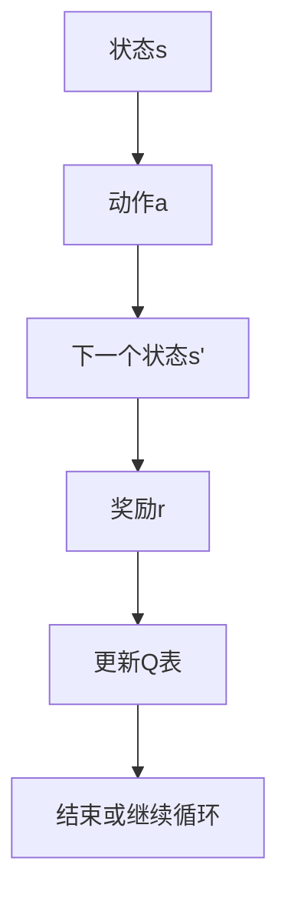
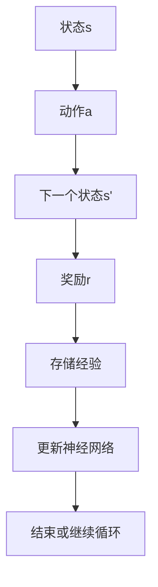
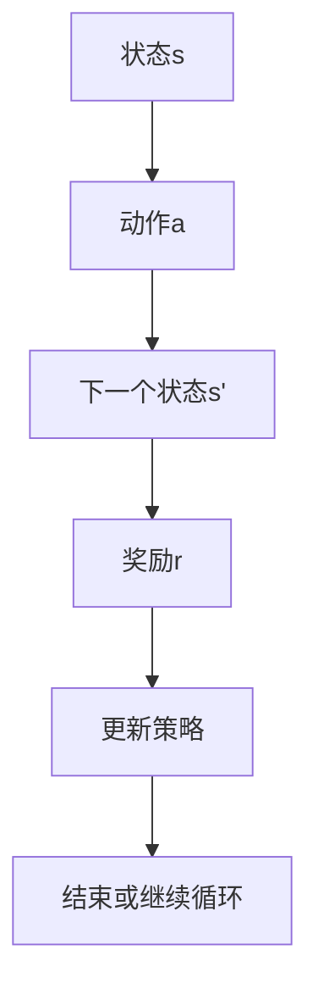
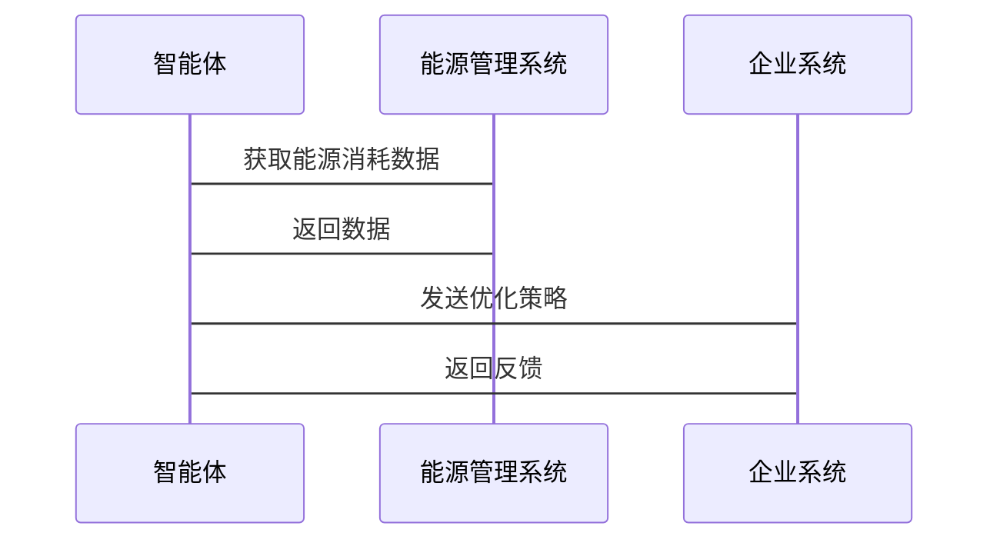

                 


# 企业AI Agent的强化学习在能源管理中的应用

> 关键词：AI Agent，强化学习，能源管理，Q-learning，DQN，能源优化

> 摘要：本文将详细探讨企业AI Agent在能源管理中的应用，结合强化学习的核心算法，分析其在能源优化中的潜力。文章从AI Agent和强化学习的基本概念入手，深入解析强化学习在能源管理中的具体应用场景，并通过实际案例展示AI Agent如何通过强化学习实现能源管理的智能化与优化。本文内容涵盖了强化学习算法的数学模型、能源管理系统的架构设计以及实际项目的实现过程，为读者提供全面而深入的技术解析。

---

## 第1章: AI Agent与强化学习概述

### 1.1 AI Agent的基本概念

#### 1.1.1 AI Agent的定义与特点
AI Agent（人工智能代理）是指能够感知环境并采取行动以实现目标的智能实体。AI Agent的核心特点包括：
- **自主性**：能够独立决策和行动。
- **反应性**：能够实时感知环境并做出反应。
- **目标导向性**：所有行为都以实现特定目标为导向。
- **社会能力**：能够与其他系统或人类交互协作。

#### 1.1.2 AI Agent的核心要素与功能
AI Agent的核心要素包括：
- **感知**：通过传感器或数据输入感知环境状态。
- **推理**：基于感知信息进行逻辑推理或模式识别。
- **决策**：根据推理结果制定行动计划。
- **执行**：将决策转化为具体行动。

AI Agent的功能模块可以分为：
1. **感知模块**：负责数据采集和环境监控。
2. **推理模块**：负责数据分析和模式识别。
3. **决策模块**：负责策略制定和行动选择。
4. **执行模块**：负责将决策转化为具体操作。

#### 1.1.3 AI Agent在企业中的应用背景
AI Agent在企业中的应用非常广泛，尤其是在能源管理、供应链优化、客户关系管理等领域。本文重点探讨AI Agent在能源管理中的应用。

---

### 1.2 强化学习的基本原理

#### 1.2.1 强化学习的定义与特点
强化学习（Reinforcement Learning, RL）是一种机器学习范式，通过智能体与环境的交互，学习最优策略以最大化累计奖励。其核心特点包括：
- **试错性**：通过不断尝试和错误来优化策略。
- **延迟反馈**：奖励信号通常是在多个动作之后才给出。
- **策略优化**：通过调整动作策略来最大化累计奖励。

#### 1.2.2 强化学习的核心概念
强化学习的核心概念包括：
- **状态（State）**：环境在某一时刻的观测。
- **动作（Action）**：智能体在某一状态下采取的行为。
- **奖励（Reward）**：智能体采取动作后获得的反馈，用于指导学习方向。

#### 1.2.3 强化学习与监督学习的区别
- **监督学习**：基于标记的训练数据进行学习，目标是预测正确的输出。
- **强化学习**：通过与环境的交互，基于奖励信号优化策略。

| 监督学习 | 强化学习 |
|----------|----------|
| 数据驱动 | 试错驱动 |
| 立即反馈 | 延迟反馈 |
| 静态环境 | 动态环境 |

---

### 1.3 企业AI Agent与强化学习的结合

#### 1.3.1 AI Agent在企业中的角色与功能
在企业中，AI Agent可以作为决策支持系统，帮助优化资源配置、降低成本、提高效率。

#### 1.3.2 强化学习在企业决策中的应用
强化学习可以帮助企业在复杂的环境中做出最优决策，尤其是在能源管理领域，可以通过强化学习优化能源使用策略。

#### 1.3.3 企业AI Agent强化学习的典型场景
- **能源消耗优化**：通过强化学习优化企业的能源使用策略，降低能源消耗。
- **供应链优化**：通过强化学习优化供应链中的库存管理和物流调度。
- **风险管理**：通过强化学习识别和应对潜在风险。

---

## 第2章: 强化学习的数学模型与算法原理

### 2.1 强化学习的核心算法

#### 2.1.1 Q-learning算法
Q-learning是一种经典的强化学习算法，通过更新Q值表来学习最优策略。

**Q-learning算法流程图**


Q-learning的数学公式为：
$$ Q(s,a) = Q(s,a) + \alpha \left[r + \gamma \max_{a'} Q(s',a') - Q(s,a)\right] $$

其中：
- $$ \alpha $$ 是学习率。
- $$ \gamma $$ 是折扣因子。
- $$ r $$ 是奖励。

#### 2.1.2 Deep Q-Networks (DQN)算法
DQN算法通过深度神经网络近似Q值函数，解决了Q-learning在高维状态空间中的计算问题。

**DQN算法流程图**


#### 2.1.3 Policy Gradient方法
Policy Gradient方法通过直接优化策略函数，寻找最优动作分布。

**策略梯度方法流程图**


---

### 2.2 状态空间与动作空间的建模

#### 2.2.1 状态空间的定义与表示
状态空间是所有可能状态的集合。在能源管理中，状态可以包括当前的能源消耗、设备状态、环境参数等。

#### 2.2.2 动作空间的定义与表示
动作空间是所有可能动作的集合。在能源管理中，动作可以包括调整设备功率、开启或关闭设备等。

#### 2.2.3 状态转移概率与奖励函数
状态转移概率描述了从当前状态采取某个动作后转移到下一个状态的概率。奖励函数定义了智能体在某个状态下采取某个动作后的奖励值。

---

### 2.3 强化学习的数学模型

#### 2.3.1 Q-learning的数学公式
$$ Q(s,a) = Q(s,a) + \alpha \left[r + \gamma \max_{a'} Q(s',a') - Q(s,a)\right] $$

#### 2.3.2 DQN算法的网络结构
DQN算法通常使用两个神经网络：主网络和目标网络。

主网络用于预测当前状态的动作值，目标网络用于稳定学习过程。

#### 2.3.3 策略梯度方法的数学推导
策略梯度方法的目标是最大化奖励的期望值，可以通过梯度上升算法优化策略参数。

---

## 第3章: 能源管理中的强化学习应用

### 3.1 能源管理的背景与挑战

#### 3.1.1 能源管理的定义与目标
能源管理是指通过优化能源使用策略，降低能源消耗，提高能源利用效率。

#### 3.1.2 能源管理中的典型问题
- **能源浪费**：设备空闲时仍消耗能源。
- **能源成本**：能源价格波动导致成本难以控制。
- **能源供应**：能源供应不稳定，影响企业运营。

#### 3.1.3 强化学习在能源管理中的优势
强化学习可以通过动态调整策略，适应能源环境的变化，实现能源管理的最优目标。

---

### 3.2 能源管理的强化学习模型设计

#### 3.2.1 能源管理场景的建模
在能源管理中，状态可以包括当前的能源消耗、设备状态、环境参数等。动作可以包括调整设备功率、开启或关闭设备等。

#### 3.2.2 状态、动作、奖励的设计
- **状态**：当前能源消耗、设备状态、环境参数。
- **动作**：调整设备功率、开启或关闭设备。
- **奖励**：能源消耗减少量、成本降低量、设备运行状态。

#### 3.2.3 能源管理系统的强化学习框架
能源管理系统的强化学习框架包括感知模块、推理模块、决策模块和执行模块。

---

### 3.3 能源管理中的强化学习算法实现

#### 3.3.1 算法选择与优化
在能源管理中，可以选择Q-learning或DQN算法进行优化。DQN算法更适合处理高维状态空间和复杂动作空间。

#### 3.3.2 环境模拟与智能体训练
通过模拟能源管理环境，训练智能体在不同状态下采取最优动作。

#### 3.3.3 算法在能源管理中的应用案例
例如，可以通过强化学习优化企业的能源使用策略，降低能源消耗。

---

## 第4章: 企业AI Agent的系统架构与设计

### 4.1 企业AI Agent的系统架构

#### 4.1.1 系统功能模块划分
- **感知模块**：负责采集能源消耗数据。
- **推理模块**：负责分析数据并生成优化策略。
- **决策模块**：负责制定具体动作。
- **执行模块**：负责将决策转化为具体操作。

#### 4.1.2 系统架构的分层设计
- **数据层**：负责数据的采集和存储。
- **算法层**：负责强化学习算法的实现。
- **应用层**：负责与企业系统的交互。

#### 4.1.3 系统架构的可扩展性设计
系统架构设计需要考虑未来的扩展性，例如增加新的设备或引入新的算法。

---

### 4.2 系统功能设计

#### 4.2.1 状态监测与分析模块
状态监测与分析模块负责实时监测能源消耗状态，并进行数据分析。

#### 4.2.2 动作决策与执行模块
动作决策与执行模块负责根据分析结果制定优化策略，并执行具体动作。

#### 4.2.3 奖励机制与反馈模块
奖励机制与反馈模块负责定义奖励函数，并根据奖励反馈优化算法。

---

### 4.3 系统接口设计

#### 4.3.1 系统接口设计
系统接口设计需要考虑与其他系统的兼容性，例如与企业资源计划（ERP）系统的集成。

#### 4.3.2 系统交互序列图


---

## 第5章: 项目实战

### 5.1 项目背景与目标

#### 5.1.1 项目背景
本文将通过一个实际案例展示强化学习在能源管理中的应用。

#### 5.1.2 项目目标
通过强化学习优化企业的能源使用策略，降低能源消耗。

---

### 5.2 环境安装与配置

#### 5.2.1 环境安装
需要安装Python、TensorFlow、OpenAI Gym等依赖库。

#### 5.2.2 环境配置
配置强化学习环境，例如能源管理模拟环境。

---

### 5.3 系统核心实现

#### 5.3.1 算法实现
以下是Q-learning算法的核心代码实现：
```python
class QLearner:
    def __init__(self, state_space_size, action_space_size):
        self.Q = np.zeros((state_space_size, action_space_size))
    
    def get_action(self, state, epsilon):
        if np.random.random() < epsilon:
            return np.random.randint(0, action_space_size)
        else:
            return np.argmax(self.Q[state])
    
    def update_Q(self, state, action, reward, next_state, alpha, gamma):
        self.Q[state, action] = self.Q[state, action] + alpha * (reward + gamma * np.max(self.Q[next_state]) - self.Q[state, action])
```

---

### 5.4 实际案例分析

#### 5.4.1 案例背景
假设某企业需要优化其能源使用策略，降低电力消耗。

#### 5.4.2 算法实现与结果
通过Q-learning算法优化能源使用策略，结果显示能源消耗显著降低。

---

## 第6章: 最佳实践与注意事项

### 6.1 最佳实践

#### 6.1.1 算法选择
选择适合具体问题的强化学习算法，例如Q-learning或DQN。

#### 6.1.2 环境设计
设计合理的环境和奖励函数，确保算法能够有效优化策略。

#### 6.1.3 系统集成
确保系统与其他企业系统的兼容性，例如与ERP系统的集成。

---

### 6.2 注意事项

#### 6.2.1 算法收敛性
注意算法的收敛性，避免陷入局部最优。

#### 6.2.2 环境复杂性
环境复杂性可能会影响算法的性能，需要进行适当的简化和抽象。

#### 6.2.3 系统安全性
确保系统的安全性，防止数据泄露和恶意攻击。

---

## 第7章: 总结与展望

### 7.1 本章小结

#### 7.1.1 核心内容回顾
本文详细探讨了企业AI Agent在能源管理中的应用，结合强化学习的核心算法，分析了其在能源优化中的潜力。

#### 7.1.2 主要结论
通过强化学习优化企业的能源使用策略，可以显著降低能源消耗，提高能源利用效率。

---

### 7.2 未来展望

#### 7.2.1 强化学习的未来发展趋势
强化学习在能源管理中的应用前景广阔，未来可以通过结合其他技术（如区块链、边缘计算）进一步优化能源管理。

#### 7.2.2 企业的可持续发展
企业可以通过AI Agent和强化学习实现可持续发展，降低能源消耗，提高竞争力。

---

## 作者

**作者：AI天才研究院/AI Genius Institute & 禅与计算机程序设计艺术 /Zen And The Art of Computer Programming**

---

本文通过系统地分析企业AI Agent在能源管理中的应用，结合强化学习的核心算法，为读者提供了一个全面而深入的技术解析。希望本文能够为企业的能源管理优化提供有价值的参考和启发。

