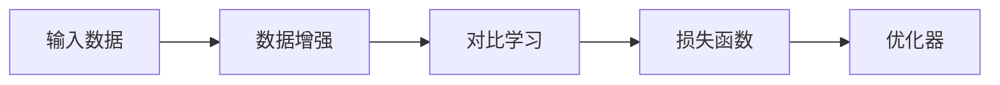
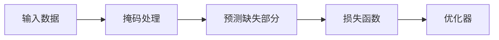
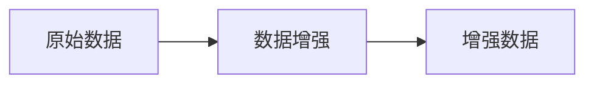
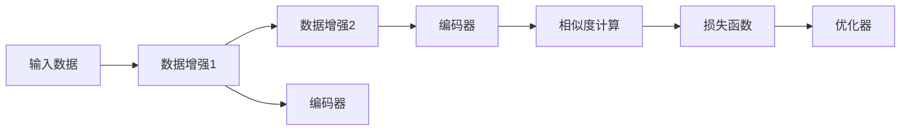
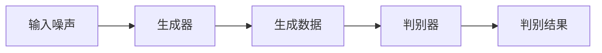
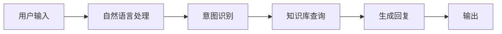
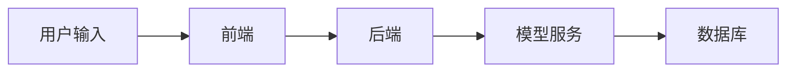

                 


# 《企业AI Agent的自监督学习：利用未标记数据提升性能》

## 关键词：企业AI Agent，自监督学习，未标记数据，性能提升，深度学习，对比学习，生成对抗网络

## 摘要：  
企业AI Agent的性能高度依赖于数据的质量和数量，而未标记数据的利用是提升其性能的关键。本文深入探讨了自监督学习在企业AI Agent中的应用，结合理论分析、算法实现和系统设计，详细阐述了如何通过自监督学习技术，从大量未标记数据中提取有价值的信息，进而提升AI Agent的智能水平和决策能力。文章从背景介绍、核心概念、算法原理、系统设计到项目实战，层层递进，为读者提供了一套完整的解决方案，帮助企业在实际场景中有效利用未标记数据，推动AI Agent的智能化发展。

---

# 第1章: 企业AI Agent与自监督学习概述

## 1.1 自监督学习的基本概念

### 1.1.1 什么是自监督学习  
自监督学习是一种无监督学习的变体，通过利用数据本身的结构信息，以伪标签的方式进行监督学习。其核心思想是让模型在未标记数据上预测某种关系或属性，从而学习到数据的有用特征。  

**公式：**  
$$ \text{自监督学习} = \text{无监督学习} + \text{伪标签} $$  

### 1.1.2 自监督学习的特点  
- **无需人工标注**：利用未标记数据进行学习。  
- **数据高效**：能够从大量未标记数据中提取信息。  
- **任务通用性**：适用于多种任务，如分类、聚类、生成等。  

### 1.1.3 企业AI Agent的核心目标  
企业AI Agent的目标是通过与用户交互，理解用户需求，并提供高效的解决方案。自监督学习能够帮助AI Agent在未标记数据中学习用户行为模式，从而提高交互效率和准确性。  

---

## 1.2 未标记数据的重要性

### 1.2.1 数据标注的成本与挑战  
- 数据标注需要大量人工投入，成本高昂。  
- 数据标注的质量依赖于标注者的专业性。  
- 标签的稀缺性限制了模型的训练效果。  

### 1.2.2 未标记数据的潜在价值  
未标记数据中包含大量潜在信息，如用户行为、场景特征等，这些信息可以通过自监督学习提取并转化为有用的特征。  

### 1.2.3 企业中的应用场景  
- **客户服务**：通过分析用户对话历史，提升问答系统的准确性。  
- **内部流程优化**：通过分析员工行为数据，优化企业内部流程。  

---

## 1.3 自监督学习在企业AI Agent中的应用

### 1.3.1 企业AI Agent的定义与分类  
企业AI Agent是一种能够理解、推理和执行特定任务的智能系统，主要应用于客服、销售、内部管理等领域。  

### 1.3.2 自监督学习如何提升性能  
通过自监督学习，AI Agent可以从大量未标记数据中学习到用户的意图、情感倾向等信息，从而提高交互准确性和响应速度。  

### 1.3.3 企业级AI Agent的挑战与机遇  
- **挑战**：数据异质性高、模型泛化能力不足。  
- **机遇**：未标记数据的充分利用能够显著提升模型性能。  

---

## 1.4 本章小结  
本章介绍了自监督学习的基本概念及其在企业AI Agent中的应用，强调了未标记数据的重要性，并为后续章节奠定了基础。

---

# 第2章: 自监督学习的核心原理

## 2.1 自监督学习的原理与方法

### 2.1.1 对比学习  
对比学习通过对比不同数据之间的关系，学习数据的表征。  

**公式：**  
$$ \mathcal{L}(\text{similarity}(x_1, x_2)) = \text{loss}(\text{预测值}, \text{真实值}) $$  

**图示：**  


### 2.1.2 生成对抗网络  
生成对抗网络通过生成器和判别器的对抗训练，学习数据的分布。  

**公式：**  
$$ \mathcal{L} = \mathbb{E}_{x \sim p_{\text{data}}}[D(x)] + \mathbb{E}_{z \sim p(z)}[1 - D(G(z))] $$  

### 2.1.3 掩码预测  
掩码预测通过掩盖部分信息，让模型预测缺失部分。  

**图示：**  


---

## 2.2 自监督学习的关键技术

### 2.2.1 数据增强技术  
数据增强通过变换数据，增加数据的多样性。  

**图示：**  


### 2.2.2 知识蒸馏  
知识蒸馏通过教师模型指导学生模型，降低模型复杂度。  

### 2.2.3 表征学习  
表征学习通过学习数据的低维表示，提升模型的泛化能力。  

---

## 2.3 自监督学习的优缺点

### 2.3.1 优点  
- 无需标注数据。  
- 能够从大量未标记数据中提取信息。  

### 2.3.2 缺点  
- 需要设计合适的伪标签生成方法。  
- �易受数据分布偏移影响。  

### 2.3.3 改进方向  
- 结合半监督学习，提升模型鲁棒性。  
- 引入领域知识，优化伪标签生成。  

---

## 2.4 本章小结  
本章详细介绍了自监督学习的核心原理，包括对比学习、生成对抗网络和掩码预测等方法，并分析了其优缺点及改进方向。

---

# 第3章: 对比学习算法的实现与优化

## 3.1 对比学习算法的实现

### 3.1.1 算法流程  


### 3.1.2 核心代码实现  
```python
import torch
import torch.nn as nn
import torch.optim as optim

class ContrastiveLoss(nn.Module):
    def __init__(self, temperature=0.1):
        super(ContrastiveLoss, self).__init__()
        self.temperature = temperature
        
    def forward(self, embeddings, labels):
        # 计算相似度
        similarity = torch.mm(embeddings, embeddings.T)
        # 计算损失
        loss = (similarity - labels).pow(2).mean()
        return loss

# 初始化模型和优化器
encoder = nn.Linear(768, 128)
criterion = ContrastiveLoss()
optimizer = optim.Adam(encoder.parameters(), lr=1e-4)

# 训练过程
for batch in batches:
    optimizer.zero_grad()
    x1, x2 = batch
    h1 = encoder(x1)
    h2 = encoder(x2)
    loss = criterion(h1, h2)
    loss.backward()
    optimizer.step()
```

### 3.1.3 数学模型与公式  
对比学习的目标是最小化正样本的相似度和最大化负样本的相似度。  

**公式：**  
$$ \mathcal{L} = \frac{1}{2} \left[ \log \frac{1}{1 + e^{-d_{+}}} + \log \frac{1}{1 + e^{d_{-}}}} \right] $$  

---

## 3.2 对比学习的优化策略

### 3.2.1 温度系数调节  
通过调整温度系数，平衡正样本和负样本的相似度。  

**公式：**  
$$ \mathcal{L} = \frac{1}{|B|^2} \sum_{i=1}^{B} \sum_{j=1}^{B} \text{contrastive_loss}(x_i, x_j) $$  

### 3.2.2 动态标签生成  
根据数据分布动态生成伪标签，提升模型的适应性。  

---

## 3.3 本章小结  
本章详细介绍了对比学习算法的实现与优化策略，展示了如何通过代码和数学公式实现对比学习，并分析了其优化方向。

---

# 第4章: 生成对抗网络在自监督学习中的应用

## 4.1 生成对抗网络的基本原理

### 4.1.1 GAN的结构  


### 4.1.2 损失函数  
$$ \mathcal{L} = \mathbb{E}_{x \sim p_{\text{data}}}[D(x)] + \mathbb{E}_{z \sim p(z)}[1 - D(G(z))] $$  

---

## 4.2 GAN在自监督学习中的应用

### 4.2.1 数据生成  
通过GAN生成更多样化的数据，提升模型的泛化能力。  

### 4.2.2 特征学习  
通过GAN学习数据的分布，提取有用的特征表示。  

---

## 4.3 GAN的改进与优化

### 4.3.1 WGAN-GP  
通过改进损失函数和引入梯度惩罚，提升GAN的稳定性。  

### 4.3.2 标签指导GAN  
通过引入标签信息，提升生成数据的质量。  

---

## 4.4 本章小结  
本章介绍了生成对抗网络在自监督学习中的应用，分析了其优势与挑战，并探讨了改进策略。

---

# 第5章: 企业AI Agent的系统设计与实现

## 5.1 系统设计概述

### 5.1.1 应用场景  
企业AI Agent应用于客户服务、内部流程优化等领域。  

### 5.1.2 系统功能设计  


### 5.1.3 系统架构设计  


---

## 5.2 自监督学习在系统中的实现

### 5.2.1 数据预处理  
- 清洗数据，去除噪声。  
- 数据增强，增加多样性。  

### 5.2.2 模型训练  
通过自监督学习算法，训练模型提取特征。  

### 5.2.3 模型部署  
将训练好的模型部署到生产环境，提供实时服务。  

---

## 5.3 系统优化与调优

### 5.3.1 参数调优  
调整模型超参数，如学习率、批量大小等。  

### 5.3.2 模型压缩  
通过知识蒸馏等技术，降低模型复杂度。  

---

## 5.4 本章小结  
本章详细介绍了企业AI Agent的系统设计与实现，展示了如何将自监督学习技术应用于实际系统中。

---

# 第6章: 项目实战与案例分析

## 6.1 项目背景与目标

### 6.1.1 项目背景  
提升企业客服系统的智能化水平。  

### 6.1.2 项目目标  
通过自监督学习，提高客服系统的问答准确率。  

---

## 6.2 项目实现

### 6.2.1 环境安装  
安装必要的库，如PyTorch、Transformers等。  

### 6.2.2 核心代码实现  
```python
import transformers

# 加载预训练模型
model = transformers.BertForMaskedLM.from_pretrained('bert-base-uncased')

# 自定义数据集
class MyDataset(torch.utils.data.Dataset):
    def __init__(self, texts):
        self.texts = texts
    def __len__(self):
        return len(self.texts)
    def __getitem__(self, idx):
        text = self.texts[idx]
        return text

# 初始化训练器
tokenizer = transformers.BertTokenizer.from_pretrained('bert-base-uncased')
trainer = transformers.Trainer(
    model=model,
    args=transformers.TrainingArguments(
        output_dir='./',
        num_train_epochs=3,
        per_device_train_batch_size=16,
    ),
    train_dataset=MyDataset(texts),
)
```

### 6.2.3 模型训练与评估  
通过自监督学习训练模型，并评估其性能。  

---

## 6.3 案例分析

### 6.3.1 实际案例  
分析一个实际案例，展示自监督学习的应用效果。  

### 6.3.2 案例小结  
总结案例中的经验与教训，提出改进建议。  

---

## 6.4 本章小结  
本章通过一个实际项目展示了自监督学习在企业AI Agent中的应用，详细讲解了项目的实现过程和案例分析。

---

# 第7章: 总结与展望

## 7.1 本章总结  
回顾全文，总结自监督学习在企业AI Agent中的应用及其优势。  

### 7.1.1 自监督学习的核心价值  
- 无需标注数据，降低成本。  
- 有效利用未标记数据，提升性能。  

### 7.1.2 系统设计的关键点  
- 数据预处理与模型训练。  
- 模型优化与部署。  

---

## 7.2 未来展望

### 7.2.1 研究方向  
- 更高效的自监督学习算法。  
- 多模态数据的自监督学习。  

### 7.2.2 技术发展趋势  
- 自监督学习与大模型的结合。  
- 自监督学习在边缘计算中的应用。  

---

## 7.3 注意事项与最佳实践

### 7.3.1 数据质量  
确保数据的多样性和代表性。  

### 7.3.2 模型选择  
根据具体任务选择合适的自监督学习方法。  

---

## 7.4 本章小结  
本章总结了全文内容，并展望了自监督学习在企业AI Agent中的未来发展方向。

---

# 参考文献  
（此处列出相关文献和参考资料）

---

# 作者：AI天才研究院/AI Genius Institute & 禅与计算机程序设计艺术 /Zen And The Art of Computer Programming

---

以上是《企业AI Agent的自监督学习：利用未标记数据提升性能》的详细目录大纲，涵盖了从理论到实践的各个方面，结合了技术原理和实际应用，为读者提供了一个全面的学习和参考路径。

