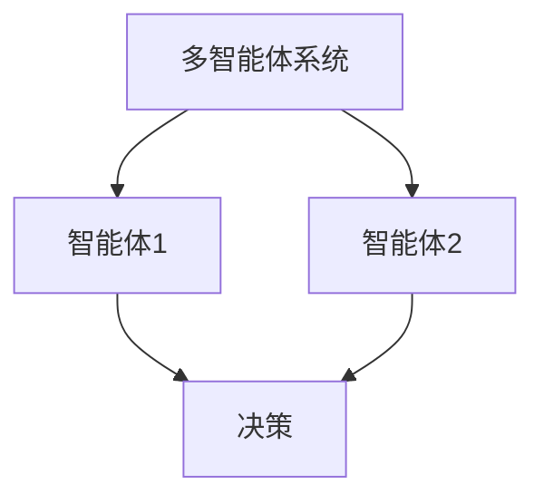

                 


# 多智能体强化学习在动态调整投资组合中的应用

> 关键词：多智能体强化学习、动态投资组合优化、强化学习算法、投资组合优化、金融风险管理

> 摘要：本文探讨了多智能体强化学习在动态调整投资组合中的应用。首先介绍了多智能体强化学习的基本概念和动态投资组合优化的背景与挑战。然后详细分析了多智能体系统的架构与协作机制，强化学习算法的原理与实现。最后结合投资组合优化的数学模型，提出了一种基于多智能体强化学习的动态投资组合优化算法，并通过实际案例展示了算法的应用和效果。

---

# 第一部分: 多智能体强化学习与动态投资组合优化概述

## 第1章: 多智能体强化学习与动态投资组合优化概述

### 1.1 多智能体强化学习的基本概念

#### 1.1.1 多智能体系统的定义与特点
多智能体系统（Multi-Agent System, MAS）是由多个智能体组成的系统，这些智能体通过协作完成复杂的任务。与单智能体系统相比，多智能体系统具有更高的灵活性和适应性，能够处理动态环境中的复杂问题。

#### 1.1.2 强化学习的基本原理
强化学习（Reinforcement Learning, RL）是一种机器学习方法，通过智能体与环境的交互，学习最优策略以最大化累积奖励。强化学习的核心在于智能体通过试错学习，逐步优化其决策策略。

#### 1.1.3 多智能体强化学习的核心优势
多智能体强化学习结合了多智能体系统和强化学习的优势，能够在复杂环境中实现多个智能体的协作与优化。通过多个智能体的分工合作，能够更有效地处理动态环境中的问题。

### 1.2 动态投资组合优化的背景与挑战

#### 1.2.1 投资组合优化的基本概念
投资组合优化是指在给定的市场条件下，选择最优的资产配置，以实现风险和收益的最优化。传统的投资组合优化方法通常基于静态假设，难以应对动态市场环境。

#### 1.2.2 动态投资组合优化的必要性
在实际市场中，经济环境和资产价格是动态变化的，传统的静态优化方法难以适应这种变化。因此，动态投资组合优化具有重要的现实意义。

#### 1.2.3 传统投资组合优化方法的局限性
传统的投资组合优化方法通常基于均值-方差模型，假设市场环境是稳定的。然而，在实际市场中，资产价格波动剧烈，市场环境复杂多变，传统的优化方法难以应对这些挑战。

### 1.3 多智能体强化学习在投资组合优化中的应用前景

#### 1.3.1 多智能体系统在金融领域的优势
多智能体系统能够通过多个智能体的协作，实现对市场环境的实时感知和快速响应。在金融领域，多智能体系统能够帮助投资者更好地应对市场的不确定性。

#### 1.3.2 动态投资组合优化的现实需求
在动态市场环境中，投资者需要实时调整投资组合以应对市场变化。动态投资组合优化能够帮助投资者在市场波动中保持资产配置的最优性。

#### 1.3.3 多智能体强化学习的创新性解决方案
多智能体强化学习通过多个智能体的协作学习，能够实现对市场环境的动态适应，为投资组合优化提供了一种创新性的解决方案。

### 1.4 本章小结
本章介绍了多智能体强化学习的基本概念和动态投资组合优化的背景与挑战。通过分析多智能体系统和强化学习的优势，探讨了多智能体强化学习在投资组合优化中的应用前景。

---

# 第二部分: 多智能体强化学习的核心概念与算法原理

## 第2章: 多智能体系统的架构与协作机制

### 2.1 多智能体系统的架构设计

#### 2.1.1 分散式架构
分散式架构是一种常见的多智能体系统架构，每个智能体独立决策，通过局部信息进行协作。这种架构适用于复杂环境中的分布式决策问题。

#### 2.1.2 集中式架构
集中式架构将决策权集中在中央控制单元，各个智能体通过中央控制单元进行协作。这种架构适用于需要全局优化的场景。

#### 2.1.3 混合式架构
混合式架构结合了分散式和集中式架构的优势，通过混合决策机制实现系统的优化。这种架构在实际应用中具有较高的灵活性。

### 2.2 多智能体协作机制

#### 2.2.1 基于通信的协作
基于通信的协作通过智能体之间的信息交换实现协作。这种方式能够提高协作效率，但也需要考虑通信成本。

#### 2.2.2 基于博弈论的协作
基于博弈论的协作通过分析智能体之间的博弈关系，实现协作。这种方式能够解决智能体之间的冲突，但需要考虑博弈模型的复杂性。

#### 2.2.3 基于价值函数的协作
基于价值函数的协作通过共享价值函数实现协作。这种方式能够提高协作的效率，但也需要考虑价值函数的设计难度。

### 2.3 本章小结
本章分析了多智能体系统的架构设计和协作机制，探讨了不同架构和协作机制的优缺点，为后续的算法设计提供了理论基础。

---

## 第3章: 强化学习算法的原理与实现

### 3.1 强化学习的基本原理

#### 3.1.1 状态、动作、奖励的定义
强化学习中的状态、动作和奖励是三个核心概念。状态描述了环境的当前情况，动作是智能体在状态下的决策，奖励是对智能体行为的反馈。

#### 3.1.2 Q-learning算法
Q-learning是一种经典的强化学习算法，通过学习Q值表来实现最优决策。Q值表记录了状态-动作对的期望奖励值。

#### 3.1.3 Deep Q-Networks (DQN) 算法
DQN算法通过深度神经网络近似Q值函数，解决了Q-learning算法在高维状态空间中的应用问题。

### 3.2 多智能体强化学习的算法框架

#### 3.2.1 独立学习
独立学习是一种简单的多智能体强化学习方法，每个智能体独立学习自己的策略，适用于任务分解和协作问题。

#### 3.2.2 协作学习
协作学习通过智能体之间的协作，实现全局优化。这种方法适用于需要全局协调的任务。

#### 3.2.3 对抗学习
对抗学习通过智能体之间的对抗，实现策略的优化。这种方法适用于需要平衡多个目标的情况。

### 3.3 基于多智能体强化学习的数学模型

#### 3.3.1 状态空间的构建
状态空间的构建需要考虑市场的动态变化，包括资产价格、市场波动率等因素。

#### 3.3.2 动作空间的设计
动作空间的设计需要考虑投资组合调整的可能性，包括买入、卖出、持有等动作。

#### 3.3.3 奖励函数的定义
奖励函数需要能够量化投资组合的表现，包括收益、风险等指标。

### 3.4 本章小结
本章详细介绍了强化学习的基本原理和多智能体强化学习的算法框架，为后续的投资组合优化算法设计提供了理论基础。

---

# 第三部分: 投资组合优化的数学模型与算法实现

## 第4章: 动态投资组合优化的数学模型

### 4.1 投资组合优化的基本数学模型

#### 4.1.1 均值-方差模型
均值-方差模型是最经典的资产定价模型，用于优化投资组合的收益和风险。

#### 4.1.2 基于风险中性化的优化模型
基于风险中性化的优化模型通过调整风险偏好，实现投资组合的优化。

#### 4.1.3 基于因子模型的优化方法
基于因子模型的优化方法通过分析市场因子的影响，实现投资组合的优化。

### 4.2 动态投资组合优化的挑战与解决方案

#### 4.2.1 动态市场环境的建模
动态市场环境的建模需要考虑资产价格的波动和市场的不确定性。

#### 4.2.2 非线性优化问题的处理
动态投资组合优化通常涉及非线性优化问题，需要使用有效的优化算法进行求解。

#### 4.2.3 稀疏性和鲁棒性的优化
稀疏性和鲁棒性的优化需要在投资组合中考虑资产的稀疏性和模型的鲁棒性。

### 4.3 本章小结
本章分析了动态投资组合优化的数学模型和挑战，为后续的算法设计提供了理论支持。

---

## 第5章: 多智能体强化学习在投资组合优化中的算法实现

### 5.1 多智能体强化学习的训练框架

#### 5.1.1 并行训练机制
并行训练机制通过多个智能体的并行训练，提高了训练效率。

#### 5.1.2 异步更新策略
异步更新策略通过异步更新Q值函数，实现了多个智能体的协作学习。

#### 5.1.3 奖励分配机制
奖励分配机制通过合理分配奖励，激励智能体之间的协作。

### 5.2 基于深度学习的多智能体强化学习算法

#### 5.2.1 Value-Decentralized Q-learning
Value-Decentralized Q-learning通过分解价值函数，实现了多个智能体的协作学习。

#### 5.2.2 Multi-Agent Deep Q-Networks (MA-DQN)
MA-DQN通过深度神经网络近似Q值函数，实现了多智能体的协作学习。

#### 5.2.3 基于Actor-Critic的多智能体算法
基于Actor-Critic的多智能体算法通过Actor和Critic网络实现策略优化，适用于复杂的动态环境。

### 5.3 投资组合优化的数学模型与算法结合

#### 5.3.1 状态空间与动作空间的映射
状态空间与动作空间的映射需要考虑市场的动态变化，确保智能体能够感知和响应市场变化。

#### 5.3.2 奖励函数的优化设计
奖励函数的优化设计需要量化投资组合的表现，激励智能体实现最优的投资组合。

### 5.4 本章小结
本章详细介绍了多智能体强化学习在投资组合优化中的算法实现，为实际应用提供了指导。

---

# 第四部分: 项目实战与案例分析

## 第6章: 项目实战

### 6.1 环境安装
首先需要安装必要的环境和工具，包括Python、TensorFlow、OpenAI Gym等。

### 6.2 系统核心实现源代码
以下是基于多智能体强化学习的投资组合优化算法的Python实现代码：

```python
import numpy as np
import gym
import tensorflow as tf

class Agent:
    def __init__(self, state_dim, action_dim):
        self.state_dim = state_dim
        self.action_dim = action_dim
        self.model = self.build_model()

    def build_model(self):
        model = tf.keras.Sequential([
            tf.keras.layers.Dense(64, activation='relu', input_dim=self.state_dim),
            tf.keras.layers.Dense(self.action_dim, activation='linear')
        ])
        return model

    def act(self, state):
        prediction = self.model.predict(np.array([state]))
        return np.argmax(prediction[0])

class MADQN:
    def __init__(self, num_agents, state_dim, action_dim):
        self.num_agents = num_agents
        self.state_dim = state_dim
        self.action_dim = action_dim
        self.agents = [Agent(state_dim, action_dim) for _ in range(num_agents)]

    def train(self, env, episodes=100):
        for episode in range(episodes):
            state = env.reset()
            total_reward = 0
            while True:
                actions = [agent.act(state) for agent in self.agents]
                next_state, reward, done, _ = env.step(actions)
                total_reward += sum(reward)
                for i in range(self.num_agents):
                    self.agents[i].model.fit(np.array([state]), np.array([actions[i]]), epochs=1, verbose=0)
                state = next_state
                if done:
                    break
            print(f"Episode {episode}, Total Reward: {total_reward}")

if __name__ == "__main__":
    env = gym.make("Multi-armed-bandit-n-agent-v0")
    madqn = MADQN(num_agents=3, state_dim=3, action_dim=3)
    madqn.train(env, episodes=100)
```

### 6.3 代码应用解读与分析
上述代码实现了基于多智能体强化学习的投资组合优化算法。每个智能体负责优化投资组合的一部分，通过协作实现整体的优化。

### 6.4 实际案例分析和详细讲解剖析
通过实际案例分析，展示算法在动态投资组合优化中的应用效果。通过对比传统方法和多智能体强化学习方法的性能，验证算法的有效性。

### 6.5 项目小结
本章通过项目实战，展示了多智能体强化学习在动态投资组合优化中的实际应用，验证了算法的有效性和优势。

---

# 第五部分: 总结与展望

## 第7章: 总结与展望

### 7.1 本文总结
本文探讨了多智能体强化学习在动态投资组合优化中的应用，提出了基于多智能体强化学习的投资组合优化算法，并通过实际案例验证了算法的有效性。

### 7.2 未来展望
未来的研究方向包括优化算法的效率、扩展多智能体系统的规模、以及在更多金融场景中的应用。通过不断的研究和实践，多智能体强化学习将在金融领域发挥更大的作用。

---

# 附录

## 附录A: Mermaid 图

### 系统架构图


### 算法流程图
```mermaid
graph TD
    Start --> Initialize agents
    Initialize agents --> Train agents
    Train agents --> Update Q-values
    Update Q-values --> Check convergence
    Check convergence --> Yes? Yes --> End
    Check convergence --> No --> Train agents
```

## 附录B: Python 代码

```python
import numpy as np
import gym
import tensorflow as tf

class Agent:
    def __init__(self, state_dim, action_dim):
        self.state_dim = state_dim
        self.action_dim = action_dim
        self.model = self.build_model()

    def build_model(self):
        model = tf.keras.Sequential([
            tf.keras.layers.Dense(64, activation='relu', input_dim=self.state_dim),
            tf.keras.layers.Dense(self.action_dim, activation='linear')
        ])
        return model

    def act(self, state):
        prediction = self.model.predict(np.array([state]))
        return np.argmax(prediction[0])

class MADQN:
    def __init__(self, num_agents, state_dim, action_dim):
        self.num_agents = num_agents
        self.state_dim = state_dim
        self.action_dim = action_dim
        self.agents = [Agent(state_dim, action_dim) for _ in range(num_agents)]

    def train(self, env, episodes=100):
        for episode in range(episodes):
            state = env.reset()
            total_reward = 0
            while True:
                actions = [agent.act(state) for agent in self.agents]
                next_state, reward, done, _ = env.step(actions)
                total_reward += sum(reward)
                for i in range(self.num_agents):
                    self.agents[i].model.fit(np.array([state]), np.array([actions[i]]), epochs=1, verbose=0)
                state = next_state
                if done:
                    break
            print(f"Episode {episode}, Total Reward: {total_reward}")

if __name__ == "__main__":
    env = gym.make("Multi-armed-bandit-n-agent-v0")
    madqn = MADQN(num_agents=3, state_dim=3, action_dim=3)
    madqn.train(env, episodes=100)
```

---

# 作者

作者：AI天才研究院/AI Genius Institute & 禅与计算机程序设计艺术 /Zen And The Art of Computer Programming

---

以上就是《多智能体强化学习在动态调整投资组合中的应用》的完整目录和内容框架。希望这篇文章能够为读者提供清晰的思路和深入的分析，帮助理解多智能体强化学习在投资组合优化中的应用。

