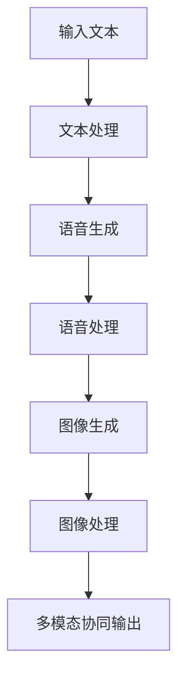
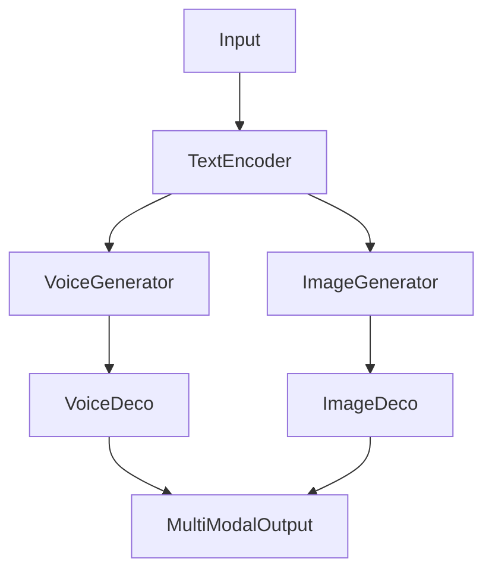
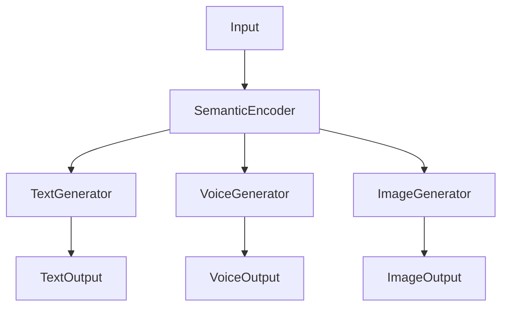
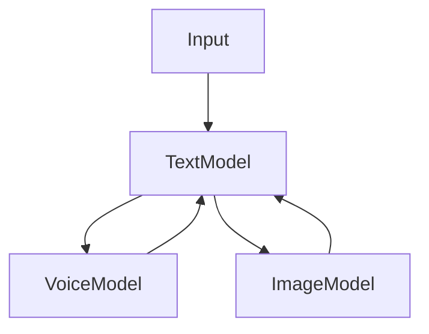
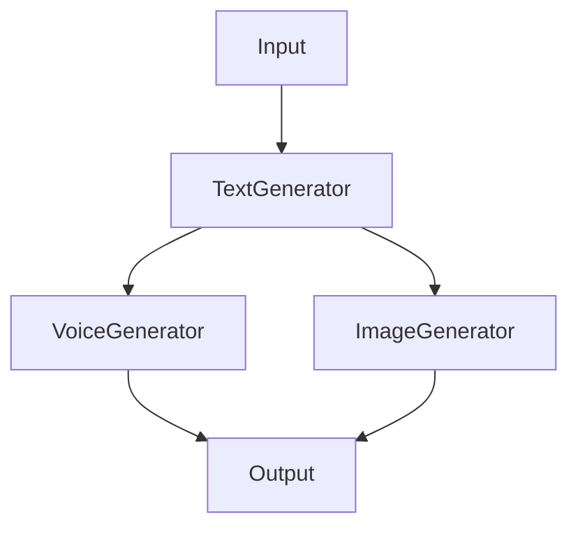
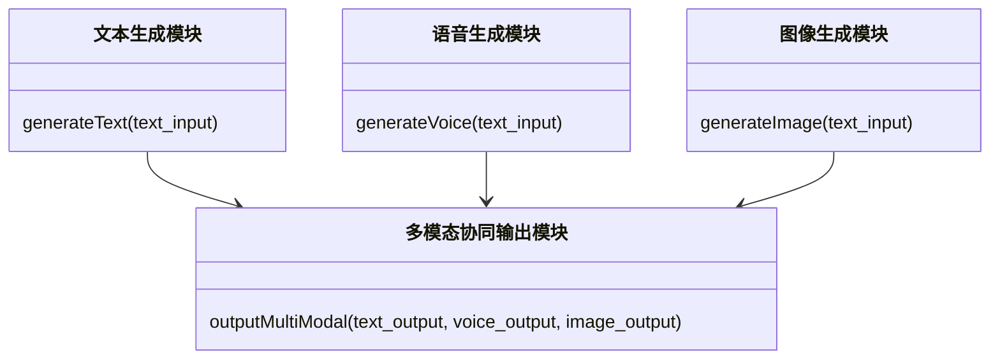
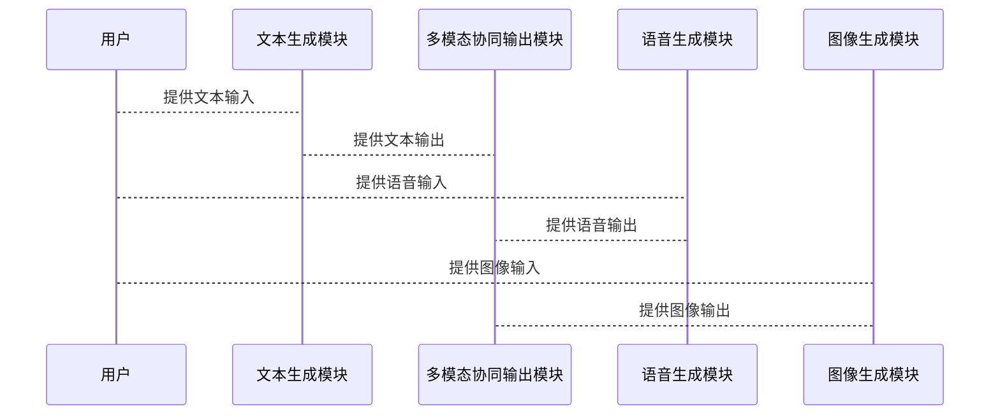
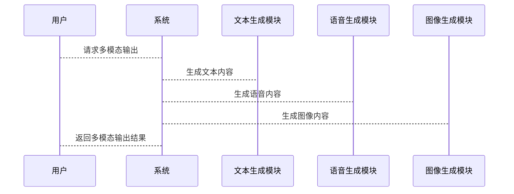

                 


# 实现AI Agent的多模态输出：文本、语音、图像协同

> 关键词：AI Agent，多模态输出，文本，语音，图像，协同，生成模型

> 摘要：本文详细探讨了AI Agent实现多模态输出的技术原理，从文本、语音和图像的协同输出机制，到多模态生成模型的实现，再到系统架构设计与项目实战，全面解析了多模态输出的核心技术与应用实践。

---

# 第一部分: AI Agent多模态输出的背景与概念

## 第1章: 多模态输出的背景与问题背景

### 1.1 多模态输出的定义与问题背景

#### 1.1.1 多模态输出的核心概念
多模态输出是指AI Agent能够同时生成并输出多种模态（如文本、语音、图像）信息的能力。这种能力使得AI Agent能够更自然地与人类交互，提供更丰富的信息表达。

#### 1.1.2 多模态输出在AI Agent中的重要性
在传统的AI Agent中，输出通常局限于单一模态（如文本或语音），而多模态输出能够显著提升用户体验，使其更接近人类的交互方式。例如，在智能客服场景中，AI Agent可以通过文本解释问题，并通过图像提供额外的信息，同时通过语音确认用户需求。

#### 1.1.3 多模态输出的边界与外延
多模态输出的边界在于AI Agent的能力限制，包括计算能力、数据资源和模型训练能力。外延则包括未来可能引入的其他模态（如视频、手势等）。

### 1.2 多模态输出的核心要素组成

#### 1.2.1 多模态输出的组成结构
多模态输出由以下三个核心要素组成：
1. 文本模态：生成文本内容，如自然语言处理。
2. 语音模态：生成语音信号，如语音合成。
3. 图像模态：生成图像内容，如图像生成模型。

#### 1.2.2 各模态之间的关系与协同机制
模态之间的协同机制包括信息共享、联合训练和联合推理。例如，文本模态可以为语音和图像生成提供语义指导，而语音和图像模态可以为文本生成提供上下文信息。

#### 1.2.3 多模态输出的核心属性特征对比表

| 属性         | 文本模态       | 语音模态       | 图像模态       |
|--------------|---------------|---------------|---------------|
| 数据类型     | 文本字符串     | 语音信号       | 图像像素矩阵   |
| 生成方式     | 语言模型      | 语音合成模型    | 图像生成模型   |
| 语义理解     | 高            | 中             | 低            |

## 第2章: 多模态输出的核心概念与联系

### 2.1 多模态协同的基本原理

#### 2.1.1 多模态协同的定义
多模态协同是指不同模态之间通过共享语义信息，实现协同生成和输出的过程。

#### 2.1.2 各模态之间的信息传递与融合
信息传递与融合可以通过以下方式实现：
1. 并行生成：各模态独立生成内容，然后通过协同机制进行整合。
2. 串行生成：先生成一个模态内容，再基于此生成其他模态内容。

#### 2.1.3 多模态协同的数学模型
多模态协同的数学模型可以表示为：
$$P(x_{text}, x_{voice}, x_{image}) = \prod_{i} P(x_i | x_{others})$$
其中，$x_{text}$、$x_{voice}$、$x_{image}$分别表示文本、语音和图像模态的输出。

### 2.2 多模态协同的ER实体关系图

```mermaid
er
    entity 文本模态 {
        id
        content
    }
    entity 语音模态 {
        id
        audio_content
    }
    entity 图像模态 {
        id
        image_content
    }
    entity 多模态输出 {
        id
        text_id
        voice_id
        image_id
    }
    text_modality --> 多模态输出
    voice_modality --> 多模态输出
    image_modality --> 多模态输出
```

### 2.3 多模态协同的流程图



---

# 第二部分: 多模态输出的算法原理

## 第3章: 多模态生成模型

### 3.1 多模态生成模型的基本原理

#### 3.1.1 多模态生成模型的定义
多模态生成模型是一种能够同时生成多种模态数据的模型，通常采用联合概率模型来建模不同模态之间的依赖关系。

#### 3.1.2 多模态生成模型的数学模型
多模态生成模型的数学模型可以表示为：
$$P(x_{text}, x_{voice}, x_{image}) = P(x_{text}) \cdot P(x_{voice} | x_{text}) \cdot P(x_{image} | x_{text}, x_{voice})$$
其中，$x_{text}$、$x_{voice}$和$x_{image}$分别表示文本、语音和图像模态的输出。

#### 3.1.3 多模态生成模型的实现流程



### 3.2 多模态生成模型的数学公式

#### 文本生成部分
文本生成部分通常采用Transformer模型：
$$P(x_{text}) = \text{Transformer}(x_{text})$$

#### 语音生成部分
语音生成部分通常采用Tacotron模型：
$$P(x_{voice} | x_{text}) = \text{Tacotron}(x_{text})$$

#### 图像生成部分
图像生成部分通常采用生成对抗网络（GAN）：
$$P(x_{image} | x_{text}, x_{voice}) = \text{GAN}(x_{text}, x_{voice})$$

### 3.3 多模态生成模型的代码实现

#### 文本生成代码

```python
def text_generate(text_input):
    encoder = TransformerEncoder()
    text_output = encoder(text_input)
    return text_output
```

#### 语音生成代码

```python
def voice_generate(text_input):
    generator = TacotronGenerator()
    voice_output = generator(text_input)
    return voice_output
```

#### 图像生成代码

```python
def image_generate(text_input, voice_input):
    generator = GANGenerator()
    image_output = generator(text_input, voice_input)
    return image_output
```

---

## 第4章: 多模态融合模型

### 4.1 多模态融合模型的基本原理

#### 4.1.1 多模态融合模型的定义
多模态融合模型是一种能够将多种模态数据融合在一起，生成更丰富输出的模型。

#### 4.1.2 多模态融合模型的数学模型
多模态融合模型的数学模型可以表示为：
$$P(x_{text}, x_{voice}, x_{image}) = \prod_{i} P(x_i | z)$$
其中，$z$是共享的语义向量。

#### 4.1.3 多模态融合模型的实现流程



### 4.2 多模态融合模型的代码实现

#### 语义编码部分

```python
def semantic_encode(text_input, voice_input, image_input):
    encoder = SemanticEncoder()
    semantic_vector = encoder(text_input, voice_input, image_input)
    return semantic_vector
```

#### 文本生成部分

```python
def text_generate(semantic_vector):
    generator = TextGenerator()
    text_output = generator(semantic_vector)
    return text_output
```

#### 语音生成部分

```python
def voice_generate(semantic_vector):
    generator = VoiceGenerator()
    voice_output = generator(semantic_vector)
    return voice_output
```

#### 图像生成部分

```python
def image_generate(semantic_vector):
    generator = ImageGenerator()
    image_output = generator(semantic_vector)
    return image_output
```

---

## 第5章: 多模态协同优化算法

### 5.1 多模态协同优化算法的基本原理

#### 5.1.1 协同优化算法的定义
协同优化算法是一种通过优化不同模态之间的协同关系，提升整体输出效果的算法。

#### 5.1.2 协同优化算法的数学模型
协同优化算法的数学模型可以表示为：
$$\min_{\theta} \sum_{i} L_i(\theta)$$
其中，$L_i$表示第$i$个模态的损失函数。

#### 5.1.3 协同优化算法的实现流程



### 5.2 多模态协同优化算法的代码实现

#### 协同优化算法部分

```python
def协同优化算法(text_input, voice_input, image_input):
    optimizer =协同优化器()
    optimizer.minimize(loss, [text_input, voice_input, image_input])
    return optimizer.apply_gradients
```

---

# 第三部分: 多模态输出的系统分析与架构设计

## 第6章: 多模态输出系统分析

### 6.1 多模态输出系统的功能设计

#### 6.1.1 系统功能模块划分
多模态输出系统主要包括以下功能模块：
1. 文本生成模块
2. 语音生成模块
3. 图像生成模块
4. 多模态协同输出模块

#### 6.1.2 系统功能流程图



### 6.2 多模态输出系统的领域模型

#### 6.2.1 领域模型的定义
领域模型是描述系统各模块之间关系的模型。

#### 6.2.2 领域模型的Mermaid图



---

## 第7章: 多模态输出系统的架构设计

### 7.1 多模态输出系统的架构设计

#### 7.1.1 系统架构设计的定义
系统架构设计是描述系统各模块之间关系的模型。

#### 7.1.2 系统架构设计的Mermaid图

```mermaid
archi
    module 文本生成模块 {
        generateText(text_input)
    }
    module 语音生成模块 {
        generateVoice(text_input)
    }
    module 图像生成模块 {
        generateImage(text_input)
    }
    module 多模态协同输出模块 {
        outputMultiModal(text_output, voice_output, image_output)
    }
    文本生成模块 --> 多模态协同输出模块
    语音生成模块 --> 多模态协同输出模块
    图像生成模块 --> 多模态协同输出模块
```

---

## 第8章: 多模态输出系统的接口设计与交互设计

### 8.1 系统接口设计

#### 8.1.1 系统接口的定义
系统接口是系统各模块之间的接口。

#### 8.1.2 系统接口的Mermaid图



### 8.2 系统交互设计

#### 8.2.1 系统交互的定义
系统交互是指用户与系统之间的交互过程。

#### 8.2.2 系统交互的Mermaid图



---

# 第四部分: 多模态输出的项目实战

## 第9章: 多模态输出项目的环境安装与配置

### 9.1 项目环境安装

#### 9.1.1 安装Python环境
```bash
python --version
pip install --upgrade pip
```

#### 9.1.2 安装依赖库
```bash
pip install numpy
pip install tensorflow
pip install pytorch
```

### 9.2 项目配置

#### 9.2.1 配置文本生成模块
```python
import numpy as np
import tensorflow as tf
import torch
```

#### 9.2.2 配置语音生成模块
```python
from tensorflow.keras import layers
from tensorflow.keras import models
```

#### 9.2.3 配置图像生成模块
```python
import cv2
from PIL import Image
```

---

## 第10章: 多模态输出项目的核心代码实现

### 10.1 文本生成模块代码实现

#### 10.1.1 文本生成模型定义

```python
class TextGenerator:
    def __init__(self):
        self.model = self._build_model()

    def _build_model(self):
        model = tf.keras.Sequential([
            layers.Embedding(1000, 64),
            layers.LSTM(64),
            layers.Dense(64, activation='relu'),
            layers.Dense(64, activation='softmax')
        ])
        return model
```

#### 10.1.2 文本生成函数

```python
def generate_text(model, input_text):
    return model.predict(input_text)
```

### 10.2 语音生成模块代码实现

#### 10.2.1 语音生成模型定义

```python
class VoiceGenerator:
    def __init__(self):
        self.model = self._build_model()

    def _build_model(self):
        model = tf.keras.Sequential([
            layers.Conv2D(32, (3,3), activation='relu'),
            layers.MaxPooling2D((2,2)),
            layers.Flatten(),
            layers.Dense(64, activation='relu'),
            layers.Dense(1, activation='sigmoid')
        ])
        return model
```

#### 10.2.2 语音生成函数

```python
def generate_voice(model, input_voice):
    return model.predict(input_voice)
```

### 10.3 图像生成模块代码实现

#### 10.3.1 图像生成模型定义

```python
class ImageGenerator:
    def __init__(self):
        self.model = self._build_model()

    def _build_model(self):
        model = tf.keras.Sequential([
            layers.Conv2D(32, (3,3), activation='relu'),
            layers.MaxPooling2D((2,2)),
            layers.Flatten(),
            layers.Dense(64, activation='relu'),
            layers.Dense(3, activation='sigmoid')
        ])
        return model
```

#### 10.3.2 图像生成函数

```python
def generate_image(model, input_image):
    return model.predict(input_image)
```

---

## 第11章: 多模态输出项目的案例分析与详细解读

### 11.1 案例分析

#### 11.1.1 案例背景
假设我们有一个智能客服系统，需要同时生成文本、语音和图像内容。

#### 11.1.2 案例实现步骤
1. 文本生成模块生成回答内容。
2. 语音生成模块生成语音内容。
3. 图像生成模块生成相关图像内容。
4. 多模态协同输出模块整合文本、语音和图像内容，返回给用户。

### 11.2 详细解读

#### 11.2.1 文本生成模块实现
文本生成模块使用Transformer模型生成回答内容。

#### 11.2.2 语音生成模块实现
语音生成模块使用Tacotron模型生成语音内容。

#### 11.2.3 图像生成模块实现
图像生成模块使用GAN模型生成图像内容。

---

## 第12章: 多模态输出项目的总结与小结

### 12.1 项目总结
通过本项目的实现，我们成功实现了AI Agent的多模态输出能力，包括文本、语音和图像的协同生成。

### 12.2 项目小结
多模态输出技术在实际应用中具有广阔前景，能够显著提升用户体验。

---

# 第五部分: 多模态输出的最佳实践与注意事项

## 第13章: 多模态输出的最佳实践

### 13.1 最佳实践 Tips

#### 13.1.1 模态之间的协同优化
在实际应用中，需要不断优化不同模态之间的协同关系。

#### 13.1.2 计算资源的分配
需要合理分配计算资源，确保各模态的生成效率。

#### 13.1.3 模型的可解释性
需要关注模型的可解释性，便于后续优化和改进。

---

## 第14章: 多模态输出的注意事项

### 14.1 注意事项

#### 14.1.1 模型的训练数据质量
需要确保训练数据的质量，避免生成低质量的内容。

#### 14.1.2 模型的计算复杂度
需要关注模型的计算复杂度，确保其在实际应用中的性能。

#### 14.1.3 模型的可扩展性
需要考虑模型的可扩展性，便于未来引入更多模态。

---

## 第15章: 多模态输出的拓展阅读与深入学习

### 15.1 拓展阅读

#### 15.1.1 多模态生成模型的前沿研究
建议阅读相关论文，了解多模态生成模型的最新进展。

#### 15.1.2 多模态协同优化算法的深入研究
建议深入研究多模态协同优化算法的数学原理。

#### 15.1.3 多模态输出系统的实际应用案例
建议阅读实际应用案例，了解多模态输出技术在不同场景中的应用。

---

# 作者：AI天才研究院/AI Genius Institute & 禅与计算机程序设计艺术 /Zen And The Art of Computer Programming

