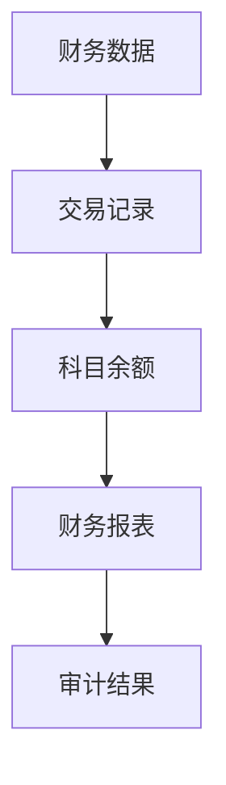
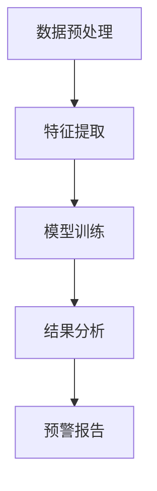
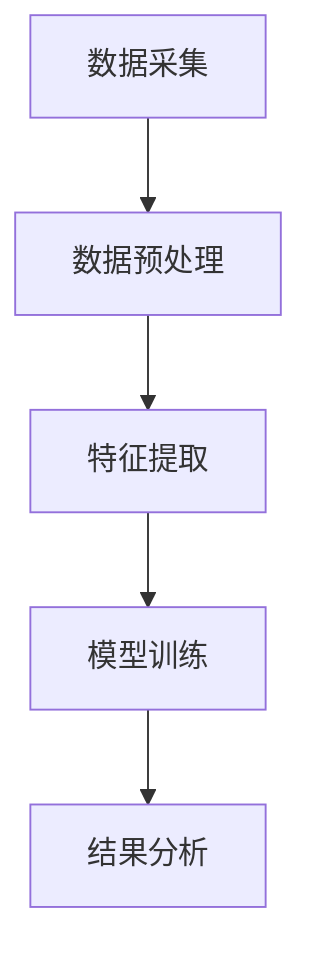
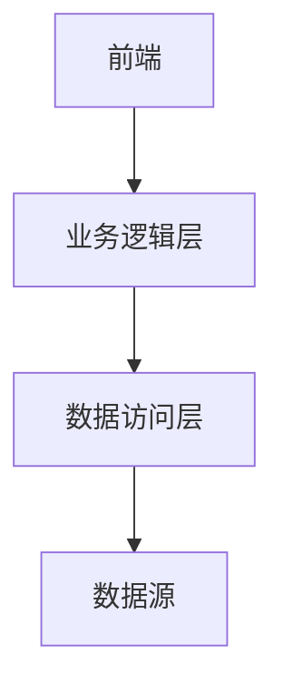
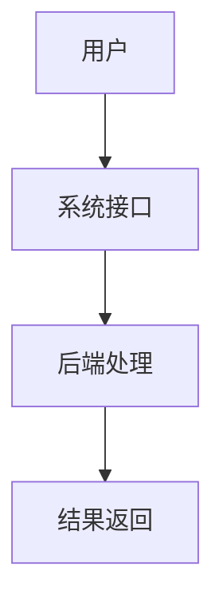
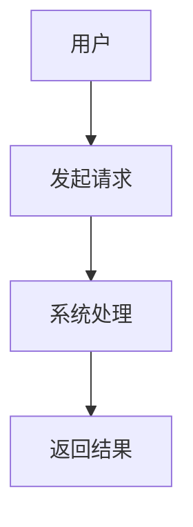

                 


# 智能财务舞弊检测系统

## 关键词：智能财务舞弊检测系统, 财务舞弊检测, 人工智能, 机器学习, 数据分析

## 摘要：智能财务舞弊检测系统是一种利用人工智能和机器学习技术，通过分析财务数据中的异常模式和关系，来识别和预测财务舞弊行为的系统。本文将详细探讨该系统的背景、核心概念、算法原理、系统架构设计以及实际项目实现，为读者提供全面的技术解读。

---

# 第一部分: 智能财务舞弊检测系统概述

## 第1章: 智能财务舞弊检测系统背景介绍

### 1.1 问题背景
#### 1.1.1 传统财务舞弊检测的局限性
传统财务舞弊检测主要依赖人工审查和简单的规则检查，这种方式效率低下、成本高昂，且容易受到主观因素的影响。此外，传统方法难以发现复杂和隐蔽的舞弊行为，尤其是在大数据环境下，财务数据的复杂性和多样性使得人工检测更加困难。

#### 1.1.2 智能化技术在财务舞弊检测中的应用潜力
随着人工智能和大数据技术的快速发展，智能化技术在财务舞弊检测中的应用潜力巨大。通过机器学习算法，系统能够自动学习财务数据中的异常模式和关系，从而实现对舞弊行为的早期识别和预警。智能化技术能够处理海量数据，发现隐藏的规律，大大提高了检测的准确性和效率。

#### 1.1.3 当前财务舞弊检测的主要挑战
当前财务舞弊检测的主要挑战包括数据的多样性和复杂性、舞弊手段的不断进化、数据隐私和安全问题等。此外，如何在保证数据隐私的前提下，充分利用数据进行分析，也是智能化财务舞弊检测系统需要解决的关键问题。

### 1.2 问题描述
#### 1.2.1 财务舞弊的定义与类型
财务舞弊是指在财务活动中故意制造虚假信息或隐瞒真实情况，以达到非法目的的行为。常见的财务舞弊类型包括虚假交易、虚增收入、虚减支出、资产转移、关联交易舞弊等。

#### 1.2.2 财务舞弊检测的核心目标
财务舞弊检测的核心目标是通过分析财务数据，识别出异常的交易或行为，从而预防和打击财务舞弊行为。具体目标包括：实时监控财务数据、识别异常交易模式、预测潜在舞弊行为、提供预警信息等。

#### 1.2.3 财务舞弊检测的关键问题
财务舞弊检测的关键问题包括：如何有效提取和处理财务数据中的特征；如何选择合适的机器学习算法；如何保证系统的实时性和高效性；如何处理数据隐私和安全问题等。

### 1.3 问题解决
#### 1.3.1 智能财务舞弊检测系统的解决方案
智能财务舞弊检测系统通过整合人工智能、大数据和机器学习技术，构建一个自动化、智能化的检测系统。系统能够从海量财务数据中提取关键特征，训练机器学习模型，识别异常交易和行为，提供实时预警和分析报告。

#### 1.3.2 系统设计的核心要素
智能财务舞弊检测系统的核心要素包括：数据采集与预处理模块、特征提取与选择模块、模型训练与优化模块、结果分析与反馈模块。

#### 1.3.3 系统实现的主要步骤
系统实现的主要步骤包括：数据采集、数据预处理、特征提取、模型训练、模型评估、系统集成与部署。

### 1.4 系统边界与外延
#### 1.4.1 系统功能的边界
智能财务舞弊检测系统的功能边界包括：数据采集、特征提取、模型训练、结果分析等核心功能。系统不包括外部数据源的直接连接和数据生成过程。

#### 1.4.2 系统与外部系统的交互
系统需要与财务系统、数据库、用户界面等外部系统进行交互。系统通过API接口与外部系统进行数据交换和功能调用。

#### 1.4.3 系统功能的扩展性
系统设计具有良好的扩展性，支持新增特征、模型更新、功能扩展等。例如，可以添加自然语言处理功能，对财务报告中的文本信息进行分析。

### 1.5 系统概念结构与核心要素
#### 1.5.1 系统功能模块划分
智能财务舞弊检测系统可以划分为以下几个功能模块：
- 数据采集模块：负责采集财务数据。
- 数据预处理模块：对数据进行清洗和标准化处理。
- 特征提取模块：提取财务数据中的关键特征。
- 模型训练模块：训练机器学习模型。
- 结果分析模块：分析模型输出结果，并生成预警报告。

#### 1.5.2 核心要素的组成与关系
系统的核心要素包括：财务数据、特征、模型、预警结果。财务数据是输入，特征是数据处理的中间结果，模型是核心算法，预警结果是系统的输出。

#### 1.5.3 系统功能的逻辑流程
系统功能的逻辑流程如下：
1. 数据采集模块从财务系统中获取原始数据。
2. 数据预处理模块对数据进行清洗和标准化处理。
3. 特征提取模块从数据中提取关键特征。
4. 模型训练模块使用提取的特征训练机器学习模型。
5. 结果分析模块分析模型输出结果，并生成预警报告。

## 第2章: 智能财务舞弊检测系统的核心概念与联系

### 2.1 核心概念原理
#### 2.1.1 数据采集与预处理
数据采集是从财务系统中获取原始数据，包括交易数据、科目余额、财务报表等。数据预处理包括数据清洗、缺失值处理、异常值处理、数据标准化等。

#### 2.1.2 特征提取与选择
特征提取是从原始数据中提取能够反映舞弊行为的关键特征。例如，交易金额、交易时间、交易频率、交易关系等。特征选择是通过评估特征的重要性，选择最优特征组合。

#### 2.1.3 模型训练与优化
模型训练是使用提取的特征训练机器学习模型，如支持向量机、随机森林、神经网络等。模型优化包括参数调优、模型评估、模型部署等。

#### 2.1.4 结果分析与反馈
结果分析是对模型输出结果进行解读，识别异常交易和行为，并生成预警报告。反馈机制用于优化模型和系统。

### 2.2 核心概念属性特征对比
以下是核心概念属性特征的对比：

| 特征 | 数据类型 | 处理方式 | 目标 | 示例 |
|------|----------|----------|------|------|
| 交易金额 | 数值型 | 标准化 | 检测金额异常 | 某些交易金额远高于正常水平 |
| 交易时间 | 时间序列 | 时间差计算 | 检测时间异常 | 多笔交易集中在短时间内 |
| 交易频率 | 数值型 | 统计分析 | 检测频率异常 | 某些账户交易过于频繁 |
| 交易关系 | 关系型 | 社会网络分析 | 检测关系异常 | 关联交易过于复杂或不透明 |

### 2.3 ER实体关系图架构
以下是系统的ER实体关系图：



---

# 第二部分: 智能财务舞弊检测系统的算法原理

## 第3章: 算法原理

### 3.1 算法流程
以下是算法的流程图：



### 3.2 算法实现
以下是算法的Python代码实现：

```python
import pandas as pd
from sklearn.model_selection import train_test_split
from sklearn.ensemble import RandomForestClassifier
from sklearn.metrics import accuracy_score

# 数据加载
data = pd.read_csv('financial_data.csv')

# 特征提取
features = data[['transaction_amount', 'transaction_time', 'transaction_frequency', 'relationship']]
target = data['is_fraud']

# 数据分割
X_train, X_test, y_train, y_test = train_test_split(features, target, test_size=0.2, random_state=42)

# 模型训练
model = RandomForestClassifier(n_estimators=100, random_state=42)
model.fit(X_train, y_train)

# 模型预测
y_pred = model.predict(X_test)

# 模型评估
accuracy = accuracy_score(y_test, y_pred)
print(f'Accuracy: {accuracy}')
```

### 3.3 数学模型与公式
以下是算法的数学模型和公式：

分类函数：
$$
f(x) = \text{sign}(w \cdot x + b)
$$

损失函数：
$$
L = -\frac{1}{n}\sum_{i=1}^{n} [y_i \log(p_i) + (1-y_i)\log(1-p_i)]
$$

优化器：
$$
\theta := \theta - \alpha \frac{\partial L}{\partial \theta}
$$

---

# 第三部分: 智能财务舞弊检测系统的系统分析与架构设计

## 第4章: 系统分析与架构设计

### 4.1 系统功能设计
以下是系统的功能模块划分：



### 4.2 系统架构设计
以下是系统的架构图：



### 4.3 系统接口设计
以下是系统的接口设计：



### 4.4 系统交互流程图
以下是系统的交互流程图：



---

# 第四部分: 智能财务舞弊检测系统的项目实战

## 第5章: 项目实战

### 5.1 环境安装
以下是项目环境的安装命令：

```bash
pip install pandas scikit-learn matplotlib
```

### 5.2 核心代码实现
以下是项目的Python核心代码：

```python
import pandas as pd
from sklearn.ensemble import RandomForestClassifier
from sklearn.metrics import classification_report

# 数据加载
data = pd.read_csv('financial_data.csv')

# 特征提取
features = data[['transaction_amount', 'transaction_time', 'transaction_frequency', 'relationship']]
target = data['is_fraud']

# 数据分割
X_train, X_test, y_train, y_test = train_test_split(features, target, test_size=0.2, random_state=42)

# 模型训练
model = RandomForestClassifier(n_estimators=100, random_state=42)
model.fit(X_train, y_train)

# 模型预测
y_pred = model.predict(X_test)

# 模型评估
print(classification_report(y_test, y_pred))
```

### 5.3 代码解读
以下是代码的详细解读：

1. 数据加载：从CSV文件中加载财务数据。
2. 特征提取：从数据中提取关键特征，包括交易金额、交易时间、交易频率、交易关系。
3. 数据分割：将数据分为训练集和测试集。
4. 模型训练：使用随机森林算法训练模型。
5. 模型预测：使用训练好的模型进行预测。
6. 模型评估：评估模型的性能，输出分类报告。

### 5.4 实际案例分析
以下是实际案例的分析：

假设我们有一个财务数据集，其中包含以下字段：
- transaction_amount：交易金额
- transaction_time：交易时间
- transaction_frequency：交易频率
- relationship：交易关系
- is_fraud：是否为舞弊交易（标签）

通过上述代码，我们可以训练一个随机森林模型，识别出异常的交易行为，并生成预警报告。

### 5.5 项目小结
通过本项目，我们了解了智能财务舞弊检测系统的实现过程，包括数据采集、特征提取、模型训练、结果分析等步骤。通过实际案例分析，我们验证了系统的有效性和实用性。

---

# 第五部分: 智能财务舞弊检测系统的最佳实践

## 第6章: 最佳实践

### 6.1 系统优化与调优
系统优化与调优包括：
1. 数据预处理的优化
2. 特征选择的优化
3. 模型调优
4. 系统性能优化

### 6.2 技术选型与实现
技术选型与实现包括：
1. 数据库的选择
2. 机器学习算法的选择
3. 开发框架的选择
4. 接口设计与实现

### 6.3 系统测试与验证
系统测试与验证包括：
1. 单元测试
2. 集成测试
3. 性能测试
4. 安全测试

### 6.4 注意事项
1. 数据隐私和安全问题
2. 模型的泛化能力
3. 系统的实时性和高效性
4. 系统的可扩展性

### 6.5 小结
智能财务舞弊检测系统是一个复杂的系统工程，需要综合考虑数据、算法、系统架构等多个方面。通过最佳实践，我们可以提高系统的性能和准确性，确保系统的稳定运行。

---

# 作者：AI天才研究院/AI Genius Institute & 禅与计算机程序设计艺术 /Zen And The Art of Computer Programming

---

通过以上内容，我们详细探讨了智能财务舞弊检测系统的各个方面，从背景介绍到项目实战，再到最佳实践，为读者提供了一个全面的技术解读。希望本文能为相关领域的技术人员和研究人员提供有价值的参考。

