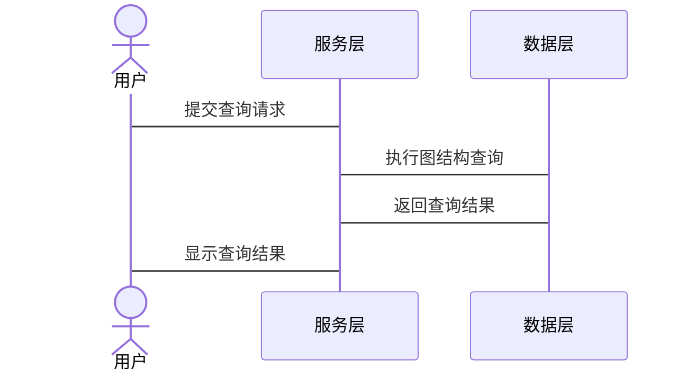

                 


# 构建基于知识图谱的金融监管合规追踪系统

> 关键词：知识图谱、金融监管、合规追踪系统、图嵌入算法、监管合规分析

> 摘要：随着金融市场的日益复杂化和监管要求的不断加强，传统的监管方式难以满足高效、精准的合规追踪需求。知识图谱作为一种强大的数据建模工具，能够有效捕捉和表示金融数据中的复杂关系，为金融监管合规追踪系统的构建提供了新的可能性。本文将从知识图谱的核心概念出发，详细探讨其在金融监管中的应用场景，并结合实际案例，介绍如何利用知识图谱构建高效、智能的合规追踪系统。通过本篇文章，读者将能够全面理解知识图谱在金融监管中的价值，并掌握构建此类系统的相关技术与方法。

---

## # 第1章: 知识图谱与金融监管合规追踪系统背景

### 1.1 知识图谱的定义与特点

#### 1.1.1 知识图谱的定义
知识图谱是一种用于表示和组织知识的图结构，通过实体（节点）和关系（边）描述数据间的语义关联。例如，知识图谱可以表示“公司A投资了公司B”，其中公司A和公司B是实体，投资是它们之间的关系。

#### 1.1.2 知识图谱的核心特点
- **结构化**：知识图谱通过三元组（头实体、关系、尾实体）的形式，将数据结构化，便于计算机理解和分析。
- **语义关联**：通过关系和属性的描述，知识图谱能够捕捉数据之间的语义联系，超越传统数据库的简单记录。
- **可扩展性**：知识图谱支持动态扩展，能够随着数据的增加而不断丰富。

#### 1.1.3 知识图谱与传统数据库的区别
| 特性       | 知识图谱                | 传统数据库        |
|------------|------------------------|-------------------|
| 数据结构   | 图结构（节点与边）      | 行列结构          |
| 关联性     | 强调语义关系            | 关系有限，通常为属性关系 |
| 查询能力   | 支持复杂关联查询        | 查询能力有限      |
| 可视化     | 支持复杂的图结构可视化    | 不支持复杂关系的可视化 |

### 1.2 金融监管合规追踪系统的定义与目标

#### 1.2.1 金融监管的定义与重要性
金融监管是指通过法律法规和监管机构，对金融机构的经营行为进行监督和管理，以确保金融市场的稳定和合规性。其重要性在于防范金融风险、保护投资者利益以及维护金融市场秩序。

#### 1.2.2 合规追踪系统的定义与功能
合规追踪系统是一种用于监控和记录金融机构的经营行为，确保其符合相关法律法规的系统。其主要功能包括：
- 数据采集与存储
- 合规规则定义与执行
- 违规行为识别与报警
- 追踪记录与报告生成

#### 1.2.3 知识图谱在金融监管中的应用价值
知识图谱能够通过语义关联的方式，帮助监管机构快速识别跨机构、跨业务的复杂关系，从而提高监管效率和精准度。例如，通过知识图谱可以发现同一实际控制人控制的多家公司之间的关联交易，帮助识别潜在的合规风险。

### 1.3 知识图谱与金融监管合规追踪系统的结合

#### 1.3.1 知识图谱在金融监管中的应用场景
- **关联交易识别**：通过知识图谱识别同一实际控制人控制的多家公司之间的关联交易，帮助发现潜在的合规风险。
- **风险传播分析**：利用知识图谱分析风险在金融网络中的传播路径，帮助监管机构提前预警和应对。
- **合规规则执行**：通过知识图谱的语义关联能力，动态定义和执行复杂的合规规则。

#### 1.3.2 合规追踪系统的核心需求
- **实时性**：能够实时采集和处理金融数据，快速识别违规行为。
- **准确性**：确保合规判断的准确性，减少误报和漏报。
- **可扩展性**：能够适应金融市场的动态变化，支持数据的动态扩展。

#### 1.3.3 知识图谱如何满足合规追踪系统的需求
知识图谱通过语义关联和结构化的数据表示，能够帮助合规追踪系统实现：
- **复杂关系的识别**：快速发现跨机构、跨业务的复杂关系。
- **动态规则定义**：根据监管要求的变化，动态调整合规规则的执行逻辑。
- **高效的数据查询**：通过图结构的高效查询能力，快速定位潜在的违规行为。

### 1.4 本章小结
本章介绍了知识图谱的定义、特点及其在金融监管中的应用价值，详细探讨了知识图谱与合规追踪系统的结合方式，为后续章节的深入分析奠定了基础。

---

## # 第2章: 知识图谱的核心概念与构建方法

### 2.1 知识图谱的核心概念

#### 2.1.1 实体与关系的定义
- **实体**：知识图谱中的节点，表示现实世界中的具体事物，例如“公司”、“个人”、“交易”等。
- **关系**：实体之间的关联，例如“投资”、“控股”、“交易”等。

#### 2.1.2 知识图谱的三元组表示法
知识图谱可以用三元组（头实体、关系、尾实体）表示，例如：“公司A 投资了 公司B”。

#### 2.1.3 知识图谱的属性与约束
- **属性**：描述实体的特征，例如“公司A的注册地是北京”。
- **约束**：用于限制关系的适用范围，例如“公司A必须是上市公司才能进行投资”。

#### 2.1.4 知识图谱的层次结构
- **基本层次**：实体、关系、属性。
- **扩展层次**：上下文、时间戳、语境等。

#### 2.1.5 实体关系图的ER图示例
```mermaid
er
    actor: 实体
    relationship: 关系
    entity: 实体
    actor --> relationship
    relationship --> entity
```

### 2.2 知识图谱的构建流程

#### 2.2.1 数据采集与预处理
- **数据来源**：包括金融机构的交易数据、财务报表、新闻报道等。
- **数据清洗**：去除重复数据、处理缺失值、标准化数据格式。

#### 2.2.2 实体识别与抽取
- **实体识别**：通过自然语言处理技术，从文本中提取实体信息。
- **实体抽取**：将提取的实体信息映射到知识图谱的实体节点。

#### 2.2.3 关系抽取与构建
- **关系抽取**：识别实体之间的关系，并将关系表示为边。
- **关系构建**：根据抽取的关系，构建知识图谱的边结构。

#### 2.2.4 知识图谱的存储与管理
- **存储方式**：使用图数据库（如Neo4j）或关系型数据库存储知识图谱。
- **管理方法**：包括数据索引、查询优化、数据同步等。

### 2.3 知识图谱的可视化与查询

#### 2.3.1 知识图谱的可视化方法
- **节点与边的绘制**：使用图数据库自带的可视化工具或第三方工具（如Gephi）进行绘制。
- **布局优化**：通过调整节点布局，使图结构更加清晰易懂。

#### 2.3.2 基于图的查询语言
- **SPARQL**：一种用于查询RDF数据的查询语言，支持复杂的图结构查询。
- **Cypher**：Neo4j图数据库的查询语言，简单易用，适合非技术人员。

#### 2.3.3 知识图谱的查询优化
- **索引优化**：通过建立索引提高查询效率。
- **查询剪枝**：通过提前终止不必要的查询分支，减少计算量。

### 2.4 本章小结
本章详细介绍了知识图谱的核心概念和构建方法，包括数据采集、实体识别、关系抽取以及知识图谱的存储与管理。这些内容为后续章节构建金融监管合规追踪系统提供了坚实的基础。

---

## # 第3章: 知识图谱中的图嵌入算法

### 3.1 图嵌入算法的定义与特点

#### 3.1.1 图嵌入算法的定义
图嵌入算法是一种将图结构数据（如知识图谱）映射到低维向量空间的技术，使得相似的节点具有相似的向量表示。

#### 3.1.2 图嵌入算法的核心特点
- **降维**：将高维的图结构数据映射到低维空间，便于后续处理。
- **语义保留**：尽可能保留图中节点的语义信息，使得向量表示能够反映节点之间的语义关联。

#### 3.1.3 图嵌入算法与传统文本嵌入的区别
| 特性       | 图嵌入算法                | 传统文本嵌入        |
|------------|--------------------------|---------------------|
| 数据结构   | 图结构（节点与边）        | 文本数据            |
| 关联性     | 强调节点间的语义关系      | 强调文本内容的相似性 |
| 应用场景   | 网络分析、推荐系统等       | 文本分类、搜索等     |

### 3.2 常见的图嵌入算法

#### 3.2.1 Word2Vec算法
- **原理**：通过遍历图中的边，将节点的邻居信息融入到节点的向量表示中。
- **优点**：简单易实现，计算效率高。
- **缺点**：难以捕捉复杂的语义信息。

#### 3.2.2 Node2Vec算法
- **原理**：基于随机游走，在图中生成节点的上下文信息，并通过Skip-Gram模型生成节点向量。
- **优点**：能够捕捉节点的多种语义信息。
- **缺点**：计算复杂度较高。

#### 3.2.3 GraphSAGE算法
- **原理**：通过归纳式学习，在图中传播和聚合信息，生成节点的向量表示。
- **优点**：适用于大规模图数据，支持在线更新。
- **缺点**：需要较多的计算资源。

#### 3.2.4 TransE算法
- **原理**：通过最小化边的向量差，将三元组（头实体、关系、尾实体）映射到低维空间。
- **优点**：计算效率高，适合大规模数据。
- **缺点**：难以捕捉复杂的语义信息。

### 3.3 图嵌入算法的实现与应用

#### 3.3.1 基于Word2Vec的图嵌入实现
```python
import numpy as np
from sklearn.linear_model import SGDClassifier

# 定义图结构
graph = {
    'A': ['B', 'C'],
    'B': ['A', 'D'],
    'C': ['A', 'D'],
    'D': ['B', 'C']
}

# Word2Vec实现
def word2vec(graph, vector_size=100):
    # 初始化向量
    vectors = {node: np.random.randn(vector_size) for node in graph}
    # 训练模型
    for _ in range(100):
        for node in graph:
            # 遍历邻居节点
            for neighbor in graph[node]:
                # 更新向量
                vectors[node] += (vectors[neighbor] - vectors[node]) * 0.1
    return vectors

vectors = word2vec(graph)
print(vectors)
```

#### 3.3.2 图嵌入算法在金融监管中的应用
- **风险评估**：通过图嵌入算法识别具有高风险的机构或交易。
- **异常检测**：利用图嵌入向量的相似性，发现异常交易模式。
- **推荐系统**：基于图嵌入向量，推荐相关机构或交易进行深入分析。

#### 3.3.3 图嵌入算法的性能优化
- **分布式计算**：利用分布式计算框架（如Spark）提高计算效率。
- **模型压缩**：通过量化或剪枝技术，减少向量维度，降低存储和计算成本。

### 3.4 本章小结
本章介绍了图嵌入算法的核心概念和常见算法，并通过实际代码示例展示了Word2Vec算法的实现。同时，探讨了图嵌入算法在金融监管中的应用场景和性能优化方法，为后续章节构建合规追踪系统提供了技术支持。

---

## # 第4章: 基于知识图谱的金融监管合规分析算法

### 4.1 基于知识图谱的合规分析方法

#### 4.1.1 基于图遍历的合规分析
- **广度优先搜索（BFS）**：从目标节点出发，逐层遍历图中的节点，发现潜在的关联关系。
- **深度优先搜索（DFS）**：从目标节点出发，深入探索某一路径，发现深层次的关联关系。

#### 4.1.2 基于图相似度的合规分析
- **余弦相似度**：通过计算节点向量的余弦相似度，发现语义相似的节点。
- **Jaccard相似度**：通过计算节点之间共享的邻居数量，衡量节点的相似性。

#### 4.1.3 基于图聚类的合规分析
- **社区发现**：通过聚类算法（如Louvain算法），发现图中的社区结构，识别具有相似特征的节点。
- **异常检测**：通过聚类分析，识别与主流社区差异较大的异常节点。

### 4.2 合规分析算法的实现与优化

#### 4.2.1 基于图遍历的合规分析实现
```python
def bfs(graph, start_node):
    visited = set()
    queue = [start_node]
    while queue:
        node = queue.pop(0)
        if node not in visited:
            visited.add(node)
            for neighbor in graph[node]:
                if neighbor not in visited:
                    queue.append(neighbor)
    return visited

graph = {
    'A': ['B', 'C'],
    'B': ['D', 'E'],
    'C': ['F', 'G'],
    'D': ['H', 'I'],
    # ... 其他节点
}

result = bfs(graph, 'A')
print(result)
```

#### 4.2.2 基于图相似度的合规分析实现
```python
from sklearn.metrics.pairwise import cosine_similarity

def compute_similarity(vectors):
    similarity_matrix = cosine_similarity(vectors.values())
    return similarity_matrix

vectors = {
    'A': [0.2, 0.3],
    'B': [0.4, 0.5],
    'C': [0.1, 0.2],
    # ... 其他节点
}

similarity_matrix = compute_similarity(vectors)
print(similarity_matrix)
```

#### 4.2.3 基于图聚类的合规分析实现
```python
from sklearn.cluster import KMeans

vectors = {
    'A': [0.2, 0.3],
    'B': [0.4, 0.5],
    'C': [0.1, 0.2],
    # ... 其他节点
}

model = KMeans(n_clusters=3)
model.fit(list(vectors.values()))
clusters = model.predict(list(vectors.values()))
print(clusters)
```

#### 4.2.4 合规分析算法的优化
- **索引优化**：通过建立索引提高查询效率。
- **并行计算**：利用多线程或分布式计算框架提高计算效率。
- **模型优化**：通过调整算法参数，提高合规分析的准确性和效率。

### 4.3 本章小结
本章详细介绍了基于知识图谱的合规分析方法，包括图遍历、图相似度和图聚类等算法，并通过实际代码示例展示了这些算法的实现。同时，探讨了合规分析算法的优化方法，为后续章节构建合规追踪系统提供了技术支持。

---

## # 第5章: 金融监管合规追踪系统的架构设计与实现

### 5.1 问题场景介绍

#### 5.1.1 问题背景
随着金融市场的快速发展，金融机构之间的关联交易日益复杂，传统的监管方式难以满足高效、精准的合规追踪需求。

#### 5.1.2 问题描述
金融机构之间的关联交易可能存在合规风险，例如同一实际控制人控制的多家公司之间的隐性关联交易，可能导致利益输送和市场操纵。

#### 5.1.3 问题解决
通过构建基于知识图谱的合规追踪系统，可以实时监控金融机构的经营行为，识别潜在的合规风险，并及时采取措施。

### 5.2 系统功能设计

#### 5.2.1 领域模型设计


#### 5.2.2 系统架构设计


#### 5.2.3 系统接口设计
- **数据接口**：用于采集和存储金融数据。
- **查询接口**：用于执行合规分析的图结构查询。
- **报警接口**：用于触发合规报警。

#### 5.2.4 系统交互设计


### 5.3 系统核心实现

#### 5.3.1 环境安装
```bash
pip install neo4j
pip install networkx
pip install numpy
pip install scikit-learn
```

#### 5.3.2 核心代码实现
```python
from neo4j import GraphDatabase
from networkx import Graph

# 初始化图数据库
def init_graph_db():
    driver = GraphDatabase.driver('bolt://localhost:7687', auth=('neo4j', 'password'))
    return driver

# 构建知识图谱
def build_knowledge_graph(driver, entities, relationships):
    with driver.session() as session:
        # 创建节点
        for entity in entities:
            session.write_transaction(lambda tx: tx.run("CREATE (n:{ EntityType } { id: $id })", EntityType='Entity', id=entity))
        # 创建关系
        for relation in relationships:
            session.write_transaction(lambda tx: tx.run("MATCH (a), (b) WHERE a.id = $a_id AND b.id = $b_id CREATE (a)-[r:{ RelationType } { type: $type }]->(b)", a_id=relation['head'], b_id=relation['tail'], type=relation['type']))
    return driver

# 合规分析
def compliance_analysis(driver, start_node):
    with driver.session() as session:
        result = session.read_transaction(lambda tx: tx.run("MATCH (a), (b), path = shortestPath(a, b) RETURN path", a=start_node))
        return result

# 主程序
def main():
    entities = ['公司A', '公司B', '公司C']
    relationships = [
        {'head': '公司A', 'tail': '公司B', 'type': '投资'},
        {'head': '公司B', 'tail': '公司C', 'type': '控股'}
    ]
    driver = init_graph_db()
    build_knowledge_graph(driver, entities, relationships)
    compliance_analysis(driver, '公司A')
    driver.close()

if __name__ == '__main__':
    main()
```

#### 5.3.3 代码功能解读
- **初始化图数据库**：通过Neo4j图数据库存储知识图谱。
- **构建知识图谱**：将实体和关系数据写入图数据库，构建知识图谱。
- **合规分析**：通过图数据库执行合规分析，识别潜在的合规风险。

### 5.4 实际案例分析

#### 5.4.1 案例背景
某金融机构存在多个关联公司，可能存在隐性关联交易，需要通过合规追踪系统识别潜在的合规风险。

#### 5.4.2 案例分析
通过构建知识图谱，识别出同一实际控制人控制的多家公司之间的关联交易，并通过合规分析算法，发现潜在的合规风险。

#### 5.4.3 案例结果
系统成功识别出隐性关联交易，并触发合规报警，帮助监管机构及时采取措施，防范金融风险。

### 5.5 本章小结
本章通过实际案例分析，详细介绍了基于知识图谱的金融监管合规追踪系统的架构设计与实现过程，展示了知识图谱在金融监管中的实际应用价值。

---

## # 第6章: 总结与展望

### 6.1 本章总结
本文详细介绍了基于知识图谱的金融监管合规追踪系统的构建过程，包括知识图谱的核心概念、构建方法、图嵌入算法、合规分析算法以及系统架构设计与实现。通过实际案例分析，展示了知识图谱在金融监管中的实际应用价值。

### 6.2 本文的主要贡献
- 提供了一种基于知识图谱的金融监管合规追踪系统构建方法。
- 探讨了知识图谱在金融监管中的应用场景，为后续研究提供了理论基础。
- 提出了图嵌入算法在金融监管中的具体应用方法，为实际应用提供了技术支持。

### 6.3 未来研究方向
- **图神经网络的应用**：探索图神经网络在金融监管中的应用，进一步提高合规分析的准确性和效率。
- **动态知识图谱的构建**：研究动态知识图谱的构建方法，实现实时的合规追踪。
- **多模态数据的融合**：结合文本、图像等多种数据源，构建更加完善的知识图谱。

### 6.4 最佳实践 Tips
- **数据质量**：确保数据的准确性和完整性，是构建高效知识图谱的基础。
- **算法选择**：根据具体场景和需求，选择合适的图嵌入算法和合规分析算法。
- **系统优化**：通过分布式计算和模型优化，提高系统的计算效率和存储效率。

### 6.5 本章小结
本文通过系统的构建过程和实际案例分析，总结了知识图谱在金融监管中的应用价值，并展望了未来的研究方向和最佳实践。

---

## 作者：AI天才研究院/AI Genius Institute & 禅与计算机程序设计艺术/Zen And The Art of Computer Programming

---

通过以上详细的目录结构和内容安排，读者可以系统地学习和理解如何构建基于知识图谱的金融监管合规追踪系统，掌握相关的核心技术和实际应用方法。

