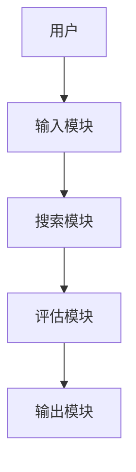
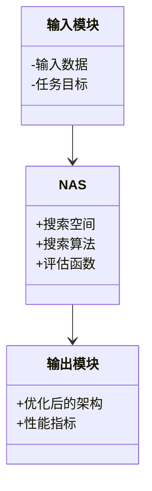
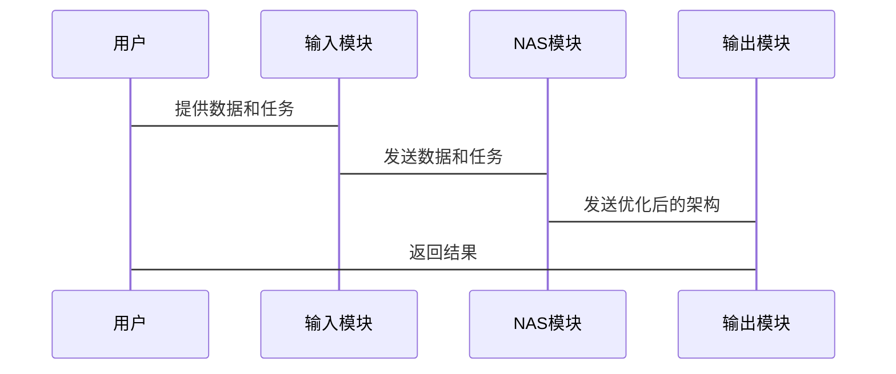

                 


# 神经网络架构搜索：为AI Agent找到最佳结构

> **关键词**：神经网络架构搜索，AI Agent，深度学习，自动化机器学习，强化学习  
> **摘要**：神经网络架构搜索（Neural Architecture Search, NAS）是一种通过自动化方法寻找最优神经网络结构的技术。本文将从基础概念、算法原理、系统架构到项目实战，全面解析如何为AI Agent找到最佳的神经网络结构，帮助读者理解并应用这一前沿技术。

---

## 第一部分：神经网络架构搜索的背景与基础

### 第1章：神经网络架构搜索概述

#### 1.1 神经网络架构搜索的基本概念
- **1.1.1 神经网络架构搜索的定义**  
  神经网络架构搜索（NAS）是一种通过自动化方法生成和优化神经网络结构的技术，旨在找到在特定任务上表现最优的网络架构。

- **1.1.2 神经网络架构搜索的背景与意义**  
  随着深度学习的快速发展，人工设计神经网络架构的效率逐渐成为瓶颈。NAS通过自动化方法，显著提高了模型设计的效率和性能。

- **1.1.3 神经网络架构搜索与AI Agent的关系**  
  AI Agent需要在复杂环境中做出决策，而NAS为其提供了高效的感知和推理能力，使其能够更好地适应动态环境。

#### 1.2 神经网络架构搜索的核心问题
- **1.2.1 神经网络架构的复杂性**  
  神经网络架构的复杂性使得手动设计变得困难，而NAS通过系统化的方法简化了这一过程。

- **1.2.2 神经网络架构搜索的目标与挑战**  
  NAS的目标是在特定任务上找到最优或次优的网络架构，但其计算成本和搜索效率是主要挑战。

- **1.2.3 神经网络架构搜索的边界与外延**  
  NAS不仅关注架构设计，还包括模型压缩和部署等后续步骤，其应用范围不断扩大。

#### 1.3 神经网络架构搜索的应用场景
- **1.3.1 AI Agent在智能助手中的应用**  
  通过NAS优化的语音识别模型，显著提升了智能助手的交互体验。

- **1.3.2 AI Agent在图像识别中的应用**  
  NAS生成的高效网络架构，使得图像识别任务的准确率和速度得到了双重提升。

- **1.3.3 AI Agent在自然语言处理中的应用**  
  NAS在NLP任务中的应用，如文本分类和机器翻译，展现了其强大的适应能力。

#### 1.4 本章小结
本章介绍了NAS的基本概念、核心问题及其应用场景，为后续内容奠定了基础。

---

## 第二部分：神经网络架构搜索的核心概念与原理

### 第2章：神经网络架构搜索的核心概念

#### 2.1 神经网络架构的表示与建模
- **2.1.1 神经网络架构的表示方法**  
  神经网络架构可以用图结构表示，节点代表运算层，边代表数据流动。

- **2.1.2 神经网络架构的图结构模型**  
  使用图论中的概念，将网络架构建模为计算图，便于搜索和优化。

- **2.1.3 神经网络架构的可学习性**  
  通过参数化表示，使得架构搜索过程可以被学习算法优化。

#### 2.2 神经网络架构搜索的搜索空间
- **2.2.1 神经网络架构的组件与连接关系**  
  包括卷积层、全连接层等基本组件及其连接方式。

- **2.2.2 神经网络架构的超参数空间**  
  包括网络深度、宽度、激活函数等超参数。

- **2.2.3 神经网络架构的搜索空间设计**  
  设计合理的搜索空间，以减少计算成本并提高搜索效率。

#### 2.3 神经网络架构搜索的评估方法
- **2.3.1 基于性能的评估指标**  
  如准确率、F1分数等。

- **2.3.2 基于模型复杂度的评估指标**  
  如模型参数数量和计算复杂度。

- **2.3.3 基于搜索效率的评估指标**  
  如搜索时间、计算资源消耗等。

#### 2.4 本章小结
本章详细阐述了NAS中的核心概念，包括架构表示、搜索空间和评估方法。

---

## 第三部分：神经网络架构搜索的算法原理

### 第3章：主流的神经网络架构搜索算法

#### 3.1 基于强化学习的神经网络架构搜索

##### 3.1.1 强化学习在NAS中的应用
- 强化学习通过定义状态、动作和奖励机制，引导搜索过程。

##### 3.1.2 基于RNN的架构搜索方法
- 使用循环神经网络生成网络架构，模拟人类设计过程。

##### 3.1.3 基于强化学习的NAS算法实现
```python
class NASAgent:
    def __init__(self, action_space):
        self.action_space = action_space
        self.model = RNNModel(...)
        self.optimizer = Adam(...)

    def get_action(self, state):
        # 输入状态，输出动作
        return self.model.predict(state)

    def update_model(self, state, action, reward):
        # 基于奖励更新模型参数
        self.optimizer.minimize(reward, [self.model.trainable_weights])
```

##### 3.1.4 基于强化学习的NAS优缺点
- 优点：能够探索复杂的搜索空间，适应性强。
- 缺点：计算成本高，训练时间长。

#### 3.2 基于遗传算法的神经网络架构搜索
- **3.2.1 遗传算法的基本原理**  
  通过模拟自然选择，逐步优化网络架构。

- **3.2.2 遗传算法在NAS中的实现**
```python
def genetic_search(population_size, mutation_rate):
    population = initialize_population()
    for generation in range(max_generations):
        # 评估每个个体的适应度
        fitness = evaluate_population(population)
        # 选择高适应度的个体
        selected = selection(fitness)
        # 进行交叉和变异
        population = mutate(selected, mutation_rate)
    return best_architecture(population)
```

#### 3.3 基于进化策略的神经网络架构搜索
- **3.3.1 进化策略的基本原理**  
  通过群体协作，逐步优化网络架构。

- **3.3.2 进化策略的实现细节**
```python
class EvolutionStrategy:
    def __init__(self, pop_size, mutation_rate):
        self.pop_size = pop_size
        self.mutation_rate = mutation_rate

    def evolve(self, population):
        mutated = [mutate(individual, self.mutation_rate) for individual in population]
        return mutated
```

#### 3.4 基于梯度下降的神经网络架构搜索
- **3.4.1 梯度下降的基本原理**  
  通过参数优化，间接影响网络架构。

- **3.4.2 梯度下降的实现示例**
```python
def gradient_descent(objective_function, initial_params, learning_rate):
    params = initial_params
    for _ in range(steps):
        gradient = compute_gradient(objective_function, params)
        params = params - learning_rate * gradient
    return params
```

#### 3.5 各类算法的对比分析
- **3.5.1 算法优缺点对比**  
  制作对比表格，详细列出各种算法的优缺点。

- **3.5.2 算法适用场景分析**  
  根据任务需求选择合适的算法。

#### 3.6 本章小结
本章详细介绍了几种主流的NAS算法，包括强化学习、遗传算法、进化策略和梯度下降，并对其优缺点进行了对比分析。

---

## 第四部分：数学模型与公式

### 第4章：神经网络架构搜索的数学模型

#### 4.1 基于强化学习的数学模型
- **4.1.1 状态空间表示**  
  状态由网络层的参数和连接方式组成。

- **4.1.2 动作空间表示**  
  动作对应网络层的增删和参数调整。

- **4.1.3 奖励函数设计**  
  $$ R(s, a) = \alpha \cdot \text{accuracy} + (1 - \alpha) \cdot \text{complexity} $$  
  其中，$\alpha$是平衡性能和复杂度的权重参数。

#### 4.2 基于遗传算法的数学模型
- **4.2.1 适应度函数**  
  $$ f(a) = \text{accuracy}(a) \times \text{complexity}(a)^{-1} $$  

- **4.2.2 选择机制**  
  使用轮盘赌选择或其他选择策略。

#### 4.3 基于梯度下降的数学模型
- **4.3.1 目标函数**  
  $$ \mathcal{L}(\theta) = \frac{1}{N}\sum_{i=1}^{N} \text{loss}(x_i, y_i, \theta) $$  

- **4.3.2 梯度计算**  
  使用反向传播算法计算损失函数关于参数的梯度。

#### 4.4 本章小结
本章通过数学公式详细描述了各种NAS算法的模型，为后续的实现提供了理论基础。

---

## 第五部分：系统架构与设计方案

### 第5章：系统架构与设计方案

#### 5.1 系统功能设计
- **5.1.1 系统整体架构**  
  使用mermaid图展示系统架构。



- **5.1.2 系统功能模块**  
  包括输入模块、搜索模块、评估模块和输出模块。

#### 5.2 系统架构设计
- **5.2.1 系统架构图**  
  使用mermaid图展示系统架构。



#### 5.3 系统接口设计
- **5.3.1 输入接口**  
  接收输入数据和任务目标。

- **5.3.2 输出接口**  
  输出优化后的架构和性能指标。

#### 5.4 系统交互设计
- **5.4.1 交互流程图**  
  使用mermaid图展示交互流程。



#### 5.5 本章小结
本章详细设计了NAS系统的架构和接口，为实际应用提供了指导。

---

## 第六部分：项目实战

### 第6章：项目实战

#### 6.1 环境安装与配置
- **6.1.1 环境需求**  
  需要安装Python、TensorFlow、Keras等库。

- **6.1.2 安装依赖**  
  ```bash
  pip install tensorflow keras numpy
  ```

#### 6.2 系统核心实现
- **6.2.1 强化学习实现**
```python
class NASAgent:
    def __init__(self, state_space, action_space):
        self.state_space = state_space
        self.action_space = action_space
        self.model = self.build_model()

    def build_model(self):
        # 构建RNN模型
        pass

    def act(self, state):
        # 选择动作
        pass

    def train(self, state, action, reward):
        # 更新模型
        pass
```

- **6.2.2 遗传算法实现**
```python
def evaluate_architecture(architecture):
    # 评估架构性能
    pass

def mutate(architecture, mutation_rate):
    # 突变操作
    pass

def genetic_search():
    population = initialize()
    for _ in range(generations):
        evaluate(population)
        select_parents(population)
        mutate(population)
    return best_architecture(population)
```

#### 6.3 代码解读与分析
- **6.3.1 代码结构分析**  
  展示核心代码的结构和功能。

- **6.3.2 代码实现细节**  
  详细说明每个函数的实现方法。

#### 6.4 案例分析与实际应用
- **6.4.1 实际案例分析**  
  以图像分类任务为例，展示NAS的应用。

- **6.4.2 性能对比分析**  
  对比使用NAS优化后的模型与手动设计模型的性能差异。

#### 6.5 本章小结
本章通过实际项目展示了NAS的实现过程，帮助读者掌握核心代码和应用场景。

---

## 第七部分：总结与展望

### 第7章：总结与展望

#### 7.1 本章总结
- 回顾全文，总结核心内容和主要收获。

#### 7.2 未来展望
- 展望NAS的发展方向，包括算法优化、应用拓展等。

#### 7.3 最佳实践Tips
- 提供一些实践中的建议和注意事项。

#### 7.4 本章小结
结束全文，留下深刻印象。

---

## 作者：AI天才研究院 & Zen And The Art of Computer Programming

---

这篇文章从理论到实践，全面解析了神经网络架构搜索的核心概念、算法原理和系统设计，为AI Agent的优化提供了详尽的指导。希望读者能够通过本文，掌握NAS的关键技术，并在实际应用中取得优异成果。

