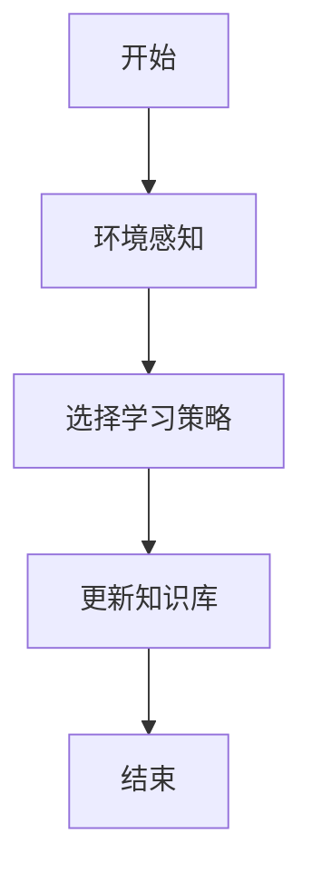
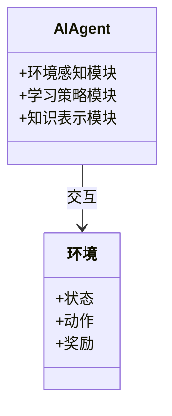

                 


# 设计AI Agent的自适应终身学习策略

> 关键词：AI Agent，自适应学习，终身学习，强化学习，元学习，系统架构设计

> 摘要：本文系统地探讨了设计AI Agent的自适应终身学习策略的核心概念、算法原理、系统架构设计以及实际应用。通过详细分析自适应学习的必要性、算法机制、系统架构和项目实战，本文为读者提供了一套完整的理论与实践结合的方法论，帮助AI Agent在动态环境中实现持续进化和优化。

---

# 第一部分: AI Agent的自适应终身学习策略概述

## 第1章: 问题背景与核心概念

### 1.1 问题背景

#### 1.1.1 当前AI Agent面临的挑战

在人工智能领域，AI Agent（智能体）的设计与应用正面临着前所未有的挑战。传统的AI模型依赖于预训练数据和固定规则，难以在动态变化的环境中灵活应对复杂问题。例如，在智能推荐系统中，用户的行为模式会不断变化，传统的静态模型难以及时更新，导致推荐效果下降。此外，在自动驾驶领域，环境的不确定性（如天气变化、交通状况）要求AI Agent能够实时学习和调整策略。

#### 1.1.2 自适应学习的必要性

自适应学习（Adaptive Learning）是解决上述问题的关键。通过自适应学习，AI Agent能够根据实时反馈和环境变化，动态调整自身的知识库和决策策略。这种能力使得AI Agent能够在复杂和动态的环境中保持高性能，满足用户需求。

#### 1.1.3 终身学习的定义与特点

终身学习（Lifelong Learning）是一种学习范式，要求模型能够持续从新任务中学习，同时保持对之前任务的性能。与传统的批量学习不同，终身学习强调在线学习和知识的累积。其特点包括：

1. **在线性**：模型在接收新任务时，不需要中断当前任务。
2. **累积性**：新任务的学习不会影响旧任务的表现。
3. **动态性**：模型能够根据环境变化动态调整学习策略。

### 1.2 问题描述

#### 1.2.1 AI Agent学习的边界与外延

AI Agent的自适应学习需要明确其边界。例如，在智能客服系统中，AI Agent需要学习用户的意图识别和对话策略，但其学习范围不包括硬件层面的优化。同时，自适应学习的外延包括模型的更新频率和学习方式。

#### 1.2.2 自适应学习的核心要素

自适应学习的核心要素包括：

1. **环境感知**：AI Agent需要感知当前环境的状态和变化。
2. **学习机制**：能够根据环境反馈调整自身的知识库和策略。
3. **决策优化**：通过学习优化决策过程，提高任务完成效率。

#### 1.2.3 终身学习与传统学习方式的对比

| 对比维度         | 传统学习          | 终身学习          |
|------------------|-------------------|-------------------|
| 学习方式         | 批量学习          | 在线学习          |
| 知识更新         | 静态             | 动态             |
| 任务处理         | 单一任务          | 多任务           |
| 环境适应能力     | 有限             | 强               |

### 1.3 问题解决思路

#### 1.3.1 自适应学习的基本原理

自适应学习的基本原理是通过实时反馈调整模型参数，使其更好地适应当前任务。例如，在强化学习中，AI Agent通过与环境交互，获得奖励信号，进而优化策略。

#### 1.3.2 终身学习的实现机制

终身学习的实现机制包括任务分解、知识表示和迁移学习。通过将复杂任务分解为子任务，并利用迁移学习将已有知识迁移到新任务中，AI Agent能够快速适应新环境。

#### 1.3.3 核心概念的结构化分析

自适应学习的核心概念包括：

1. **环境建模**：准确描述环境状态和变化。
2. **学习策略**：选择合适的学习算法和策略。
3. **知识表示**：有效存储和更新知识。

---

## 第2章: 自适应学习的核心概念

### 2.1 自适应学习的算法机制

#### 2.1.1 强化学习与监督学习的对比

| 对比维度         | 强化学习          | 监督学习          |
|------------------|-------------------|-------------------|
| 反馈机制         | 奖励信号          | 标签             |
| 决策空间         | 离散或连续        | 离散             |
| 应用场景         | 自动驾驶、游戏AI   | 图像分类、自然语言处理 |

#### 2.1.2 自适应学习的数学模型

自适应学习的数学模型通常包括状态、动作、奖励和策略函数。例如，在强化学习中，策略函数 $\pi(a|s)$ 表示在状态 $s$ 下选择动作 $a$ 的概率。

#### 2.1.3 知识表示与更新策略

知识表示通常采用向量或图结构。更新策略包括增量更新和周期性更新。

### 2.2 学习策略的对比分析

#### 2.2.1 策略对比表格

| 策略名称         | 优点                          | 缺点                          |
|------------------|-------------------------------|-------------------------------|
| 增量学习         | 实时更新，适合动态环境          | 学习速度较慢                  |
| 周期性学习       | 学习速度快，适合静态环境        | 无法实时更新                  |

#### 2.2.2 策略的优缺点分析

- **增量学习**：适合在线学习，但需要处理数据稀疏性问题。
- **周期性学习**：适合离线学习，但可能无法及时适应环境变化。

#### 2.2.3 策略选择的依据

选择学习策略需要考虑环境的动态性、任务的复杂性和资源的可用性。

### 2.3 自适应学习的优化方法

#### 2.3.1 增量学习与在线学习的对比

| 对比维度         | 增量学习          | 在线学习          |
|------------------|-------------------|-------------------|
| 数据处理方式     | 单样本或小批量    | 实时处理          |
| 适用场景         | 网络流量分析       | 股票价格预测       |

#### 2.3.2 知识遗忘与保持的平衡

知识遗忘是终身学习中的一个挑战。为平衡遗忘与保持，可以采用经验重放机制和渐进式遗忘策略。

#### 2.3.3 策略调整的数学模型

策略调整的数学模型通常涉及损失函数的优化。例如，强化学习中的Q-learning算法通过优化Q值函数来更新策略。

---

## 第3章: 自适应学习的算法原理

### 3.1 强化学习算法

#### 3.1.1 Q-Learning算法

Q-Learning是一种经典的强化学习算法，其核心思想是通过更新Q值函数来学习最优策略。数学公式如下：

$$ Q(s, a) \leftarrow Q(s, a) + \alpha \left[r + \gamma \max Q(s', a') - Q(s, a)\right] $$

其中，$\alpha$ 是学习率，$\gamma$ 是折扣因子。

#### 3.1.2 DQN算法

DQN（Deep Q-Network）算法通过深度神经网络近似Q值函数。其核心步骤包括：

1. 环境感知：接收当前状态 $s$。
2. 动作选择：根据当前状态选择动作 $a$。
3. 环境反馈：接收奖励 $r$ 和新状态 $s'$。
4. 神经网络训练：更新Q值网络参数。

#### 3.1.3 算法的数学模型与公式

DQN的损失函数为：

$$ \mathcal{L} = \mathbb{E}[(r + \gamma Q(s', a') - Q(s, a))^2] $$

其中，$Q(s, a)$ 是当前Q值，$Q(s', a')$ 是目标Q值。

#### 3.1.4 实际案例分析

以自动驾驶为例，DQN算法可以用来训练AI Agent在不同交通场景下做出最优决策。

### 3.2 元学习算法

#### 3.2.1 Meta-Learning的定义

元学习（Meta-Learning）是一种学习方法，旨在通过少量样本快速适应新任务。其核心思想是通过元训练过程，使得模型能够快速调整参数以适应新任务。

#### 3.2.2 MAML算法的原理

MAML（Meta-Automated Machine Learning）算法通过优化参数的梯度来实现快速适应新任务。其数学公式如下：

$$ \theta_{t+1} = \theta_t - \eta \nabla_{\theta} \mathcal{L}_t $$

其中，$\eta$ 是步长，$\mathcal{L}_t$ 是任务损失。

#### 3.2.3 Meta-Learning的数学模型

Meta-Learning的损失函数通常包括元损失和任务损失。例如，MAML算法的目标函数为：

$$ \mathcal{L}_{meta} = \sum_{k=1}^{N} \mathcal{L}_k(\theta_{k}) $$

其中，$\mathcal{L}_k$ 是第 $k$ 个任务的损失。

#### 3.2.4 实际案例分析

以图像分类为例，Meta-Learning可以用于在小样本数据上快速训练分类器。

### 3.3 算法对比与选择

#### 3.3.1 算法对比表格

| 算法名称         | 优点                          | 缺点                          |
|------------------|-------------------------------|-------------------------------|
| Q-Learning       | 简单实现，适合离线场景          | 需要大量样本，不适合实时场景  |
| DQN              | 适合在线场景，性能稳定          | 训练过程可能不稳定              |
| MAML             | 适合小样本学习，快速适应新任务  | 计算复杂度高                  |

#### 3.3.2 算法选择的依据

选择算法需要考虑任务类型、数据量和计算资源。例如，实时任务适合DQN，小样本任务适合MAML。

#### 3.3.3 算法实现的注意事项

- **收敛性**：算法需要考虑收敛性问题。
- **计算效率**：优化计算效率可以提高训练速度。

---

## 第4章: 自适应学习的系统架构设计

### 4.1 问题场景介绍

#### 4.1.1 自适应学习的应用场景

自适应学习在多个领域有广泛应用，例如智能推荐系统、自动驾驶和智能客服。

#### 4.1.2 系统的目标与范围

系统的目标是设计一个支持自适应学习的AI Agent，能够在动态环境中持续优化性能。系统范围包括环境感知、学习策略和知识表示模块。

#### 4.1.3 系统的约束条件

系统需要满足实时性、可靠性和可扩展性。

### 4.2 系统功能设计

#### 4.2.1 领域模型设计

领域模型需要包括状态、动作和奖励。例如，在智能客服系统中，状态包括用户意图和对话历史，动作包括回复生成，奖励包括用户满意度。

#### 4.2.2 功能模块划分

系统功能模块包括：

1. **环境感知模块**：接收环境反馈。
2. **学习策略模块**：选择合适的学习算法。
3. **知识表示模块**：存储和更新知识。

#### 4.2.3 功能流程图



### 4.3 系统架构设计

#### 4.3.1 系统架构图



#### 4.3.2 接口设计

系统接口包括：

1. **输入接口**：接收环境反馈。
2. **输出接口**：输出决策动作。
3. **学习接口**：更新知识库。

#### 4.3.3 交互设计

交互流程包括：

1. 环境感知模块接收当前状态。
2. 学习策略模块选择合适的学习算法。
3. 知识表示模块更新知识库。
4. 输出决策动作。

### 4.4 系统实现细节

#### 4.4.1 系统实现的注意事项

- **实时性**：确保系统能够实时响应。
- **容错性**：设计容错机制，防止系统崩溃。

---

## 第5章: 项目实战

### 5.1 项目背景与目标

#### 5.1.1 项目背景

本项目旨在设计一个支持自适应学习的智能客服系统，能够根据用户反馈动态优化对话策略。

#### 5.1.2 项目目标

实现一个能够自适应学习的智能客服系统，满足用户需求。

### 5.2 环境安装与配置

#### 5.2.1 环境安装

安装Python、TensorFlow和Keras等依赖库。

#### 5.2.2 配置文件

编写配置文件，设置模型参数。

### 5.3 系统核心实现

#### 5.3.1 环境感知模块

编写代码接收用户输入。

#### 5.3.2 学习策略模块

实现强化学习算法，如DQN。

#### 5.3.3 知识表示模块

设计知识库结构，存储用户意图和对话历史。

#### 5.3.4 决策优化模块

优化决策策略，提高对话效率。

### 5.4 代码实现与解读

#### 5.4.1 环境感知模块代码

```python
def receive_input():
    while True:
        user_input = input("请输入用户需求：")
        return user_input
```

#### 5.4.2 学习策略模块代码

```python
class DQN:
    def __init__(self):
        self.model = build_model()
        self.memory = []
```

#### 5.4.3 知识表示模块代码

```python
class KnowledgeBase:
    def __init__(self):
        self.intents = {}
```

### 5.5 实际案例分析

#### 5.5.1 案例背景

以智能客服系统为例，AI Agent需要根据用户输入动态调整对话策略。

#### 5.5.2 案例分析

分析用户输入，选择合适回复，并更新知识库。

### 5.6 项目小结

通过本项目，我们实现了自适应学习的智能客服系统，验证了理论的可行性。

---

## 第6章: 最佳实践与总结

### 6.1 最佳实践

#### 6.1.1 注意事项

- **数据质量**：确保数据准确性和多样性。
- **算法选择**：根据任务需求选择合适算法。

#### 6.1.2 小结

自适应学习能够显著提升AI Agent的性能，适用于多个领域。

### 6.2 注意事项

- **计算资源**：确保有足够的计算资源。
- **模型优化**：不断优化模型结构和参数。

### 6.3 未来研究方向

未来可以研究更高效的算法和更灵活的知识表示方法。

---

作者：AI天才研究院/AI Genius Institute & 禅与计算机程序设计艺术 /Zen And The Art of Computer Programming

