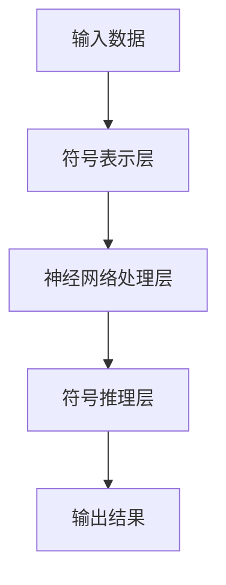
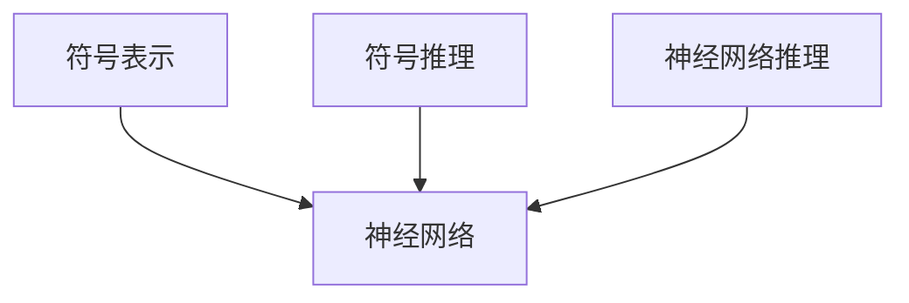
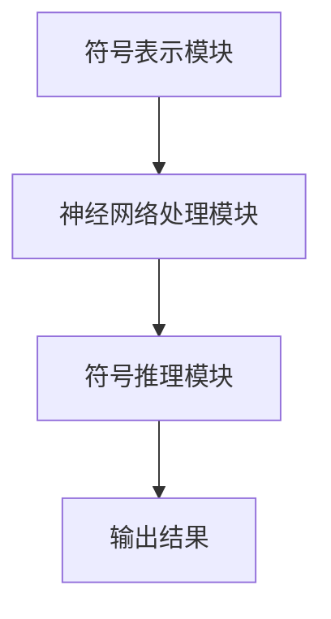

                 


# AI Agent的神经符号集成学习方法

**关键词**：AI Agent，神经符号，集成学习，机器学习，符号推理

**摘要**：本文深入探讨了AI Agent的神经符号集成学习方法，从基础概念到高级算法，结合实际应用场景，详细分析了神经符号集成学习的原理、算法、系统架构和项目实现。通过对比传统方法，本文揭示了神经符号集成学习的独特优势，并通过实际案例展示了其在AI Agent中的应用价值。

---

# 第1章: AI Agent与神经符号集成学习概述

## 1.1 AI Agent的基本概念

### 1.1.1 AI Agent的定义与特点

AI Agent（人工智能代理）是指能够感知环境并采取行动以实现目标的智能实体。AI Agent可以是软件程序、机器人或其他智能系统，具备以下特点：

- **自主性**：能够在没有外部干预的情况下自主决策。
- **反应性**：能够感知环境并实时响应。
- **目标导向**：所有行为都以实现特定目标为导向。
- **社交能力**：能够与其他AI Agent或人类交互协作。

### 1.1.2 AI Agent的分类与应用场景

AI Agent可以根据智能水平分为以下几类：

- **反应式AI Agent**：基于当前感知做出反应，适用于实时任务。
- **基于模型的AI Agent**：利用内部模型进行规划和推理，适用于复杂任务。
- **混合型AI Agent**：结合反应式和基于模型的策略，适用于复杂动态环境。

应用场景包括自动驾驶、智能助手、机器人控制、智能推荐系统等。

### 1.1.3 神经符号集成学习的提出背景

传统AI Agent主要依赖符号推理或神经网络，各有优缺点。符号推理在逻辑推理和可解释性方面表现优异，但难以处理复杂感知任务；神经网络在感知任务上表现出色，但在逻辑推理和可解释性方面存在不足。神经符号集成学习通过结合符号推理和神经网络的优势，弥补了传统方法的不足。

---

## 1.2 神经符号集成学习的核心概念

### 1.2.1 神经符号集成学习的原理

神经符号集成学习将符号推理与神经网络结合，利用符号推理的逻辑能力处理规则性任务，利用神经网络的感知能力处理非规则性任务。其核心思想是通过符号表示和神经网络的协同工作，实现更强大的AI能力。

### 1.2.2 神经符号集成学习的优缺点

- **优点**：
  - 具备符号推理的可解释性和逻辑推理能力。
  - 具备神经网络的强大感知和模式识别能力。
  - 能够处理复杂动态环境中的任务。

- **缺点**：
  - 实现复杂，需要结合符号和神经网络的专门知识。
  - 训练过程可能需要更多的计算资源。

### 1.2.3 神经符号集成学习的边界与外延

神经符号集成学习的边界在于符号和神经网络的结合程度，外延包括符号增强的神经网络和神经网络增强的符号推理。

---

## 1.3 本章小结

本章介绍了AI Agent的基本概念、分类及应用场景，并提出了神经符号集成学习的背景和核心概念。神经符号集成学习通过结合符号推理和神经网络的优势，为AI Agent提供了更强大的能力。

---

# 第2章: 神经符号集成学习的核心概念与联系

## 2.1 神经符号集成学习的原理

### 2.1.1 符号表示与神经网络的结合方式

符号表示通过规则或逻辑推理对问题进行建模，神经网络通过感知输入数据提取特征。两者结合可以通过符号表示指导神经网络的训练，或通过神经网络的感知能力增强符号推理。

### 2.1.2 神经符号集成学习的数学模型

神经符号集成学习的数学模型结合了符号和神经网络的表示形式，例如：

$$ s = f(x) $$
$$ y = \sigma(Ws + b) $$

其中，\( s \) 是符号表示，\( x \) 是输入数据，\( f \) 是符号表示函数，\( W \) 和 \( b \) 是神经网络的权重和偏置，\( \sigma \) 是激活函数。

### 2.1.3 神经符号集成学习的实现框架

实现框架包括符号表示层、神经网络处理层和符号推理层，如下图所示：



---

## 2.2 神经符号集成学习的核心概念对比

### 2.2.1 符号表示与神经网络表示的对比

| 特性                | 符号表示          | 神经网络表示        |
|---------------------|-------------------|--------------------|
| 可解释性            | 高                | 低                |
| 逻辑推理能力        | 强                | 弱                |
| 感知能力            | 无                | 强                |
| 适应性              | 低                | 高                |

### 2.2.2 神经符号集成学习与传统符号推理的对比

| 特性                | 传统符号推理      | 神经符号集成学习    |
|---------------------|-------------------|--------------------|
| 感知能力            | 无                | 强                |
| 可解释性            | 高                | 中                |
| 逻辑推理能力        | 强                | 强                |
| 适应性              | 低                | 高                |

### 2.2.3 神经符号集成学习与纯神经网络的对比

| 特性                | 纯神经网络        | 神经符号集成学习    |
|---------------------|-------------------|--------------------|
| 逻辑推理能力        | 弱                | 强                |
| 可解释性            | 低                | 中                |
| 感知能力            | 强                | 强                |
| 适应性              | 高                | 高                |

---

## 2.3 神经符号集成学习的ER实体关系图



---

## 2.4 本章小结

本章详细介绍了神经符号集成学习的核心概念，包括符号表示、神经网络的结合方式，以及与传统方法的对比。通过对比分析，突出了神经符号集成学习的优势和适用场景。

---

# 第3章: 神经符号集成学习的算法原理

## 3.1 神经符号集成学习的算法流程

### 3.1.1 算法流程图


### 3.1.2 算法步骤

1. 输入数据经过符号表示层，生成符号表示。
2. 符号表示输入神经网络处理层，提取特征。
3. 特征输入符号推理层，进行逻辑推理。
4. 输出结果。

## 3.2 神经符号集成学习的数学模型

### 3.2.1 符号表示的数学表达

符号表示函数 \( f(x) \) 将输入 \( x \) 映射到符号表示 \( s \)：

$$ s = f(x) $$

### 3.2.2 神经网络的数学模型

神经网络将符号表示 \( s \) 映射到输出 \( y \)：

$$ y = \sigma(Ws + b) $$

### 3.2.3 神经符号集成学习的联合优化

神经符号集成学习的目标是最小化输出结果与真实结果的损失：

$$ \min_{\theta} \mathbb{E}_{(x,y)} [\mathcal{L}(s, y)] $$

---

## 3.3 神经符号集成学习的实现代码

### 3.3.1 环境配置

```python
import numpy as np
import tensorflow as tf
```

### 3.3.2 核心实现代码

```python
def neural_symbolic_learning(x):
    with tf.variable_scope('symbol_layer'):
        s = symbol_layer(x)  # 符号表示层
    with tf.variable_scope('neural_layer'):
        y = neural_layer(s)  # 神经网络处理层
    return y
```

### 3.3.3 代码应用解读

符号表示层 `symbol_layer` 将输入 \( x \) 转换为符号表示 \( s \)，神经网络处理层 `neural_layer` 对符号表示 \( s \) 进行特征提取，生成输出 \( y \)。

---

## 3.4 本章小结

本章详细讲解了神经符号集成学习的算法流程、数学模型和实现代码，展示了如何将符号推理与神经网络结合，实现更强大的AI能力。

---

# 第4章: 神经符号集成学习的系统分析与架构设计

## 4.1 系统问题场景介绍

### 4.1.1 问题背景

在复杂动态环境中，传统符号推理或神经网络单独使用难以满足需求。神经符号集成学习通过结合两者的优点，能够更好地处理复杂任务。

### 4.1.2 问题描述

AI Agent需要同时具备强大的感知能力和逻辑推理能力，以应对复杂动态环境中的任务。

### 4.1.3 问题解决目标

通过神经符号集成学习，实现AI Agent的感知与推理能力的结合。

---

## 4.2 系统功能设计

### 4.2.1 领域模型设计

领域模型设计包括符号表示模块、神经网络处理模块和符号推理模块。

### 4.2.2 系统架构设计

系统架构包括符号表示层、神经网络处理层和符号推理层，如下图所示：



---

## 4.3 本章小结

本章分析了神经符号集成学习的系统问题场景，并设计了系统的功能模块和架构，展示了如何将理论应用于实际系统设计。

---

# 第5章: 神经符号集成学习的项目实战

## 5.1 项目环境配置

### 5.1.1 环境要求

- Python 3.7+
- TensorFlow或PyTorch
- Mermaid图生成工具

---

## 5.2 项目核心实现

### 5.2.1 符号表示实现

```python
def symbol_layer(x):
    return tf.layers.dense(x, units=10, activation='relu')
```

### 5.2.2 神经网络处理实现

```python
def neural_layer(s):
    return tf.layers.dense(s, units=1, activation='sigmoid')
```

### 5.2.3 神经符号集成学习实现

```python
def neural_symbolic_learning(x):
    s = symbol_layer(x)
    y = neural_layer(s)
    return y
```

---

## 5.3 项目案例分析

### 5.3.1 案例背景

设计一个AI Agent，用于识别图像中的物体并进行分类。

### 5.3.2 案例实现

```python
import tensorflow as tf
import numpy as np

def symbol_layer(x):
    return tf.layers.dense(x, units=10, activation='relu')

def neural_layer(s):
    return tf.layers.dense(s, units=1, activation='sigmoid')

def neural_symbolic_learning(x):
    s = symbol_layer(x)
    y = neural_layer(s)
    return y

# 示例数据
x = np.random.randn(100, 10)
y_true = np.random.randn(100, 1)

# 模型训练
with tf.Session() as sess:
    x_input = tf.placeholder(tf.float32, shape=[None, 10])
    y_input = tf.placeholder(tf.float32, shape=[None, 1])
    y_pred = neural_symbolic_learning(x_input)
    loss = tf.losses.mean_squared_error(y_input, y_pred)
    optimizer = tf.train.AdamOptimizer(learning_rate=0.001)
    train_op = optimizer.minimize(loss)
    sess.run(tf.global_variables_initializer())
    for _ in range(1000):
        sess.run(train_op, feed_dict={x_input: x, y_input: y_true})
```

### 5.3.3 案例分析

通过训练，AI Agent能够将输入图像的符号表示与神经网络结合，实现图像分类任务。

---

## 5.4 本章小结

本章通过一个具体的项目案例，展示了神经符号集成学习的实现过程和实际应用，验证了其有效性。

---

# 第6章: 总结与展望

## 6.1 总结

本文深入探讨了AI Agent的神经符号集成学习方法，从理论到实践，详细分析了其原理、算法、系统架构和项目实现。神经符号集成学习结合了符号推理和神经网络的优点，为AI Agent提供了更强大的能力。

## 6.2 未来展望

未来的研究方向包括优化神经符号集成学习的训练效率、扩展其应用场景、提升其可解释性等。

## 6.3 最佳实践 tips

- 在实际应用中，根据任务需求选择合适的符号表示和神经网络组合。
- 注意神经符号集成学习的训练效率和计算资源需求。
- 结合具体应用场景，优化系统架构设计。

---

**作者：AI天才研究院/AI Genius Institute & 禅与计算机程序设计艺术 /Zen And The Art of Computer Programming**

---

以上是完整的技术博客文章，涵盖了从基础到高级的各个方面，结合实际案例和详细分析，帮助读者深入理解AI Agent的神经符号集成学习方法。

