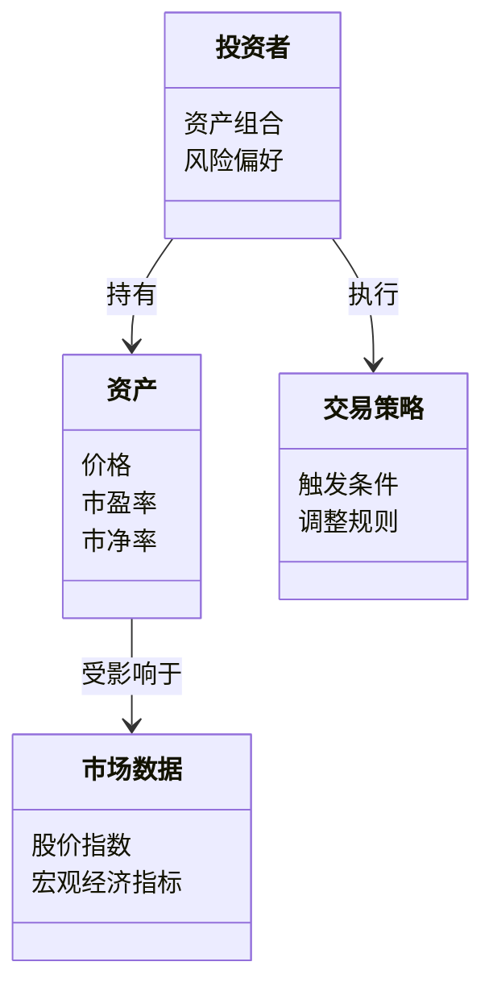
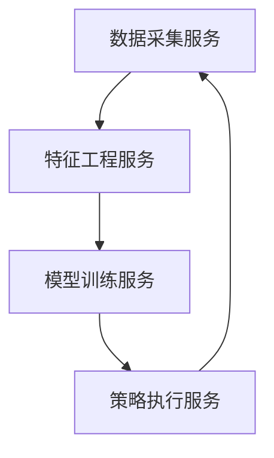

                 


# AI驱动的价值投资策略动态调整

> 关键词：价值投资，AI驱动，策略动态调整，机器学习，金融投资

> 摘要：本文探讨了如何利用人工智能技术优化价值投资策略的动态调整过程，结合金融数据的特点，分析了AI驱动的动态调整策略的核心概念、算法原理和系统架构，并通过具体案例展示了其在实际投资中的应用效果。

---

## 第一部分: AI驱动的价值投资策略动态调整概述

### 第1章: 价值投资与AI驱动的结合

#### 1.1 价值投资的基本概念

价值投资是一种以低于内在价值的价格购买优质资产的投资策略。其核心思想是寻找市场低估的公司，并长期持有，等待其价值回归。传统价值投资依赖于基本面分析，包括财务指标（如市盈率、市净率、ROE等）和行业分析。然而，随着市场的复杂化和数据量的爆炸式增长，传统方法的局限性日益显现，尤其是在应对市场波动和突发事件时，难以快速调整投资策略。

---

#### 1.2 AI技术在金融领域的应用

AI技术在金融领域的应用日益广泛，尤其是在数据处理、模式识别和预测分析方面。机器学习算法可以处理海量非结构化数据（如新闻、社交媒体数据）和结构化数据（如财务报表、市场数据），并从中提取有价值的信号。AI驱动的投资策略能够实时捕捉市场变化，优化投资组合，并动态调整交易策略。

---

#### 1.3 动态调整策略的必要性

传统的价值投资策略往往是静态的，即在初始评估后长期持有标的资产。然而，市场环境是动态变化的，受到宏观经济、政策变化、行业趋势和突发事件的影响。动态调整策略能够根据市场变化和资产表现，实时优化投资组合，降低风险，提高收益。

---

## 第2章: AI驱动的价值投资策略动态调整的核心概念

### 2.1 数据驱动的特征分析

#### 2.1.1 数据来源与特征提取

AI驱动的动态调整策略依赖于高质量的数据输入。数据来源包括：

- **财务数据**：如收入、利润、现金流等。
- **市场数据**：如股价、成交量、市场指数等。
- **文本数据**：如公司公告、新闻报道、社交媒体评论等。
- **外部数据**：如宏观经济指标、行业趋势、政策变化等。

特征提取是将这些数据转化为能够反映资产内在价值和市场走势的特征。例如，可以使用自然语言处理技术从新闻中提取情感指标，或使用统计方法构建市场情绪指数。

---

#### 2.1.2 数据清洗与预处理

数据清洗是确保数据质量和一致性的关键步骤。清洗过程包括：

- 去除缺失值或填补缺失值。
- 处理异常值。
- 标准化或归一化数据。
- 处理重复数据。

预处理后的数据将用于训练和推理。

---

#### 2.1.3 数据特征的可解释性

可解释性是价值投资的重要要求。AI模型需要能够解释其决策背后的逻辑，以便投资者理解调整的原因。例如，可以通过SHAP值或特征重要性评分来解释模型的决策过程。

---

### 2.2 AI算法在策略构建中的应用

#### 2.2.1 机器学习算法的选择与优化

在构建动态调整策略时，选择合适的机器学习算法至关重要。以下是一些常用算法及其应用场景：

- **线性回归**：用于预测资产的未来价格。
- **支持向量机（SVM）**：用于分类问题，如判断资产是否被低估。
- **随机森林**：用于特征重要性分析和风险评估。
- **神经网络**：用于处理非线性关系和复杂模式识别。

---

#### 2.2.2 深度学习模型在投资策略中的应用

深度学习模型（如LSTM、Transformer）在处理时间序列数据和长文本数据方面具有优势。例如，可以使用LSTM预测股票价格，或使用Transformer分析市场情绪。

---

#### 2.2.3 算法的可解释性与稳定性

AI驱动的策略需要具备可解释性和稳定性。可解释性确保投资者能够理解模型的决策逻辑，稳定性则确保模型在市场波动中的表现稳定。

---

### 2.3 动态调整机制的设计

#### 2.3.1 动态调整的触发条件

动态调整的触发条件包括：

- 市场波动超过预设阈值。
- 资产价格偏离内在价值。
- 公司基本面发生变化。

---

#### 2.3.2 调整策略的执行流程

调整策略的执行流程包括：

1. 监测市场和资产数据。
2. 使用AI模型预测市场变化。
3. 根据预测结果调整投资组合。
4. 评估调整效果并优化模型。

---

#### 2.3.3 调整效果的评估与反馈

评估调整效果的关键指标包括收益、风险（如波动率、最大回撤）和交易成本。模型的反馈机制可以基于这些指标优化调整策略。

---

## 第3章: AI驱动的价值投资策略动态调整的算法原理

### 3.1 机器学习算法的核心原理

#### 3.1.1 线性回归模型

线性回归模型用于预测目标变量与多个自变量之间的线性关系。其数学模型为：

$$ y = \beta_0 + \beta_1 x_1 + \beta_2 x_2 + \dots + \beta_n x_n + \epsilon $$

其中，$y$是目标变量，$x_i$是自变量，$\beta_i$是回归系数，$\epsilon$是误差项。

---

#### 3.1.2 支持向量机（SVM）

SVM用于分类问题，其核心思想是将数据映射到高维空间，并在高维空间中找到一个超平面，将数据分为两类。SVM的数学模型为：

$$ \text{目标函数：} \min_{w, b, \xi} \frac{1}{2}||w||^2 + C\sum_{i=1}^n \xi_i $$

$$ \text{约束条件：} y_i (w \cdot x_i + b) \geq 1 - \xi_i $$

其中，$w$是权重向量，$b$是偏置项，$\xi_i$是松弛变量，$C$是惩罚系数。

---

#### 3.1.3 随机森林与集成学习

随机森林是一种基于决策树的集成学习方法。其数学模型可以表示为多个决策树的集成：

$$ f(x) = \text{平均预测值或多数投票} $$

---

### 3.2 深度学习模型的应用

#### 3.2.1 神经网络的基本结构

神经网络的基本结构包括输入层、隐藏层和输出层。其数学模型可以表示为：

$$ y = \sigma(w_2 a_2 + b_2) $$

其中，$a_2$是隐藏层的激活值，$w_2$和$b_2$是权重和偏置，$\sigma$是激活函数。

---

#### 3.2.2 卷积神经网络（CNN）与循环神经网络（RNN）

CNN适用于处理图像数据，而RNN适用于处理序列数据。例如，可以使用LSTM（一种RNN的变体）预测股票价格：

$$ f_t = \text{LSTM}(x_t, f_{t-1}) $$

其中，$x_t$是输入数据，$f_{t-1}$是前一时刻的隐藏状态。

---

#### 3.2.3 Transformer模型在时间序列分析中的应用

Transformer模型通过自注意力机制处理时间序列数据。其数学模型为：

$$ \text{注意力机制：} QK^T \)，其中$Q$和$K$是查询和键的矩阵。

---

### 3.3 动态调整算法的实现

#### 3.3.1 基于强化学习的动态调整

强化学习是一种通过试错机制优化决策的方法。其数学模型可以表示为：

$$ Q(s, a) = r + \gamma \max_{a'} Q(s', a') $$

其中，$s$是状态，$a$是动作，$r$是奖励，$\gamma$是折扣因子。

---

#### 3.3.2 基于反馈机制的自适应调整

自适应调整模型能够根据市场反馈动态调整参数。例如，可以使用在线学习算法更新模型权重：

$$ w_{t+1} = w_t + \eta \nabla L(w_t) $$

其中，$\eta$是学习率，$\nabla L(w_t)$是损失函数的梯度。

---

#### 3.3.3 联合学习与分布式计算

联合学习（如联邦学习）可以在保护数据隐私的前提下，联合多个机构的数据进行模型训练。其数学模型可以表示为：

$$ \theta_{t+1} = \theta_t + \sum_{i=1}^n \eta_i \nabla L_i(\theta_t) $$

其中，$\theta_t$是模型参数，$\eta_i$是学习率，$L_i$是第$i$个机构的损失函数。

---

## 第4章: AI驱动的价值投资策略动态调整的系统架构

### 4.1 系统整体架构设计

系统整体架构包括数据采集模块、特征工程模块、模型训练模块和策略执行模块。其功能流程如下：

1. 数据采集模块：从多个数据源获取数据。
2. 特征工程模块：对数据进行清洗、转换和特征提取。
3. 模型训练模块：基于特征数据训练AI模型。
4. 策略执行模块：根据模型预测结果动态调整投资组合。

---

### 4.2 系统功能设计

#### 4.2.1 领域模型设计

领域模型是系统功能的核心，包括以下实体和关系：

- **实体**：投资者、资产、市场数据、交易策略。
- **关系**：投资者持有资产，资产的价格受市场数据影响，交易策略基于市场数据和资产特征。

领域模型的类图如下：



---

#### 4.2.2 系统架构设计

系统架构采用微服务架构，包括数据采集服务、特征工程服务、模型训练服务和策略执行服务。其架构图如下：



---

#### 4.2.3 系统接口设计

系统接口包括：

- 数据接口：与数据源（如股票交易平台、新闻网站）对接。
- 模型接口：与AI模型（如TensorFlow、PyTorch）对接。
- 策略接口：与交易系统（如券商API）对接。

---

## 第5章: 项目实战

### 5.1 环境安装

为了实现AI驱动的价值投资策略动态调整，需要以下环境：

- **编程语言**：Python 3.8+
- **深度学习框架**：TensorFlow或PyTorch
- **数据处理工具**：Pandas、NumPy
- **可视化工具**：Matplotlib、Seaborn
- **自然语言处理工具**：NLTK或spaCy

---

### 5.2 系统核心实现源代码

以下是基于Python的动态调整策略实现示例代码：

```python
import numpy as np
import pandas as pd
from sklearn.ensemble import RandomForestClassifier
from sklearn.metrics import accuracy_score
from sklearn.model_selection import train_test_split

# 数据加载
data = pd.read_csv('stock_data.csv')

# 特征提取
features = data[['市盈率', '市净率', 'ROE', '营收增长率']]
target = data['低估标志']

# 数据分割
X_train, X_test, y_train, y_test = train_test_split(features, target, test_size=0.2, random_state=42)

# 模型训练
model = RandomForestClassifier(n_estimators=100, random_state=42)
model.fit(X_train, y_train)

# 模型预测
y_pred = model.predict(X_test)

# 模型评估
print('准确率:', accuracy_score(y_test, y_pred))
```

---

### 5.3 代码应用解读与分析

上述代码实现了以下功能：

1. **数据加载**：从CSV文件中读取股票数据。
2. **特征提取**：选择市盈率、市净率、ROE和营收增长率作为特征。
3. **数据分割**：将数据划分为训练集和测试集。
4. **模型训练**：使用随机森林分类器训练模型。
5. **模型预测**：对测试集进行预测。
6. **模型评估**：计算准确率并输出结果。

---

### 5.4 实际案例分析和详细讲解剖析

假设我们有一个包含100只股票的数据集，目标是预测哪些股票被低估。通过上述代码，我们可以训练一个随机森林分类器，并对测试集进行预测。准确率的结果可以帮助我们评估模型的性能。

---

### 5.5 项目小结

通过本项目，我们可以看到AI驱动的价值投资策略动态调整的核心在于数据处理和模型选择。随机森林分类器能够有效地处理多维特征，并提供较高的预测准确率。

---

## 第6章: 最佳实践 tips、小结、注意事项、拓展阅读

### 6.1 小结

本文详细介绍了AI驱动的价值投资策略动态调整的核心概念、算法原理和系统架构，并通过具体案例展示了其在实际投资中的应用效果。AI技术的应用能够显著提高投资策略的动态调整能力，帮助投资者在复杂多变的市场中获得更好的收益。

---

### 6.2 注意事项

1. **数据质量**：数据清洗和预处理是关键步骤，需要仔细处理缺失值和异常值。
2. **模型选择**：不同的算法适用于不同的场景，需要根据具体问题选择合适的模型。
3. **风险管理**：动态调整策略需要考虑交易成本和市场风险。

---

### 6.3 拓展阅读

1. **《机器学习实战》**：学习机器学习算法的实现细节。
2. **《Python机器学习》**：了解如何使用Python进行机器学习项目。
3. **《深度学习》**：掌握深度学习的核心原理和应用。

---

## 作者：AI天才研究院/AI Genius Institute & 禅与计算机程序设计艺术 /Zen And The Art of Computer Programming

