                 


# 《多Agent协作：构建复杂的智能系统》

---

## 关键词：  
多Agent协作、智能系统、分布式计算、协同工作、系统架构

---

## 摘要：  
多Agent协作是一种构建复杂智能系统的核心技术，它通过多个智能体之间的协同工作，实现复杂的任务和目标。本文从多Agent协作的基本概念出发，深入探讨其核心原理、算法、系统架构，并通过实际案例展示如何构建一个多Agent协作系统。文章内容涵盖多Agent协作的背景、核心概念、算法与数学模型、系统设计、项目实战等，为读者提供全面的理论和实践指导。

---

# 第一部分：多Agent协作系统概述

---

## 第1章：多Agent协作系统概述

### 1.1 多Agent协作的定义与背景

#### 1.1.1 什么是Agent

Agent（智能体）是指能够感知环境并采取行动以实现目标的实体。它可以是一个软件程序、机器人或其他智能系统。Agent的核心特征包括：

- **自主性**：能够在没有外部干预的情况下独立运作。
- **反应性**：能够感知环境并实时响应。
- **目标导向性**：通过行动实现特定目标。

#### 1.1.2 多Agent协作的定义

多Agent协作是指多个智能体通过协同工作，共同完成复杂任务的过程。这些智能体可以是独立的，也可以共享信息和资源，以实现更高层次的目标。

#### 1.1.3 多Agent协作的应用背景

随着人工智能和分布式计算的发展，多Agent协作在多个领域得到了广泛应用，例如：

- **分布式计算**：通过多个Agent协同完成复杂的计算任务。
- **机器人协作**：多个机器人协同完成任务，如工业自动化、物流配送等。
- **智能系统设计**：通过多Agent协作构建更复杂的智能系统，如自动驾驶、智能城市等。

### 1.2 多Agent协作的核心概念

#### 1.2.1 Agent的基本属性

- **知识**：Agent对环境和任务的理解。
- **信念**：Agent对世界的认知和假设。
- **意图**：Agent的目标和行动动机。
- **能力**：Agent完成任务的能力。

#### 1.2.2 多Agent协作的特征

- **分布式性**：多个Agent分布在不同的位置或计算资源上。
- **协作性**：Agent之间通过通信和协调完成共同目标。
- **动态性**：环境和任务可能动态变化，Agent需要灵活调整策略。

#### 1.2.3 多Agent协作的边界与外延

多Agent协作的边界包括：

- **协作范围**：Agent之间协作的任务范围。
- **协作方式**：Agent之间的通信和协调机制。
- **协作目标**：最终需要实现的目标。

多Agent协作的外延包括：

- **分布式计算**：通过多个计算节点协同完成任务。
- **协同学习**：多个Agent通过协作学习共同提升性能。
- **自适应性**：系统能够根据环境变化自动调整协作策略。

### 1.3 多Agent协作的重要性和优势

#### 1.3.1 多Agent协作的重要性

- **提高效率**：通过多个Agent协作，可以并行处理任务，提高整体效率。
- **增强鲁棒性**：多个Agent协作可以分散风险，提高系统的容错能力。
- **灵活性**：系统可以根据任务需求动态调整协作方式。

#### 1.3.2 多Agent协作的优势

- **模块化设计**：每个Agent负责特定的任务，便于模块化设计和维护。
- **可扩展性**：可以通过增加更多的Agent来扩展系统的功能。
- **适应性**：系统可以根据环境变化快速调整协作策略。

#### 1.3.3 多Agent协作的挑战

- **通信开销**：多个Agent之间的通信可能带来额外的开销。
- **协调复杂性**：多个Agent协作需要复杂的协调机制。
- **安全性**：Agent之间的协作可能带来安全风险。

### 1.4 本章小结

本章从多Agent协作的基本概念出发，介绍了Agent的基本属性、多Agent协作的特征及其重要性和优势。通过这些内容，读者可以对多Agent协作有一个初步的了解，为后续章节的学习打下基础。

---

# 第二部分：多Agent协作的核心概念与联系

---

## 第2章：多Agent协作的核心概念

### 2.1 多Agent协作的核心原理

#### 2.1.1 Agent的决策机制

Agent的决策机制是多Agent协作的核心，它决定了Agent如何根据环境信息做出决策。常见的决策机制包括：

- **基于规则的决策**：通过预定义的规则进行决策。
- **基于知识的决策**：通过知识库进行推理和决策。
- **基于学习的决策**：通过机器学习算法进行决策。

#### 2.1.2 多Agent协作的通信机制

通信机制是多Agent协作的关键，它决定了Agent之间如何交换信息。常见的通信机制包括：

- **直接通信**：Agent之间直接交换信息。
- **间接通信**：通过中间媒介进行信息交换。
- **广播通信**：所有Agent都可以接收信息。

#### 2.1.3 多Agent协作的协调机制

协调机制是多Agent协作的重要组成部分，它决定了Agent之间如何协作完成任务。常见的协调机制包括：

- **协商协调**：通过协商达成一致。
- **基于角色的协调**：根据角色分配任务。
- **基于任务的协调**：根据任务需求进行协调。

### 2.2 多Agent协作的核心要素

#### 2.2.1 Agent的智能性

Agent的智能性是多Agent协作的核心要素之一，它决定了Agent能否有效地完成任务。智能性包括：

- **感知能力**：Agent能否感知环境。
- **推理能力**：Agent能否根据信息进行推理。
- **学习能力**：Agent能否通过学习提升能力。

#### 2.2.2 Agent的协作性

Agent的协作性是多Agent协作的核心要素之一，它决定了Agent之间能否有效地协作。协作性包括：

- **通信能力**：Agent之间能否有效地交换信息。
- **协调能力**：Agent之间能否有效地协作完成任务。
- **信任能力**：Agent之间能否信任彼此。

#### 2.2.3 Agent的适应性

Agent的适应性是多Agent协作的核心要素之一，它决定了Agent能否根据环境变化动态调整行为。适应性包括：

- **自适应能力**：Agent能否根据环境变化调整行为。
- **容错能力**：Agent能否在故障情况下继续工作。
- **恢复能力**：Agent能否从故障中恢复。

### 2.3 多Agent协作的系统架构

#### 2.3.1 反应式架构

反应式架构是一种基于当前感知信息进行决策的架构。它适用于动态变化的环境，但可能缺乏长期规划。

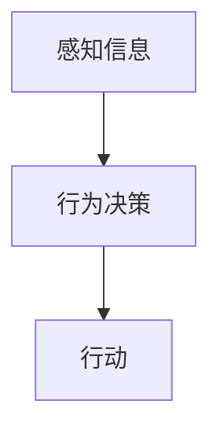

#### 2.3.2 BDI模型

BDI模型是一种基于信念、目标和意图的架构。它适用于需要长期规划和目标导向的任务。

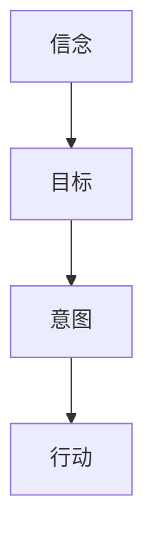

#### 2.3.3 分层架构

分层架构是一种将系统分成多个层次的架构，每一层负责不同的功能。它适用于复杂的任务，能够提高系统的模块化和可维护性。

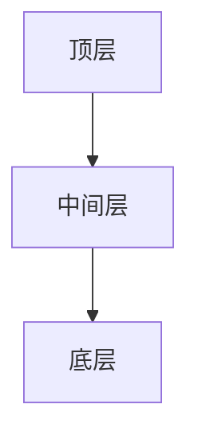

### 2.4 多Agent协作的实体关系图

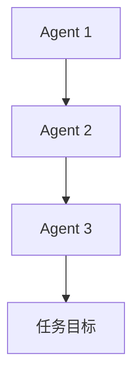

---

## 2.5 本章小结

本章深入探讨了多Agent协作的核心概念，包括Agent的决策机制、通信机制、协调机制，以及多Agent协作的核心要素和系统架构。通过这些内容，读者可以更好地理解多Agent协作的原理和实现方法。

---

# 第三部分：多Agent协作的算法与数学模型

---

## 第3章：多Agent协作的算法与数学模型

### 3.1 多Agent协作的核心算法

#### 3.1.1 分布式计算算法

分布式计算算法是多Agent协作的重要组成部分，它通过多个计算节点协同完成任务。

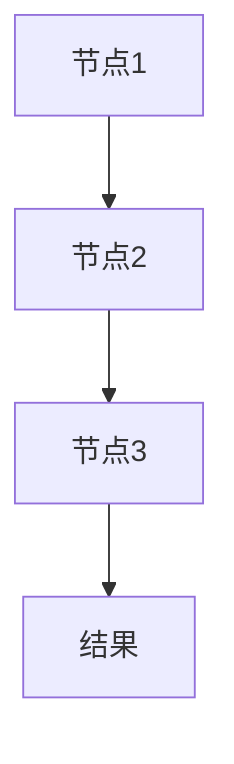

#### 3.1.2 协商算法

协商算法是多Agent协作中的关键算法，它通过协商达成一致。

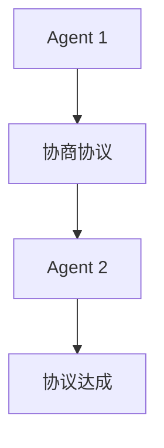

#### 3.1.3 协调算法

协调算法是多Agent协作中的重要算法，它通过协调完成任务。

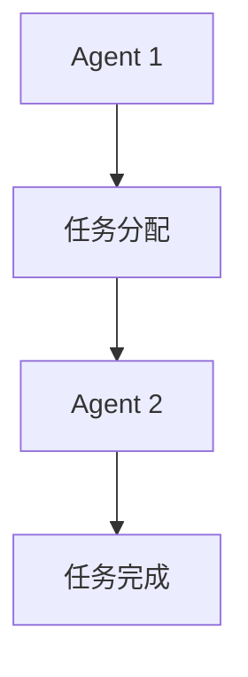

### 3.2 多Agent协作的数学模型

#### 3.2.1 协商模型

协商模型可以通过数学模型描述，例如：

$$ P = \{p_1, p_2, ..., p_n\} $$

其中，\( P \) 表示参与协商的Agent集合，\( p_i \) 表示第 \( i \) 个Agent。

#### 3.2.2 协调模型

协调模型可以通过数学模型描述，例如：

$$ C = \{c_1, c_2, ..., c_m\} $$

其中，\( C \) 表示协调机制，\( c_i \) 表示第 \( i \) 种协调机制。

### 3.3 多Agent协作的数学模型实现

#### 3.3.1 分布式计算模型

分布式计算模型可以通过数学模型描述，例如：

$$ D = \{d_1, d_2, ..., d_k\} $$

其中，\( D \) 表示分布式计算任务，\( d_i \) 表示第 \( i \) 个计算任务。

#### 3.3.2 协商算法实现

协商算法可以通过数学模型实现，例如：

$$ H = \{h_1, h_2, ..., h_l\} $$

其中，\( H \) 表示协商协议，\( h_i \) 表示第 \( i \) 个协商协议。

---

## 3.4 本章小结

本章探讨了多Agent协作的核心算法和数学模型，包括分布式计算算法、协商算法和协调算法。通过数学模型的描述，读者可以更好地理解多Agent协作的实现方法。

---

# 第四部分：多Agent协作的系统架构与设计

---

## 第4章：多Agent协作的系统架构与设计

### 4.1 系统架构设计

#### 4.1.1 系统功能设计

系统功能设计是多Agent协作系统设计的关键部分，它需要明确系统的功能需求和模块划分。

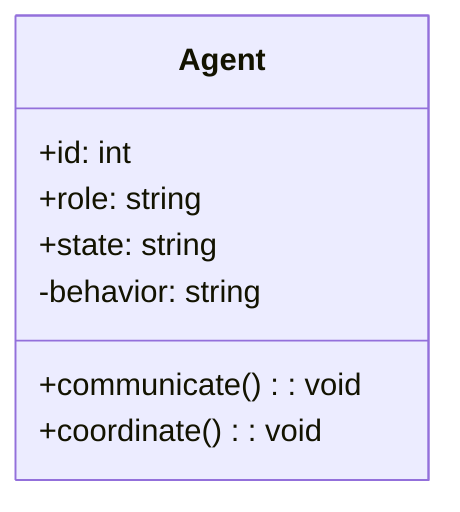

#### 4.1.2 系统架构设计

系统架构设计是多Agent协作系统设计的重要部分，它需要明确系统的架构风格和模块划分。

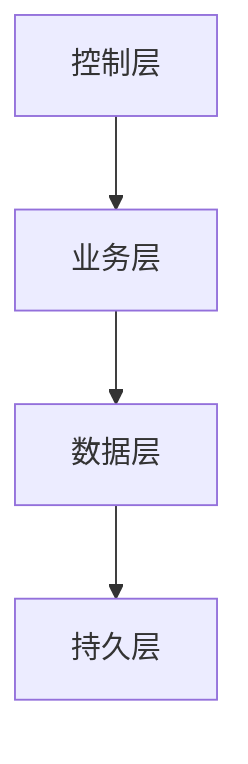

#### 4.1.3 系统接口设计

系统接口设计是多Agent协作系统设计的关键部分，它需要明确系统的接口定义和交互流程。

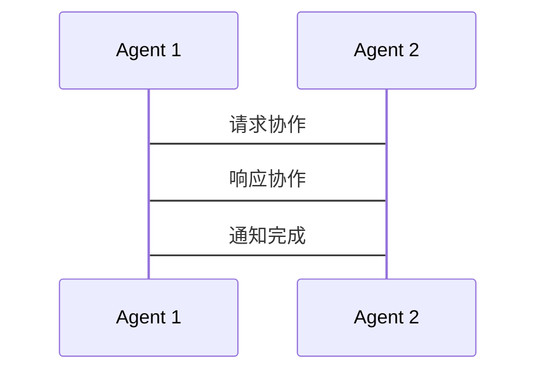

### 4.2 系统交互设计

#### 4.2.1 任务分配

任务分配是多Agent协作系统中的关键环节，它需要明确任务的分配方式和交互流程。

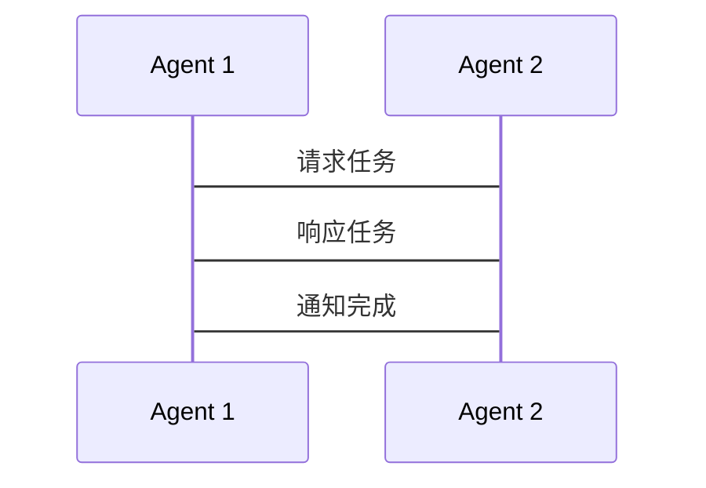

#### 4.2.2 协商与协调

协商与协调是多Agent协作系统中的核心环节，它需要明确协商和协调的交互流程。

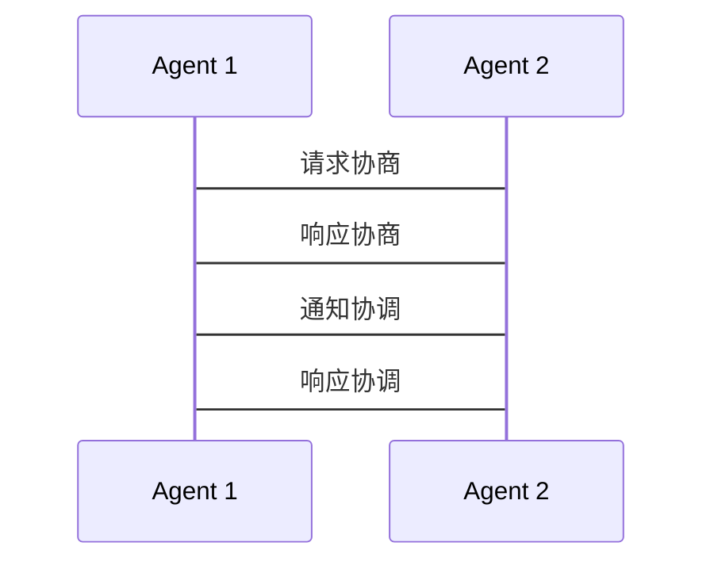

### 4.3 系统实现设计

#### 4.3.1 系统实现框架

系统实现框架是多Agent协作系统设计的重要部分，它需要明确系统的实现框架和模块划分。

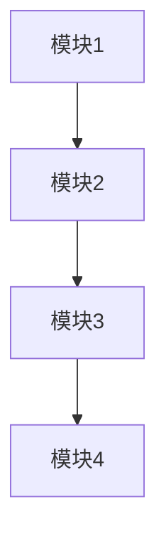

#### 4.3.2 系统实现细节

系统实现细节是多Agent协作系统设计的关键部分，它需要明确系统的实现细节和代码结构。

---

## 4.4 本章小结

本章探讨了多Agent协作的系统架构与设计，包括系统功能设计、系统架构设计、系统接口设计和系统交互设计。通过这些内容，读者可以更好地理解多Agent协作系统的实现方法。

---

# 第五部分：多Agent协作的项目实战

---

## 第5章：多Agent协作的项目实战

### 5.1 项目背景与需求分析

#### 5.1.1 项目背景

本项目旨在通过多Agent协作构建一个智能物流系统，实现多个机器人协同完成货物运输任务。

#### 5.1.2 项目需求

项目需求包括：

- **货物运输**：通过多个机器人协同完成货物运输任务。
- **路径规划**：通过路径规划算法优化货物运输路径。
- **任务分配**：通过任务分配算法合理分配任务。

### 5.2 项目设计与实现

#### 5.2.1 系统功能设计

系统功能设计包括：

- **机器人管理**：管理多个机器人，分配任务。
- **路径规划**：通过算法规划最优路径。
- **任务分配**：通过算法分配任务。

#### 5.2.2 系统实现

系统实现包括：

- **环境安装**：安装必要的开发工具和库。
- **代码实现**：实现多Agent协作的核心功能。
- **功能测试**：测试系统功能，确保系统正常运行。

### 5.3 项目实现细节

#### 5.3.1 环境安装

环境安装包括：

- **Python**：安装Python 3.8及以上版本。
- **库安装**：安装必要的库，例如`ros`、`numpy`等。

#### 5.3.2 代码实现

代码实现包括：

```python
class Agent:
    def __init__(self, id):
        self.id = id
        self.state = 'idle'
    
    def communicate(self, message):
        # 实现通信逻辑
        pass
    
    def coordinate(self, task):
        # 实现协调逻辑
        pass

class MultiAgentSystem:
    def __init__(self, num_agents):
        self.agents = [Agent(i) for i in range(num_agents)]
    
    def start(self):
        for agent in self.agents:
            agent.state = 'active'
    
    def stop(self):
        for agent in self.agents:
            agent.state = 'idle'
```

#### 5.3.3 功能测试

功能测试包括：

- **单个Agent测试**：测试单个Agent的功能。
- **多个Agent测试**：测试多个Agent协作完成任务。
- **系统测试**：测试整个系统的功能。

### 5.4 项目总结

#### 5.4.1 项目成果

项目成果包括：

- **智能物流系统**：实现多个机器人协同完成货物运输任务。
- **路径规划算法**：通过路径规划算法优化货物运输路径。
- **任务分配算法**：通过任务分配算法合理分配任务。

#### 5.4.2 项目经验

项目经验包括：

- **协作的重要性**：多个Agent协作是实现复杂任务的关键。
- **系统设计的重要性**：系统设计是实现复杂任务的基础。
- **算法的重要性**：算法是实现复杂任务的核心。

---

## 5.5 本章小结

本章通过实际案例展示了如何构建一个多Agent协作系统。通过环境安装、代码实现和功能测试，读者可以更好地理解多Agent协作的实现方法。

---

# 第六部分：多Agent协作的总结与扩展阅读

---

## 第6章：总结与扩展阅读

### 6.1 多Agent协作的核心要点

多Agent协作的核心要点包括：

- **Agent的基本属性**：自主性、反应性、目标导向性。
- **多Agent协作的特征**：分布式性、协作性、动态性。
- **多Agent协作的系统架构**：反应式架构、BDI模型、分层架构。

### 6.2 多Agent协作的扩展阅读

扩展阅读包括：

- **经典书籍**：《Multi-Agent Systems: Algorithmic, Complexity Theoretic, and Game Theoretic Foundations》。
- **学术论文**：搜索相关领域的最新研究成果。
- **技术博客**：关注相关技术博客，获取最新技术动态。

### 6.3 多Agent协作的未来发展趋势

多Agent协作的未来发展趋势包括：

- **智能化**：通过人工智能技术提升Agent的智能性。
- **分布式计算**：通过分布式计算技术提升系统的计算能力。
- **自适应性**：通过自适应技术提升系统的灵活性和容错能力。

### 6.4 本章小结

本章总结了多Agent协作的核心要点，并提供了扩展阅读和未来发展趋势。通过这些内容，读者可以更好地理解多Agent协作的实现方法，并为未来的学习和研究打下基础。

---

# 作者：AI天才研究院/AI Genius Institute & 禅与计算机程序设计艺术/Zen And The Art of Computer Programming

---

> 以上是《多Agent协作：构建复杂的智能系统》的技术博客文章的目录大纲和部分正文内容。完整文章将包含更多详细内容，涵盖每一章节的核心概念、算法、数学模型和项目实战等内容，帮助读者全面理解和掌握多Agent协作技术。

