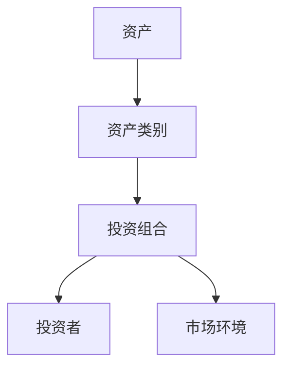
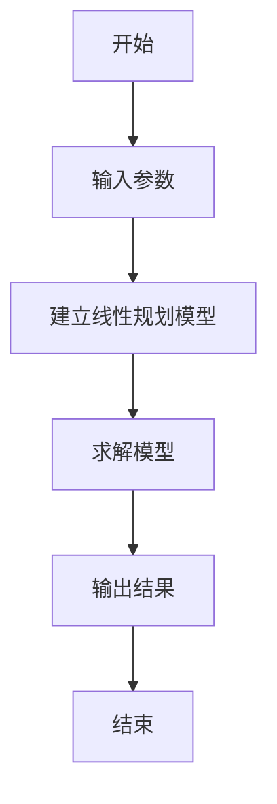
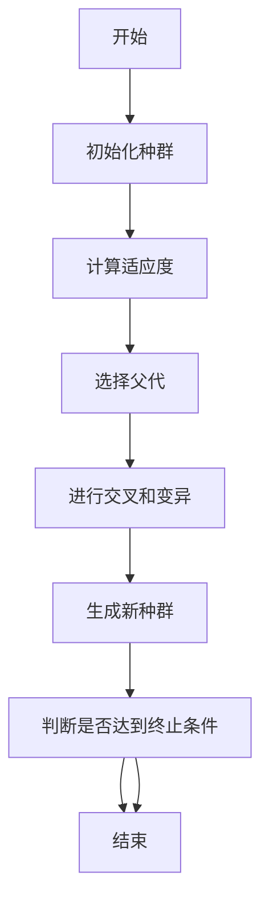
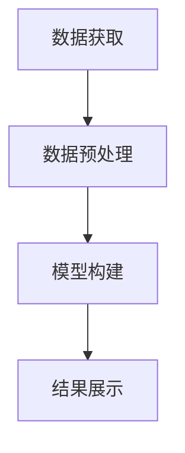
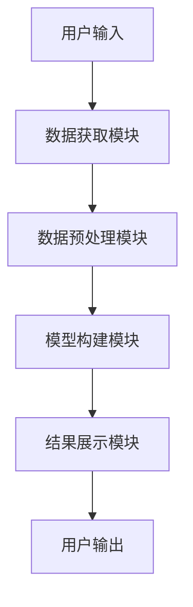

                 


# 开发智能化的资产配置优化模型

**关键词**：资产配置优化，人工智能，投资组合管理，优化算法，风险管理，动态调整

**摘要**：本文详细介绍了开发智能化资产配置优化模型的全过程，从背景分析到系统设计，再到项目实战。文章首先阐述了资产配置的基本概念和智能化的重要性，接着深入探讨了模型的核心概念与联系，详细讲解了多种优化算法的原理与实现，随后分析了系统架构设计，最后通过具体案例展示了项目的实战过程。本文适合对金融工程和人工智能感兴趣的读者阅读。

---

# 第一部分: 资产配置优化模型的背景与概述

## 第1章: 资产配置优化模型概述

### 1.1 资产配置的基本概念

#### 1.1.1 资产配置的定义
资产配置是指将资金分配到不同的资产类别（如股票、债券、房地产等）中，以实现投资目标和风险控制的过程。它是投资组合管理的核心部分。

#### 1.1.2 资产配置的分类
资产配置可以分为以下几类：
- **战略资产配置**：基于长期投资目标确定的资产分配，通常适用于机构投资者。
- **战术资产配置**：根据市场短期变化进行的动态调整，适用于短期投资策略。
- **恒定资产配置**：保持资产权重不变，定期再平衡投资组合。

#### 1.1.3 资产配置的目标与意义
资产配置的目标包括：
- **最大化收益**：在风险可控的前提下，实现投资收益的最大化。
- **风险分散**：通过多样化投资降低组合的整体风险。
- **动态调整**：根据市场变化和个人风险偏好进行实时优化。

### 1.2 智能化资产配置的背景

#### 1.2.1 传统资产配置的局限性
传统资产配置方法存在以下问题：
- **人为因素干扰**：投资决策容易受到情绪影响。
- **数据处理能力有限**：难以处理海量数据和复杂市场环境。
- **反应速度慢**：无法及时捕捉市场变化进行调整。

#### 1.2.2 大数据与人工智能在金融领域的应用
大数据和人工智能技术为资产配置带来了革命性的变化：
- **数据处理能力提升**：利用大数据分析技术处理海量市场数据。
- **预测能力增强**：通过机器学习模型预测市场走势和资产回报。
- **自动化决策**：实现自动化投资策略，提高决策效率。

#### 1.2.3 智能化资产配置的优势
智能化资产配置的优势包括：
- **高效性**：能够快速处理和分析大量数据，提高决策效率。
- **准确性**：通过算法优化，提高资产配置的科学性和准确性。
- **适应性**：能够根据市场变化实时调整配置策略。

### 1.3 资产配置优化模型的现状与发展趋势

#### 1.3.1 当前主流的资产配置方法
目前常见的资产配置方法包括：
- **均值-方差模型**：由Harry Markowitz提出，基于优化理论进行资产配置。
- **风险平价法**：通过平衡不同资产的风险贡献来构建投资组合。
- **因子模型**：利用市场因子（如市值、价值、动量等）进行资产定价和配置。

#### 1.3.2 人工智能在资产配置中的应用现状
人工智能在资产配置中的应用日益广泛，主要体现在：
- **智能投顾**：通过算法为投资者提供个性化的资产配置建议。
- **动态再平衡**：利用算法实时监控市场变化，动态调整投资组合。
- **风险管理**：通过算法识别和预测市场风险，优化资产配置策略。

#### 1.3.3 未来智能化资产配置的发展方向
未来智能化资产配置的发展方向包括：
- **多目标优化**：在追求收益的同时，考虑流动性、税收等多方面因素。
- **实时动态调整**：结合实时市场数据，实现更频繁的资产配置调整。
- **个性化服务**：基于投资者的个性化需求，提供定制化的资产配置方案。

### 1.4 本章小结
本章介绍了资产配置的基本概念、智能化的背景及其在金融领域的应用，分析了当前的主流方法和未来的发展趋势。通过理解这些内容，读者可以更好地把握智能化资产配置模型的核心思想和重要意义。

---

# 第二部分: 资产配置优化模型的核心概念与联系

## 第2章: 资产配置优化模型的核心要素

### 2.1 资产配置优化模型的构成要素

#### 2.1.1 投资目标与风险偏好
投资目标是投资者希望通过资产配置实现的财务目标，而风险偏好则决定了投资者愿意承担的风险水平。

#### 2.1.2 资产类别与权重分配
资产类别包括股票、债券、房地产等，权重分配则是指每类资产在投资组合中的比例。

#### 2.1.3 市场环境与动态变化
市场环境包括宏观经济指标、市场波动性等因素，动态变化则是指市场环境的实时变化对资产配置的影响。

### 2.2 核心概念的属性特征对比

#### 2.2.1 资产类别与风险收益特征对比表

| 资产类别 | 风险 | 收益 |
|----------|------|------|
| 股票     | 高   | 高   |
| 债券     | 中   | 中   |
| 房地产   | 中高 | 高   |
| 现金     | 低   | 低   |

#### 2.2.2 不同优化目标的约束条件对比

| 优化目标         | 约束条件                     |
|------------------|-----------------------------|
| 最大化收益       | 风险不超过一定水平          |
| 最小化风险       | 收益不低于一定水平          |
| 最大化夏普比率   | 无约束条件                  |

### 2.3 实体关系图（ER图）分析

#### 2.3.1 资产配置优化模型的ER图架构



---

## 2.4 本章小结
本章详细分析了资产配置优化模型的核心要素，包括投资目标、风险偏好、资产类别和市场环境，并通过对比表和ER图展示了这些要素之间的关系和属性特征。这为后续的算法设计和系统实现奠定了基础。

---

# 第三部分: 资产配置优化模型的算法原理

## 第3章: 资产配置优化算法概述

### 3.1 常见的优化算法

#### 3.1.1 确定性优化算法
确定性优化算法基于数学模型进行优化，常见的包括：
- **线性规划**：适用于目标函数和约束条件均为线性的情况。
- **非线性规划**：适用于目标函数或约束条件为非线性的情况。

#### 3.1.2 随机优化算法
随机优化算法通过随机采样来寻找最优解，常见的包括：
- **蒙特卡洛方法**：通过随机模拟来估计最优解。
- **随机搜索**：随机选择候选解进行评估，选择最优解。

#### 3.1.3 启发式优化算法
启发式优化算法基于特定规则或经验进行优化，常见的包括：
- **遗传算法**：模拟生物进化过程，通过选择、交叉和变异操作生成新的解。
- **粒子群优化**：模拟鸟群觅食过程，通过粒子的移动寻找最优解。

### 3.2 算法选择与适用场景

#### 3.2.1 线性规划算法
线性规划适用于目标函数和约束条件均为线性的情况，例如简单的资产权重分配问题。

#### 3.2.2 非线性规划算法
非线性规划适用于目标函数或约束条件为非线性的情况，例如复杂的市场预测模型。

#### 3.2.3 遗传算法与粒子群优化
遗传算法和粒子群优化适用于复杂的优化问题，能够处理非线性和多目标优化问题。

### 3.3 算法流程图

#### 3.3.1 线性规划算法流程图



#### 3.3.2 遗传算法流程图



### 3.4 算法实现的数学模型

#### 3.4.1 线性规划模型

目标函数：
$$ \text{最大化：} \sum_{i=1}^{n} w_i r_i $$

约束条件：
$$ \sum_{i=1}^{n} w_i = 1 $$
$$ w_i \geq 0 \quad \forall i $$

其中，\( w_i \) 是资产 \( i \) 的权重，\( r_i \) 是资产 \( i \) 的预期收益。

#### 3.4.2 遗传算法数学模型

适应度函数：
$$ f(x) = \sum_{i=1}^{n} w_i r_i $$

选择操作：
$$ p_i = \frac{f(x_i)}{\sum_{j=1}^{n} f(x_j)} $$

交叉操作：
$$ w_i' = w_i + w_j - w_k $$

变异操作：
$$ w_i' = w_i + \epsilon $$

### 3.5 算法实现的具体步骤

#### 3.5.1 线性规划算法实现步骤

1. **定义目标函数和约束条件**。
2. **选择合适的求解器**。
3. **输入参数并求解模型**。
4. **输出优化结果**。

#### 3.5.2 遗传算法实现步骤

1. **初始化种群**。
2. **计算适应度值**。
3. **选择父代**。
4. **进行交叉和变异操作**。
5. **生成新种群**。
6. **判断是否达到终止条件**。
7. **输出结果**。

### 3.6 本章小结
本章介绍了几种常见的优化算法，分析了它们的适用场景和实现步骤，并通过流程图和数学公式详细讲解了算法的实现过程。这些算法为后续的系统设计和项目实现提供了理论基础。

---

## 3.7 算法实现的代码示例

#### 3.7.1 线性规划算法代码示例（Python）

```python
import numpy as np
from scipy.optimize import linprog

# 定义目标函数系数
c = [-0.1, -0.2, -0.15]

# 定义约束条件
A = [[1, 1, 1]]
b = [1]

# 定义变量范围
bounds = [(0, None), (0, None), (0, None)]

# 求解线性规划问题
result = linprog(c, A=A, b=b, bounds=bounds, method='highside')

# 输出结果
print("优化结果：", result)
print("最优解：", result.x)
```

#### 3.7.2 遗传算法代码示例（Python）

```python
import random

# 定义适应度函数
def fitness(x):
    return sum(w * r for w, r in zip(x, [0.1, 0.2, 0.15]))

# 初始化种群
population = [random.uniform(0, 1) for _ in range(100)]

# 计算适应度值
fitness_values = [fitness(x) for x in population]

# 选择父代
selected = [x for x in population if fitness(x) > max(fitness_values) * 0.8]

# 交叉操作
def crossover(x1, x2):
    return (x1 + x2) / 2

# 变异操作
def mutate(x):
    return x + random.uniform(-0.1, 0.1)

# 生成新种群
new_population = [mutate(crossover(x1, x2)) for x1, x2 in zip(selected[:50], selected[50:])]

# 输出结果
print("最优解：", max(new_population, key=fitness))
```

---

## 3.8 本章小结
通过以上代码示例，读者可以理解如何将优化算法应用于资产配置问题。这些算法的实现需要结合具体的市场数据和投资目标，以达到最优的资产配置效果。

---

# 第四部分: 资产配置优化模型的系统架构设计

## 第4章: 资产配置优化系统的架构设计

### 4.1 系统功能设计

#### 4.1.1 数据获取模块
负责从数据源获取市场数据，包括股票价格、债券收益率等。

#### 4.1.2 数据预处理模块
对获取的市场数据进行清洗和标准化处理，确保数据的准确性和一致性。

#### 4.1.3 模型构建模块
基于预处理后的数据，构建资产配置优化模型，选择合适的优化算法进行求解。

#### 4.1.4 结果展示模块
将优化结果以可视化的方式展示给用户，包括投资组合的收益、风险等指标。

### 4.2 系统架构图



### 4.3 系统接口设计

#### 4.3.1 数据接口
- **输入接口**：市场数据接口。
- **输出接口**：预处理后的数据接口。

#### 4.3.2 模型接口
- **输入接口**：预处理后的数据接口。
- **输出接口**：优化后的资产配置方案接口。

### 4.4 系统交互流程图



### 4.5 本章小结
本章通过系统功能设计和架构图，展示了资产配置优化系统的整体结构。系统包括数据获取、数据预处理、模型构建和结果展示四个主要模块，各模块之间通过接口进行数据交互，确保系统的高效运行。

---

# 第五部分: 资产配置优化模型的项目实战

## 第5章: 资产配置优化模型的实现

### 5.1 项目环境安装

#### 5.1.1 安装Python环境
- 安装Python 3.8或更高版本。
- 安装必要的库：`numpy`, `pandas`, `scipy.optimize`, `matplotlib`.

#### 5.1.2 数据获取工具
- 使用`pandas_datareader`获取股票数据。

### 5.2 系统核心实现

#### 5.2.1 数据预处理代码

```python
import pandas_datareader as pdr

# 获取数据
data = pdr.get_dataYahoo('AAPL', start='2020-01-01', end='2023-12-31')

# 数据清洗
data = data.dropna()
data = data['Adj Close']
data = data.pct_change().cumsum()
```

#### 5.2.2 模型实现代码

```python
import numpy as np
from scipy.optimize import minimize

# 定义目标函数
def objective(weights, returns):
    return -np.sum(weights * returns)

# 定义约束条件
def constraint(weights):
    return np.sum(weights) - 1

# 初始化权重
weights = np.array([1/3, 1/3, 1/3])

# 使用SLSQP求解器
result = minimize(objective, weights, method='SLSQP', constraints={'type': 'eq', 'fun': constraint})

# 输出结果
print("优化后的权重：", result.x)
```

#### 5.2.3 结果展示代码

```python
import matplotlib.pyplot as plt

# 绘制投资组合收益曲线
plt.plot(data, label='原始数据')
plt.plot(result.x * data, label='优化后数据')
plt.legend()
plt.show()
```

### 5.3 项目小结
本章通过具体的代码实现，展示了资产配置优化模型的开发过程。从数据获取到模型构建，再到结果展示，详细讲解了每一步的操作和实现方法。读者可以通过这些代码理解如何将理论应用于实际项目中。

---

# 第六部分: 总结与展望

## 第6章: 总结与展望

### 6.1 本章总结
本文详细介绍了开发智能化资产配置优化模型的全过程，从背景分析到系统设计，再到项目实战。通过理论与实践相结合，展示了如何利用人工智能技术提升资产配置的效率和准确性。

### 6.2 未来展望
随着人工智能技术的不断发展，资产配置优化模型将更加智能化和个性化。未来的研究方向包括：
- **多目标优化**：在收益、风险、流动性等多个目标之间找到平衡点。
- **实时动态调整**：结合实时市场数据，实现更频繁的资产配置调整。
- **个性化服务**：基于投资者的个性化需求，提供定制化的资产配置方案。

### 6.3 最佳实践 Tips
- 在实际应用中，建议结合具体的投资目标和市场环境，选择合适的优化算法。
- 数据预处理是模型实现的关键步骤，确保数据的准确性和完整性。
- 结果展示是模型应用的重要环节，通过可视化工具帮助投资者更好地理解优化结果。

### 6.4 本章小结
通过本文的介绍，读者可以全面了解开发智能化资产配置优化模型的核心思想和实现过程。未来的研究和实践将为这一领域带来更多的创新和发展。

---

# 作者：AI天才研究院/AI Genius Institute & 禅与计算机程序设计艺术 /Zen And The Art of Computer Programming

---

**本文为AI天才研究院（AI Genius Institute）原创，转载请注明出处。**

