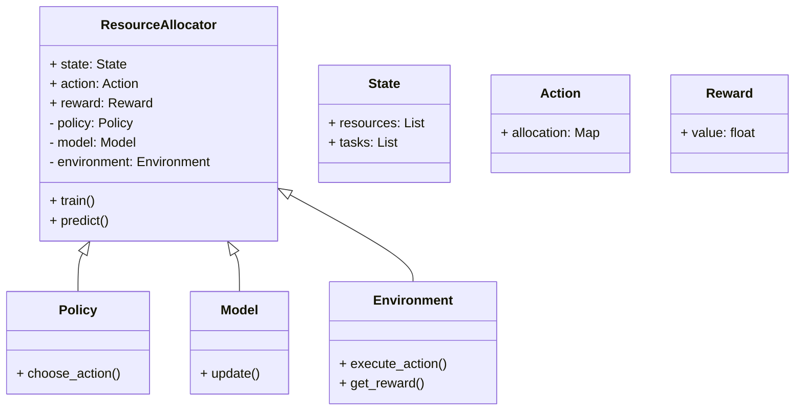
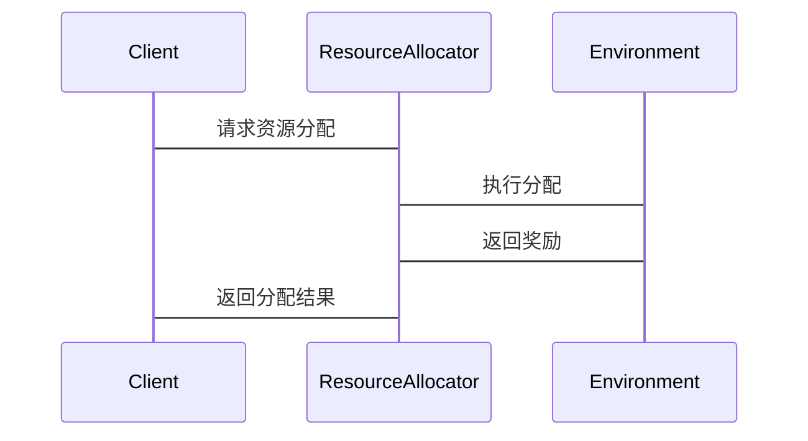

                 


# 强化学习在AI Agent资源分配中的应用

> 关键词：强化学习，AI Agent，资源分配，多智能体系统，深度强化学习

> 摘要：本文探讨了强化学习在AI Agent资源分配中的应用，从基本概念到算法原理，再到系统设计和实际案例，全面解析了强化学习如何解决资源分配问题。

---

# 第一部分: 强化学习与AI Agent资源分配的背景介绍

## 第1章: 强化学习与AI Agent概述

### 1.1 强化学习的基本概念

#### 1.1.1 强化学习的定义与特点
强化学习（Reinforcement Learning, RL）是一种机器学习范式，通过智能体与环境的交互，学习如何做出决策以最大化累积奖励。其特点包括：
- **自主性**：智能体无需监督，自主决策。
- **试错性**：通过不断试错优化策略。
- **延迟反馈**：奖励可能在多个动作后才获得。

#### 1.1.2 强化学习的核心要素：状态、动作、奖励
- **状态（State）**：环境当前的状况，如系统资源使用情况。
- **动作（Action）**：智能体可执行的操作，如分配资源。
- **奖励（Reward）**：对动作的反馈，如资源使用效率提升。

#### 1.1.3 强化学习与监督学习、无监督学习的区别
- **监督学习**：基于标记数据，如分类任务。
- **无监督学习**：发现数据结构，如聚类。
- **强化学习**：通过与环境交互，学习策略。

### 1.2 AI Agent的基本概念

#### 1.2.1 AI Agent的定义与分类
AI Agent是具有感知和决策能力的智能体，分为：
- **反应式Agent**：实时响应环境。
- **认知式Agent**：具备复杂推理能力。

#### 1.2.2 AI Agent的核心功能与应用场景
- **感知环境**：收集资源使用信息。
- **决策制定**：优化资源分配。
- **执行操作**：分配资源到不同任务。

### 1.3 资源分配问题的背景与挑战

#### 1.3.1 资源分配问题的定义
资源分配是在多任务环境下，合理分配有限资源以达到目标，如最大化效率或收益。

#### 1.3.2 资源分配问题在AI Agent中的应用
AI Agent通过强化学习优化资源分配，如云计算资源调度。

#### 1.3.3 资源分配问题的复杂性与挑战
- **动态变化**：资源需求波动。
- **多目标优化**：需平衡效率、公平性等。
- **不确定性**：环境不可预测。

## 第2章: 强化学习在资源分配中的应用背景

### 2.1 资源分配问题的典型场景

#### 2.1.1 云计算资源分配
动态分配计算资源以满足需求，减少浪费。

#### 2.1.2 网络资源分配
优化带宽分配，提升网络性能。

#### 2.1.3 多智能体环境中的资源分配
多个智能体协作分配资源，如分布式系统。

### 2.2 强化学习在资源分配中的优势

#### 2.2.1 强化学习的自主决策能力
无需人工干预，自动优化分配策略。

#### 2.2.2 强化学习的动态适应性
适应环境变化，实时调整分配策略。

#### 2.2.3 强化学习的优化能力
通过最大化累积奖励，优化资源分配效率。

### 2.3 资源分配问题的数学建模

#### 2.3.1 资源分配问题的数学模型
资源分配可建模为优化问题，目标函数为最大化资源利用率，约束条件包括资源限制。

#### 2.3.2 强化学习在资源分配中的目标函数
定义奖励函数，通常为资源利用率或任务完成时间。

#### 2.3.3 资源分配问题的约束条件
如资源限制、任务优先级等。

---

# 第二部分: 强化学习与资源分配的核心概念

## 第3章: 强化学习的核心原理

### 3.1 强化学习的基本原理

#### 3.1.1 状态空间与动作空间
- **状态空间**：所有可能的状态集合。
- **动作空间**：所有可能的动作集合。

#### 3.1.2 奖励函数与价值函数
- **奖励函数**：单个动作的反馈。
- **价值函数**：评估状态-动作对的累积奖励。

#### 3.1.3 策略与价值函数的关系
策略定义动作选择的概率，价值函数评估状态的价值。

### 3.2 常见的强化学习算法

#### 3.2.1 Q-learning算法
基于Q值表，通过更新Q值优化策略。

#### 3.2.2 深度Q网络（DQN）
使用神经网络近似Q值函数，解决高维状态问题。

#### 3.2.3 策略梯度方法
直接优化策略参数，如Actor-Critic架构。

### 3.3 强化学习的核心挑战

#### 3.3.1 稀疏奖励问题
奖励信号稀疏，导致学习困难。

#### 3.3.2 状态空间的高维性
高维状态空间增加计算复杂度。

#### 3.3.3 动作空间的复杂性
复杂的动作空间增加决策难度。

## 第4章: AI Agent与资源分配的关系

### 4.1 AI Agent在资源分配中的角色

#### 4.1.1 AI Agent作为资源分配决策者
基于强化学习算法，制定分配策略。

#### 4.1.2 AI Agent作为资源分配执行者
执行分配决策，如分配计算资源。

#### 4.1.3 AI Agent作为资源分配优化器
通过强化学习优化分配策略，提升效率。

### 4.2 资源分配问题的多智能体建模

#### 4.2.1 多智能体系统中的资源分配
多个智能体协作分配资源，如分布式系统中的资源调度。

#### 4.2.2 多智能体强化学习的挑战
- **通信开销**：智能体间需频繁通信。
- **协调问题**：避免冲突，确保协作。

#### 4.2.3 多智能体强化学习的应用场景
如多机器人协作、分布式计算资源分配。

### 4.3 资源分配问题的数学建模与优化

#### 4.3.1 资源分配问题的数学建模
建立优化模型，明确目标函数和约束条件。

#### 4.3.2 强化学习在资源分配中的优化目标
通常为最大化资源利用率或最小化任务完成时间。

#### 4.3.3 资源分配问题的

---

# 第三部分: 系统分析与架构设计

## 第5章: 资源分配系统的系统分析

### 5.1 问题场景介绍

#### 5.1.1 云计算资源分配
动态分配计算资源，优化资源利用率。

#### 5.1.2 网络资源分配
优化带宽分配，提升网络性能。

### 5.2 项目介绍

#### 5.2.1 项目目标
通过强化学习优化资源分配策略。

#### 5.2.2 项目背景
云计算环境中资源分配问题复杂，需智能优化。

### 5.3 系统功能设计

#### 5.3.1 领域模型（Mermaid 类图）


#### 5.3.2 系统架构设计（Mermaid 架构图）


#### 5.3.3 系统接口设计
- **API接口**：提供训练、预测等功能。
- **通信接口**：智能体与环境交互的接口。

#### 5.3.4 系统交互设计（Mermaid 序列图）


## 第6章: 系统架构设计

### 6.1 项目核心代码实现

#### 6.1.1 环境定义（Python代码）
```python
class ResourceEnvironment:
    def __init__(self, resources, tasks):
        self.resources = resources
        self.tasks = tasks
        self.current_state = self.get_initial_state()

    def get_initial_state(self):
        # 初始化状态，例如资源和任务的初始分配情况
        return {'available_resources': self.resources, 'tasks': self.tasks}

    def execute_action(self, action):
        # 执行动作，更新环境状态
        new_state = self.current_state.copy()
        new_state['allocated_resources'] = action.allocation
        return new_state

    def get_reward(self, action, new_state):
        # 计算奖励，例如资源利用率或任务完成时间
        reward = calculate_reward(new_state)
        return reward
```

#### 6.1.2 强化学习算法实现（Python代码）
```python
class DQN:
    def __init__(self, state_space, action_space):
        self.state_space = state_space
        self.action_space = action_space
        self.model = self.build_model()

    def build_model(self):
        # 构建神经网络模型
        model = Sequential()
        model.add(Dense(64, activation='relu', input_dim=len(self.state_space)))
        model.add(Dense(32, activation='relu'))
        model.add(Dense(len(self.action_space), activation='linear'))
        model.compile(optimizer='adam', loss='mse')
        return model

    def train(self, state, action, reward, next_state):
        # 训练模型
        self.model.fit(state, reward, epochs=10, verbose=0)

    def predict(self, state):
        # 预测动作
        return self.model.predict(state)
```

### 6.2 系统功能模块实现

#### 6.2.1 状态空间与动作空间定义
- **状态空间**：资源使用情况、任务队列。
- **动作空间**：资源分配方案。

#### 6.2.2 策略选择与优化
- **ε-greedy策略**：平衡探索与利用。
- **策略更新**：基于奖励调整动作选择概率。

### 6.3 系统性能优化

#### 6.3.1 并行计算优化
利用多线程或分布式计算加速训练过程。

#### 6.3.2 状态压缩技术
降低状态空间维度，减少计算复杂度。

---

# 第四部分: 项目实战

## 第7章: 强化学习在资源分配中的项目实战

### 7.1 环境安装

#### 7.1.1 安装Python环境
使用Anaconda或virtualenv创建独立环境。

#### 7.1.2 安装依赖库
安装TensorFlow、Keras、OpenAI Gym等库。

### 7.2 系统核心实现

#### 7.2.1 强化学习算法实现
实现DQN算法，用于资源分配决策。

#### 7.2.2 资源分配环境模拟
模拟云计算环境，定义状态、动作和奖励函数。

### 7.3 案例分析

#### 7.3.1 案例背景
云计算环境中，多个任务竞争计算资源。

#### 7.3.2 案例实现
使用强化学习算法优化资源分配策略。

#### 7.3.3 案例结果
展示资源利用率和任务完成时间的提升。

### 7.4 项目总结

#### 7.4.1 项目成果
成功应用强化学习优化资源分配。

#### 7.4.2 经验与教训
总结项目中的经验教训，如算法选择和参数调优。

---

# 第五部分: 最佳实践与总结

## 第8章: 强化学习在资源分配中的最佳实践

### 8.1 最佳实践 Tips

#### 8.1.1 环境建模
准确建模状态和动作空间，影响算法效果。

#### 8.1.2 奖励设计
合理设计奖励函数，引导智能体做出正确决策。

#### 8.1.3 算法选择
根据问题特点选择合适的算法，如DQN适合高维状态。

#### 8.1.4 系统优化
通过并行计算和状态压缩优化系统性能。

### 8.2 小结

#### 8.2.1 全文总结
强化学习有效解决资源分配问题，但需合理建模和算法选择。

#### 8.2.2 未来研究方向
多智能体强化学习、动态资源分配优化等。

## 第9章: 注意事项与拓展阅读

### 9.1 注意事项

#### 9.1.1 算法选择
根据具体问题选择合适的算法。

#### 9.1.2 环境建模
确保状态和动作空间准确反映问题。

#### 9.1.3 系统优化
优化算法和系统架构，提升性能。

### 9.2 拓展阅读

#### 9.2.1 强化学习经典论文
如DQN论文、多智能体强化学习综述。

#### 9.2.2 资源分配相关文献
研究云计算、网络资源分配领域的最新成果。

---

# 作者：AI天才研究院/AI Genius Institute & 禅与计算机程序设计艺术 /Zen And The Art of Computer Programming

---

以上是文章的详细目录和部分正文内容，涵盖了从基础概念到实际应用的各个方面，确保读者能够全面理解强化学习在AI Agent资源分配中的应用。

