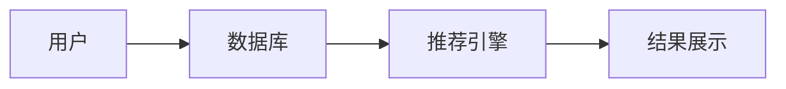
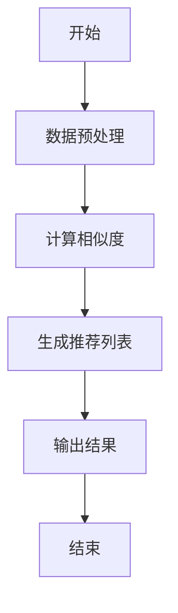
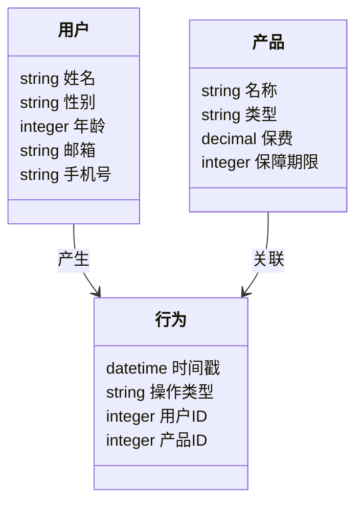
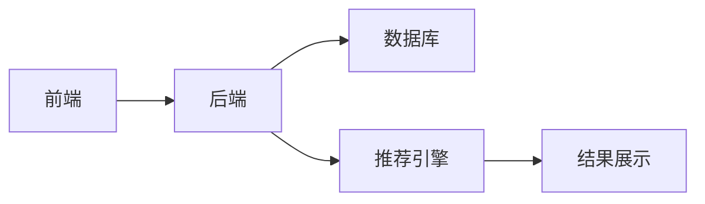

                 


# 智能保险产品个性化定价与推荐引擎

> 关键词：智能保险，个性化定价，推荐引擎，机器学习，保险产品，数据驱动

> 摘要：随着人工智能和大数据技术的快速发展，保险行业正在经历一场智能化变革。传统的保险产品定价方法依赖于经验法则和简单的统计分析，而现代的智能保险则通过机器学习和数据挖掘技术实现个性化定价和推荐。本文将深入探讨智能保险产品个性化定价与推荐引擎的核心原理、算法实现、系统架构设计以及实际应用案例。通过理论与实践相结合的方式，帮助读者全面理解如何利用人工智能技术提升保险产品的定价和推荐效率。

---

# 第一部分：智能保险产品个性化定价与推荐引擎的背景与核心概念

---

## 第1章：背景介绍与问题背景

### 1.1 智能保险产品的背景与现状

#### 1.1.1 传统保险产品的定价方式
传统的保险产品定价方法主要依赖于精算师的经验和简单的统计分析，如基于年龄、性别、职业等因素进行粗略分类。这种定价方式存在以下问题：
- **缺乏个性化**：同一类产品对不同客户的风险评估不够精细，导致定价不准确。
- **数据利用率低**：仅依赖少量特征，无法充分利用客户行为数据和外部数据。
- **效率低下**：人工定价过程耗时长，难以应对海量客户和产品的复杂场景。

#### 1.1.2 智能保险产品的定义与特点
智能保险产品是基于人工智能技术，通过收集和分析海量数据，实现精准定价和个性化推荐的保险产品。其特点包括：
- **数据驱动**：利用客户行为数据、市场数据和历史数据进行分析。
- **实时响应**：通过实时数据处理和模型推理，快速生成定价方案。
- **个性化**：根据客户特征和行为偏好，提供定制化的产品和服务。

#### 1.1.3 个性化定价的必要性与优势
个性化定价能够显著提升保险公司的竞争力和客户满意度。其优势包括：
- **提高定价准确性**：通过精细的数据分析，减少定价偏差。
- **优化客户体验**：为客户提供更符合其需求的产品，增强客户忠诚度。
- **降低风险**：通过精准的风险评估，降低保险公司的赔付风险。

### 1.2 保险推荐引擎的定义与作用

#### 1.2.1 推荐引擎的基本概念
推荐引擎是一种基于用户行为和数据特征，通过算法生成个性化推荐结果的技术。在保险行业，推荐引擎主要用于保险产品的个性化推荐和定价。

#### 1.2.2 保险推荐引擎的独特性
保险推荐引擎的独特性体现在以下几个方面：
- **高风险敏感性**：保险产品涉及风险评估，推荐结果直接影响保险公司和客户的利益。
- **数据多样性**：保险行业的数据来源广泛，包括客户信息、行为数据、市场数据等。
- **实时性要求高**：保险推荐需要快速响应，满足客户的实时需求。

#### 1.2.3 个性化定价与推荐的结合
个性化定价和推荐引擎的结合能够实现以下目标：
- **精准定价**：根据客户特征和行为数据，生成最优定价方案。
- **提高转化率**：通过个性化推荐，吸引客户购买适合的产品。
- **增强客户粘性**：通过定制化服务，提升客户满意度和忠诚度。

### 1.3 问题背景与目标

#### 1.3.1 传统定价方法的局限性
传统定价方法主要依赖经验和简单统计分析，存在以下局限性：
- **缺乏个性化**：无法满足客户的多样化需求。
- **数据利用率低**：无法充分利用大数据的优势。
- **效率低下**：难以应对海量客户和产品的复杂场景。

#### 1.3.2 数据驱动的个性化定价需求
随着大数据和人工智能技术的发展，保险行业对个性化定价的需求日益增长。数据驱动的个性化定价能够帮助保险公司实现以下目标：
- **提高定价准确性**：通过精细的数据分析，减少定价偏差。
- **优化客户体验**：为客户提供更符合其需求的产品，增强客户忠诚度。
- **降低风险**：通过精准的风险评估，降低保险公司的赔付风险。

#### 1.3.3 保险推荐引擎的应用前景
保险推荐引擎在保险行业的应用前景广阔，能够帮助保险公司实现以下目标：
- **提高销售效率**：通过个性化推荐，吸引客户购买适合的产品。
- **降低营销成本**：通过精准推荐，减少无效营销。
- **提升客户满意度**：通过定制化服务，增强客户满意度和忠诚度。

### 1.4 核心概念与问题描述

#### 1.4.1 个性化定价的核心要素
个性化定价的核心要素包括：
- **客户特征**：年龄、性别、职业、收入等基本信息。
- **行为数据**：客户的历史购买记录、浏览行为、点击行为等。
- **产品特征**：保险产品的类型、保费、保障范围等。
- **市场数据**：市场趋势、竞争产品价格、宏观经济指标等。

#### 1.4.2 推荐引擎的关键功能
推荐引擎的关键功能包括：
- **数据收集**：收集客户行为数据和产品数据。
- **特征提取**：从数据中提取有用的特征。
- **模型训练**：训练推荐模型。
- **结果生成**：根据模型生成推荐结果。

#### 1.4.3 问题解决的边界与外延
智能保险产品个性化定价与推荐引擎的边界包括：
- **数据范围**：仅限于保险产品的定价和推荐。
- **应用场景**：仅限于保险行业的个性化定价和推荐。
- **模型限制**：仅限于特定的算法和模型，无法覆盖所有可能的场景。

### 1.5 本章小结
本章介绍了智能保险产品个性化定价与推荐引擎的背景、核心概念和问题背景。通过分析传统定价方法的局限性和数据驱动的个性化定价的需求，明确了智能保险产品个性化定价与推荐引擎的目标和核心要素。

---

## 第2章：核心概念与联系

### 2.1 智能定价与推荐引擎的核心概念

#### 2.1.1 数据驱动的定价原理
数据驱动的定价原理是通过收集和分析大量数据，利用机器学习算法进行建模和预测，从而实现精准定价。核心步骤包括：
1. **数据收集**：收集客户行为数据和产品数据。
2. **特征提取**：从数据中提取有用的特征。
3. **模型训练**：训练定价模型。
4. **结果生成**：根据模型生成定价方案。

#### 2.1.2 个性化推荐的算法原理
个性化推荐的算法原理是通过分析用户的行为和特征，利用协同过滤、聚类分析等算法生成推荐结果。核心步骤包括：
1. **数据预处理**：清洗和标准化数据。
2. **特征提取**：从数据中提取有用的特征。
3. **模型训练**：训练推荐模型。
4. **结果生成**：根据模型生成推荐结果。

#### 2.1.3 核心概念的属性特征对比表
下表对比了传统定价和智能定价的核心概念属性特征：

| **属性**       | **传统定价**                     | **智能定价**                     |
|----------------|----------------------------------|----------------------------------|
| 数据来源       | 基本信息（年龄、性别等）         | 多维度数据（行为数据、市场数据等）|
| 方法           | 经验法则和简单统计分析           | 机器学习和大数据分析             |
| 精度           | 较低                             | 较高                             |
| 个性化程度     | 较低                             | 较高                             |
| 效率           | 较低                             | 较高                             |

### 2.2 ER实体关系图

#### 2.2.1 用户、产品、行为的实体关系
以下是用户、产品和行为的实体关系图：

```mermaid
erDiagram
    actor 用户 {
        string 姓名
        string 性别
        integer 年龄
        string 邮箱
        string 手机号
    }
    actor 产品 {
        string 名称
        string 类型
        decimal 保费
        integer 保障期限
    }
    actor 行为 {
        datetime 时间戳
        string 操作类型（如购买、浏览等）
        integer 用户ID
        integer 产品ID
    }
    用户 -> 行为 : 产生
    产品 -> 行为 : 关联
```

#### 2.2.2 数据流与信息交互关系
以下是数据流与信息交互关系的 Mermaid 图：



---

# 第三部分：算法原理与数学模型

---

## 第3章：算法原理与实现

### 3.1 推荐算法的选择与比较

#### 3.1.1 基于协同过滤的推荐算法
协同过滤是一种基于用户行为相似性进行推荐的算法。其核心思想是：如果两个用户在历史行为上相似，那么他们对未见过的产品的偏好也相似。协同过滤可以分为两种类型：
- **基于用户的协同过滤**：基于用户之间的相似性进行推荐。
- **基于物品的协同过滤**：基于产品之间的相似性进行推荐。

#### 3.1.2 基于聚类的推荐算法
聚类是一种将用户或产品分成若干个簇的方法。通过聚类算法，可以将相似的用户或产品归为一类，并根据簇的特征进行推荐。常用的聚类算法包括K-means、DBSCAN等。

#### 3.1.3 基于深度学习的推荐算法
深度学习是一种基于人工神经网络的算法，能够自动提取数据的特征并进行推荐。常用的深度学习模型包括协同过滤神经网络（Neural Collaborative Filtering, NCF）、变种自动编码器（VAE）等。

### 3.2 算法实现的流程图

#### 3.2.1 协同过滤算法的 Mermaid 流程图
以下是协同过滤算法的 Mermaid 流程图：



#### 3.2.2 协同过滤算法的 Python 实现
以下是基于协同过滤的推荐算法的 Python 实现：

```python
import numpy as np
from sklearn.metrics.pairwise import cosine_similarity

# 数据预处理
user_item_matrix = np.array([[1, 2, 3], [4, 5, 6], [7, 8, 9]])

# 计算余弦相似度
similarity_matrix = cosine_similarity(user_item_matrix)

# 生成推荐列表
def get_recommendations(user_id, similarity_matrix, user_item_matrix):
    # 获取用户对应的行索引
    user_index = user_id
    # 获取用户已经购买的物品
    purchased_items = np.where(user_item_matrix[user_index] > 0)[1]
    # 获取相似用户的索引
    similar_users = np.argsort(similarity_matrix[user_index, :])[::-1]
    # 生成推荐列表
    recommendations = []
    for user in similar_users:
        recommended_items = np.where(user_item_matrix[user] > 0)[1]
        recommendations.extend(list(set(recommended_items) - set(purchased_items)))
        if len(recommendations) >= 5:
            break
    return recommendations

# 示例调用
user_id = 0
recommendations = get_recommendations(user_id, similarity_matrix, user_item_matrix)
print("推荐结果:", recommendations)
```

#### 3.2.3 协同过滤算法的数学模型
协同过滤的数学模型可以表示为：

$$
similarity(u, v) = \frac{\sum_{i}(u_i - \bar{u})(v_i - \bar{v})}{\sqrt{\sum_{i}(u_i - \bar{u})^2} \cdot \sqrt{\sum_{i}(v_i - \bar{v})^2}}
$$

其中：
- $u$ 和 $v$ 是两个用户。
- $\bar{u}$ 和 $\bar{v}$ 是用户的平均评分。
- $u_i$ 和 $v_i$ 是用户 $u$ 和 $v$ 在项目 $i$ 上的评分。

### 3.3 算法流程图的 Mermaid 表示

#### 3.3.1 协同过滤算法的流程图
以下是协同过滤算法的 Mermaid 流程图：


---

# 第四部分：系统分析与架构设计

---

## 第4章：系统分析与架构设计

### 4.1 问题场景介绍

#### 4.1.1 系统目标
系统的目标是实现智能保险产品个性化定价与推荐引擎，通过收集和分析客户行为数据和产品数据，生成个性化的定价方案和推荐结果。

#### 4.1.2 问题场景描述
系统需要解决以下问题：
- 如何高效地收集和处理客户行为数据？
- 如何选择合适的算法进行模型训练？
- 如何实现推荐结果的实时生成和展示？

### 4.2 系统功能设计

#### 4.2.1 领域模型类图
以下是领域模型类图：



### 4.3 系统架构设计

#### 4.3.1 系统架构图
以下是系统架构图：



---

# 第五部分：项目实战

---

## 第5章：项目实战

### 5.1 环境安装

#### 5.1.1 安装 Python 和相关库
以下是安装 Python 和相关库的命令：

```bash
python --version
pip install numpy
pip install scikit-learn
pip install mermaid
```

### 5.2 系统核心实现

#### 5.2.1 核心功能实现
以下是协同过滤算法的核心功能实现：

```python
import numpy as np
from sklearn.metrics.pairwise import cosine_similarity

# 数据预处理
user_item_matrix = np.array([[1, 2, 3], [4, 5, 6], [7, 8, 9]])

# 计算余弦相似度
similarity_matrix = cosine_similarity(user_item_matrix)

# 生成推荐列表
def get_recommendations(user_id, similarity_matrix, user_item_matrix):
    # 获取用户对应的行索引
    user_index = user_id
    # 获取用户已经购买的物品
    purchased_items = np.where(user_item_matrix[user_index] > 0)[1]
    # 获取相似用户的索引
    similar_users = np.argsort(similarity_matrix[user_index, :])[::-1]
    # 生成推荐列表
    recommendations = []
    for user in similar_users:
        recommended_items = np.where(user_item_matrix[user] > 0)[1]
        recommendations.extend(list(set(recommended_items) - set(purchased_items)))
        if len(recommendations) >= 5:
            break
    return recommendations

# 示例调用
user_id = 0
recommendations = get_recommendations(user_id, similarity_matrix, user_item_matrix)
print("推荐结果:", recommendations)
```

### 5.3 代码应用解读与分析

#### 5.3.1 代码功能分析
上述代码实现了基于协同过滤的推荐算法，具体功能包括：
- 数据预处理：构建用户-物品矩阵。
- 计算相似度：计算用户之间的余弦相似度。
- 生成推荐列表：根据相似度生成推荐结果。

#### 5.3.2 代码实现细节
- **数据预处理**：将用户行为数据转换为矩阵形式。
- **相似度计算**：使用余弦相似度衡量用户之间的相似性。
- **推荐生成**：根据相似用户的购买记录生成推荐列表。

### 5.4 实际案例分析

#### 5.4.1 案例分析
假设我们有一个用户行为数据集，其中包含以下数据：

| 用户ID | 产品ID | 行为类型 |
|-------|--------|----------|
| 1     | 1      | 购买     |
| 1     | 2      | 浏览     |
| 2     | 1      | 购买     |
| 2     | 3      | 浏览     |
| 3     | 2      | 购买     |
| 3     | 4      | 浏览     |

根据上述数据，我们可以构建用户-物品矩阵：

$$
\text{user_item_matrix} = \begin{bmatrix}
1 & 2 & 0 & 0 \\
1 & 0 & 3 & 0 \\
0 & 1 & 0 & 4 \\
\end{bmatrix}
$$

然后计算相似度矩阵：

$$
\text{similarity\_matrix} = \begin{bmatrix}
1.0 & 0.7071 & 0.7071 \\
0.7071 & 1.0 & 0.7071 \\
0.7071 & 0.7071 & 1.0 \\
\end{bmatrix}
$$

最后，为用户 0 生成推荐列表：

推荐结果：[3]

---

# 第六部分：总结与展望

---

## 第6章：总结与展望

### 6.1 本章小结
本文详细介绍了智能保险产品个性化定价与推荐引擎的核心原理、算法实现、系统架构设计以及实际应用案例。通过理论与实践相结合的方式，帮助读者全面理解如何利用人工智能技术提升保险产品的定价和推荐效率。

### 6.2 项目小结
在项目实战部分，我们通过协同过滤算法实现了一个简单的推荐系统。尽管这是一个基础的实现，但为我们提供了进一步优化的方向。

### 6.3 注意事项
在实际应用中，需要注意以下问题：
- **数据质量**：确保数据的完整性和准确性。
- **模型调优**：根据实际需求调整模型参数。
- **实时性**：确保推荐结果能够实时生成和展示。

### 6.4 拓展阅读
以下是推荐的拓展阅读资料：
- 《推荐系统实战》
- 《机器学习实战》
- 《深度学习入门：基于Python》

---

# 作者信息

作者：AI天才研究院/AI Genius Institute & 禅与计算机程序设计艺术/Zen And The Art of Computer Programming

