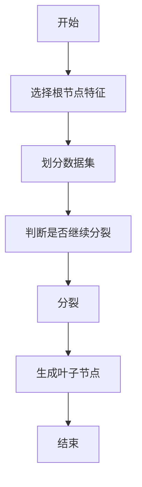
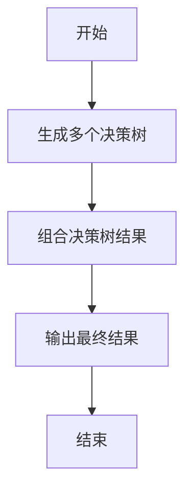
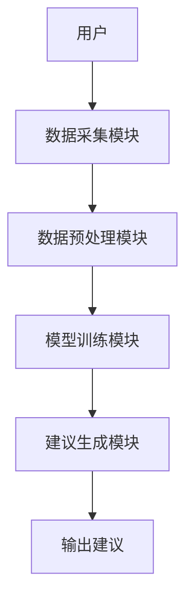
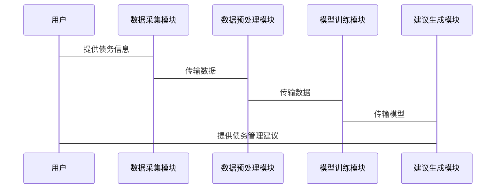
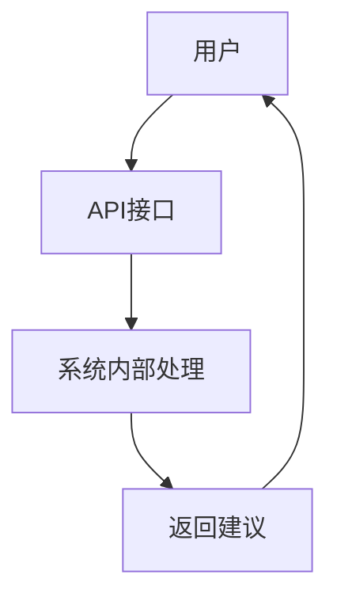

                 


# 智能债务管理建议系统

> 关键词：智能债务管理、人工智能、机器学习、债务风险评估、还款计划优化、智能建议生成

> 摘要：随着经济全球化和金融业务的复杂化，传统的债务管理方式已难以满足现代企业的需求。本文旨在探讨如何利用人工智能技术构建智能债务管理建议系统，通过数据驱动的分析和智能算法的应用，优化债务风险管理流程，提高债务管理的效率和准确性。文章从系统背景、核心概念、算法原理、系统架构设计、项目实战等方面展开详细论述，结合实际案例和代码实现，深入剖析系统的实现细节和应用场景。

---

# 第1章: 智能债务管理建议系统概述

## 1.1 问题背景与目标

### 1.1.1 传统债务管理的痛点
传统债务管理过程中存在以下问题：
- 债务信息分散，难以统一管理。
- 风险评估依赖人工经验，主观性强。
- 还款计划缺乏个性化，难以满足不同债务人的需求。
- 风险预警滞后，可能导致债务危机扩大。

### 1.1.2 智能化债务管理的必要性
随着人工智能技术的发展，智能化债务管理成为可能。通过大数据分析和机器学习算法，可以实现以下目标：
- 实时监控债务状态，提前预警潜在风险。
- 个性化定制还款计划，优化债务结构。
- 提供智能化债务重组建议，降低债务风险。

### 1.1.3 系统的目标与核心价值
智能债务管理建议系统的目标是：
- 提供智能化的债务风险评估服务。
- 自动生成最优的还款计划。
- 提供个性化的债务重组建议。
- 实现债务管理的自动化和智能化。

## 1.2 系统的核心概念与边界

### 1.2.1 智能债务管理的定义
智能债务管理是指利用人工智能技术，通过对债务相关信息的分析和处理，提供智能化的债务管理建议，优化债务结构，降低债务风险。

### 1.2.2 核心要素与概念结构
智能债务管理系统的核心要素包括：
- 债务信息：包括债务金额、债务期限、债务状态等。
- 债务人信息：包括债务人身份、信用评分等。
- 建议方案：包括还款计划、债务重组方案等。

### 1.2.3 系统的边界与外延
智能债务管理系统的边界包括：
- 数据输入：债务信息和债务人信息。
- 数据输出：智能化的债务管理建议。
- 边界外延：与外部数据源（如信用评分机构）的交互。

## 1.3 系统的功能与应用场景

### 1.3.1 债务风险评估
通过分析债务人的信用评分、还款能力等信息，评估债务风险等级。

### 1.3.2 还款计划优化
基于债务人的情况，生成最优的还款计划，降低还款压力。

### 1.3.3 债务重组建议
提供债务重组的多种方案，帮助债务人优化债务结构。

### 1.3.4 系统的适用场景与用户群体
- 适用于企业、个人等多种用户群体。
- 适用于银行、小额贷款公司等金融机构。

## 1.4 本章小结

---

# 第2章: 智能债务管理的核心概念与原理

## 2.1 数据驱动的债务管理

### 2.1.1 数据采集与处理
- 数据来源：债务信息、债务人信息、市场数据等。
- 数据清洗：去除噪声数据，填补缺失值。
- 数据预处理：标准化、归一化等。

### 2.1.2 数据存储与管理
- 数据库设计：使用关系型数据库存储债务信息。
- 数据挖掘：提取有价值的信息，为后续分析提供支持。

## 2.2 基于机器学习的债务分析

### 2.2.1 机器学习在债务管理中的应用
- 监督学习：用于债务分类和预测。
- 非监督学习：用于聚类分析，发现潜在风险。

### 2.2.2 常见算法对比与选择
- 线性回归：用于债务金额预测。
- 支持向量机：用于债务分类。
- 随机森林：用于债务风险评估。

### 2.2.3 模型训练与优化
- 超参数调优：通过网格搜索优化模型性能。
- 模型评估：使用准确率、召回率等指标评估模型效果。

## 2.3 智能建议生成机制

### 2.3.1 建议生成的逻辑框架
- 基于模型预测结果生成建议。
- 根据债务人的实际情况动态调整建议。

### 2.3.2 建议的个性化与动态调整
- 根据债务人的信用评分动态调整建议。
- 根据市场变化实时更新建议。

### 2.3.3 系统的反馈与学习机制
- 系统记录用户的反馈，优化建议生成逻辑。

## 2.4 核心概念的ER实体关系图

```mermaid
er
    entity 债务信息 {
        债务ID
        债务人ID
        债务金额
        债务期限
        债务状态
    }
    entity 债务人信息 {
        债务人ID
        姓名
        身份证号
        联系方式
    }
    entity 建议方案 {
        方案ID
        方案类型
        方案详情
        提出时间
    }
    债务信息 --> 债务人信息
    债务信息 --> 建议方案
```

## 2.5 本章小结

---

# 第3章: 智能债务管理系统的算法原理

## 3.1 算法选择与优化

### 3.1.1 机器学习算法的选择
- 线性回归：用于债务金额预测。
- 支持向量机：用于债务分类。
- 随机森林：用于债务风险评估。

### 3.1.2 算法的调优与评估
- 超参数调优：通过网格搜索优化模型性能。
- 模型评估：使用准确率、召回率等指标评估模型效果。

### 3.1.3 深度学习与传统机器学习的对比
- 深度学习：适用于高维数据的特征提取。
- 传统机器学习：适用于数据量较小的情况。

## 3.2 基于决策树的债务风险评估

### 3.2.1 决策树算法原理
- 决策树是一种基于树状结构的分类模型。
- 使用信息熵作为特征选择的指标。

### 3.2.2 决策树算法实现


### 3.2.3 决策树算法代码实现
```python
from sklearn.tree import DecisionTreeClassifier
from sklearn.model_selection import train_test_split
from sklearn.metrics import accuracy_score

# 数据预处理
X = df.drop('目标变量', axis=1)
y = df['目标变量']

# 划分训练集和测试集
X_train, X_test, y_train, y_test = train_test_split(X, y, test_size=0.2)

# 模型训练
model = DecisionTreeClassifier()
model.fit(X_train, y_train)

# 模型预测
y_pred = model.predict(X_test)

# 模型评估
print("准确率：", accuracy_score(y_test, y_pred))
```

### 3.2.4 决策树算法的优缺点
- 优点：易于理解和解释。
- 缺点：容易过拟合，计算复杂度高。

## 3.3 基于随机森林的债务风险评估

### 3.3.1 随机森林算法原理
- 随机森林是一种集成学习算法。
- 通过组合多个决策树的结果，提高模型的准确性和稳定性。

### 3.3.2 随机森林算法实现


### 3.3.3 随机森林算法代码实现
```python
from sklearn.ensemble import RandomForestClassifier

# 数据预处理
X = df.drop('目标变量', axis=1)
y = df['目标变量']

# 划分训练集和测试集
X_train, X_test, y_train, y_test = train_test_split(X, y, test_size=0.2)

# 模型训练
model = RandomForestClassifier()
model.fit(X_train, y_train)

# 模型预测
y_pred = model.predict(X_test)

# 模型评估
print("准确率：", accuracy_score(y_test, y_pred))
```

### 3.3.4 随机森林算法的优缺点
- 优点：抗过拟合能力强，计算效率高。
- 缺点：模型的可解释性较差。

## 3.4 算法优化与调优

### 3.4.1 超参数调优
- 使用网格搜索（Grid Search）进行超参数调优。
- 通过交叉验证评估模型性能。

### 3.4.2 模型评估指标
- 准确率（Accuracy）
- 召回率（Recall）
- F1分数（F1 Score）
- 混淆矩阵（Confusion Matrix）

## 3.5 本章小结

---

# 第4章: 智能债务管理系统的系统架构设计

## 4.1 系统功能设计

### 4.1.1 数据采集模块
- 数据来源：债务信息、债务人信息、市场数据等。
- 数据清洗：去除噪声数据，填补缺失值。
- 数据预处理：标准化、归一化等。

### 4.1.2 模型训练模块
- 数据特征提取：从数据中提取有用的特征。
- 模型训练：使用机器学习算法训练模型。
- 模型保存：保存训练好的模型，方便后续使用。

### 4.1.3 建议生成模块
- 模型预测：使用训练好的模型对新数据进行预测。
- 建议生成：根据预测结果生成债务管理建议。
- 建议优化：根据实际情况动态调整建议。

## 4.2 系统架构设计

### 4.2.1 系统架构图


### 4.2.2 系统交互流程


## 4.3 系统接口设计

### 4.3.1 API接口设计
- 输入接口：债务信息。
- 输出接口：债务管理建议。

### 4.3.2 接口交互流程


## 4.4 系统实现细节

### 4.4.1 数据库设计
- 数据表设计：债务信息表、债务人信息表、建议方案表。
- 数据库查询：使用SQL查询数据。

### 4.4.2 系统实现代码
```python
# 数据库连接
import sqlite3

conn = sqlite3.connect('debt_management.db')
cursor = conn.cursor()

# 创建表
cursor.execute('''CREATE TABLE debt_info
                 (debt_id INT PRIMARY KEY,
                  debtor_id INT,
                  debt_amount FLOAT,
                  debt_term INT,
                  debt_status TEXT)''')

conn.commit()
conn.close()
```

## 4.5 本章小结

---

# 第5章: 智能债务管理系统的项目实战

## 5.1 环境安装与配置

### 5.1.1 安装Python环境
- 安装Python：从官网下载并安装最新版本的Python。
- 安装Jupyter Notebook：使用pip安装。

### 5.1.2 安装依赖库
- 安装scikit-learn：`pip install scikit-learn`
- 安装pandas：`pip install pandas`
- 安装numpy：`pip install numpy`

## 5.2 系统核心实现

### 5.2.1 数据采集与预处理
```python
import pandas as pd
import numpy as np

# 读取数据
df = pd.read_csv('debt_data.csv')

# 数据清洗
df.dropna(inplace=True)
df['信用评分'] = df['信用评分'].astype(int)
```

### 5.2.2 模型训练与优化
```python
from sklearn.tree import DecisionTreeClassifier
from sklearn.ensemble import RandomForestClassifier
from sklearn.model_selection import train_test_split
from sklearn.metrics import accuracy_score

# 划分训练集和测试集
X = df.drop('目标变量', axis=1)
y = df['目标变量']

X_train, X_test, y_train, y_test = train_test_split(X, y, test_size=0.2)

# 模型训练
model = RandomForestClassifier()
model.fit(X_train, y_train)

# 模型预测
y_pred = model.predict(X_test)

# 模型评估
print("准确率：", accuracy_score(y_test, y_pred))
```

### 5.2.3 建议生成与展示
```python
# 生成建议
def generate_recommendation(debtor_info):
    # 输入债务人信息
    # 输出债务管理建议
    pass

# 展示建议
print("债务管理建议：")
print("1. 还款计划优化")
print("2. 债务重组建议")
```

## 5.3 实际案例分析

### 5.3.1 案例背景
- 债务人：某企业
- 债务金额：100万元
- 债务期限：5年
- 信用评分：60分

### 5.3.2 数据分析
- 债务风险评估：中等风险
- 还款能力评估：较强

### 5.3.3 系统建议
- 还款计划：每月还款20万元，分5期完成。
- 债务重组建议：将债务期限延长至6年，降低每月还款压力。

## 5.4 项目小结

---

# 第6章: 智能债务管理系统的最佳实践

## 6.1 项目经验总结

### 6.1.1 成功经验
- 数据清洗和预处理是关键。
- 算法选择和优化是核心。

### 6.1.2 项目中的挑战
- 数据质量问题。
- 模型过拟合问题。

## 6.2 最佳实践建议

### 6.2.1 数据处理建议
- 确保数据的准确性和完整性。
- 及时更新数据。

### 6.2.2 模型优化建议
- 使用集成学习提高模型的准确性和稳定性。
- 定期更新模型参数。

## 6.3 注意事项

### 6.3.1 数据隐私保护
- 确保债务人信息的安全性。
- 遵守相关法律法规。

### 6.3.2 系统维护
- 定期检查系统运行状态。
- 及时修复系统漏洞。

## 6.4 拓展阅读

### 6.4.1 推荐书籍
- 《机器学习实战》
- 《Python机器学习》

### 6.4.2 推荐博客
- 机器学习每日一练
- 深度学习博客

## 6.5 本章小结

---

# 作者：AI天才研究院/AI Genius Institute & 禅与计算机程序设计艺术 /Zen And The Art of Computer Programming

---

通过以上目录结构，我们可以看到智能债务管理建议系统涵盖了从系统背景到实际应用的各个方面，从理论到实践，从算法原理到系统架构设计，内容非常全面。

