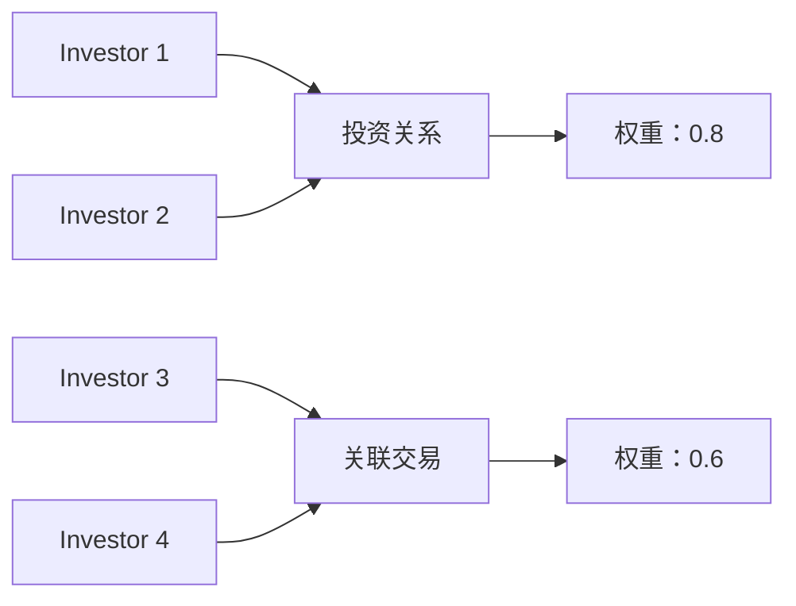
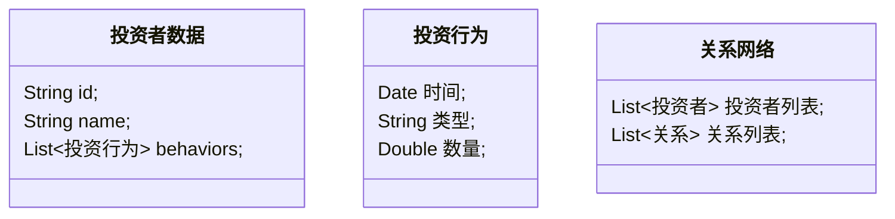

                 


# 智能投资者关系分析平台

> 关键词：投资者关系管理、智能分析、自然语言处理、数据挖掘、机器学习

> 摘要：本文详细介绍了智能投资者关系分析平台的设计与实现，从背景介绍、核心概念、算法原理、系统架构到项目实战，全面解析了如何利用人工智能技术提升投资者关系管理的效率与精度。

---

## 第1章: 投资者关系管理的背景与挑战

### 1.1 投资者关系管理的重要性
#### 1.1.1 投资者关系管理的核心概念
投资者关系管理（Investor Relations Management，IRM）是指企业与投资者之间的信息沟通和关系维护。有效的投资者关系管理可以帮助企业建立良好的市场形象，增强投资者信心，提升股价表现。

#### 1.1.2 数字化时代下的投资者关系管理
随着互联网和大数据技术的发展，投资者关系管理逐渐从传统的面对面沟通转向数字化、智能化的管理方式。企业需要通过多种渠道（如网站、社交媒体、邮件等）与投资者保持联系，并实时分析投资者的情绪和需求。

#### 1.1.3 智能投资者关系分析的必要性
传统的投资者关系管理依赖人工分析，效率低、成本高且容易出错。通过引入人工智能技术，可以实现投资者数据的自动采集、分析和预测，从而提高管理效率和决策准确性。

### 1.2 当前投资者关系管理的主要挑战
#### 1.2.1 数据分散与信息孤岛问题
投资者信息分散在不同的渠道和平台，缺乏统一的整合和分析工具，导致信息利用效率低下。

#### 1.2.2 信息处理的复杂性
投资者数据种类繁多，包括文本、语音、图像等多种形式，如何有效提取和分析这些数据是一个技术挑战。

#### 1.2.3 人工分析的低效性
人工分析需要投入大量时间和人力资源，且容易受到主观因素的影响，难以保证分析结果的客观性和准确性。

### 1.3 智能投资者关系分析平台的解决方案
#### 1.3.1 平台的核心目标
智能投资者关系分析平台旨在通过人工智能技术，实现投资者数据的自动采集、分析和预测，帮助企业在投资者关系管理中提高效率和准确性。

#### 1.3.2 平台的主要功能模块
- 数据采集模块：从多种渠道（如新闻、社交媒体、财报等）采集投资者相关数据。
- 数据清洗模块：对采集的数据进行去噪和标准化处理。
- 情绪分析模块：分析投资者情绪，识别市场 sentiment。
- 关系网络构建模块：构建投资者之间的关系网络，发现潜在关联。
- 行为预测模块：基于历史数据，预测投资者未来的行为。

#### 1.3.3 平台的预期效果
通过智能投资者关系分析平台，企业可以实时掌握投资者动态，优化沟通策略，提升投资者满意度和市场表现。

### 1.4 本章小结
本章介绍了投资者关系管理的重要性及其在数字化时代的挑战，提出了智能投资者关系分析平台的解决方案，并概述了其核心功能模块和预期效果。

---

## 第2章: 智能投资者关系分析的核心概念

### 2.1 投资者情绪分析
#### 2.1.1 情绪分析的定义与作用
情绪分析是指通过自然语言处理技术，分析文本中的情感倾向（如正面、负面、中性）。在投资者关系管理中，情绪分析可以帮助企业了解投资者对公司的看法和态度。

#### 2.1.2 情绪分析的关键特征
- **情感极性**：文本的情感倾向，如正面、负面、中性。
- **情感强度**：情感的强烈程度，如非常正面、稍微负面等。
- **情感类别**：除了极性，还可以进一步细分为愤怒、快乐、悲伤等具体情感类别。

#### 2.1.3 情绪分析的实现方法
- **基于规则的方法**：通过预定义的关键词和规则，判断文本的情感倾向。
- **基于机器学习的方法**：使用训练好的分类模型（如SVM、随机森林）进行情感分类。
- **基于深度学习的方法**：使用循环神经网络（RNN）或变换器（Transformer）模型（如BERT）进行情感分析。

### 2.2 投资者关系网络构建
#### 2.2.1 关系网络的定义与构建方式
关系网络是指投资者之间通过某种关系（如投资关系、关联交易等）形成的网络结构。通过分析这些关系，可以发现投资者之间的潜在联系和影响。

#### 2.2.2 关系网络的核心要素
- **节点**：投资者个体或机构。
- **边**：表示两个投资者之间的关系（如持股关系、关联交易等）。
- **权重**：边的权重表示关系的强度或重要性。

#### 2.2.3 关系网络的分析方法
- **网络可视化**：使用工具（如Gephi）将关系网络可视化，便于观察和分析。
- **社区检测**：通过社区检测算法（如Louvain算法）发现网络中的社区结构，识别具有相似特征的投资者群体。
- **关键节点识别**：通过中心性指标（如度中心性、接近中心性）识别网络中的关键节点，即影响力较大的投资者。

### 2.3 投资者行为预测
#### 2.3.1 行为预测的定义与目标
投资者行为预测是指通过分析投资者的历史行为数据和市场环境，预测其未来的投资行为（如买入、卖出、增持等）。

#### 2.3.2 行为预测的关键因素
- **投资者的历史行为数据**：包括交易记录、持股变化等。
- **市场环境数据**：包括市场指数、行业趋势、宏观经济指标等。
- **投资者情绪**：通过情绪分析获得的投资者情绪数据。

#### 2.3.3 行为预测的实现方法
- **时间序列分析**：使用ARIMA、GARCH等时间序列模型预测投资者行为。
- **机器学习方法**：使用随机森林、XGBoost等模型进行预测。
- **深度学习方法**：使用LSTM、Transformer等模型进行序列预测。

### 2.4 核心概念的联系与对比
#### 2.4.1 核心概念的属性特征对比
| 概念      | 情绪分析         | 关系网络         | 行为预测         |
|-----------|------------------|------------------|------------------|
| 定义      | 文本情感倾向分析   | 投资者关系网络   | 投资者行为预测   |
| 数据输入  | 文本数据         | 投资者关系数据   | 历史行为数据+环境数据 |
| 输出      | 情感极性         | 关系网络结构     | 行为预测结果     |
| 方法      | 机器学习/深度学习 | 社区检测/关键节点识别 | 时间序列分析/机器学习/深度学习 |

#### 2.4.2 实体关系图的构建


---

## 第3章: 情绪分析算法原理

### 3.1 情绪分析的实现方法
#### 3.1.1 基于规则的分类方法
- **规则定义**：预定义情感词汇表（如“满意”、“高兴”为正面词汇，“不满意”、“失望”为负面词汇）。
- **文本匹配**：将文本与情感词汇表进行匹配，判断文本的情感倾向。

#### 3.1.2 基于机器学习的情感分类
- **特征提取**：将文本转换为数值特征（如词袋模型、TF-IDF）。
- **模型训练**：使用分类算法（如SVM、随机森林）训练情感分类模型。
- **模型预测**：输入新的文本，预测其情感倾向。

#### 3.1.3 基于深度学习的情感分析
- **模型选择**：使用预训练的深度学习模型（如BERT、GPT）。
- **微调模型**：在特定任务（如情感分析）上进行微调，提升模型性能。

### 3.2 情绪分析的数学模型
#### 3.2.1 基于贝叶斯定理的分类模型
- **贝叶斯公式**：
  $$ P(y|x) = \frac{P(x|y)P(y)}{P(x)} $$
  其中，$y$ 表示情感类别（如正面、负面），$x$ 表示文本特征。

#### 3.2.2 基于支持向量机的分类模型
- **SVM优势**：在高维空间中寻找最优超平面，实现类别分割。
- **线性SVM**：
  $$ y = \text{sign}(w \cdot x + b) $$
  其中，$w$ 是权重向量，$b$ 是截距。

#### 3.2.3 基于深度学习的模型（如 LSTM）
- **LSTM结构**：
  $$ \text{LSTM}(x_t) = \text{tanh}(g_t) \circ \sigma(f_t) $$
  其中，$g_t$ 是单元状态，$f_t$ 是遗忘门。

### 3.3 情绪分析的 Mermaid 流程图


### 3.4 情绪分析的 Python 代码示例
```python
from sklearn.feature_extraction.text import TfidfVectorizer
from sklearn.svm import SVC
from sklearn.pipeline import Pipeline

# 数据准备
texts = ["公司业绩增长显著，前景看好", "管理层决策失误，股价下跌"]
labels = [1, 0]  # 1表示正面，0表示负面

# 创建管道
pipeline = Pipeline([
    ('tfidf', TfidfVectorizer()),
    ('svm', SVC())
])

# 训练模型
pipeline.fit(texts, labels)

# 预测新文本
new_text = "技术创新领先，行业地位稳固"
print(pipeline.predict([new_text]))
```

---

## 第4章: 投资者行为预测算法

### 4.1 行为预测的实现方法
#### 4.1.1 基于时间序列的预测方法
- **ARIMA模型**：
  $$ \text{ARIMA}(p, d, q) $$
  其中，$p$ 是自回归阶数，$d$ 是差分阶数，$q$ 是移动平均阶数。

#### 4.1.2 基于机器学习的方法
- **XGBoost模型**：
  使用梯度提升树进行预测，适合处理高维数据和非线性关系。

#### 4.1.3 基于深度学习的方法
- **LSTM网络**：
  $$ \text{LSTM}(x_t) = \text{tanh}(g_t) \circ \sigma(f_t) $$
  适合处理时间序列数据，捕捉长期依赖关系。

### 4.2 行为预测的数学模型
#### 4.2.1 时间序列模型
- **ARIMA模型**：
  $$ \phi(B)(1 - B)^d X_t = \theta(B) Z_t $$
  其中，$B$ 是后移算子，$d$ 是差分阶数，$\phi(B)$ 是自回归多项式，$\theta(B)$ 是移动平均多项式。

#### 4.2.2 LSTM模型
- **LSTM单元**：
  $$ f_t = \sigma(W_f \cdot [h_{t-1}, x_t] + b_f) $$
  $$ i_t = \sigma(W_i \cdot [h_{t-1}, x_t] + b_i) $$
  $$ g_t = \tanh(W_g \cdot [h_{t-1}, x_t] + b_g) $$
  $$ h_t = f_t \cdot h_{t-1} + i_t \cdot g_t $$

### 4.3 行为预测的 Mermaid 流程图


### 4.4 行为预测的 Python 代码示例
```python
from sklearn.ensemble import RandomForestClassifier
from sklearn.model_selection import train_test_split

# 数据准备
features = [...]  # 特征数据
labels = [...]     # 行为标签

# 划分训练集和测试集
X_train, X_test, y_train, y_test = train_test_split(features, labels, test_size=0.2)

# 创建模型
model = RandomForestClassifier()

# 训练模型
model.fit(X_train, y_train)

# 预测新数据
new_features = [...]  # 新特征数据
print(model.predict(new_features))
```

---

## 第5章: 智能投资者关系分析系统的架构设计

### 5.1 系统功能设计
#### 5.1.1 领域模型


#### 5.1.2 系统架构
```mermaid
container 投资者关系分析平台 {
    component 数据采集模块 {
        "从多种渠道采集投资者数据"
    }
    component 数据处理模块 {
        "清洗、转换和存储数据"
    }
    component 分析模块 {
        "情绪分析、关系网络构建、行为预测"
    }
    component 用户界面模块 {
        "展示分析结果"
    }
}
```

### 5.2 系统接口设计
#### 5.2.1 API 接口
- **数据采集接口**：`/api/v1/data`，用于接收投资者数据。
- **情绪分析接口**：`/api/v1/sentiment`，返回文本的情感倾向。
- **行为预测接口**：`/api/v1/predict`，返回投资者行为预测结果。

#### 5.2.2 交互流程图
```mermaid
sequenceDiagram
用户 -> 数据采集模块: 发送投资者数据
数据采集模块 -> 数据处理模块: 数据清洗和转换
数据处理模块 -> 分析模块: 提供处理后的数据
分析模块 -> 用户界面模块: 展示分析结果
用户 <- 用户界面模块: 查看分析结果
```

---

## 第6章: 项目实战与应用

### 6.1 环境安装与配置
- **Python版本**：建议使用 Python 3.8 或更高版本。
- **依赖库安装**：
  ```bash
  pip install numpy pandas scikit-learn tensorflow
  ```

### 6.2 核心代码实现
#### 6.2.1 数据采集模块
```python
import requests
import json

def fetch_data(url):
    response = requests.get(url)
    return json.loads(response.text)

url = "https://example.com/investors"
data = fetch_data(url)
print(data)
```

#### 6.2.2 数据处理模块
```python
from sklearn.preprocessing import StandardScaler

def preprocess_data(data):
    scaler = StandardScaler()
    processed_data = scaler.fit_transform(data)
    return processed_data
```

#### 6.2.3 情绪分析模块
```python
from sklearn.svm import SVC

def sentiment_analysis(train_texts, train_labels, test_texts):
    model = SVC()
    model.fit(train_texts, train_labels)
    return model.predict(test_texts)

train_texts = ["公司业绩增长显著，前景看好", "管理层决策失误，股价下跌"]
train_labels = [1, 0]
test_texts = ["技术创新领先，行业地位稳固"]
print(sentiment_analysis(train_texts, train_labels, test_texts))
```

### 6.3 实际案例分析
#### 6.3.1 案例背景
假设我们有一个包含投资者评论的数据集，目标是通过情绪分析模块识别投资者的情绪倾向。

#### 6.3.2 数据分析与解读
- **数据清洗**：去除无关信息，提取有效评论。
- **模型训练**：使用 SVM 模型进行情绪分类。
- **结果分析**：输出每条评论的情绪倾向，帮助企业了解投资者态度。

#### 6.3.3 项目小结
通过实际案例分析，我们可以看到智能投资者关系分析平台在实际应用中的强大能力。结合数据采集、处理和分析模块，企业可以实时掌握投资者动态，优化沟通策略，提升投资者满意度和市场表现。

---

## 第7章: 最佳实践与总结

### 7.1 小结
智能投资者关系分析平台通过整合自然语言处理、数据挖掘和机器学习技术，为企业提供了高效、精准的投资者关系管理工具。通过情绪分析、关系网络构建和行为预测等功能，企业可以更好地理解投资者需求，优化沟通策略，提升市场表现。

### 7.2 注意事项
- **数据隐私**：在处理投资者数据时，需严格遵守数据隐私法规，确保数据安全。
- **模型优化**：根据实际应用效果，不断优化模型参数和算法，提升预测精度。
- **技术支持**：保持技术团队的更新和培训，确保平台的稳定运行和功能扩展。

### 7.3 拓展阅读
- **相关书籍**：
  - 《Python机器学习实战》
  - 《自然语言处理入门》
- **在线资源**：
  - [Kaggle投资者关系分析数据集](https://www.kaggle.com/datasets/investor-relations-management)
  - [GitHub情感分析开源项目](https://github.com/huggingface/transformers)

---

## 作者：AI天才研究院/AI Genius Institute & 禅与计算机程序设计艺术/Zen And The Art of Computer Programming

---

通过以上目录和内容设计，我们可以看到《智能投资者关系分析平台》一书从理论到实践，详细讲解了如何利用人工智能技术提升投资者关系管理的效率与精度。无论是对于企业高管、投资者，还是IT技术人员，这本书都提供了丰富的知识和实用的指导。

