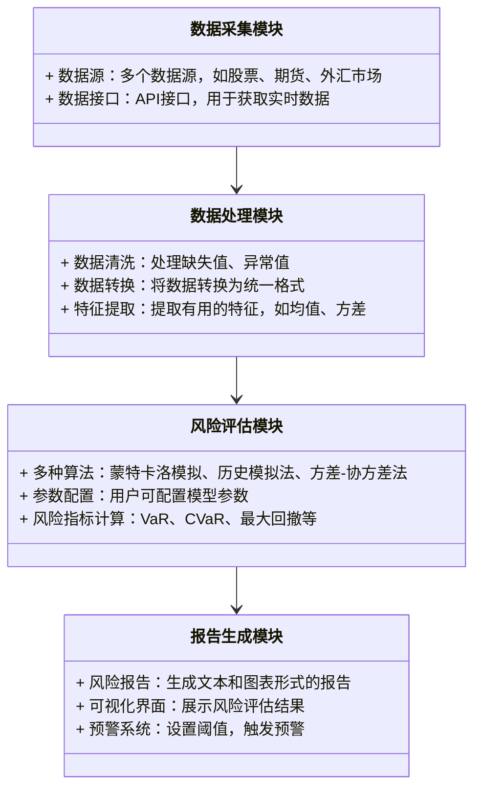
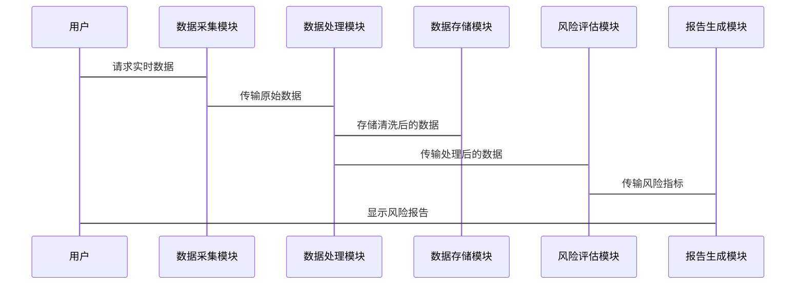

                 


# 《金融衍生品风险管理平台》

## 关键词：风险管理、金融衍生品、VaR、CVaR、蒙特卡洛模拟、系统架构

## 摘要：本文详细探讨了金融衍生品风险管理平台的设计与实现，从核心概念到算法原理，再到系统架构，结合实际案例，深入分析了平台的构建过程和应用价值。

---

# 第一部分: 金融衍生品风险管理平台概述

## 第1章: 金融衍生品风险管理平台的背景与目标

### 1.1 金融衍生品的基本概念

金融衍生品是一种金融工具，其价值来源于基础资产（如股票、债券、商品等）的价格波动。常见的金融衍生品包括期货、期权、掉期和互换等。这些工具广泛应用于风险管理、价格发现和投机套利。

#### 1.1.1 金融衍生品的定义
金融衍生品是基于基础资产的契约，其价值依赖于基础资产的价格变动。衍生品可以是场内交易或场外交易，具有高杠杆、高风险的特点。

#### 1.1.2 金融衍生品的主要类型
- **期货**：标准化合约，约定在未来特定时间以特定价格买卖资产。
- **期权**：买方有权在特定时间以特定价格买入或卖出资产，卖方承担相应义务。
- **掉期**：双方约定在未来交换现金流，通常基于利率或汇率的变动。
- **互换**：双方约定在未来交换资产或现金流，常见的有货币互换和信用互换。

#### 1.1.3 金融衍生品的市场现状
全球衍生品市场庞大，市场规模远超基础资产市场。衍生品的种类繁多，交易方式多样，且不断创新，以满足不同风险管理和投资需求。

### 1.2 风险管理的重要性

风险管理是金融衍生品交易中至关重要的一环，直接关系到金融机构的稳健运营和投资者的收益安全。

#### 1.2.1 风险管理的基本概念
风险管理是指识别、评估和应对潜在风险的过程，旨在降低风险对目标的影响。在金融领域，风险管理尤为重要，因为金融市场的波动性和不确定性较高。

#### 1.2.2 金融衍生品风险管理的特殊性
衍生品的高杠杆性和复杂性使得其风险管理更具挑战性。衍生品的风险不仅包括市场风险，还包括信用风险、流动性风险和操作风险。

#### 1.2.3 风险管理的目标与方法
- **目标**：降低潜在损失，确保资产安全，实现稳健收益。
- **方法**：常用方法包括VaR（Value at Risk）、CVaR（Conditional Value at Risk）等模型，以及压力测试和情景分析。

### 1.3 金融衍生品风险管理平台的必要性

随着衍生品市场的快速发展，传统的风险管理方法已难以应对复杂的市场环境，平台化管理成为必然选择。

#### 1.3.1 传统风险管理的局限性
传统风险管理依赖手工操作，效率低，且难以处理大量复杂数据。此外，传统方法难以实时监控和预测风险，容易导致遗漏或误判。

#### 1.3.2 平台化管理的优势
- **自动化处理**：平台可以实时收集和处理大量数据，快速生成风险评估结果。
- **高效性**：通过自动化算法和模型，提高风险管理的效率和准确性。
- **全面性**：平台可以整合多种风险指标和模型，提供全面的风险评估。

#### 1.3.3 平台的功能与目标
- **数据采集与处理**：实时收集市场数据，进行清洗和预处理。
- **风险评估与预警**：基于多种模型，评估风险并及时预警。
- **决策支持**：提供风险分析报告，辅助决策者制定风险管理策略。

### 1.4 本章小结
本章介绍了金融衍生品的基本概念、风险管理的重要性以及平台化管理的必要性。通过对比传统方法与平台化管理的优劣，明确了风险管理平台的功能和目标，为后续章节的深入分析奠定了基础。

---

# 第二部分: 核心概念与联系

## 第2章: 风险管理的核心概念与联系

### 2.1 风险指标与模型

风险管理中的关键指标和模型是衡量和管理风险的核心工具。

#### 2.1.1 VaR（Value at Risk）

VaR是一种常用的风险指标，表示在一定置信水平下，资产可能遭受的最大损失。

##### VaR的计算方法
VaR可以通过历史模拟法、方差-协方差法或蒙特卡洛模拟法计算。

##### VaR的优缺点
- **优点**：简单直观，易于理解和应用。
- **缺点**：在极端情况下可能低估风险，且假设市场数据符合正态分布。

#### 2.1.2 CVaR（Conditional Value at Risk）

CVaR是VaR的扩展，表示在VaR值超过的情况下，资产的平均损失。

##### CVaR的计算方法
CVaR通常通过优化模型计算，考虑在VaR水平下的条件期望损失。

##### CVaR的优缺点
- **优点**：更全面，考虑了VaR之外的风险。
- **缺点**：计算复杂，需要更多的数据和计算资源。

#### 2.1.3 其他风险指标
- **波动率**：衡量资产价格的波动程度。
- **最大回撤**：衡量资产在一定时间段内的最大损失。

#### 2.1.4 风险指标对比分析

| 风险指标 | VaR | CVaR | 最大回撤 |
|----------|-----|------|----------|
| 定义     | 在置信水平下的最大损失 | 超过VaR的条件期望损失 | 资产在一定时间段内的最大损失 |
| 优缺点   | 简单，但可能低估尾部风险 | 更全面，但计算复杂 | 直观，但不考虑概率 |
| 应用     | 常规风险评估 | 更适合风险厌恶型投资者 | 用于评估策略回撤 |

### 2.2 风险模型的构建

构建有效的风险模型是准确评估风险的关键。

#### 2.2.1 数据收集与处理

数据是模型的基础，需要准确、完整和及时。

##### 数据来源
- 市场数据：包括价格、收益率、波动率等。
- 历史数据：用于回测和验证模型。
- 实时数据：用于实时监控和预测。

##### 数据处理步骤
1. 数据清洗：去除无效数据，处理缺失值。
2. 数据标准化：将数据转换为统一格式，便于模型处理。
3. 数据特征提取：提取有用的特征，如均值、方差等。

#### 2.2.2 模型选择与参数设定

选择合适的模型和参数是模型准确性的关键。

##### 常用模型
- **线性回归模型**：适用于线性关系的预测。
- **时间序列模型**：如ARIMA，适用于预测未来的价格走势。
- **机器学习模型**：如随机森林、神经网络，适用于复杂非线性关系的预测。

##### 模型参数设定
- 确定模型的输入变量，如价格、成交量、市场指数等。
- 设定模型的超参数，如学习率、正则化参数等。

#### 2.2.3 模型验证与优化

验证模型的准确性和稳定性，优化模型性能。

##### 验证方法
- 回测：使用历史数据验证模型的预测能力。
- 分割数据集：将数据分为训练集和测试集，验证模型的泛化能力。
- 指标评估：使用准确率、召回率、F1分数等指标评估模型性能。

##### 优化策略
- 调参：通过网格搜索或随机搜索优化模型参数。
- 特征选择：去除冗余特征，提高模型性能。
- 集成学习：结合多个模型的结果，提高预测准确性。

### 2.3 风险模型的可视化

通过可视化工具，帮助理解风险模型的运行情况。

#### 2.3.1 数据可视化工具

常用的可视化工具包括Matplotlib、Seaborn、Tableau等。

#### 2.3.2 风险分布的可视化

绘制风险分布图，如直方图、QQ图等，帮助识别数据的分布特征。

#### 2.3.3 可视化在决策中的应用

通过可视化工具，直观展示风险评估结果，辅助决策者制定风险管理策略。

### 2.4 本章小结

本章详细介绍了风险管理的核心概念与联系，包括VaR、CVaR等风险指标，风险模型的构建与验证，以及可视化工具的应用。通过对比分析和案例说明，帮助读者理解不同风险指标和模型的特点及其应用场景。

---

# 第三部分: 算法原理与实现

## 第3章: 风险管理算法原理

### 3.1 蒙特卡洛模拟

蒙特卡洛模拟是一种基于随机数的模拟方法，广泛应用于金融风险管理。

#### 3.1.1 蒙特卡洛模拟的基本原理

蒙特卡洛模拟通过生成大量随机数，模拟资产价格的波动，计算风险指标。

##### 算法步骤
1. 确定资产的价格模型，如几何布朗运动。
2. 生成大量随机数，模拟价格路径。
3. 计算每个路径的风险指标，如VaR。
4. 统计结果，计算平均值和置信区间。

#### 3.1.2 蒙特卡洛模拟的实现步骤

使用Python编写蒙特卡洛模拟的代码，实现对资产价格的模拟和风险评估。

##### 代码示例
```python
import numpy as np
import matplotlib.pyplot as plt

# 参数设置
initial_price = 100
volatility = 0.2
time_horizon = 252  # 交易日数
num_simulations = 10000

# 生成随机数
np.random.seed(42)
random_numbers = np.random.standard_normal((time_horizon, num_simulations))

# 计算价格路径
drift = 0  # 假设无漂移
prices = initial_price * np.exp((drift - 0.5 * volatility**2) * time_horizon + volatility * random_numbers)
```

#### 3.1.3 蒙特卡洛模拟的优缺点

- **优点**：能够处理复杂的非线性问题，适合大数据场景。
- **缺点**：计算量大，需要大量计算资源，结果具有随机性。

### 3.2 历史模拟法

历史模拟法基于历史数据，计算资产价格的波动情况。

#### 3.2.1 历史模拟法的基本原理

通过分析历史数据，计算资产价格的变化情况，评估风险指标。

##### 算法步骤
1. 收集历史价格数据。
2. 计算收益率的分布。
3. 根据历史收益率，模拟价格变化。
4. 计算风险指标，如VaR。

#### 3.2.2 历史模拟法的实现步骤

使用Python编写历史模拟法的代码，实现对风险指标的计算。

##### 代码示例
```python
import pandas as pd
import numpy as np

# 数据加载
data = pd.read_csv('historical_prices.csv')
returns = data.pct_change().dropna()

# 计算VaR
def calculate_var(returns, confidence_level=0.95):
    sorted_returns = sorted(returns)
    var_index = int(len(sorted_returns) * (1 - confidence_level))
    var = sorted_returns[var_index]
    return var

var_result = calculate_var(returns)
print(f"VaR at {confidence_level} confidence level: {var_result}")
```

#### 3.2.3 历史模拟法的优缺点

- **优点**：简单直观，不需要复杂的模型。
- **缺点**：依赖历史数据，可能无法准确预测未来的极端情况。

### 3.3 方差-协方差法

方差-协方差法基于资产的波动性和相关性，计算风险指标。

#### 3.3.1 方差-协方差法的基本原理

通过计算资产的方差和协方差矩阵，评估资产组合的风险。

##### 算法步骤
1. 计算资产的收益率。
2. 计算收益率的方差和协方差矩阵。
3. 计算组合的风险值，如VaR。

#### 3.3.2 方差-协方差法的实现步骤

使用Python编写方差-协方差法的代码，实现对风险指标的计算。

##### 代码示例
```python
import numpy as np

# 收益率矩阵
returns_matrix = np.array([[0.05, 0.03, -0.01],
                            [0.02, 0.04, 0.06],
                            [-0.03, -0.02, 0.05]])

# 计算协方差矩阵
covariance_matrix = np.cov(returns_matrix, rowvar=False)

# 计算组合VaR
# 假设组合权重相等
weights = np.array([1/3, 1/3, 1/3])
portfolio_variance = np.dot(weights.T, np.dot(covariance_matrix, weights))
portfolio_volatility = np.sqrt(portfolio_variance)
```

#### 3.3.3 方差-协方差法的优缺点

- **优点**：计算简单，适合处理小规模数据。
- **缺点**：假设资产收益率服从正态分布，可能无法准确反映实际市场情况。

### 3.4 算法的比较与选择

选择合适的算法需要考虑数据规模、模型复杂性和计算资源等因素。

#### 3.4.1 不同算法的对比分析

| 算法 | 蒙特卡洛模拟 | 历史模拟法 | 方差-协方差法 |
|------|--------------|------------|---------------|
| 适用场景 | 大规模复杂问题 | 历史数据充足 | 小规模线性关系 |
| 计算复杂度 | 高 | 中 | 低 |
| 依赖假设 | 资产价格随机游走 | 历史数据准确 | 正态分布 |

#### 3.4.2 算法选择的影响因素
- 数据规模：大规模数据适合蒙特卡洛模拟，小规模数据适合方差-协方差法。
- 模型复杂性：复杂模型适合蒙特卡洛模拟，简单模型适合方差-协方差法。
- 计算资源：计算资源充足时适合蒙特卡洛模拟，资源有限时适合历史模拟法。

#### 3.4.3 算法优化的策略
- **并行计算**：利用多核处理器或分布式计算加速蒙特卡洛模拟。
- **混合方法**：结合多种算法，提高计算效率和准确性。

### 3.5 本章小结

本章详细介绍了三种常用的风险管理算法：蒙特卡洛模拟、历史模拟法和方差-协方差法。通过对比分析和代码示例，帮助读者理解每种算法的实现步骤和适用场景，为后续章节的系统设计和实现奠定了基础。

---

# 第四部分: 系统分析与架构设计

## 第4章: 系统分析与架构设计

### 4.1 问题场景介绍

金融衍生品风险管理平台需要实时监控和评估风险，支持多用户同时使用，处理大量数据。

#### 4.1.1 问题背景
金融机构在衍生品交易中面临复杂的市场风险，需要实时监控和评估风险，确保交易安全。

#### 4.1.2 问题描述
- 实时监控：需要实时获取市场数据，计算风险指标。
- 多用户支持：支持多个用户同时访问平台，进行风险评估和管理。
- 高效处理：需要快速处理大量数据，及时生成风险报告。

### 4.2 项目介绍

金融衍生品风险管理平台旨在帮助金融机构实时监控和管理衍生品交易中的风险，提高风险管理效率和准确性。

#### 4.2.1 项目目标
- 实现实时数据采集与处理。
- 提供多种风险评估模型，支持用户选择和配置。
- 自动生成风险报告，提供决策支持。

#### 4.2.2 项目范围
- 数据采集：从多个数据源获取实时市场数据。
- 数据处理：清洗、转换和存储数据。
- 风险评估：基于多种算法，计算VaR、CVaR等风险指标。
- 报告生成：生成可视化报告，支持用户决策。

### 4.3 系统功能设计

系统功能设计包括数据采集、处理、评估、报告生成和用户界面等模块。

#### 4.3.1 领域模型（Mermaid 类图）



### 4.4 系统架构设计

系统架构设计采用分层架构，包括数据层、业务逻辑层和表现层。

#### 4.4.1 系统架构图（Mermaid 架构图）


#### 4.4.2 系统接口设计

系统接口包括数据接口、用户界面和API接口。

##### 数据接口
- 数据采集模块通过API接口获取实时数据。
- 数据处理模块将处理后的数据存储到数据库。

##### 用户界面
- 提供可视化界面，用户可以配置模型参数，查看风险报告。
- 提供预警界面，用户可以设置预警阈值，接收预警通知。

##### API接口
- 提供RESTful API，供其他系统调用风险评估结果。
- 支持批量处理，提供批量数据接口。

### 4.5 系统交互流程（Mermaid 序列图）



### 4.6 本章小结

本章详细介绍了金融衍生品风险管理平台的系统分析与架构设计，包括系统功能模块、架构图、接口设计和交互流程。通过分层架构和模块化设计，确保系统的高效性和可扩展性，为后续的项目实现奠定了坚实的基础。

---

# 第五部分: 项目实战

## 第5章: 项目实战

### 5.1 环境安装与配置

#### 5.1.1 环境需求
- **操作系统**：Windows、Linux或macOS。
- **Python版本**：建议使用Python 3.6以上。
- **依赖库**：安装numpy、pandas、matplotlib、scikit-learn、mermaid等。

##### 安装依赖
```bash
pip install numpy pandas matplotlib scikit-learn mermaid
```

### 5.2 系统核心实现源代码

#### 5.2.1 数据采集模块

```python
import requests
import json

def get_realtime_data(ticker):
    url = f"https://api.example.com/stock/{ticker}"
    response = requests.get(url)
    data = json.loads(response.text)
    return data['price'], data['volume']
```

#### 5.2.2 数据处理模块

```python
import pandas as pd

def process_data(prices, volumes):
    df = pd.DataFrame({'prices': prices, 'volumes': volumes})
    df['returns'] = df['prices'].pct_change()
    return df
```

#### 5.2.3 风险评估模块

```python
from sklearn.metrics import mean_squared_error

def calculate_var(returns, confidence_level=0.95):
    sorted_returns = sorted(returns)
    var_index = int(len(sorted_returns) * (1 - confidence_level))
    var = sorted_returns[var_index]
    return var

def backtest_model(actual_returns, predicted_returns):
    mse = mean_squared_error(actual_returns, predicted_returns)
    return mse
```

#### 5.2.4 报告生成模块

```python
import matplotlib.pyplot as plt

def generate_report(var_value, cvar_value):
    plt.figure(figsize=(10, 6))
    plt.bar(['VaR', 'CVaR'], [var_value, cvar_value])
    plt.title('Risk Assessment Report')
    plt.show()
```

### 5.3 代码应用解读与分析

#### 5.3.1 数据采集模块解读
数据采集模块通过API接口获取实时数据，包括价格和成交量。数据获取后，传输到数据处理模块进行清洗和转换。

#### 5.3.2 数据处理模块解读
数据处理模块将原始数据转换为统一格式，计算收益率，为风险评估模块提供输入数据。

#### 5.3.3 风险评估模块解读
风险评估模块基于历史模拟法计算VaR值，并通过回测验证模型的准确性。回测结果用于优化模型参数，提高风险评估的准确性。

#### 5.3.4 报告生成模块解读
报告生成模块将风险评估结果可视化，生成图表和文本报告，帮助用户直观理解风险情况。同时，提供预警功能，当风险指标超过阈值时，触发预警通知。

### 5.4 实际案例分析和详细讲解剖析

#### 5.4.1 案例背景
某金融机构投资于股票指数期货，需要实时监控和评估市场风险，确保投资组合的安全。

#### 5.4.2 数据准备
收集过去一年的股票指数期货价格数据，计算收益率，为风险评估提供输入。

#### 5.4.3 模型选择
选择历史模拟法计算VaR值，通过回测验证模型的准确性。

#### 5.4.4 实施步骤
1. 通过API接口获取实时价格数据。
2. 数据处理模块清洗和转换数据，计算收益率。
3. 风险评估模块基于历史模拟法计算VaR值。
4. 报告生成模块生成风险报告，显示VaR和CVaR值。

#### 5.4.5 结果分析
通过平台生成的风险报告，发现VaR值为5%的分位数，CVaR值为超过VaR的条件期望损失。报告还提供了可视化图表，帮助用户直观理解风险情况。

### 5.5 项目小结

本章通过实际案例详细讲解了金融衍生品风险管理平台的实现过程，从环境配置到代码实现，再到案例分析，帮助读者掌握平台的核心功能和实际应用。

---

# 第六部分: 最佳实践和小结

## 第6章: 最佳实践和小结

### 6.1 最佳实践

#### 6.1.1 数据质量管理
- 确保数据的准确性和完整性，定期进行数据清洗和预处理。
- 使用数据增强技术，提高模型的泛化能力。

#### 6.1.2 模型优化策略
- 结合多种算法，提高模型的准确性和鲁棒性。
- 使用超参数优化技术，如网格搜索和随机搜索，提高模型性能。

#### 6.1.3 系统安全性
- 实施严格的访问控制，确保数据和系统的安全性。
- 定期进行系统备份和恢复测试，防止数据丢失和系统崩溃。

#### 6.1.4 用户培训与支持
- 提供详细的用户手册和在线帮助，指导用户使用平台功能。
- 定期举办培训和研讨会，提高用户的使用技能和风险管理能力。

### 6.2 小结

金融衍生品风险管理平台是现代金融风险管理的重要工具，通过自动化处理和智能化分析，帮助金融机构有效降低风险，提高决策效率。本文章从背景介绍、核心概念、算法原理、系统架构到项目实战，全面详细地探讨了平台的构建与应用。通过最佳实践的总结，为读者提供了宝贵的实施经验和优化策略。

### 6.3 注意事项

- **数据隐私**：确保数据的隐私和合规性，遵守相关法律法规。
- **系统维护**：定期更新系统和模型，适应市场变化和新技术的发展。
- **用户体验**：优化用户界面和交互流程，提高用户体验和满意度。

### 6.4 拓展阅读

- **风险管理领域的最新研究**：阅读学术论文和行业报告，了解最新的研究成果和趋势。
- **金融衍生品市场的动态**：关注市场动态和新产品，及时调整和优化风险管理策略。
- **技术工具的创新**：学习新技术和工具，如人工智能、大数据分析等，提高风险管理的效率和准确性。

---

# 结语

金融衍生品风险管理平台的建设是一个复杂而重要的任务，需要综合运用风险管理知识、算法原理和系统设计技术。通过本文的详细讲解，读者可以掌握平台的核心技术和实际应用，为金融衍生品市场的稳健发展提供有力支持。

---

# 作者：AI天才研究院 & 禅与计算机程序设计艺术

