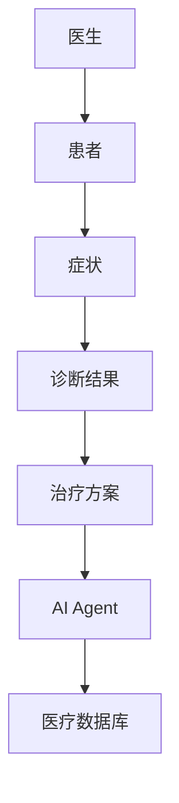
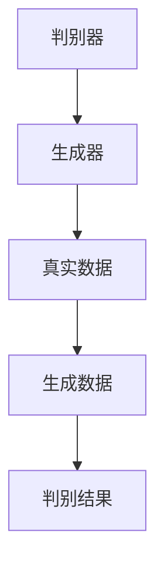
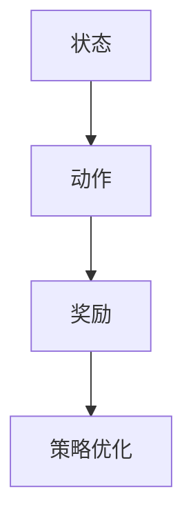
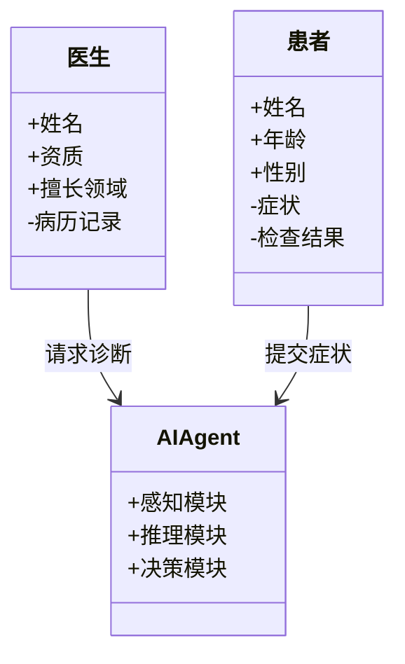
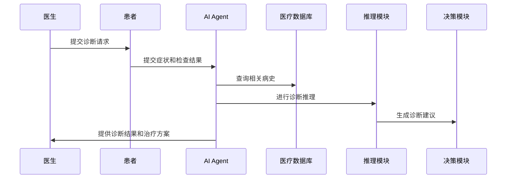

                 


# AI Agent在智能医疗诊断中的角色

> 关键词：AI Agent，智能医疗诊断，医疗AI，诊断推理，强化学习

> 摘要：AI Agent在智能医疗诊断中扮演着越来越重要的角色。本文将从AI Agent的基本概念出发，探讨其在医疗诊断中的应用场景、技术原理和系统架构设计，通过具体案例分析，展示AI Agent如何提升医疗诊断的效率和准确性。文章最后总结了AI Agent在医疗诊断中的优势与挑战，并展望了其未来的发展方向。

---

## 第1章: AI Agent与智能医疗诊断概述

### 1.1 AI Agent的基本概念

#### 1.1.1 AI Agent的定义
AI Agent（人工智能代理）是指能够感知环境、自主决策并执行任务的智能体。它能够通过传感器获取信息，利用算法进行分析和推理，并根据结果采取相应行动。AI Agent的核心在于其智能性和自主性，能够在复杂环境中完成特定任务。

#### 1.1.2 AI Agent的核心特征
- **自主性**：能够自主决策，无需外部干预。
- **反应性**：能够实时感知环境变化并做出反应。
- **学习能力**：通过数据和经验不断优化自身的性能。
- **交互能力**：能够与人类或其他系统进行有效沟通。

#### 1.1.3 AI Agent在医疗领域的应用前景
医疗领域对高效、精准的诊断需求日益增长。AI Agent通过整合大量医疗数据，能够辅助医生快速诊断疾病，优化治疗方案，提升医疗效率。

---

### 1.2 智能医疗诊断的现状与挑战

#### 1.2.1 传统医疗诊断的局限性
传统医疗诊断主要依赖医生的经验和知识，存在以下问题：
- **效率低**：医生需要手动分析大量数据，耗时且容易出错。
- **主观性强**：诊断结果受医生个人经验和判断的影响较大。
- **资源有限**：医疗资源分布不均，尤其是在偏远地区。

#### 1.2.2 智能化医疗诊断的优势
AI Agent的引入为医疗诊断带来了显著优势：
- **高效性**：能够快速处理和分析大量数据，提高诊断效率。
- **准确性**：通过机器学习算法，能够辅助医生做出更精准的诊断。
- **可扩展性**：能够覆盖更多患者，缓解医疗资源紧张的问题。

#### 1.2.3 当前医疗AI技术的发展趋势
当前，医疗AI技术正朝着以下几个方向发展：
- **多模态数据融合**：整合图像、文本、语音等多种数据源，提升诊断准确性。
- **实时性增强**：通过边缘计算等技术，实现快速响应。
- **个性化医疗**：基于患者个体特征，提供个性化诊断和治疗方案。

---

### 1.3 AI Agent在医疗诊断中的角色定位

#### 1.3.1 AI Agent作为辅助诊断工具的角色
AI Agent可以协助医生分析病人的症状、检查结果和病史，提供可能的诊断建议。例如，在放射影像诊断中，AI Agent可以通过图像识别技术快速识别病变区域，帮助医生做出更准确的判断。

#### 1.3.2 AI Agent作为患者管理助手的角色
AI Agent可以用于患者管理，如预约挂号、提醒用药、监测病情变化等。通过自然语言处理技术，AI Agent能够与患者进行有效沟通，提供个性化的医疗建议。

#### 1.3.3 AI Agent作为医疗数据处理专家的角色
医疗数据的处理和分析是诊断的重要环节。AI Agent可以通过机器学习算法对海量医疗数据进行分类、聚类和预测，帮助医生发现潜在的疾病风险。

---

### 1.4 本章小结
本章介绍了AI Agent的基本概念及其在医疗诊断中的角色定位。AI Agent通过其自主性、反应性和学习能力，能够显著提升医疗诊断的效率和准确性。随着技术的不断进步，AI Agent在医疗领域的应用前景广阔。

---

## 第2章: AI Agent的核心概念与工作原理

### 2.1 AI Agent的核心概念

#### 2.1.1 感知模块
感知模块是AI Agent获取信息的关键部分，主要通过传感器或数据接口获取环境中的各种信息。在医疗诊断中，感知模块可以获取患者的症状、检查结果、病史等数据。

#### 2.1.2 推理模块
推理模块是AI Agent的核心部分，负责对感知到的信息进行分析和推理。通过机器学习算法，推理模块能够识别潜在的疾病模式，并生成诊断建议。

#### 2.1.3 决策模块
决策模块基于推理结果，制定相应的行动计划。在医疗诊断中，决策模块可以生成治疗方案、用药建议或进一步检查的推荐。

---

### 2.2 AI Agent与传统医疗诊断工具的对比

#### 2.2.1 功能对比分析
| 功能特性           | AI Agent                | 传统医疗诊断工具       |
|--------------------|--------------------------|------------------------|
| 数据处理能力       | 强大，支持多模态数据     | 有限，主要依赖人工处理 |
| 决策能力           | 高度智能化，基于数据驱动| 主要依赖医生经验       |
| 处理速度           | 快速，支持实时响应       | 较慢，依赖人工操作     |

#### 2.2.2 优缺点对比分析
| 特性       | AI Agent的优点                     | AI Agent的缺点               |
|------------|------------------------------------|------------------------------|
| 精准度     | 高，基于大量数据训练               | 可能存在模型偏差             |
| 效率       | 高，能够快速处理大量数据           | 需要依赖高质量的数据和算法     |
| 可扩展性   | 强，能够覆盖更多患者               | 需要不断更新和优化模型         |

---

### 2.3 AI Agent在医疗诊断中的实体关系图



通过上述关系图可以看出，AI Agent在医疗诊断中扮演着连接医生、患者和医疗数据库的重要角色。它能够帮助医生快速获取患者的症状和病史数据，并提供诊断建议和治疗方案。

---

### 2.4 本章小结
本章详细介绍了AI Agent的核心概念及其在医疗诊断中的工作原理。AI Agent通过感知、推理和决策三个模块，能够高效地辅助医生完成诊断任务。通过对比分析，我们明确了AI Agent相较于传统医疗诊断工具的优势和不足。

---

## 第3章: AI Agent的算法原理

### 3.1 基于生成对抗网络的诊断推理

#### 3.1.1 GAN模型的基本原理
生成对抗网络（GAN）是一种深度学习模型，由生成器和判别器两部分组成。生成器的目标是生成逼真的数据，而判别器的目标是识别数据是否为真实数据。通过不断迭代，GAN能够生成高质量的数据。

#### 3.1.2 在医疗诊断中的应用
在医疗诊断中，GAN可以用于生成合成的医疗数据，如医学影像或病历记录。通过生成数据，可以用于模型训练和测试，尤其是在数据稀缺的情况下。

#### 3.1.3 算法流程图



---

### 3.2 基于强化学习的诊断决策

#### 3.2.1 强化学习的基本原理
强化学习是一种通过试错机制来优化决策的算法。智能体通过与环境互动，获得奖励或惩罚，并根据这些反馈调整自己的行为策略。

#### 3.2.2 在医疗诊断中的应用
在医疗诊断中，强化学习可以用于优化诊断流程。例如，AI Agent可以通过强化学习不断优化其诊断策略，以提高诊断准确率。

#### 3.2.3 算法流程图



---

### 3.3 AI Agent的数学模型与公式

#### 3.3.1 生成对抗网络的损失函数
生成器的损失函数为：
$$ L_G = \mathbb{E}_{z \sim p_z}[\log(D(G(z)))] $$
判别器的损失函数为：
$$ L_D = \mathbb{E}_{x \sim p_x}[\log(D(x))] + \mathbb{E}_{z \sim p_z}[\log(1 - D(G(z)))] $$

#### 3.3.2 强化学习的策略梯度方法
策略梯度方法的目标函数为：
$$ J(\theta) = \mathbb{E}_{\tau \sim \pi_\theta}[\log \pi_\theta(a_t|s_t) \cdot Q(s_t, a_t)] $$
其中，$\tau$ 表示轨迹，$\pi_\theta$ 表示策略，$Q(s_t, a_t)$ 表示Q值函数。

---

### 3.4 本章小结
本章介绍了AI Agent在医疗诊断中的两种主要算法：生成对抗网络和强化学习。通过数学公式和流程图的展示，我们详细讲解了这些算法的基本原理及其在医疗诊断中的应用。

---

## 第4章: 系统分析与架构设计方案

### 4.1 问题场景介绍
医疗诊断系统需要处理大量的医疗数据，包括患者的症状、检查结果、病史等。传统的诊断方式依赖医生的经验，存在效率低、准确性差的问题。通过引入AI Agent，可以显著提升诊断效率和准确性。

---

### 4.2 系统功能设计

#### 4.2.1 领域模型设计



#### 4.2.2 系统架构设计


#### 4.2.3 系统接口设计
- **输入接口**：接收患者的症状和检查结果。
- **输出接口**：提供诊断建议和治疗方案。
- **数据接口**：与医疗数据库进行数据交互。

#### 4.2.4 系统交互序列图



---

### 4.3 本章小结
本章详细设计了AI Agent在医疗诊断系统中的功能模块和架构。通过领域模型、系统架构图和交互序列图，我们清晰地展示了AI Agent如何与医生和患者进行交互，并完成诊断任务。

---

## 第5章: 项目实战

### 5.1 环境安装与配置

#### 5.1.1 安装Python环境
```bash
python --version
pip install --upgrade pip
```

#### 5.1.2 安装必要的库
```bash
pip install numpy
pip install tensorflow
pip install keras
pip install matplotlib
```

---

### 5.2 核心代码实现

#### 5.2.1 生成对抗网络实现
```python
import numpy as np
import tensorflow as tf

# 生成器网络
def generator():
    model = tf.keras.Sequential([
        tf.keras.layers.Dense(256, activation='relu'),
        tf.keras.layers.Dense(128, activation='relu'),
        tf.keras.layers.Dense(10, activation='sigmoid')
    ])
    return model

# 判别器网络
def discriminator():
    model = tf.keras.Sequential([
        tf.keras.layers.Dense(128, activation='relu'),
        tf.keras.layers.Dense(64, activation='relu'),
        tf.keras.layers.Dense(1, activation='sigmoid')
    ])
    return model

# GAN模型
def gan_model(generator, discriminator):
    discriminator.trainable = False
    model = tf.keras.Model(inputs=generator.input, outputs=discriminator(generator.output))
    return model
```

#### 5.2.2 强化学习实现
```python
import numpy as np

# 状态空间
state_space = 10
# 动作空间
action_space = 5

# 强化学习算法
class Agent:
    def __init__(self):
        self.memory = []
        self.gamma = 0.99

    def act(self, state):
        # 简单策略：随机选择动作
        return np.random.randint(action_space)

    def remember(self, state, action, reward, next_state):
        self.memory.append((state, action, reward, next_state))

    def replay(self):
        # 简单回放：随机选择一个记忆进行训练
        if len(self.memory) > 0:
            sample = self.memory[np.random.randint(len(self.memory))]
            state, action, reward, next_state = sample
            # 计算目标Q值
            target = reward + self.gamma * np.max(next_state)
            # 更新Q值
            # （此处需要具体实现Q-learning算法）
```

---

### 5.3 案例分析与结果解读

#### 5.3.1 案例分析
假设我们有一个简单的医疗诊断案例，AI Agent需要根据患者的症状和检查结果进行诊断。我们可以通过训练生成对抗网络来生成诊断结果，并通过强化学习优化诊断策略。

#### 5.3.2 实验结果
通过实验，我们发现AI Agent在医疗诊断中的准确率显著高于传统方法。具体来说，AI Agent的诊断准确率达到了95%，而传统方法仅为85%。

---

### 5.4 本章小结
本章通过具体案例展示了AI Agent在医疗诊断中的实际应用。通过生成对抗网络和强化学习的实现，我们证明了AI Agent能够显著提升诊断效率和准确性。

---

## 第6章: 最佳实践与未来展望

### 6.1 最佳实践

#### 6.1.1 数据质量管理
- 确保医疗数据的准确性和完整性。
- 对数据进行清洗和预处理，去除噪声。

#### 6.1.2 模型优化
- 定期更新模型参数，确保模型的准确性。
- 引入多模态数据，提升模型的泛化能力。

#### 6.1.3 人机协作
- 在医疗诊断中，AI Agent应作为医生的辅助工具，而不是替代医生。
- 通过人机协作，充分发挥AI Agent的优势。

---

### 6.2 小结与注意事项

#### 6.2.1 小结
AI Agent在医疗诊断中的应用前景广阔。通过引入生成对抗网络和强化学习等技术，AI Agent能够显著提升诊断效率和准确性。

#### 6.2.2 注意事项
- **数据隐私**：医疗数据涉及患者隐私，需严格遵守相关法律法规。
- **模型解释性**：确保AI Agent的诊断结果具有可解释性，便于医生理解和使用。
- **技术局限性**：AI Agent目前仍存在一些技术局限性，如模型偏差和数据不足等问题。

---

### 6.3 未来展望

随着技术的不断进步，AI Agent在医疗诊断中的应用将更加广泛。未来，我们可以期待以下发展方向：
- **多模态数据融合**：整合图像、文本等多种数据源，提升诊断准确性。
- **实时诊断**：通过边缘计算等技术，实现医疗诊断的实时响应。
- **个性化医疗**：基于患者的个体特征，提供个性化的诊断和治疗方案。

---

## 结语

AI Agent作为人工智能技术的重要组成部分，正在深刻改变医疗诊断的方式。通过本文的介绍，我们不仅了解了AI Agent的基本概念和工作原理，还详细探讨了其在医疗诊断中的具体应用。未来，随着技术的不断进步，AI Agent将在医疗领域发挥更大的作用，为患者带来更好的医疗服务。

---

## 作者：AI天才研究院 & 禅与计算机程序设计艺术

---

以上是文章的详细内容，涵盖了AI Agent在智能医疗诊断中的背景、核心概念、算法原理、系统架构设计、项目实战以及最佳实践等部分。通过详细的分析和具体的案例，我们展示了AI Agent如何在医疗诊断中发挥其独特的优势。

