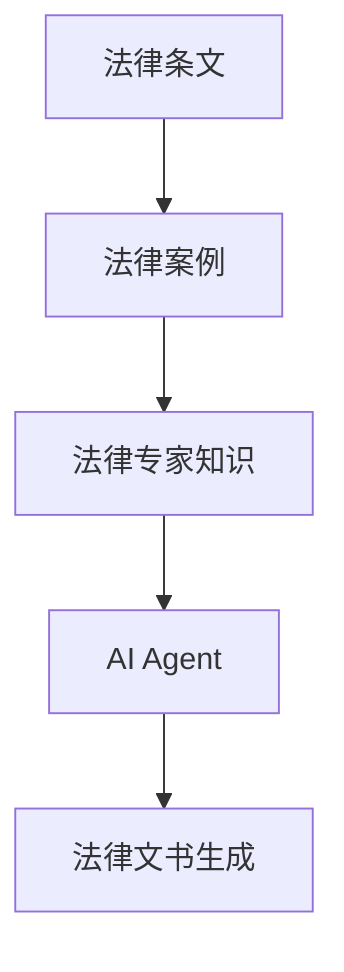
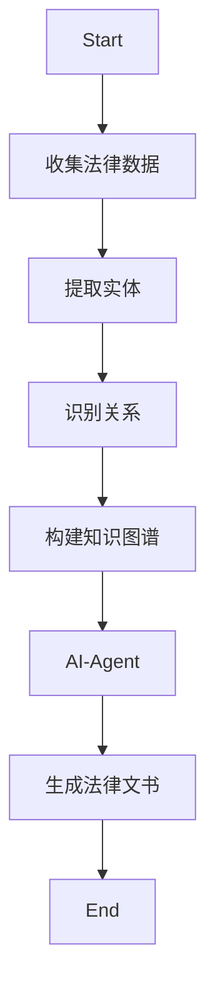
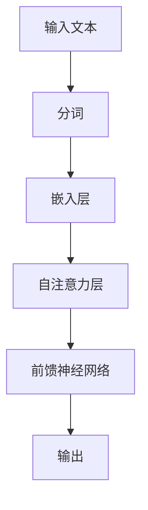
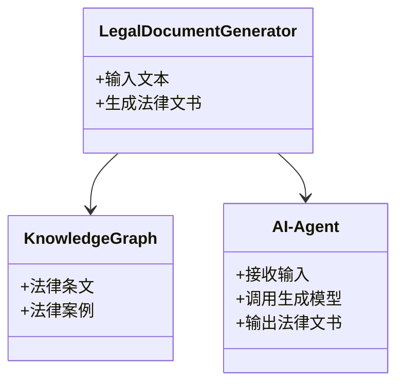
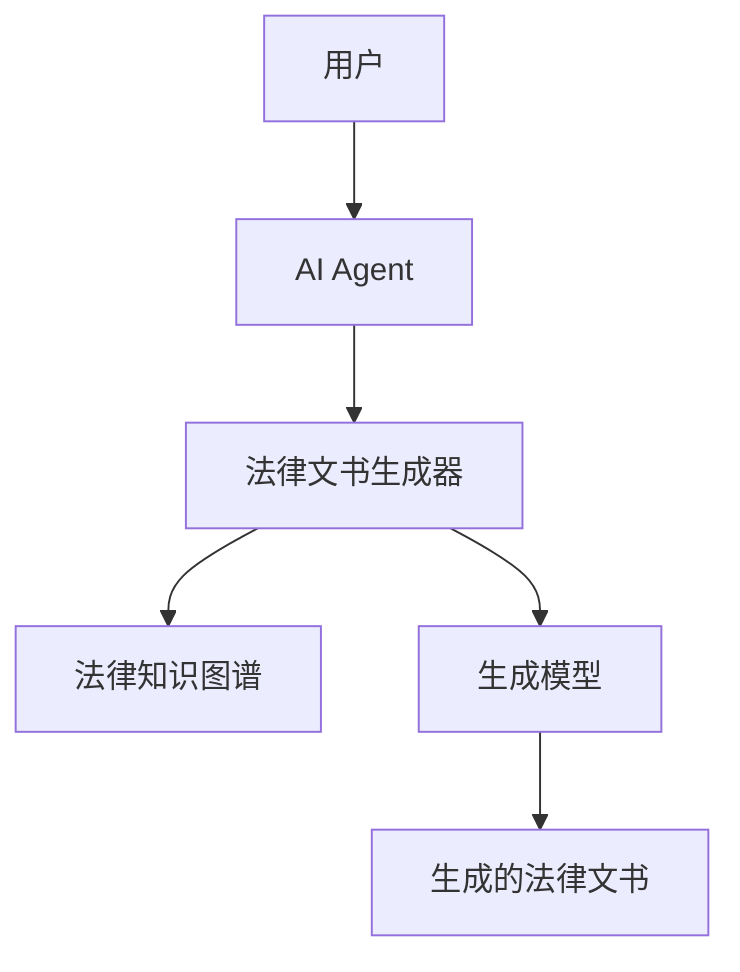

                 


# AI Agent在智能法律文书生成中的角色

> 关键词：AI Agent, 法律文书生成, 法律知识图谱, Transformer模型, 智能法律系统, 法律自动化

> 摘要：本文探讨了AI Agent在智能法律文书生成中的角色，从背景概述、核心概念、算法原理、系统架构到项目实战，全面分析了AI Agent如何通过法律知识图谱和生成模型推动法律文书生成的智能化。文章结合实际案例，详细解读了AI Agent在法律领域的应用潜力，并展望了未来的发展方向。

---

# 第1章: AI Agent与智能法律文书生成的背景与概述

## 1.1 AI Agent的基本概念

### 1.1.1 AI Agent的定义与分类

AI Agent（人工智能代理）是指能够感知环境、自主决策并执行任务的智能实体。根据功能和应用场景的不同，AI Agent可以分为多种类型，包括：

1. **反应式AI Agent**：基于当前输入做出实时反应，适用于需要快速决策的任务。
2. **认知式AI Agent**：具备复杂的推理和规划能力，能够处理复杂场景。
3. **协作式AI Agent**：能够与其他AI Agent或人类协同工作，共同完成任务。

### 1.1.2 AI Agent的核心特征

- **自主性**：能够在没有外部干预的情况下独立运行。
- **反应性**：能够实时感知环境并做出响应。
- **学习能力**：通过数据和经验不断优化自身性能。
- **推理能力**：能够进行逻辑推理和知识处理。

### 1.1.3 AI Agent在法律领域的应用潜力

AI Agent在法律领域的应用前景广阔，特别是在法律文书生成、案件分析、法律咨询等方面展现了巨大潜力。通过结合法律知识图谱和自然语言处理技术，AI Agent能够显著提升法律文书生成的效率和准确性。

---

## 1.2 法律文书生成的现状与挑战

### 1.2.1 法律文书的基本类型与特点

法律文书主要包括合同、起诉书、判决书、法律意见书等类型。这些文书通常具有格式规范、内容严谨、逻辑清晰的特点，且需要符合相关法律法规。

### 1.2.2 传统法律文书生成的痛点

1. **效率低下**：传统法律文书生成依赖人工撰写，耗时且效率低。
2. **一致性问题**：不同律师或团队撰写的法律文书可能存在格式和内容不一致的问题。
3. **知识依赖**：法律文书的撰写需要深厚的法律知识储备，对撰写人员要求较高。

### 1.2.3 智能化法律文书生成的需求

随着AI技术的快速发展，智能化法律文书生成的需求日益迫切。通过AI Agent实现自动化、智能化的法律文书生成，不仅能够提高效率，还能降低错误率，同时确保法律文书的规范性和一致性。

---

## 1.3 AI Agent在法律文书生成中的角色定位

### 1.3.1 AI Agent作为法律文书生成的驱动者

AI Agent通过整合自然语言处理技术、法律知识图谱和生成模型，驱动法律文书的自动化生成过程。

### 1.3.2 AI Agent在法律知识理解中的作用

AI Agent能够通过法律知识图谱进行推理和理解，确保生成的法律文书符合相关法律法规。

### 1.3.3 AI Agent与法律专业人士的协同工作模式

AI Agent可以作为法律专业人士的辅助工具，帮助他们快速生成初稿，同时提供多种选项供选择，从而提高工作效率。

---

## 1.4 本章小结

本章从AI Agent的基本概念入手，分析了法律文书生成的现状与挑战，并探讨了AI Agent在法律文书生成中的角色定位。AI Agent通过智能化的技术手段，为法律文书生成带来了新的可能性，同时也为法律专业人士提供了强大的工具支持。

---

# 第2章: AI Agent与法律知识图谱

## 2.1 法律知识图谱的构建

### 2.1.1 法律知识图谱的定义与特点

法律知识图谱是一种将法律知识以结构化形式表示的知识库，具有语义丰富、可扩展性强的特点。

### 2.1.2 法律知识图谱的构建方法

1. **数据收集**：从法律文献、案例库中提取数据。
2. **实体识别**：识别法律相关实体，如法律条文、案件类型等。
3. **关系抽取**：提取实体之间的关系。
4. **知识融合**：整合多源数据，消除冗余和冲突。
5. **知识表示**：使用图结构表示法律知识。

### 2.1.3 法律知识图谱的应用场景

- **法律信息检索**：通过图谱快速定位相关法律条文。
- **法律推理**：基于图谱进行逻辑推理，辅助决策。
- **法律文书生成**：利用图谱中的知识生成标准化的法律文书。

## 2.2 AI Agent与法律知识图谱的结合

### 2.2.1 AI Agent如何利用法律知识图谱进行推理

AI Agent通过法律知识图谱进行语义理解，能够准确提取法律条文和案例的关联关系，从而生成符合法律规范的文书内容。

### 2.2.2 法律知识图谱对AI Agent决策的支持

法律知识图谱为AI Agent提供了丰富的法律知识储备，使其能够做出符合法律规范的决策。

### 2.2.3 法律知识图谱的动态更新与维护

法律知识图谱需要定期更新，以反映最新的法律法规变化，确保AI Agent的决策始终基于最新的法律信息。

## 2.3 实体关系图与流程图（Mermaid）

### 实体关系图



### 流程图



## 2.4 本章小结

本章详细探讨了AI Agent与法律知识图谱的关系，分析了法律知识图谱的构建方法及其在AI Agent中的应用。通过结合法律知识图谱，AI Agent能够更高效地进行法律推理和决策，为法律文书生成提供了强有力的支持。

---

# 第3章: 法律文书生成算法与模型

## 3.1 法律文书生成算法的核心原理

### 3.1.1 基于Transformer的生成模型

Transformer模型通过自注意力机制（Self-Attention）和前馈神经网络，能够有效捕捉文本中的长距离依赖关系，非常适合用于法律文书的生成。

### 3.1.2 自注意力机制的数学模型

自注意力机制的计算公式如下：

$$
\text{Attention}(Q, K, V) = \text{softmax}\left(\frac{QK^T}{\sqrt{d_k}}\right)V
$$

其中，\( Q \) 是查询向量，\( K \) 是键向量，\( V \) 是值向量，\( d_k \) 是向量的维度。

### 3.1.3 模型的训练与优化

1. **预训练**：使用大规模的法律文本数据进行预训练，提升模型的语义理解能力。
2. **微调**：在特定的法律文书生成任务上进行微调，优化模型的生成效果。
3. **评估指标**：采用BLEU、ROUGE等指标评估生成结果的质量。

## 3.2 法律文书生成模型的实现

### 3.2.1 模型架构



### 3.2.2 核心代码实现

```python
import torch
import torch.nn as nn

class TransformerBlock(nn.Module):
    def __init__(self, d_model, n_heads, d_ff):
        super(TransformerBlock, self).__init__()
        self.self_attention = nn.MultiheadAttention(d_model, n_heads)
        self.feedforward = nn.Sequential(
            nn.Linear(d_model, d_ff),
            nn.ReLU(),
            nn.Linear(d_ff, d_model)
        )
    
    def forward(self, x, mask):
        attn_output, _ = self.self_attention(x, x, x, mask=mask)
        ff_output = self.feedforward(attn_output)
        return ff_output + attn_output  # 残差连接
```

## 3.3 本章小结

本章详细讲解了法律文书生成算法的核心原理，包括基于Transformer的生成模型及其数学模型。通过代码示例，展示了模型的实现过程，为后续的系统设计奠定了基础。

---

# 第4章: AI Agent驱动的法律文书生成系统架构设计

## 4.1 系统功能设计

### 4.1.1 领域模型设计



### 4.1.2 系统架构设计



### 4.1.3 系统接口设计

1. **输入接口**：接收用户输入的法律相关文本。
2. **输出接口**：生成并输出标准化的法律文书。
3. **知识图谱接口**：与法律知识图谱进行交互，获取相关知识。

## 4.2 本章小结

本章从系统架构的角度，详细设计了AI Agent驱动的法律文书生成系统的功能模块和架构图，展示了各个组件之间的交互关系，为后续的项目实现提供了清晰的设计蓝图。

---

# 第5章: 项目实战与案例分析

## 5.1 环境安装与配置

1. **安装Python和PyTorch**：
   ```bash
   pip install torch
   pip install transformers
   ```

2. **安装法律知识图谱库**：
   ```bash
   pip install networkx
   ```

## 5.2 核心代码实现

### 5.2.1 法律知识图谱的构建

```python
import networkx as nx

G = nx.DiGraph()
G.add_node("合同")
G.add_node("条款")
G.add_node("违约责任")
G.add_edge("合同", "条款")
G.add_edge("条款", "违约责任")
```

### 5.2.2 法律文书生成器

```python
from transformers import AutoTokenizer, AutoModelForCausalLM

tokenizer = AutoTokenizer.from_pretrained("gpt2")
model = AutoModelForCausalLM.from_pretrained("gpt2")

def generate_legal_document(prompt):
    inputs = tokenizer.encode(prompt, return_tensors="pt")
    outputs = model.generate(inputs, max_length=500, temperature=0.7)
    return tokenizer.decode(outputs[0], skip_special_tokens=True)
```

## 5.3 案例分析

### 5.3.1 案例背景

某公司需要一份标准的商业合同，用户只需输入合同的主要条款，AI Agent即可自动生成完整的合同内容。

### 5.3.2 生成过程

1. 用户输入主要条款。
2. AI Agent调用法律知识图谱，生成合同的各个部分。
3. 法律文书生成器基于预训练模型生成完整的合同内容。

### 5.3.3 生成结果

```text
合同编号：XXX-2023
甲方：XXX公司
乙方：YYY公司
鉴于甲乙双方达成如下协议：
第一条：服务内容
第二条：支付方式
第三条：违约责任
...
```

## 5.4 本章小结

本章通过实际案例展示了AI Agent在法律文书生成中的应用，详细讲解了项目实战中的关键步骤和实现细节。通过案例分析，读者可以更好地理解AI Agent在法律领域的实际应用价值。

---

# 第6章: 总结与展望

## 6.1 全文总结

本文详细探讨了AI Agent在智能法律文书生成中的角色，从背景概述、核心概念、算法原理到系统架构和项目实战，全面分析了AI Agent如何通过法律知识图谱和生成模型推动法律文书生成的智能化。

## 6.2 未来展望

随着AI技术的不断进步，AI Agent在法律文书生成中的应用将更加广泛和深入。未来的研究方向包括：

1. **多模态生成**：结合视觉、听觉等多模态信息，生成更加多样化的法律文书。
2. **动态知识更新**：实现法律知识图谱的实时更新，确保生成的法律文书始终符合最新的法律法规。
3. **人机协作优化**：进一步提升AI Agent与法律专业人士的协同效率，实现更高效的法律文书生成。

## 6.3 注意事项与最佳实践

1. **数据隐私保护**：在处理法律文书时，需注意数据的隐私保护和合规性。
2. **模型可解释性**：确保生成的法律文书可追溯和可解释，避免“黑箱”操作。
3. **持续学习与优化**：定期更新模型和法律知识图谱，保持系统的先进性和准确性。

## 6.4 拓展阅读

推荐读者进一步阅读以下内容，深入了解AI Agent和法律文书生成的最新研究进展：

- 《生成式AI在法律领域的应用》
- 《法律知识图谱构建与应用》
- 《Transformer模型的深度解析》

---

# 作者

作者：AI天才研究院/AI Genius Institute & 禅与计算机程序设计艺术/Zen And The Art of Computer Programming

---

以上为完整的技术博客文章内容，涵盖了AI Agent在智能法律文书生成中的各个方面，从理论到实践，从算法到系统设计，为读者提供了全面而深入的解读。

