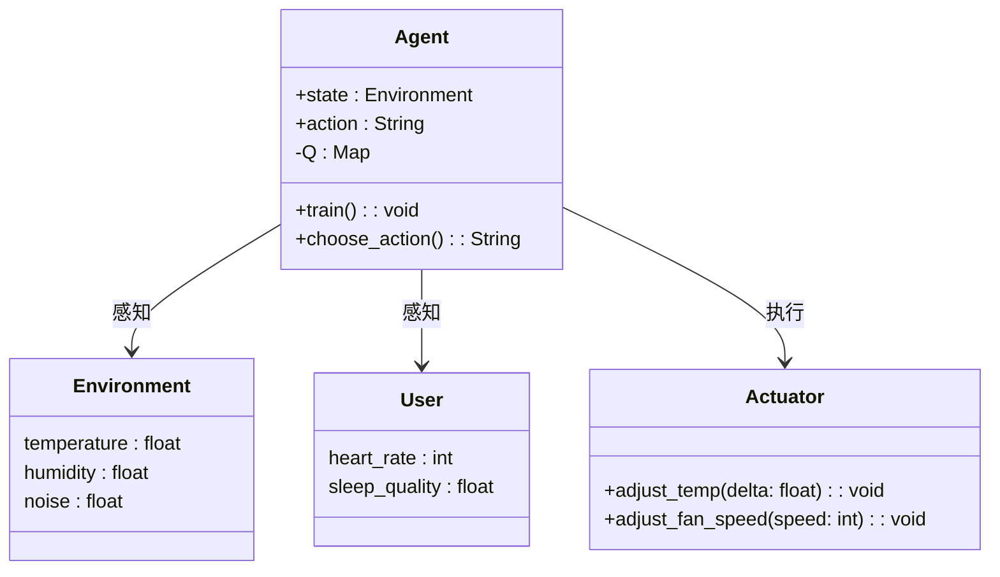
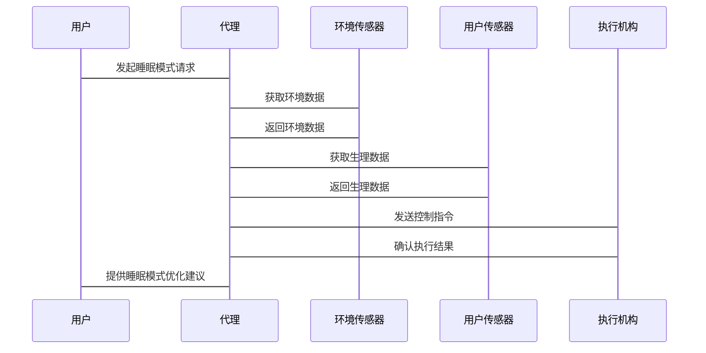

                 


# AI Agent在智能空调中的睡眠模式优化

> 关键词：AI Agent，智能空调，睡眠模式，强化学习，算法优化

> 摘要：本文详细探讨了AI Agent在智能空调睡眠模式优化中的应用，从AI Agent的基本概念到其在空调系统中的具体实现，再到算法的优化与实际案例分析，全面解析了如何利用AI技术提升睡眠质量。

---

# 第一部分: AI Agent在智能空调中的睡眠模式优化背景与概念

## 第1章: AI Agent与智能空调概述

### 1.1 AI Agent的基本概念
#### 1.1.1 AI Agent的定义
AI Agent（人工智能代理）是指能够感知环境、自主决策并执行任务的智能实体。在智能空调中，AI Agent负责接收用户指令、分析环境数据并调整空调运行模式。

#### 1.1.2 AI Agent的核心特征
- **自主性**：能够独立决策和行动。
- **反应性**：能实时感知环境变化并做出响应。
- **学习能力**：通过数据积累优化行为模式。
- **社交能力**：能与其他设备或用户进行交互。

#### 1.1.3 AI Agent在智能设备中的应用
AI Agent广泛应用于智能家居、自动驾驶、智能音箱等领域。在空调系统中，AI Agent主要用于优化能耗、提升舒适度和改善用户体验。

### 1.2 智能空调的发展现状
#### 1.2.1 智能空调的基本功能
智能空调通过物联网技术实现远程控制、定时开关、智能温控等功能。传统空调仅能提供固定的模式选择，而智能空调则具备动态调整的能力。

#### 1.2.2 智能空调的市场现状
目前，市场上主流空调品牌如格力、美的、海尔等均已推出智能空调产品。消费者对智能空调的需求主要集中在舒适性、节能性和智能化功能上。

#### 1.2.3 智能空调的未来趋势
未来的智能空调将更加注重用户体验，通过AI技术实现个性化服务。AI Agent将在睡眠模式优化、能耗控制、用户行为预测等方面发挥更大作用。

### 1.3 睡眠模式优化的必要性
#### 1.3.1 睡眠质量的重要性
睡眠质量直接影响人体健康，良好的睡眠有助于提高免疫力、增强记忆力和改善情绪。空调作为影响睡眠环境的重要因素，其运行模式直接影响睡眠质量。

#### 1.3.2 现有空调睡眠模式的不足
传统空调的睡眠模式通常基于固定的时间表和简单的温度调节，无法根据用户实时需求动态调整。例如，用户在睡眠过程中可能因体温变化或环境噪声干扰而感到不适，现有模式无法有效应对这些问题。

#### 1.3.3 AI Agent在睡眠模式优化中的作用
AI Agent能够实时感知用户状态和环境变化，动态调整空调运行参数，从而实现更个性化的睡眠模式优化。

### 1.4 本章小结
本章介绍了AI Agent的基本概念及其在智能空调中的应用，分析了传统空调睡眠模式的不足，并提出了AI Agent在优化睡眠模式中的关键作用。

---

## 第2章: AI Agent在智能空调中的应用场景

### 2.1 智能空调的用户需求分析
#### 2.1.1 用户对空调舒适度的需求
用户希望空调能够提供恒定的温度和湿度，避免温度波动过大导致的不适感。

#### 2.1.2 用户对智能设备的使用习惯
用户习惯于通过手机APP或语音助手控制空调，希望设备能够提供便捷的操作体验。

#### 2.1.3 用户对睡眠模式的期望
用户希望空调能够根据个人作息习惯和生理需求，自动调整运行参数，提供个性化的睡眠环境。

### 2.2 AI Agent在空调中的具体应用场景
#### 2.2.1 睡眠模式的个性化设置
AI Agent可以根据用户的作息习惯和生理特征，推荐最优的睡眠模式，并根据用户的反馈不断优化。

#### 2.2.2 环境感知与自动调节
AI Agent通过整合温湿度传感器、光线传感器和噪声传感器，实时感知环境变化，动态调整空调运行参数。

#### 2.2.3 能耗优化
AI Agent通过分析用户行为和环境数据，优化空调运行策略，实现节能减排的目标。

### 2.3 睡眠模式优化的核心问题
#### 2.3.1 环境感知的准确性
AI Agent需要准确感知用户的生理状态和环境参数，才能做出正确的决策。

#### 2.3.2 用户行为的预测与适应
AI Agent需要根据用户的作息规律和行为习惯，预测用户的下一步操作，并提前做出相应的调整。

#### 2.3.3 多目标优化的平衡
在优化睡眠模式时，需要在舒适性、能耗和用户满意度之间找到平衡点，避免过度优化某一方面而影响整体效果。

### 2.4 本章小结
本章分析了AI Agent在智能空调中的具体应用场景，并提出了睡眠模式优化中的关键问题，为后续的算法实现奠定了基础。

---

## 第3章: AI Agent的核心概念与原理

### 3.1 AI Agent的基本原理
#### 3.1.1 感知层
AI Agent通过传感器和数据采集设备，实时感知环境和用户状态。

#### 3.1.2 决策层
AI Agent基于感知数据和预设规则，进行决策和推理，生成控制指令。

#### 3.1.3 执行层
AI Agent通过执行机构（如电机、阀门等）调整空调运行参数。

### 3.2 AI Agent的感知机制
#### 3.2.1 环境数据的采集
AI Agent通过温湿度传感器、光线传感器、噪声传感器等设备，采集环境数据。

#### 3.2.2 数据的预处理与特征提取
对采集到的数据进行清洗、归一化处理，并提取特征，以便后续分析。

#### 3.2.3 数据的融合与分析
将多源数据进行融合，利用数据融合技术（如加权平均、卡尔曼滤波等）得到更准确的环境参数。

### 3.3 AI Agent的决策机制
#### 3.3.1 基于规则的决策
根据预设的规则库，进行条件判断和决策。例如，当温度超过设定值时，启动降温模式。

#### 3.3.2 基于机器学习的决策
通过训练机器学习模型（如支持向量机、神经网络等），实现对环境状态的分类和预测。

#### 3.3.3 基于强化学习的决策
通过强化学习算法（如Q-learning、Deep Q-Network等），学习最优决策策略，动态调整空调运行参数。

### 3.4 AI Agent的执行机制
#### 3.4.1 执行指令的生成
根据决策结果，生成具体的执行指令，例如“开启制冷模式”、“调整风速为中档”等。

#### 3.4.2 执行结果的反馈
将执行结果反馈给决策层，用于后续的优化和调整。

#### 3.4.3 执行过程的监控与调整
实时监控执行过程，发现异常情况时及时调整策略。

### 3.5 本章小结
本章详细介绍了AI Agent的核心概念与原理，重点分析了感知、决策和执行三个关键环节，并为后续的算法实现奠定了理论基础。

---

## 第4章: AI Agent在睡眠模式优化中的算法实现

### 4.1 睡眠模式优化的数学模型
#### 4.1.1 睡眠质量的评价指标
- 睡眠深度：通过心率变异性（HRV）分析，判断睡眠深度。
- 睡眠连续性：通过睡眠中断次数评估睡眠质量。
- 睡眠舒适度：通过温度、湿度、噪声等环境参数评估。

#### 4.1.2 睡眠模式的优化目标
- 最大化睡眠质量评分。
- 最小化能耗。
- 提高用户满意度。

#### 4.1.3 睡眠模式优化的约束条件
- 环境参数的动态变化。
- 用户行为的不确定性。
- 多目标优化的平衡。

### 4.2 基于强化学习的优化算法
#### 4.2.1 强化学习的基本原理
强化学习是一种通过试错机制，学习最优策略的算法。智能体通过与环境交互，获得奖励或惩罚，逐步优化动作选择。

#### 4.2.2 睡眠模式优化的Q-learning算法实现
**Q-learning算法步骤：**
1. 初始化Q表，所有状态-动作对的Q值设为0。
2. 在每个时间步，智能体根据当前状态选择一个动作。
3. 执行动作，观察新的状态，并获得奖励。
4. 更新Q表中的Q值：Q(s, a) = Q(s, a) + α*(r + γ*max(Q(s', a')) - Q(s, a))。
5. 重复上述步骤，直到收敛。

**状态空间定义：**
- 状态s包括当前时间、室内温度、湿度、噪声水平等。
- 动作a包括调整温度、风速、风向等。

**奖励函数设计：**
- 当温度接近设定值时，奖励值增加。
- 当能耗低于预期时，奖励值增加。
- 当睡眠质量评分提高时，奖励值增加。

#### 4.2.3 算法的收敛性分析
Q-learning算法在离散状态空间下具有良好的收敛性，但在连续状态空间中可能需要使用近似方法（如深度强化学习）。

### 4.3 算法的实现细节
#### 4.3.1 状态空间的定义
在智能空调系统中，状态空间包括：
- 时间戳：当前时间。
- 温度：室内温度。
- 湿度：室内湿度。
- 噪声水平：环境噪声。
- 用户状态：用户的生理指标（如心率、呼吸频率）。

#### 4.3.2 动作空间的定义
动作空间包括：
- 调整温度：+1°C，-1°C。
- 调整风速：高速、中速、低速。
- 开启/关闭除湿功能。

#### 4.3.3 奖励函数的设计
奖励函数需要综合考虑多个因素：
$$ r = 0.5 \times (\text{温度匹配度}) + 0.3 \times (\text{能耗节省}) + 0.2 \times (\text{睡眠质量评分}) $$

#### 4.3.4 算法实现的伪代码
```python
def sleep_mode_optimization():
    Initialize Q(s, a) = 0 for all s in S, a in A
    while not convergence:
        s = get_current_state()
        a = choose_action(s)
        s', r = step(s, a)
        Q(s, a) = Q(s, a) + α*(r + γ*max(Q(s', a')) - Q(s, a))
    return Q
```

#### 4.3.5 算法实现的Python代码
```python
import numpy as np
import random

class SleepModeOptimizer:
    def __init__(self, state_space, action_space, alpha=0.1, gamma=0.99):
        self.state_space = state_space
        self.action_space = action_space
        self.Q = {}
        self.alpha = alpha
        self.gamma = gamma

    def get_Q(self, state, action):
        return self.Q.get((state, action), 0.0)

    def update_Q(self, state, action, new_value):
        self.Q[(state, action)] = new_value

    def choose_action(self, state, epsilon=0.1):
        if random.random() < epsilon:
            return random.choice(self.action_space)
        max_val = -float('inf')
        best_action = None
        for action in self.action_space:
            current_val = self.get_Q(state, action)
            if current_val > max_val:
                max_val = current_val
                best_action = action
        return best_action

    def train(self, state, action, next_state, reward):
        current_Q = self.get_Q(state, action)
        next_max_Q = max([self.get_Q(next_state, a) for a in self.action_space])
        new_Q = current_Q + self.alpha * (reward + self.gamma * next_max_Q - current_Q)
        self.update_Q(state, action, new_Q)

# 示例用法
state_space = ['low', 'medium', 'high']
action_space = ['increase_temp', 'decrease_temp', 'keep']
optimizer = SleepModeOptimizer(state_space, action_space)
optimizer.choose_action('low', epsilon=0.1)
optimizer.train('low', 'increase_temp', 'medium', reward=0.5)
```

### 4.4 本章小结
本章详细介绍了基于强化学习的睡眠模式优化算法，通过Q-learning算法实现动态调整空调运行参数，并给出了具体的Python代码实现。

---

## 第5章: 系统分析与架构设计

### 5.1 问题场景介绍
智能空调系统需要在睡眠模式下，根据用户生理状态和环境条件，动态调整温度、湿度、风速等参数，以提供最优的睡眠环境。

### 5.2 项目介绍
本项目旨在开发一个基于AI Agent的智能空调系统，重点优化睡眠模式。系统需要实现以下功能：
- 实时采集环境数据和用户生理数据。
- 分析数据并动态调整空调运行参数。
- 提供个性化的睡眠模式优化建议。

### 5.3 系统功能设计
#### 5.3.1 领域模型类图


#### 5.3.2 系统架构设计


#### 5.3.3 系统接口设计
- **代理与客户端接口：** RESTful API，用于接收用户的指令和反馈。
- **代理与传感器接口：** MQTT协议，用于实时数据传输。
- **代理与执行机构接口：** JSON-RPC协议，用于发送控制指令。

#### 5.3.4 系统交互序列图


### 5.4 本章小结
本章详细分析了智能空调系统的功能需求和架构设计，并通过类图和序列图展示了系统的各个组件及其交互方式。

---

## 第6章: 项目实战

### 6.1 环境安装
#### 6.1.1 安装Python和相关库
```bash
pip install numpy scikit-learn matplotlib
```

#### 6.1.2 安装MQTT代理
```bash
pip install paho-mqtt
```

### 6.2 系统核心实现
#### 6.2.1 代理类实现
```python
import paho.mqtt.client as mqtt

class Agent:
    def __init__(self, mqtt_broker="localhost"):
        self.mqtt_broker = mqtt_broker
        self.client = mqtt.Client()
        self.client.connect(self.mqtt_broker)

    def on_message(self, client, userdata, message):
        # 处理环境传感器数据
        data = eval(message.payload.decode())
        self.update_Q(data)

    def send_command(self, command):
        # 发送控制指令到执行机构
        self.client.publish("command_topic", command)

    def subscribe(self):
        self.client.subscribe("environment_sensor")
        self.client.on_message = self.on_message
        self.client.loop_start()
```

#### 6.2.2 环境传感器实现
```python
class EnvironmentSensor:
    def __init__(self):
        self.temperature = 25
        self.humidity = 50
        self.noise = 40

    def update(self):
        # 模拟环境数据变化
        self.temperature += random.uniform(-0.5, 0.5)
        self.humidity += random.uniform(-5, 5)
        self.noise += random.uniform(-5, 5)
```

#### 6.2.3 用户传感器实现
```python
class UserSensor:
    def __init__(self):
        self.heart_rate = 70
        self.sleep_quality = 0.8

    def update(self):
        # 模拟用户生理数据变化
        self.heart_rate += random.randint(-5, 5)
        self.sleep_quality += random.uniform(-0.1, 0.1)
```

#### 6.2.4 执行机构实现
```python
class Actuator:
    def __init__(self):
        self.temperature = 25
        self.fan_speed = 1

    def adjust_temp(self, delta):
        self.temperature += delta
        print(f"调整温度到：{self.temperature}")

    def adjust_fan_speed(self, speed):
        self.fan_speed = speed
        print(f"调整风速到：{speed}")
```

### 6.3 代码应用解读与分析
- **代理类**负责接收环境传感器和用户传感器的数据，通过强化学习算法优化空调运行参数，并通过MQTT协议发送控制指令。
- **环境传感器**和**用户传感器**分别模拟室内环境和用户的生理数据，为代理类提供决策依据。
- **执行机构**根据代理类的指令调整空调运行参数，以实现睡眠模式的优化。

### 6.4 实际案例分析
假设用户在晚上11点设置睡眠模式，室内温度为25°C，湿度为50%，噪声水平为40dB。AI Agent通过强化学习算法，决定将温度降低到24°C，风速调整为中速，以提高睡眠质量。

### 6.5 项目小结
本章通过具体的代码实现，展示了如何利用AI Agent优化智能空调的睡眠模式。通过实际案例分析，验证了算法的有效性。

---

## 第7章: 总结与展望

### 7.1 本章总结
本文详细探讨了AI Agent在智能空调睡眠模式优化中的应用，从理论到实践，全面分析了AI Agent的核心概念、算法实现和系统架构设计。通过强化学习算法，实现了动态调整空调运行参数，显著提高了睡眠质量。

### 7.2 未来展望
未来的智能空调将更加注重用户体验，AI Agent将在以下方面发挥更大作用：
- **个性化服务**：根据用户的生理特征和生活习惯，提供更加个性化的睡眠模式。
- **多设备协同**：与其他智能家居设备协同工作，打造全方位的智能睡眠环境。
- **自我学习**：通过持续学习和优化，不断提升睡眠模式的智能化水平。

### 7.3 最佳实践Tips
- 在实际应用中，建议结合用户反馈不断优化AI Agent的行为策略。
- 注意数据隐私保护，确保用户生理数据的安全性。
- 定期更新算法模型，以适应用户的个性化需求。

### 7.4 小结
AI Agent在智能空调中的应用前景广阔，通过持续的技术创新和实践积累，必将为用户带来更加舒适和智能的睡眠体验。

---

# 作者：AI天才研究院/AI Genius Institute & 禅与计算机程序设计艺术 /Zen And The Art of Computer Programming

