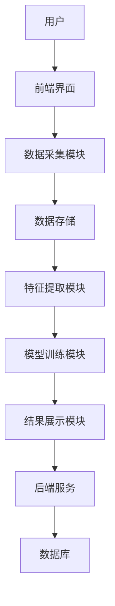
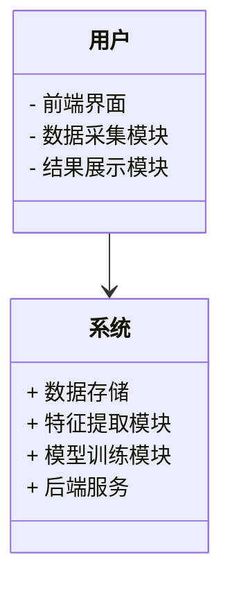
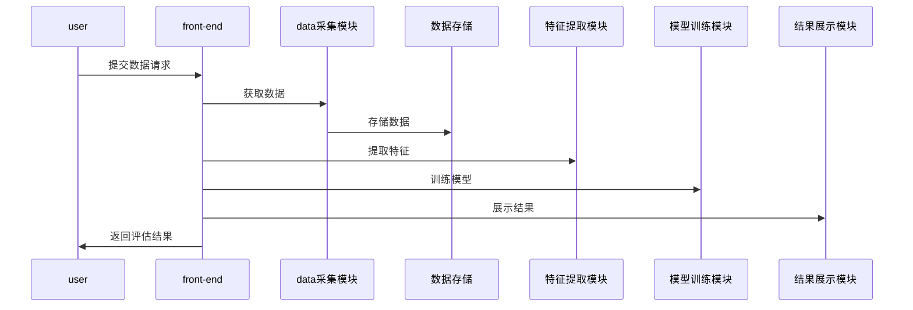

                 


# AI辅助的企业无形资产价值评估

> 关键词：AI辅助，企业无形资产，价值评估，机器学习，自然语言处理，深度学习，资产评估

> 摘要：本文将探讨如何利用人工智能技术辅助企业无形资产的价值评估。通过分析无形资产的特征，结合AI技术的核心原理，提出一种基于机器学习和自然语言处理的评估方法，并详细阐述其算法实现和系统架构设计。最后，通过实际案例展示如何利用AI技术实现高效、精准的企业无形资产评估。

---

# 第一部分: AI辅助的企业无形资产价值评估背景与概念

## 第1章: 企业无形资产概述

### 1.1 无形资产的定义与分类

#### 1.1.1 无形资产的定义
企业无形资产是指企业拥有或控制的，没有实物形态的长期资产。这些资产为企业创造价值，但无法用物理手段直接观察或衡量。常见的无形资产包括品牌价值、专利权、商标权、客户关系、商誉等。

#### 1.1.2 无形资产的分类
无形资产可以分为以下几类：
1. **知识产权类**：包括专利、商标、版权等。
2. **品牌价值类**：包括品牌知名度、品牌忠诚度等。
3. **客户关系类**：包括客户数据库、客户满意度等。
4. **商誉类**：包括企业声誉、企业形象等。

#### 1.1.3 无形资产在企业中的重要性
无形资产是企业价值的重要组成部分，尤其在高科技行业和服务业中，无形资产的价值往往远超过有形资产。准确评估无形资产的价值，对于企业的并购、融资、资产管理等决策具有重要意义。

---

### 1.2 AI技术的背景与现状

#### 1.2.1 AI技术的基本概念
人工智能（AI）是指通过模拟人类智能的思维方式，使计算机能够执行复杂任务的技术。AI的核心技术包括机器学习、深度学习、自然语言处理、计算机视觉等。

#### 1.2.2 当前AI技术的发展现状
近年来，AI技术取得了飞速发展，尤其是在以下领域：
1. **机器学习**：基于数据训练模型，实现预测和分类。
2. **深度学习**：通过多层神经网络，实现复杂模式识别。
3. **自然语言处理**：理解和生成人类语言，应用于文本分析、情感分析等。

#### 1.2.3 AI在企业中的应用领域
AI技术已经在多个企业领域得到广泛应用，包括：
1. **客户关系管理**：通过自然语言处理分析客户反馈，优化客户体验。
2. **风险管理**：利用机器学习预测潜在风险，优化企业决策。
3. **资产管理**：通过AI技术评估资产价值，优化资产配置。

---

### 1.3 AI辅助企业无形资产价值评估的必要性

#### 1.3.1 传统无形资产评估的局限性
传统无形资产评估方法主要依赖于财务数据和人工经验，存在以下问题：
1. **主观性**：评估结果受到评估人员主观判断的影响。
2. **数据不足**：难以获取足够的数据支持评估。
3. **效率低下**：评估过程复杂且耗时较长。

#### 1.3.2 AI技术在资产评估中的优势
AI技术可以通过以下方式提升无形资产评估的效率和准确性：
1. **数据处理能力**：AI能够处理大量非结构化数据，如文本、图像等。
2. **自动化分析**：通过机器学习算法自动分析数据，提取特征。
3. **实时更新**：AI模型可以根据最新数据实时更新评估结果。

#### 1.3.3 结合AI技术进行评估的可行性
通过结合AI技术，企业可以实现以下目标：
1. **精准评估**：利用机器学习模型，提高评估结果的准确性。
2. **快速响应**：通过自动化分析，缩短评估时间。
3. **动态调整**：根据市场变化实时更新评估结果。

---

### 1.4 本章小结
本章介绍了企业无形资产的定义、分类及其在企业中的重要性，同时分析了AI技术的背景与发展现状，并探讨了AI技术在企业无形资产评估中的必要性和可行性。

---

# 第二部分: AI辅助的企业无形资产价值评估核心概念与联系

## 第2章: AI技术在无形资产评估中的应用原理

### 2.1 AI技术的核心原理

#### 2.1.1 机器学习的基本原理
机器学习是一种通过数据训练模型，使其能够从数据中学习并做出预测的技术。其核心流程包括：
1. 数据预处理：清洗数据，提取特征。
2. 模型训练：通过算法优化模型参数。
3. 模型预测：利用训练好的模型进行预测。

#### 2.1.2 深度学习的基本原理
深度学习是一种基于多层神经网络的机器学习技术，能够自动提取数据中的复杂特征。其核心流程包括：
1. 数据输入：将输入数据传递到网络的输入层。
2. 网络前传：数据通过各层网络，最终输出预测结果。
3. 模型优化：通过反向传播算法调整网络参数，优化模型。

#### 2.1.3 自然语言处理的基本原理
自然语言处理（NLP）是研究如何让计算机理解和生成人类语言的技术。其核心流程包括：
1. 文本预处理：分词、去除停用词等。
2. 特征提取：提取文本中的有用信息。
3. 模型训练：通过机器学习或深度学习模型进行文本分析。

---

### 2.2 无形资产评估的关键要素

#### 2.2.1 无形资产的特征提取
特征提取是无形资产评估的关键步骤。常见的特征包括：
1. **品牌相关特征**：品牌知名度、品牌忠诚度等。
2. **客户相关特征**：客户数量、客户满意度等。
3. **市场相关特征**：市场需求、市场竞争等。

#### 2.2.2 AI技术在特征提取中的应用
通过自然语言处理技术，可以自动从文本数据中提取有用特征。例如：
1. **文本分析**：分析客户反馈文本，提取情感特征。
2. **关键词提取**：提取品牌相关的关键词，评估品牌价值。

#### 2.2.3 数据的融合与处理
为了提高评估结果的准确性，需要将多源数据进行融合。例如：
1. 结合财务数据和文本数据，综合评估企业价值。
2. 通过数据清洗和特征选择，减少冗余数据的影响。

---

### 2.3 基于机器学习的评估模型

#### 2.3.1 回归分析
回归分析是一种常用的机器学习算法，适用于预测连续型变量。其数学模型如下：
$$ y = \beta_0 + \beta_1x_1 + \beta_2x_2 + \ldots + \beta_nx_n + \epsilon $$
其中，$y$ 是目标变量，$x_i$ 是特征变量，$\beta_i$ 是模型参数，$\epsilon$ 是误差项。

#### 2.3.2 随机森林
随机森林是一种基于决策树的集成学习算法。其核心思想是通过训练多棵决策树，并通过投票或平均的方式进行预测。

#### 2.3.3 神经网络
神经网络是一种基于多层神经元的深度学习模型。其核心思想是通过多层非线性变换，提取数据中的复杂特征。

---

### 2.4 本章小结
本章详细介绍了AI技术的核心原理及其在无形资产评估中的应用，重点分析了机器学习、深度学习和自然语言处理在评估过程中的作用。

---

# 第三部分: AI辅助的企业无形资产价值评估算法原理

## 第3章: 基于机器学习的评估算法

### 3.1 回归分析的实现

#### 3.1.1 算法流程
1. 数据预处理：清洗数据，提取特征。
2. 模型训练：使用线性回归算法训练模型。
3. 模型预测：利用训练好的模型进行预测。

#### 3.1.2 代码实现
```python
import numpy as np
from sklearn.linear_model import LinearRegression

# 数据预处理
X = np.array([[1, 2], [3, 4], [5, 6]])
y = np.array([1, 2, 3])

# 模型训练
model = LinearRegression()
model.fit(X, y)

# 模型预测
print(model.predict([[7, 8]]))
```

#### 3.1.3 示例分析
通过上述代码，我们可以看到线性回归算法能够根据输入数据预测出目标变量的值。

---

### 3.2 随机森林的实现

#### 3.2.1 算法流程
1. 数据预处理：清洗数据，提取特征。
2. 模型训练：使用随机森林算法训练模型。
3. 模型预测：利用训练好的模型进行预测。

#### 3.2.2 代码实现
```python
from sklearn.ensemble import RandomForestRegressor

# 数据预处理
X = np.array([[1, 2], [3, 4], [5, 6]])
y = np.array([1, 2, 3])

# 模型训练
model = RandomForestRegressor(n_estimators=100)
model.fit(X, y)

# 模型预测
print(model.predict([[7, 8]]))
```

#### 3.2.3 示例分析
随机森林算法通过集成多棵决策树，能够提高模型的准确性和鲁棒性。

---

### 3.3 神经网络的实现

#### 3.3.1 算法流程
1. 数据预处理：清洗数据，提取特征。
2. 模型训练：使用神经网络算法训练模型。
3. 模型预测：利用训练好的模型进行预测。

#### 3.3.2 代码实现
```python
import tensorflow as tf

# 数据预处理
X = np.array([[1, 2], [3, 4], [5, 6]])
y = np.array([1, 2, 3])

# 模型训练
model = tf.keras.Sequential([
    tf.keras.layers.Dense(64, activation='relu'),
    tf.keras.layers.Dense(1)
])
model.compile(optimizer='adam', loss='mean_squared_error')
model.fit(X, y, epochs=100, batch_size=32)

# 模型预测
print(model.predict([[7, 8]]))
```

#### 3.3.3 示例分析
神经网络算法通过多层非线性变换，能够提取数据中的复杂特征，适用于复杂的评估场景。

---

### 3.4 本章小结
本章详细介绍了回归分析、随机森林和神经网络三种机器学习算法的实现过程，并通过代码示例展示了它们的应用。

---

# 第四部分: AI辅助的企业无形资产价值评估系统分析与架构设计

## 第4章: 系统分析与架构设计

### 4.1 系统应用场景

#### 4.1.1 企业并购中的应用
在企业并购中，准确评估被并购企业的无形资产价值，是制定合理并购价格的重要依据。

#### 4.1.2 企业融资中的应用
通过AI技术评估企业无形资产价值，帮助企业获得合理的融资额度。

#### 4.1.3 企业风险管理中的应用
通过实时监测企业无形资产价值的变化，及时发现潜在风险，优化企业风险管理。

---

### 4.2 系统功能设计

#### 4.2.1 数据采集模块
数据采集模块负责采集企业相关的数据，包括财务数据、文本数据等。

#### 4.2.2 特征提取模块
特征提取模块通过自然语言处理技术，从文本数据中提取有用特征。

#### 4.2.3 模型训练模块
模型训练模块负责训练机器学习模型，优化模型参数。

#### 4.2.4 结果展示模块
结果展示模块将评估结果以可视化的方式呈现，便于用户理解和决策。

---

### 4.3 系统架构设计

#### 4.3.1 系统架构图


#### 4.3.2 系统功能模块图


---

### 4.4 系统接口设计

#### 4.4.1 数据接口
系统需要与外部数据源进行对接，获取企业相关的数据。

#### 4.4.2 模型接口
系统需要与机器学习模型进行对接，实现模型训练和预测。

#### 4.4.3 用户接口
系统需要提供友好的用户界面，方便用户输入数据和查看结果。

---

### 4.5 系统交互设计

#### 4.5.1 用户与系统交互流程


---

### 4.6 本章小结
本章详细描述了AI辅助企业无形资产价值评估系统的应用场景、功能设计、架构设计、接口设计和交互设计。

---

# 第五部分: AI辅助的企业无形资产价值评估项目实战

## 第5章: 项目实战

### 5.1 项目环境安装

#### 5.1.1 安装Python
安装Python 3.8或更高版本，推荐使用Anaconda安装包管理器。

#### 5.1.2 安装依赖库
安装以下依赖库：
- `numpy`
- `pandas`
- `scikit-learn`
- `tensorflow`
- `matplotlib`

安装命令：
```bash
pip install numpy pandas scikit-learn tensorflow matplotlib
```

---

### 5.2 系统核心实现

#### 5.2.1 数据预处理
```python
import pandas as pd

# 读取数据
data = pd.read_csv('data.csv')

# 数据清洗
data = data.dropna()

# 特征提取
data = data[['feature1', 'feature2', 'target']]
```

#### 5.2.2 模型训练
```python
from sklearn.model import Model

# 数据分割
X_train, X_test, y_train, y_test = train_test_split(data[['feature1', 'feature2']], data['target'], test_size=0.2)

# 模型训练
model = Model()
model.fit(X_train, y_train)

# 模型预测
y_pred = model.predict(X_test)
```

#### 5.2.3 结果展示
```python
import matplotlib.pyplot as plt

plt.scatter(y_test, y_pred)
plt.xlabel('True Values')
plt.ylabel('Predicted Values')
plt.show()
```

---

### 5.3 项目案例分析

#### 5.3.1 案例背景
以某科技公司为例，评估其品牌价值。

#### 5.3.2 数据分析
分析客户反馈文本，提取情感特征，评估品牌忠诚度。

#### 5.3.3 模型训练
使用随机森林算法训练模型，预测品牌价值。

#### 5.3.4 结果解读
根据模型预测结果，评估品牌价值，并提出优化建议。

---

### 5.4 项目小结
本章通过一个具体案例，展示了如何利用AI技术实现企业无形资产价值评估，并对评估结果进行了详细解读。

---

# 第六部分: 总结与展望

## 第6章: 总结与展望

### 6.1 本章总结
本文详细探讨了AI辅助企业无形资产价值评估的核心概念、算法原理和系统设计，并通过实际案例展示了AI技术在评估中的应用。通过本文的分析，我们可以看到，AI技术能够显著提升无形资产评估的效率和准确性。

---

### 6.2 未来展望
未来，随着AI技术的不断发展，企业无形资产价值评估将更加智能化和精准化。以下是未来可能的发展方向：
1. **多模态模型的应用**：结合文本、图像等多种数据源，提高评估结果的准确性。
2. **动态评估模型**：实时更新评估结果，适应市场变化。
3. **智能化决策支持**：通过AI技术提供决策支持，优化企业资产管理。

---

# 作者：AI天才研究院/AI Genius Institute & 禅与计算机程序设计艺术/Zen And The Art of Computer Programming

