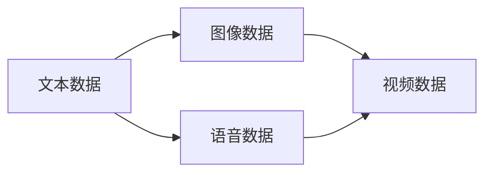
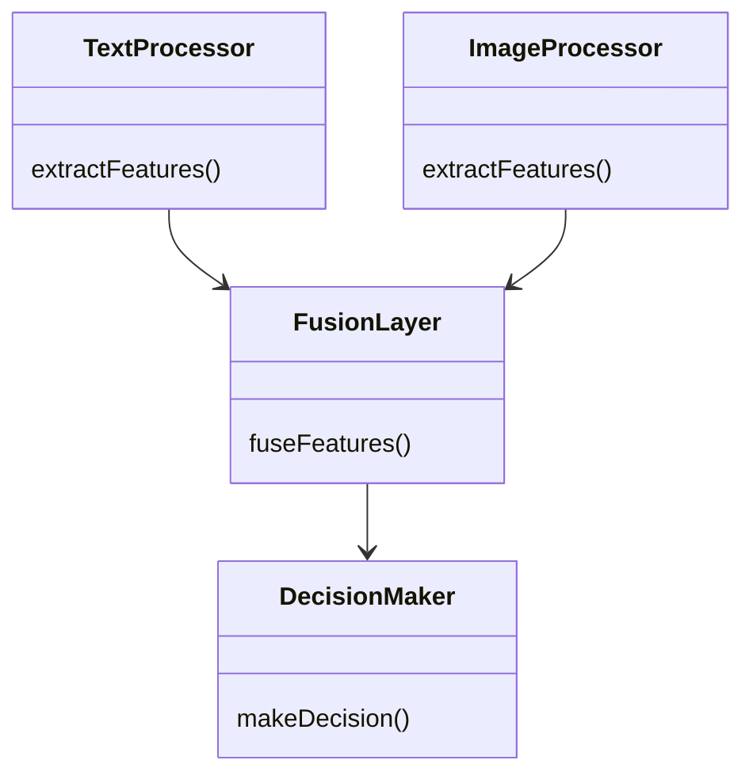
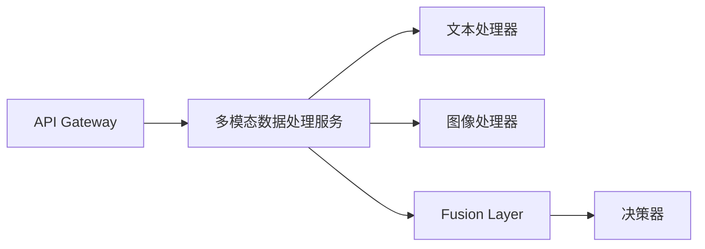
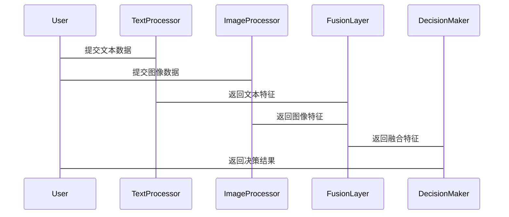

                 


# 多模态融合技术：增强AI Agent的感知与理解能力

## 关键词：多模态融合，AI Agent，感知能力，数据融合，深度学习

## 摘要

多模态融合技术是当前人工智能领域的重要研究方向之一，它通过整合多种数据模态（如文本、图像、语音、视频等）来增强AI Agent的感知与理解能力。本文将从多模态融合技术的背景、核心概念、算法原理、系统架构、项目实战等多方面展开深入探讨，结合具体的案例分析，帮助读者全面理解多模态融合技术在AI Agent中的应用及其重要意义。

---

## 第一部分: 多模态融合技术概述

### 第1章: 多模态融合技术的背景与概念

#### 1.1 多模态融合技术的背景

##### 1.1.1 从单模态到多模态的演进
在人工智能发展的早期，许多应用主要依赖单一数据模态（如文本或图像）进行处理。然而，单模态数据往往存在信息不完整或片面的问题，限制了AI系统的理解和决策能力。随着技术的进步，多模态数据的引入为AI系统提供了更全面的信息支持，使AI Agent能够更好地理解和应对复杂的现实场景。

##### 1.1.2 多模态技术的定义与特点
多模态技术是指将多种数据模态（如文本、图像、语音、视频等）结合在一起，通过融合这些数据来提升系统性能的技术。其特点包括信息互补性、数据多样性、任务协同性和复杂性。

##### 1.1.3 多模态融合技术的必要性
在现实场景中，单一模态数据往往无法提供足够的信息来支持复杂的决策任务。例如，在自动驾驶场景中，仅依赖视觉数据可能无法准确感知环境中的动态物体。通过融合激光雷达、摄像头、雷达等多种数据模态，可以显著提升系统的感知精度和可靠性。

#### 1.2 多模态融合技术的核心概念

##### 1.2.1 多模态数据的类型与特点
多模态数据主要包括以下几种类型：
- **文本数据**：包括自然语言文本、对话记录等，具有语义丰富但感知能力有限的特点。
- **图像数据**：包括静态图像和视频，具有高空间分辨率但语义理解能力较弱的特点。
- **语音数据**：包括语音信号和声学特征，能够捕捉语调和情感信息。
- **其他模态数据**：如地理位置、时间戳等结构化数据。

##### 1.2.2 多模态融合的定义与分类
多模态融合是指将多种数据模态的信息进行整合，通过协同学习或联合优化来提升系统的性能。根据融合的阶段和方式，多模态融合可以分为以下几类：
- **早期融合**：在数据预处理阶段进行模态间的信息整合。
- **晚期融合**：在特征提取或决策阶段进行模态间的信息整合。
- **联合学习**：通过多任务学习框架同时优化多个模态的信息。

##### 1.2.3 多模态融合技术的应用场景
多模态融合技术广泛应用于多个领域，如计算机视觉、自然语言处理、机器人技术等。典型的应用场景包括：
- **智能客服**：通过整合文本、语音和情感分析数据，提供更智能的客服体验。
- **自动驾驶**：通过融合视觉、激光雷达、雷达等多种传感器数据，提升车辆的环境感知能力。
- **医疗健康**：通过整合医学图像、生理数据和病历文本，辅助医生进行诊断决策。

#### 1.3 多模态融合技术的技术演进

##### 1.3.1 多模态技术的发展历程
多模态技术的发展经历了以下几个阶段：
1. **单一模态主导阶段**：早期的人工智能应用主要依赖单一模态数据，如文本或图像。
2. **多模态初步探索阶段**：研究者开始尝试将两种或多种模态数据进行简单融合，以提升系统的性能。
3. **深度学习驱动的多模态融合阶段**：随着深度学习技术的发展，多模态融合技术进入快速发展阶段，出现了许多创新性的融合方法。
4. **跨学科融合阶段**：多模态融合技术逐渐与其他学科（如认知科学、神经科学等）结合，推动了技术的进一步发展。

##### 1.3.2 当前多模态融合技术的主流方法
当前，主流的多模态融合方法主要包括以下几种：
- **基于特征对齐的方法**：通过将不同模态的特征对齐到同一个空间，进行融合。
- **基于注意力机制的方法**：通过注意力机制对不同模态的信息进行加权融合。
- **基于生成模型的方法**：利用生成对抗网络（GAN）等生成模型来融合多模态数据。

##### 1.3.3 多模态融合技术的未来趋势
未来，多模态融合技术将朝着以下几个方向发展：
- **更深层次的融合**：从简单的特征融合向更复杂的语义融合发展。
- **跨模态理解的增强**：通过引入跨模态对比学习等技术，提升系统对不同模态之间关系的理解能力。
- **实时性优化**：在实时性要求较高的场景（如实时语音翻译、实时视频分析等）中，优化多模态融合的计算效率。

#### 1.4 多模态融合技术在AI Agent中的应用

##### 1.4.1 AI Agent的定义与特点
AI Agent是一种能够感知环境、自主决策并执行任务的智能实体。与传统的被动式系统不同，AI Agent具有主动性、自主性和智能性等特点。

##### 1.4.2 多模态融合技术对AI Agent的增强作用
通过多模态融合技术，AI Agent能够更好地感知和理解复杂的环境信息。例如，在智能助手场景中，通过融合语音、文本和用户行为数据，可以更准确地理解用户的意图并提供个性化的服务。

##### 1.4.3 多模态融合技术在AI Agent中的典型应用
- **智能助手**：通过融合语音、文本和用户行为数据，提供更智能的交互体验。
- **自动驾驶**：通过融合视觉、激光雷达、雷达等多种传感器数据，提升车辆的环境感知能力。
- **智能安防**：通过融合视频、音频和地理位置数据，实现更精准的安防监控。

---

### 第2章: 多模态融合技术的核心概念与联系

#### 2.1 多模态数据的属性特征对比

| 数据模态 | 特征维度 | 优点 | 局限性 |
|----------|----------|------|--------|
| 文本      | 语义、关键词、句法结构 | 语义丰富，易于处理 | 感知能力有限 |
| 图像      | 空间分辨率、颜色、纹理 | 高空间分辨率，信息量大 | 语义理解能力弱 |
| 语音      | 音调、音速、情感特征 | 情感信息丰富 | 易受环境噪声影响 |
| 视频      | 时间序列、空间分辨率 | 信息全面 | 处理复杂度高 |

#### 2.2 多模态数据的实体关系图


#### 2.3 多模态融合技术的核心原理

##### 2.3.1 多模态数据的对齐与融合
多模态数据的对齐是指将不同模态的数据映射到同一个特征空间的过程。例如，将文本数据和图像数据通过某种映射关系对齐到同一个向量空间，然后进行融合。

##### 2.3.2 多模态数据的特征提取
特征提取是多模态融合的核心步骤之一。通过提取不同模态数据的特征，并将其进行融合，可以得到更丰富的特征表示。

##### 2.3.3 多模态数据的联合学习
联合学习是指在多模态数据上进行联合训练，使得模型能够同时利用多种模态的信息来优化目标任务。

---

### 第3章: 多模态融合技术的算法原理

#### 3.1 多模态融合算法的基础原理

##### 3.1.1 模态对齐算法
模态对齐算法的目标是将不同模态的数据对齐到同一个特征空间。常用的方法包括：
- **线性对齐**：通过线性变换将不同模态的数据映射到同一个空间。
- **非线性对齐**：通过非线性变换（如深度学习模型）将不同模态的数据对齐到同一个空间。

##### 3.1.2 注意力机制在多模态融合中的应用
注意力机制是一种有效的信息加权方法，常用于多模态融合中。通过注意力机制，模型可以对不同模态的信息进行动态加权，从而突出重要信息。

##### 3.1.3 多任务学习在多模态融合中的应用
多任务学习是一种通过同时优化多个任务来提升模型性能的方法。在多模态融合中，可以通过多任务学习框架，同时优化多个模态的信息，从而实现更好的融合效果。

#### 3.2 多模态融合算法的数学模型

##### 3.2.1 多模态对齐的数学模型
$$ y = f(x_1, x_2, ..., x_n) $$

##### 3.2.2 注意力机制的数学模型
$$ \alpha_i = \frac{e^{w_i}}{\sum_j e^{w_j}} $$

##### 3.2.3 多任务学习的数学模型
$$ L = \lambda_1 L_1 + \lambda_2 L_2 + ... + \lambda_k L_k $$

---

## 第四部分: 系统分析与架构设计

### 第4章: 多模态融合系统的架构设计

#### 4.1 项目介绍
本章将介绍一个多模态融合系统的架构设计，包括系统功能设计、架构设计、接口设计和交互流程设计。

#### 4.2 系统功能设计

##### 4.2.1 领域模型


##### 4.2.2 系统架构设计


##### 4.2.3 系统接口设计
- **输入接口**：接收多种模态的数据输入，如文本、图像等。
- **输出接口**：输出融合后的特征或决策结果。

##### 4.2.4 系统交互流程


---

## 第五部分: 项目实战

### 第5章: 多模态融合技术的项目实战

#### 5.1 环境安装与配置
```bash
pip install numpy
pip install tensorflow
pip install matplotlib
pip install scikit-learn
```

#### 5.2 核心代码实现

##### 5.2.1 数据预处理代码
```python
import numpy as np

def preprocess(text, image):
    # 文本预处理
    text_feature = text_to_feature(text)
    # 图像预处理
    image_feature = image_to_feature(image)
    return text_feature, image_feature
```

##### 5.2.2 融合算法实现
```python
def fuse_features(text_feature, image_feature):
    # 注意力机制
    attention = np.exp(np.dot(text_feature, image_feature.T)) / np.sum(np.exp(np.dot(text_feature, image_feature.T)))
    fused_feature = np.sum(attention * text_feature, axis=1)
    return fused_feature
```

##### 5.2.3 决策模型实现
```python
import tensorflow as tf
from tensorflow.keras.layers import Dense

model = tf.keras.Sequential([
    Dense(64, activation='relu'),
    Dense(1, activation='sigmoid')
])
model.compile(optimizer='adam', loss='binary_crossentropy')
```

#### 5.3 项目实现解读与分析
本项目通过融合文本和图像数据，展示了多模态融合技术在实际应用中的潜力。通过预处理、融合和决策三个步骤，实现了对多模态数据的有效利用。

#### 5.4 实际案例分析
以智能客服场景为例，通过融合文本和语音数据，可以显著提升系统的意图识别准确率和用户体验。

---

## 第六部分: 最佳实践与总结

### 第6章: 最佳实践与总结

#### 6.1 小结
本文从多模态融合技术的背景、核心概念、算法原理、系统架构到项目实战等多个方面进行了深入探讨，展示了多模态融合技术在AI Agent中的重要应用。

#### 6.2 注意事项
在实际应用中，需要注意以下几点：
- **数据质量**：多模态数据的质量对融合效果有直接影响。
- **计算效率**：多模态融合通常需要较高的计算资源。
- **模型选择**：选择合适的融合方法和模型架构，以达到最佳效果。

#### 6.3 拓展阅读
- **论文推荐**：《Multi-modal Deep Learning for Joint Recognition》
- **工具推荐**：TensorFlow、PyTorch等深度学习框架。

---

## 作者：AI天才研究院/AI Genius Institute & 禅与计算机程序设计艺术 /Zen And The Art of Computer Programming

---

通过本文的详细阐述，相信读者对多模态融合技术有了更深入的理解，并能够在实际应用中更好地利用这一技术来增强AI Agent的感知与理解能力。

