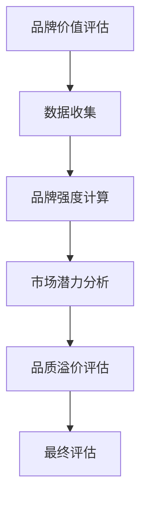
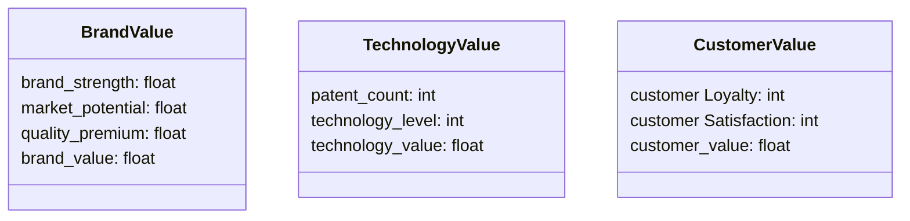
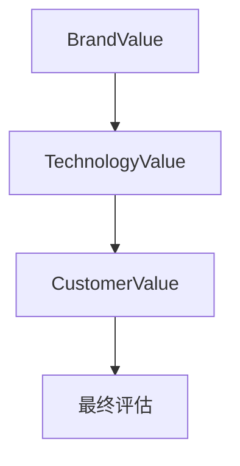

                 


# 巴菲特的品牌价值评估：无形资产在企业价值中的重要性

> 关键词：巴菲特，品牌价值，无形资产，企业价值，品牌评估，投资理念，价值投资

> 摘要：本文从巴菲特的投资理念出发，探讨品牌价值在企业价值中的重要性。通过详细分析无形资产的分类、品牌价值的评估方法以及企业价值评估的系统架构，帮助读者理解如何从技术角度量化和管理无形资产，提升企业整体价值。文章结合理论与实践，提供具体的数学模型和Python代码实现，帮助读者掌握品牌价值评估的核心技巧。

---

# 第1章: 巴菲特投资理念与无形资产

## 1.1 巴菲特投资理念概述

### 1.1.1 巴菲特的价值投资核心思想

巴菲特的价值投资理念强调长期持有优质资产，关注企业的内在价值。他认为，企业的内在价值是其未来现金流的现值，而这种价值往往体现在企业的品牌、专利、客户关系等无形资产上。无形资产不仅是企业竞争力的核心，也是企业长期盈利能力的关键。

### 1.1.2 巴菲特对无形资产的重视

在巴菲特看来，无形资产是企业价值的重要组成部分。例如，可口可乐的品牌价值高达数百亿美元，这种品牌资产不仅体现在产品的市场占有率上，还体现在消费者的忠诚度和品牌认知度上。巴菲特认为，无形资产的评估是企业价值评估的重要环节，因为它直接影响企业的长期盈利能力。

### 1.1.3 无形资产在企业价值中的地位

无形资产不仅是企业核心竞争力的体现，也是企业抵御市场风险的重要屏障。在巴菲特的投资实践中，他倾向于选择那些拥有强大品牌影响力和客户忠诚度的企业，因为这些无形资产能够为企业带来持续的超额利润。

---

## 1.2 品牌价值与无形资产的定义

### 1.2.1 品牌价值的定义

品牌价值是企业在市场中通过品牌建设所获得的市场价值，包括品牌知名度、品牌忠诚度、品牌认知度等因素。品牌价值不仅仅是品牌名称或标志的市场价值，而是品牌在消费者心中所占据的位置和带来的经济收益。

### 1.2.2 无形资产的核心特征

无形资产是指那些没有实体形态但能够为企业创造价值的资产，包括专利、商标、品牌、客户关系、商誉等。无形资产的核心特征包括：

- **非实体性**：无形资产没有物理形态，无法用肉眼直接观察。
- **长期性**：无形资产的效益通常持续较长时间，能够为企业带来长期收益。
- **依赖性**：无形资产的效益依赖于企业的管理和运营能力。

### 1.2.3 品牌价值与无形资产的对比分析

| **特征**        | **品牌价值**              | **无形资产**              |
|------------------|--------------------------|--------------------------|
| 定义             | 品牌在市场上带来的经济价值 | 企业拥有的非实体资产      |
| 评估方法         | 基于市场表现和消费者认知 | 基于财务报表和市场分析    |
| 重要性           | 直接影响企业市场地位      | 间接影响企业市场地位      |

---

## 1.3 无形资产与企业价值的关系

### 1.3.1 无形资产对企业价值的影响

无形资产是企业价值的重要组成部分。例如，一家拥有强大品牌影响力的企业，其品牌价值可能远远超过其有形资产的价值。这种无形资产能够为企业带来更高的市场占有率和利润率，从而提升企业整体价值。

### 1.3.2 品牌价值对企业竞争力的作用

品牌价值是企业竞争力的核心体现。强大的品牌能够吸引更多的消费者，提高企业的市场地位，同时降低企业的营销成本。此外，品牌价值还能够提高企业的议价能力，使企业在与竞争对手的竞争中占据优势。

### 1.3.3 无形资产的量化与评估

无形资产的量化和评估是企业价值评估的关键环节。通过科学的品牌价值评估方法，可以将无形资产的价值转化为具体的经济指标，从而为企业决策提供依据。例如，通过品牌价值评估，企业可以确定品牌在整体价值中的比重，从而制定更有效的品牌管理策略。

---

## 1.4 本章小结

本章从巴菲特的投资理念出发，介绍了品牌价值和无形资产的核心概念，并分析了它们在企业价值中的重要性。通过对比分析，我们明确了品牌价值与无形资产之间的区别和联系，为后续的品牌价值评估奠定了理论基础。

---

# 第2章: 无形资产的分类与属性特征

## 2.1 无形资产的分类

### 2.1.1 品牌资产

品牌资产是企业中最重要的一种无形资产，包括品牌知名度、品牌忠诚度、品牌认知度等因素。品牌资产的价值取决于消费者对品牌的认知和信任程度。

### 2.1.2 专利与技术

专利和技术是企业创新能力的体现。拥有核心专利和技术的企业能够在市场上占据优势，从而提高企业的竞争力和利润率。

### 2.1.3 商誉与客户关系

商誉是企业声誉的体现，而客户关系则是企业与客户之间长期合作的结果。这两者都属于无形资产的重要组成部分，能够为企业带来长期的经济收益。

---

## 2.2 无形资产的属性特征对比

### 2.2.1 表格对比分析

| **特征**        | **品牌资产**              | **专利与技术**            | **商誉与客户关系**        |
|------------------|--------------------------|--------------------------|--------------------------|
| 评估依据         | 品牌知名度、忠诚度       | 专利的数量和质量         | 企业声誉、客户满意度     |
| 有效期           | 长期                     | 取决于技术更新           | 长期                     |
| 影响因素         | 市场推广、消费者认知     | 技术创新、研发投入       | 服务质量、客户体验       |

### 2.2.2 ER实体关系图

```mermaid
erd
  customer
    +id: int
    +name: string
    +loyalty_level: int

  brand
    +id: int
    +brand_name: string
    +brand_value: float

  technology
    +id: int
    +patent_count: int
    +technology_level: int

  relationship
    +id: int
    +customer_id: int
    +brand_id: int
    +technology_id: int
    +value: float
```

---

## 2.3 本章小结

本章详细介绍了无形资产的分类及其属性特征，并通过对比分析和ER实体关系图，帮助读者更好地理解无形资产的构成和特点。这些分析为后续的品牌价值评估提供了重要的数据支持。

---

# 第3章: 品牌价值评估的理论与方法

## 3.1 品牌价值评估的核心理论

### 3.1.1 品牌资产的构成要素

品牌资产的构成要素包括品牌知名度、品牌忠诚度、品牌认知度、品牌联想等。这些要素共同构成了品牌价值的核心内容。

### 3.1.2 品牌价值的驱动因素

品牌价值的驱动因素包括市场需求、品牌竞争力、品牌创新力、品牌文化等。这些因素相互作用，共同影响品牌价值的高低。

### 3.1.3 品牌价值的评估模型

品牌价值的评估模型通常包括以下步骤：

1. 确定品牌资产的构成要素。
2. 量化每个要素的权重。
3. 计算品牌价值的总和。

---

## 3.2 品牌价值评估的数学模型

### 3.2.1 品牌价值公式

$$ 品牌价值 = 品牌强度 \times 市场潜力 \times 品质溢价 $$

其中，品牌强度是指品牌在市场中的竞争力，市场潜力是指目标市场的规模和增长潜力，品质溢价是指品牌相对于竞争对手的溢价能力。

### 3.2.2 品牌强度评估模型

$$ 品牌强度 = 品牌知名度 \times 品牌忠诚度 \times 品牌认知度 $$

---

## 3.3 品牌价值评估的算法流程

### 3.3.1 算法流程图



### 3.3.2 算法实现代码

```python
def brand_value(brand_strength, market_potential, quality_premium):
    return brand_strength * market_potential * quality_premium

# 示例
brand_strength = 0.8
market_potential = 1.2
quality_premium = 1.1
print(brand_value(brand_strength, market_potential, quality_premium))
```

---

## 3.4 本章小结

本章从理论和实践两个方面，详细介绍了品牌价值评估的核心理论和数学模型。通过具体的代码实现和算法流程图，帮助读者更好地理解品牌价值评估的实现过程。

---

# 第4章: 企业价值评估的系统分析与架构设计

## 4.1 问题场景介绍

### 4.1.1 企业价值评估的背景

在现代商业环境中，企业价值评估越来越依赖于无形资产的评估。品牌价值、专利技术等无形资产已经成为企业核心竞争力的重要组成部分。

### 4.1.2 无形资产在企业价值中的作用

无形资产不仅能够提升企业的市场地位，还能够为企业创造持续的经济价值。因此，如何科学地评估无形资产的价值，成为企业价值评估的关键问题。

### 4.1.3 系统目标与范围

本章旨在设计一个基于无形资产的企业价值评估系统，通过系统化的数据收集和分析，为企业提供科学的品牌价值评估方法。

---

## 4.2 系统功能设计

### 4.2.1 领域模型



---

## 4.3 系统架构设计

### 4.3.1 系统架构图



---

## 4.4 本章小结

本章通过系统设计的方法，介绍了企业价值评估的系统架构和功能设计。通过领域模型和系统架构图，帮助读者更好地理解如何将无形资产的价值评估纳入企业价值评估体系。

---

# 第5章: 项目实战与最佳实践

## 5.1 项目实战

### 5.1.1 环境安装

为了进行品牌价值评估，首先需要安装以下工具：

- Python编程环境
- 数据分析工具（如Pandas、NumPy）
- 图形化工具（如Matplotlib）

### 5.1.2 核心代码实现

```python
import pandas as pd
import numpy as np

def calculate_brand_value(brand_data):
    brand_strength = brand_data['brand_strength']
    market_potential = brand_data['market_potential']
    quality_premium = brand_data['quality_premium']
    return brand_strength * market_potential * quality_premium

# 示例数据
brand_data = {
    'brand_strength': 0.8,
    'market_potential': 1.2,
    'quality_premium': 1.1
}

# 计算品牌价值
brand_value = calculate_brand_value(brand_data)
print(f"品牌价值：{brand_value}")
```

### 5.1.3 案例分析

以一家公司为例，假设其品牌强度为0.8，市场潜力为1.2，品质溢价为1.1，计算其品牌价值：

$$ 品牌价值 = 0.8 \times 1.2 \times 1.1 = 1.056 $$

---

## 5.2 最佳实践

### 5.2.1 小结

品牌价值评估是企业价值评估的重要组成部分。通过科学的评估方法和系统设计，可以有效提升企业的品牌价值，进而提升企业整体价值。

### 5.2.2 注意事项

在品牌价值评估过程中，需要注意以下几点：

- 数据的准确性和完整性
- 模型的适用性和可解释性
- 结果的可操作性和实用性

### 5.2.3 拓展阅读

建议读者进一步阅读以下书籍和文章：

- 《巴菲特投资思想》
- 《品牌管理》
- 《企业价值评估》

---

# 作者：AI天才研究院/AI Genius Institute & 禅与计算机程序设计艺术 /Zen And The Art of Computer Programming

---

通过以上章节的详细分析，我们深入探讨了巴菲特的品牌价值评估方法，以及无形资产在企业价值中的重要性。结合理论与实践，本文为读者提供了科学的品牌价值评估方法和系统设计思路，帮助读者更好地理解和应用这些知识。

