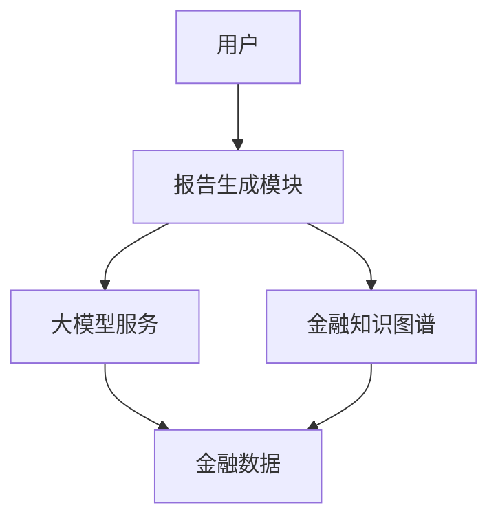
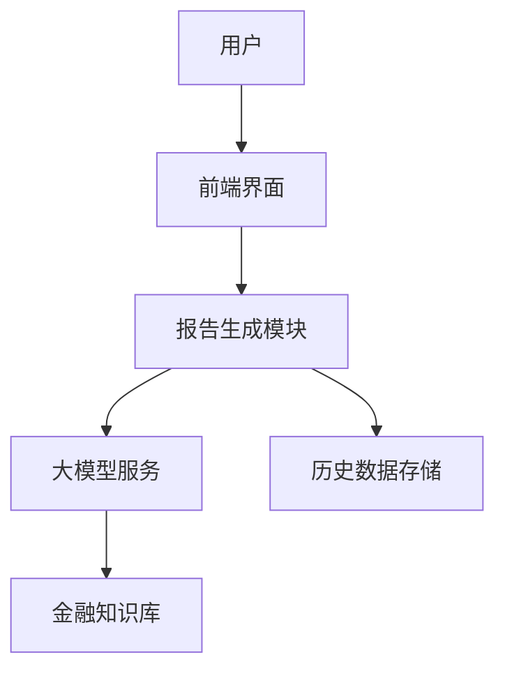
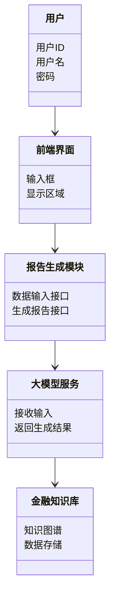
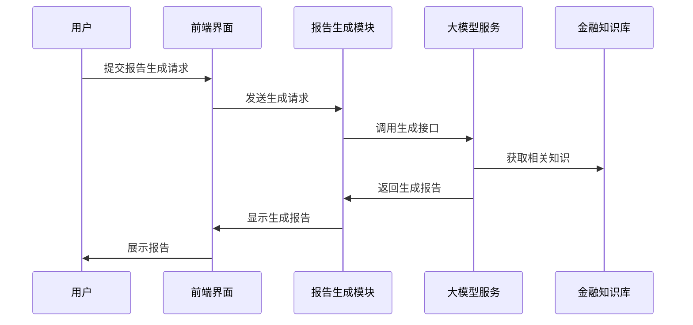

                 


# 开发基于大模型的金融研究报告生成系统

> 关键词：大模型，金融研究报告，生成系统，自然语言处理，深度学习，金融知识图谱

> 摘要：本文详细探讨了基于大模型的金融研究报告生成系统的开发过程。首先介绍了系统的核心背景与问题背景，分析了传统金融研究报告生成方式的局限性与挑战，提出了基于大模型的解决方案。接着，深入讲解了大模型在金融领域的核心应用，包括自然语言处理、知识表示与推理、生成能力等方面的能力。然后，详细分析了系统的算法原理与数学模型，包括大模型的训练过程、生成报告的算法流程等。随后，通过ER实体关系图、类图和架构图等工具，详细设计了系统的架构与接口。最后，通过实际案例展示了系统的实现过程，并提出了最佳实践建议。

---

# 第一部分: 背景介绍与问题背景

## 第1章: 问题背景与需求分析

### 1.1 问题背景介绍

#### 1.1.1 传统金融研究报告的生成方式
传统的金融研究报告生成主要依赖人工撰写，这种方式效率低下、成本高昂，且容易受到主观因素的影响。报告撰写人员需要耗费大量时间收集数据、分析市场趋势、整理信息，并根据经验撰写报告。这种方式不仅效率低，而且难以保证报告的准确性和一致性。

#### 1.1.2 传统方法的局限性与挑战
传统金融研究报告生成方式存在以下主要问题：
- **效率问题**：人工撰写报告耗时较长，难以满足金融机构对快速响应的需求。
- **一致性问题**：不同撰写人员的风格和深度可能不一致，导致报告质量参差不齐。
- **数据处理能力有限**：人工分析难以处理海量数据，且容易遗漏关键信息。
- **成本问题**：专业报告撰写人员的薪资和时间成本较高。

#### 1.1.3 大模型技术的引入与优势
随着大模型技术的快速发展，特别是在自然语言处理（NLP）和生成模型领域的突破，为金融研究报告的自动生成提供了新的可能性。大模型具备以下显著优势：
- **强大的语言理解能力**：能够准确理解金融市场中的复杂文本信息。
- **知识表示与推理能力**：能够基于大规模金融数据和知识图谱进行推理和分析。
- **高效的生成能力**：能够快速生成高质量的金融研究报告。

### 1.2 问题描述与目标

#### 1.2.1 金融研究报告生成的核心问题
金融研究报告生成的核心问题可以归结为以下几点：
- 如何高效地从海量金融数据中提取关键信息？
- 如何利用大模型的生成能力，自动生成符合行业规范的金融报告？
- 如何保证生成报告的准确性和可解释性？

#### 1.2.2 系统目标与功能需求
本系统的目标是开发一个基于大模型的金融研究报告生成系统，具体功能需求如下：
- **数据采集与处理**：能够从多种数据源（如新闻、市场数据、公司财报等）采集数据，并进行清洗和预处理。
- **报告生成**：能够根据输入的金融数据和用户需求，自动生成结构化的金融研究报告。
- **知识图谱支持**：基于金融知识图谱，提供上下文相关性分析和推理能力。
- **用户交互**：提供友好的用户界面，支持用户自定义报告主题和参数。

#### 1.2.3 边界与外延
系统的主要边界包括：
- 仅支持特定类型的金融报告生成（如市场分析报告、行业研究报告）。
- 不提供实时数据更新服务（数据来源需通过外部接口获取）。
- 系统不直接参与金融交易，仅提供报告生成功能。

### 1.3 系统解决方案

#### 1.3.1 基于大模型的技术路线
系统采用基于大模型的技术路线，主要包括以下步骤：
1. **数据预处理**：清洗和标注金融数据，构建金融知识图谱。
2. **模型训练**：基于金融数据和知识图谱，训练大模型。
3. **报告生成**：根据用户输入生成金融研究报告。

#### 1.3.2 系统架构设计思路
系统架构设计遵循模块化原则，主要模块包括：
- 数据采集模块：负责从多种数据源采集金融数据。
- 数据处理模块：对采集的数据进行清洗、标注和预处理。
- 模型训练模块：基于预处理后的数据，训练大模型。
- 报告生成模块：根据用户需求，调用大模型生成金融研究报告。

#### 1.3.3 核心功能模块的实现方案
核心功能模块包括：
- 数据采集与处理模块：实现从新闻网站、金融数据库等多源数据的采集和清洗。
- 模型训练模块：基于Transformer架构，训练大模型。
- 报告生成模块：实现从用户输入到报告生成的完整流程。

### 1.4 核心概念与系统架构

#### 1.4.1 系统核心要素组成
系统的核心要素包括：
- **金融数据**：包括市场数据、公司财报、新闻数据等。
- **金融知识图谱**：构建金融领域的知识图谱，用于模型推理。
- **大模型**：基于Transformer架构的大模型，用于生成报告。
- **用户界面**：提供友好的用户交互界面。

#### 1.4.2 系统功能模块的实体关系图（ER图）


---

## 第2章: 核心概念与联系

### 2.1 大模型在金融领域的核心应用

#### 2.1.1 大模型的自然语言处理能力
大模型在自然语言处理方面的优势体现在以下几个方面：
- **语义理解**：能够准确理解金融领域的专业术语和上下文语义。
- **文本生成**：能够生成符合行业规范的金融报告。

#### 2.1.2 大模型的金融知识表示与推理能力
大模型能够基于金融知识图谱进行推理，帮助生成更准确的报告。金融知识图谱包含以下内容：
- **公司信息**：包括公司基本面、财务数据等。
- **行业信息**：包括行业趋势、竞争格局等。
- **市场信息**：包括市场动态、宏观经济指标等。

#### 2.1.3 大模型的生成能力在金融报告中的应用
大模型的生成能力在金融报告中的应用主要体现在以下方面：
- **市场分析报告**：生成市场趋势分析、行业研究报告等。
- **公司分析报告**：生成公司基本面分析、财务分析等。

### 2.2 核心概念的对比分析

#### 2.2.1 传统NLP技术与大模型的对比
| 对比维度       | 传统NLP技术           | 大模型技术           |
|----------------|----------------------|----------------------|
| 数据需求       | 需要大量标注数据       | 需要小规模数据即可     |
| 模型能力       | 依赖特定任务模型       | 具备通用生成能力       |
| 可解释性       | 较高                  | 较低                  |

#### 2.2.2 金融知识图谱与大模型的关系
金融知识图谱为大模型提供了丰富的知识库，支持其进行推理和生成。两者的关系如下：
- **知识图谱**：提供结构化的金融知识，帮助大模型更好地理解上下文。
- **大模型**：利用知识图谱中的信息，生成更准确的金融报告。

#### 2.2.3 生成模型与大模型的结合
生成模型与大模型的结合主要体现在以下方面：
- **生成过程**：生成模型负责具体报告内容的生成。
- **大模型**：大模型提供全局的语义理解和生成能力。

### 2.3 系统架构的ER实体关系图



---

## 第3章: 大模型的算法原理

### 3.1 大模型的训练过程

#### 3.1.1 数据预处理与特征提取
数据预处理步骤包括：
1. 数据清洗：去除噪声数据，保留有用信息。
2. 数据标注：对数据进行标注，便于模型训练。
3. 数据分割：将数据划分为训练集、验证集和测试集。

#### 3.1.2 模型训练流程
模型训练流程如下：
1. **输入数据**：将预处理后的数据输入模型。
2. **计算损失**：使用交叉熵损失函数计算损失。
3. **反向传播**：通过反向传播更新模型参数。
4. **迭代优化**：重复上述步骤，直到模型收敛。

#### 3.1.3 模型调优与优化
模型调优与优化包括：
- **超参数调整**：调整学习率、批次大小等超参数。
- **模型剪枝**：去除冗余的网络结构。
- **模型集成**：通过集成多个模型提高生成效果。

### 3.2 生成报告的算法流程

#### 3.2.1 输入处理与特征提取
输入处理步骤包括：
1. **输入清洗**：去除输入中的噪声字符。
2. **特征提取**：提取输入中的关键特征。

#### 3.2.2 生成过程
生成过程包括：
1. **初始化**：将输入特征输入生成模型。
2. **解码**：通过解码器生成报告内容。
3. **输出结果**：将生成的报告内容输出。

#### 3.2.3 模型数学公式
交叉熵损失函数的数学表达式如下：
$$ \text{Loss} = -\sum_{i=1}^{n} y_i \log(p_i) $$

---

## 第4章: 系统分析与架构设计

### 4.1 系统功能设计

#### 4.1.1 领域模型类图


#### 4.1.2 系统架构图


#### 4.1.3 接口设计
系统接口设计如下：
- **用户输入接口**：接收用户的输入请求。
- **生成报告接口**：调用大模型生成报告。
- **数据存储接口**：存储生成的报告数据。

#### 4.1.4 交互流程图


---

## 第5章: 项目实战

### 5.1 环境安装

#### 5.1.1 安装Python
```bash
python --version
pip install --upgrade pip
```

#### 5.1.2 安装相关库
```bash
pip install numpy
pip install pandas
pip install transformers
pip install torch
```

### 5.2 核心代码实现

#### 5.2.1 数据预处理代码
```python
import pandas as pd
import torch
from transformers import AutoTokenizer, AutoModel

def preprocess_data(data):
    tokenizer = AutoTokenizer.from_pretrained('bert-base-uncased')
    inputs = tokenizer(data, return_tensors='pt')
    return inputs
```

#### 5.2.2 模型训练代码
```python
import torch
import torch.nn as nn
import torch.optim as optim

class SimpleModel(nn.Module):
    def __init__(self):
        super(SimpleModel, self).__init__()
        self.fc = nn.Linear(10, 5)
    
    def forward(self, x):
        return self.fc(x)

model = SimpleModel()
criterion = nn.CrossEntropyLoss()
optimizer = optim.SGD(model.parameters(), lr=0.01)
```

#### 5.2.3 报告生成代码
```python
import torch
from transformers import AutoTokenizer, AutoModelForCausalLM

tokenizer = AutoTokenizer.from_pretrained('gpt2')
model = AutoModelForCausalLM.from_pretrained('gpt2')

inputs = tokenizer("生成一份关于科技行业的报告", return_tensors="pt")
outputs = model.generate(inputs.input_ids, max_length=500)
print(tokenizer.decode(outputs[0], skip_special_tokens=True))
```

### 5.3 案例分析与详细解读

#### 5.3.1 案例分析
以生成一份科技行业报告为例，详细解读生成过程：
1. **输入处理**：用户输入“生成一份关于科技行业的报告”。
2. **数据预处理**：将输入文本进行分词和编码。
3. **模型调用**：调用生成模型，生成报告内容。
4. **结果输出**：将生成的报告内容返回给用户。

#### 5.3.2 详细解读
- **输入处理**：用户输入的文本经过分词和编码，转换为模型能够理解的格式。
- **模型调用**：生成模型基于输入内容，结合金融知识图谱，生成符合要求的报告。
- **结果输出**：生成的报告内容经过解码，返回给用户。

### 5.4 项目小结

---

## 第6章: 最佳实践与注意事项

### 6.1 最佳实践

#### 6.1.1 数据质量的重要性
确保输入数据的准确性和完整性，是生成高质量报告的前提条件。

#### 6.1.2 模型调优的技巧
通过调整超参数和优化模型结构，可以显著提高生成报告的质量。

#### 6.1.3 系统的维护与优化
定期更新模型和优化系统架构，确保系统的稳定性和高效性。

### 6.2 注意事项

#### 6.2.1 数据隐私与合规性
在处理金融数据时，必须遵守相关法律法规，确保数据隐私和合规性。

#### 6.2.2 模型的可解释性
提高模型的可解释性，有助于更好地理解和优化生成过程。

#### 6.2.3 系统的扩展性
在设计系统时，应考虑其扩展性，以便未来功能的扩展和升级。

### 6.3 拓展阅读

#### 6.3.1 大模型在金融领域的其他应用
了解大模型在金融领域的其他应用，如风险评估、投资决策等。

#### 6.3.2 最新研究成果
关注大模型领域的最新研究成果，保持技术的前沿性。

---

# 第七章: 小结与展望

## 7.1 小结

通过本文的详细探讨，我们了解了基于大模型的金融研究报告生成系统的开发过程。从背景介绍到系统实现，再到项目实战，我们全面分析了系统的各个组成部分，并通过实际案例展示了系统的实现过程。本文还提出了最佳实践建议，为读者提供了宝贵的参考。

## 7.2 展望

随着大模型技术的不断发展，金融研究报告生成系统的功能和性能将不断提升。未来，我们可以进一步优化系统的生成能力，扩展系统的应用场景，为金融机构提供更高效、更智能的报告生成服务。

---

# 作者：AI天才研究院/AI Genius Institute & 禅与计算机程序设计艺术 /Zen And The Art of Computer Programming

