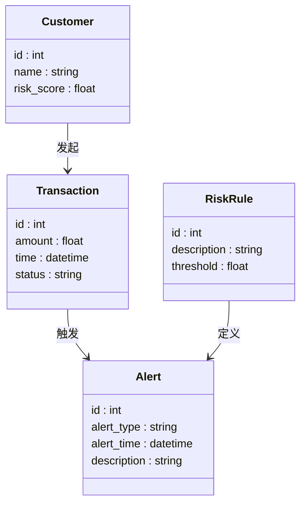
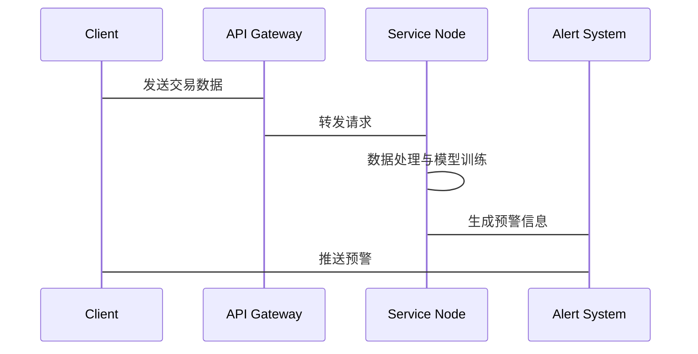

                 


# 构建AI驱动的风控系统：实时监控与风险预警

## 关键词：AI驱动，风控系统，实时监控，风险预警，机器学习，时间序列分析，异常检测

## 摘要：随着金融行业对实时监控和风险预警需求的不断增加，AI驱动的风控系统成为保障金融安全的重要手段。本文将从AI驱动风控的基本概念出发，逐步分析其实时监控与风险预警的实现机制，涵盖核心算法、系统架构设计及实际项目案例。通过详细的技术讲解和实践指导，帮助读者全面掌握构建高效AI驱动风控系统的方法。

---

# 第一部分：AI驱动的风控系统基础

## 第1章：背景介绍

### 1.1 AI驱动风控的基本概念

#### 1.1.1 从传统风控到AI驱动风控的演变

传统风控系统依赖于规则和经验，存在响应速度慢、覆盖率低的问题。随着数据量的爆炸式增长和计算能力的提升，AI技术的应用使得风控系统能够实时处理海量数据，实现自动化、智能化的风险评估与预警。

#### 1.1.2 实时监控与风险预警的重要性

在金融领域，实时监控能够及时发现异常交易和潜在风险，避免重大损失。风险预警系统通过预测模型，提前警示可能的风险事件，帮助机构采取预防措施。

#### 1.1.3 AI在风控系统中的作用

AI技术通过机器学习、深度学习等方法，从大量数据中提取特征，训练预测模型，实现对风险的精准识别和量化评估。

### 1.2 问题背景与描述

#### 1.2.1 风险管理的传统挑战

传统风控系统面临数据维度单一、规则静态、响应滞后等问题，难以应对复杂多变的市场环境。

#### 1.2.2 数据驱动的风险管理需求

现代金融机构需要利用大数据技术，从多源数据中提取有价值的信息，用于风险评估和决策支持。

#### 1.2.3 AI如何解决传统风控的痛点

AI技术能够实时处理海量数据，动态调整模型参数，快速识别潜在风险，显著提高了风控的效率和准确性。

---

## 第2章：核心概念与联系

### 2.1 AI驱动风控系统的原理

#### 2.1.1 数据流与模型训练

AI驱动的风控系统需要实时采集交易数据、用户行为数据等多源数据，经过清洗、特征提取后，输入到机器学习模型中进行训练，生成风险评估模型。

#### 2.1.2 实时监控与预警机制

通过流数据处理技术，实时监控系统能够动态更新风险评估结果，并根据预设阈值触发预警。

#### 2.1.3 系统的整体架构

AI驱动的风控系统通常包括数据采集层、数据处理层、模型训练层、实时监控层和预警展示层。

### 2.2 核心概念对比表格

| **概念**      | **传统风控**                | **AI驱动风控**               |
|---------------|-----------------------------|------------------------------|
| 数据来源      | 单一数据源                 | 多源数据（交易、行为、外部数据）|
| 模型类型      | 基于规则                   | 机器学习、深度学习模型        |
| 响应时间      | 事后处理                   | 实时处理                     |
| 精度          | 有限                       | 更高                         |

### 2.3 ER模型与实体关系图

```mermaid
erDiagram
    customer[客户] {
        id : int
        name : string
        risk_score : float
    }
    transaction[交易] {
        id : int
        amount : float
        time : datetime
        status : string
    }
    risk_rule[风险规则] {
        id : int
        description : string
        threshold : float
    }
    alert[预警信息] {
        id : int
        alert_type : string
        alert_time : datetime
        description : string
    }
    customer --> transaction : 发起
    customer --> risk_rule : 遵循
    transaction --> alert : 触发
    risk_rule --> alert : 定义
```

---

## 第3章：算法原理讲解

### 3.1 时间序列分析

#### 3.1.1 时间序列分析的原理

时间序列分析通过分析数据随时间的变化趋势，识别周期性、趋势性和随机性成分，预测未来的风险事件。

#### 3.1.2 时间序列分析的流程

1. 数据预处理：去除异常值、填充缺失值。
2. 选择模型：ARIMA、LSTM等。
3. 模型训练与验证。
4. 预测与评估。

#### 3.1.3 时间序列分析的Python实现

```python
import pandas as pd
import numpy as np
from statsmodels.tsa.arima_model import ARIMA
# 加载数据
data = pd.read_csv('transactions.csv')
# 数据预处理
data['time'] = pd.to_datetime(data['time'])
data.set_index('time', inplace=True)
# 模型训练
model = ARIMA(data['amount'], order=(5,1,0))
model_fit = model.fit(disp=0)
# 预测
forecast = model_fit.forecast(steps=5)
print(forecast)
```

### 3.2 异常检测

#### 3.2.1 异常检测的原理

异常检测通过统计分析或机器学习方法，识别数据中的异常点，预警潜在风险。

#### 3.2.2 异常检测的流程

1. 数据标准化。
2. 选择算法：Isolation Forest、One-Class SVM。
3. 模型训练。
4. 异常检测与可视化。

#### 3.2.3 异常检测的Python实现

```python
from sklearn.ensemble import IsolationForest
import pandas as pd
# 加载数据
data = pd.read_csv('transactions.csv')
# 数据标准化
data_norm = (data - data.mean()) / data.std()
# 模型训练
iso_forest = IsolationForest(n_estimators=100, random_state=42)
iso_forest.fit(data_norm)
# 预测异常
outlier_predictions = iso_forest.predict(data_norm)
print(outlier_predictions)
```

### 3.3 机器学习模型（如LSTM）

#### 3.3.1 LSTM的原理

LSTM（长短期记忆网络）通过记忆单元和控制门，有效捕捉时间序列中的长程依赖关系。

#### 3.3.2 LSTM的数学模型

$$
f_t = \sigma(W_f x_t + U_f h_{t-1} + b_f)
$$

$$
i_t = \sigma(W_i x_t + U_i h_{t-1} + b_i)
$$

$$
o_t = \sigma(W_o x_t + U_o h_{t-1} + b_o)
$$

$$
h_t = f_t \cdot c_{t-1} + i_t \cdot g(x_t, h_{t-1})
$$

$$
c_t = h_t \cdot o_t
$$

#### 3.3.3 LSTM的Python实现

```python
import tensorflow as tf
from tensorflow.keras import layers
# 模型定义
model = tf.keras.Sequential()
model.add(layers.LSTM(64, input_shape=(None, input_dim)))
model.add(layers.Dense(1))
model.compile(optimizer='adam', loss='mse')
# 模型训练
model.fit(X_train, y_train, epochs=10, batch_size=32)
```

---

## 第4章：系统分析与架构设计方案

### 4.1 系统设计思路

#### 4.1.1 功能需求

- 实时数据采集
- 数据处理与特征提取
- 模型训练与部署
- 实时监控与预警
- 预警展示与报告

#### 4.1.2 领域模型



#### 4.1.3 系统架构图


#### 4.1.4 接口设计

- 数据接口：REST API，用于数据采集和传输。
- 模型接口：API，用于模型训练和预测。
- 预警接口：WebSocket，用于实时推送预警信息。

#### 4.1.5 系统交互



---

## 第5章：项目实战

### 5.1 环境配置

- 安装必要的库：TensorFlow、Kafka、Flask。
- 配置开发环境：Jupyter Notebook、PyCharm。

### 5.2 数据预处理

#### 5.2.1 数据清洗

- 去除重复数据。
- 处理缺失值。
- 标准化数据。

#### 5.2.2 特征工程

- 时间特征提取：时间戳、时间差。
- 用户特征提取：用户行为特征、交易频率。

### 5.3 模型训练

#### 5.3.1 训练LSTM模型

```python
import tensorflow as tf
from tensorflow.keras import layers
# 模型定义
model = tf.keras.Sequential()
model.add(layers.LSTM(64, input_shape=(None, input_dim)))
model.add(layers.Dense(1))
model.compile(optimizer='adam', loss='mse')
# 模型训练
model.fit(X_train, y_train, epochs=10, batch_size=32)
```

#### 5.3.2 部署模型到生产环境

使用Flask构建API，部署到服务器，提供实时预测服务。

### 5.4 实时监控与预警

#### 5.4.1 实时数据流处理

使用Kafka处理实时交易数据，通过Flask API传递给模型进行预测。

#### 5.4.2 预警触发机制

设置风险阈值，当预测结果超过阈值时，触发预警，并通过WebSocket推送预警信息。

### 5.5 实际案例分析

#### 5.5.1 案例背景

某银行希望通过AI驱动的风控系统，实时监控信用卡交易，识别欺诈交易。

#### 5.5.2 数据收集与分析

收集过去一年的信用卡交易数据，包括交易金额、时间、地点、用户信息等。

#### 5.5.3 模型训练与优化

训练LSTM模型，识别欺诈交易的特征，优化模型性能。

#### 5.5.4 系统部署与测试

部署系统到生产环境，进行压力测试和性能调优。

### 5.6 项目小结

通过实际案例分析，展示了如何利用AI技术构建实时监控与风险预警系统，提高了风险识别的效率和准确性。

---

## 第6章：最佳实践、小结与注意事项

### 6.1 最佳实践

- 数据是关键，确保数据的准确性和完整性。
- 模型选择要根据具体场景，进行充分的实验和对比。
- 系统设计要注重可扩展性和可维护性。

### 6.2 小结

本文详细讲解了AI驱动的风控系统的构建过程，从背景介绍到项目实战，全面覆盖了核心概念、算法原理、系统架构和实际应用。

### 6.3 注意事项

- 数据隐私和安全问题需要高度重视。
- 模型需要定期更新，以应对数据分布的变化。
- 系统需要具备容错和容灾能力，确保稳定运行。

---

## 作者：AI天才研究院/AI Genius Institute & 禅与计算机程序设计艺术 /Zen And The Art of Computer Programming

