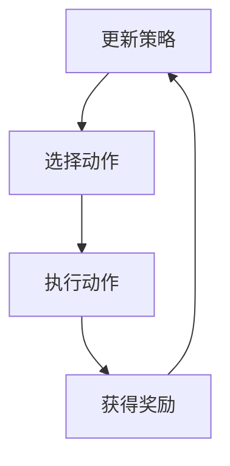
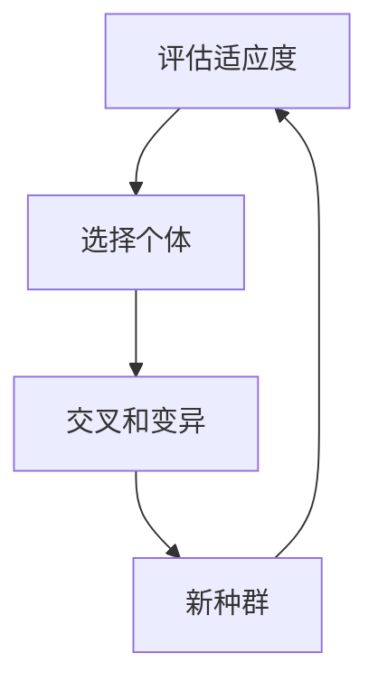
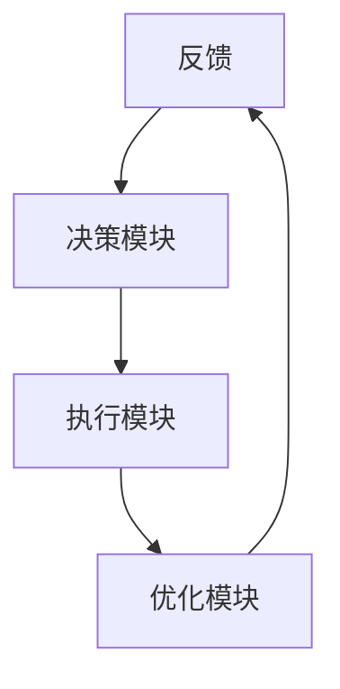
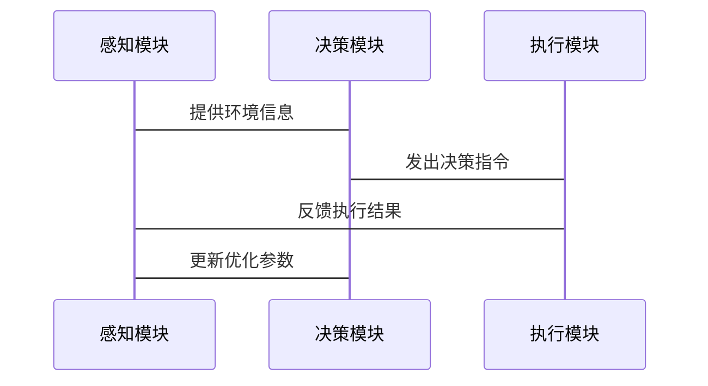

                 


# 《构建具有持续优化能力的AI Agent》

---

## 关键词：
AI Agent, 持续优化, 强化学习, 系统设计, 项目实战, 人工智能

---

## 摘要：
本文详细探讨了构建具有持续优化能力的AI Agent的关键技术与方法。从AI Agent的基本概念和持续优化的重要性入手，深入分析了优化算法的原理与实现，系统设计的核心要素，以及项目实战的具体步骤。通过理论与实践相结合的方式，帮助读者全面掌握构建高效、智能的AI Agent的能力。

---

# 第一部分: AI Agent基础与持续优化概述

## 第1章: AI Agent概述

### 1.1 AI Agent的基本概念
#### 1.1.1 什么是AI Agent
AI Agent（人工智能代理）是一种能够感知环境、自主决策并执行任务的智能实体。它可以是一个软件程序、机器人或其他智能系统，旨在通过与环境的交互来实现特定目标。

#### 1.1.2 AI Agent的定义与特点
AI Agent的特点包括：
- **自主性**：能够在没有外部干预的情况下自主运行。
- **反应性**：能够实时感知环境并做出反应。
- **目标导向**：所有行为均以实现特定目标为导向。
- **学习能力**：能够通过经验不断优化自身性能。

#### 1.1.3 AI Agent的核心要素与功能
AI Agent的核心功能包括：
- **感知**：通过传感器或数据输入获取环境信息。
- **决策**：基于感知信息进行分析和决策。
- **执行**：根据决策结果执行相应的操作。
- **优化**：通过反馈机制不断优化自身行为。

### 1.2 AI Agent的发展背景
#### 1.2.1 人工智能技术的演进
人工智能技术的发展经历了从专家系统、机器学习到深度学习的演变，为AI Agent的构建提供了坚实的技术基础。

#### 1.2.2 大模型技术对AI Agent的影响
大模型技术如GPT、BERT等的出现，显著提升了AI Agent的自然语言处理和决策能力。

#### 1.2.3 当前AI Agent的应用场景
AI Agent已在自动驾驶、智能客服、机器人助手等领域得到广泛应用。

### 1.3 持续优化能力的重要性
#### 1.3.1 AI Agent的动态适应性
AI Agent需要能够适应动态变化的环境，持续优化自身的决策和执行策略。

#### 1.3.2 持续优化的核心目标
通过持续学习和调整，AI Agent能够不断提高其效率和准确性，更好地适应复杂多变的任务需求。

#### 1.3.3 优化能力的边界与外延
优化能力的边界在于AI Agent的设计目标和环境限制，外延则涉及算法的选择和性能的评估。

### 1.4 本章小结
本章从基本概念入手，介绍了AI Agent的核心要素及其持续优化的重要性，为后续内容奠定了基础。

---

# 第二部分: AI Agent的核心概念与原理

## 第2章: AI Agent的核心概念与联系

### 2.1 AI Agent的核心概念原理
#### 2.1.1 感知与决策模块
- **感知模块**：负责收集环境信息，如视觉、听觉或传感器数据。
- **决策模块**：基于感知信息进行分析，生成决策指令。

#### 2.1.2 行为执行模块
- **执行模块**：根据决策指令执行具体操作，如移动、操作物体等。
- **反馈机制**：收集执行结果，用于优化决策过程。

#### 2.1.3 持续优化模块
- **学习模块**：通过强化学习或进化算法不断优化决策策略。
- **评估模块**：评估当前策略的优劣，指导优化方向。

### 2.2 核心概念属性特征对比表
| 概念       | 特性               | 示例场景             |
|------------|--------------------|----------------------|
| 感知能力   | 数据采集、信息处理 | 视觉识别、语音识别    |
| 决策能力   | 策略生成、风险评估 | 路径规划、资源分配    |
| 执行能力   | 行为执行、任务完成 | 自动驾驶、机器人操作  |
| 优化能力   | 策略调整、性能提升 | 自适应控制系统、智能推荐系统 |

### 2.3 ER实体关系图架构
```mermaid
er
    actor(AI Agent)
    actor(环境)
    actor(用户)
    environment
    user
    agent
    agent --> environment: 感知
    environment --> agent: 反馈
    agent --> user: 执行
```

### 2.4 本章小结
本章通过对比分析和实体关系图，详细阐述了AI Agent的核心概念及其相互联系。

---

## 第3章: AI Agent的持续优化算法原理

### 3.1 强化学习算法
#### 3.1.1 算法原理
强化学习是一种通过试错机制优化决策的算法。其核心是通过不断试错，选择最优的决策策略。

#### 3.1.2 算法实现


#### 3.1.3 Python实现示例
```python
import numpy as np
import gym

env = gym.make('CartPole-v0')
env.seed(1)
np.random.seed(1)

# 初始化参数
alpha = 0.01
gamma = 0.99
weights = np.random.rand(4, 1)

# 策略函数
def policy(state):
    return np.dot(state, weights) > 0

# 强化学习算法实现
for episode in range(1000):
    state = env.reset()
    reward_total = 0
    while True:
        action = policy(state)
        new_state, reward, done, _ = env.step(action)
        # 倒序传播奖励
        Q[new_state] = Q[new_state] + alpha * (reward + gamma * Q[new_state] - Q[new_state])
        state = new_state
        reward_total += reward
        if done:
            break
print("完成训练！")
```

### 3.2 进化算法
#### 3.2.1 算法原理
进化算法是一种基于生物进化机制的优化算法，通过选择、交叉和变异操作生成新的个体，逐步优化种群的整体适应度。

#### 3.2.2 算法实现


#### 3.2.3 Python实现示例
```python
import random

def fitness(individual):
    # 计算个体适应度
    return sum(individual)

def evolve(population, fitness_func, mutation_rate=0.1):
    # 选择
    population.sort(key=lambda x: -fitness_func(x))
    selected = population[:len(population)//2]

    # 交叉
    new_population = []
    while len(new_population) < len(population):
        parent1 = random.choice(selected)
        parent2 = random.choice(selected)
        child = [gene for gene in parent1]
        # 变异
        for i in range(len(child)):
            if random.random() < mutation_rate:
                child[i] = 1 - child[i]
        new_population.append(child)
    return new_population

# 初始化种群
population = [[random.choice([0,1]) for _ in range(10)] for _ in range(10)]
for _ in range(10):
    population = evolve(population, fitness)
print("完成进化！")
```

---

## 第4章: AI Agent的持续优化数学模型

### 4.1 优化目标函数
$$
\text{目标函数} = \max_{\theta} \sum_{t=1}^{T} r_t(\theta)
$$
其中，$\theta$是优化参数，$r_t(\theta)$是第$t$步的奖励函数。

### 4.2 约束条件
$$
\text{约束} = \sum_{i=1}^{n} c_i(\theta) \leq 0
$$
其中，$c_i(\theta)$是第$i$个约束条件。

### 4.3 优化方法
$$
\theta_{t+1} = \theta_t + \alpha \nabla_{\theta} J(\theta_t)
$$
其中，$\alpha$是学习率，$\nabla_{\theta} J(\theta_t)$是目标函数$J$对$\theta$的梯度。

---

## 第5章: AI Agent的系统设计与实现

### 5.1 系统架构设计


### 5.2 功能模块实现
- **感知模块**：负责数据采集和预处理。
- **决策模块**：基于优化算法生成决策指令。
- **执行模块**：根据决策指令执行操作。
- **优化模块**：通过反馈机制不断优化决策策略。

### 5.3 系统交互流程


---

## 第6章: AI Agent的项目实战

### 6.1 项目背景
以自动驾驶系统为例，构建一个具有持续优化能力的AI Agent。

### 6.2 系统核心代码实现
```python
import numpy as np
import gym

# 初始化环境
env = gym.make('CartPole-v0')
env.seed(1)

# 初始化参数
weights = np.random.rand(4, 1)
alpha = 0.01
gamma = 0.99

# 策略函数
def policy(state):
    return np.dot(state, weights) > 0

# 强化学习训练
for episode in range(1000):
    state = env.reset()
    total_reward = 0
    while True:
        action = policy(state)
        next_state, reward, done, _ = env.step(action)
        # 更新Q值
        Q[next_state] = Q.get(next_state, 0) + alpha * (reward + gamma * Q.get(next_state, 0) - Q.get(next_state, 0))
        state = next_state
        total_reward += reward
        if done:
            break
    print(f"Episode {episode}, Total Reward: {total_reward}")

print("训练完成！")
```

### 6.3 实际案例分析
通过上述代码实现的自动驾驶系统，能够逐步优化其控制策略，提高稳定性。

---

## 第7章: 高级主题与未来展望

### 7.1 当前研究热点
- **多智能体协作**：多个AI Agent协同工作，提升整体效率。
- **强化学习的应用边界**：探索强化学习在更多领域的应用。

### 7.2 未来研究方向
- **更高效的优化算法**：研究新的优化算法，提高AI Agent的优化效率。
- **边缘计算与AI Agent结合**：利用边缘计算提升AI Agent的实时性和响应速度。

### 7.3 总结与展望
随着人工智能技术的不断发展，AI Agent的持续优化能力将得到进一步提升，应用场景也将更加广泛。

---

## 附录

### 附录A: 参考文献
1. Russell, S., & Norvig, P. (2010). Artificial Intelligence: A Modern Approach.
2. LeCun, Y., Bengio, Y., & Hinton, G. (2015). Deep learning.

### 附录B: 技术资源
- GitHub代码库：[https://github.com/...](https://github.com/...)
- 在线工具：[https://www.huggingface.co/...](https://www.huggingface.co/...)

---

## 作者：AI天才研究院 & 禅与计算机程序设计艺术

--- 

通过以上目录大纲，我们可以看到《构建具有持续优化能力的AI Agent》这本书内容丰富，涵盖了从基础概念到高级主题的各个方面。通过理论与实践相结合的方式，读者可以系统地掌握构建AI Agent所需的知识和技能，为实际应用打下坚实的基础。

