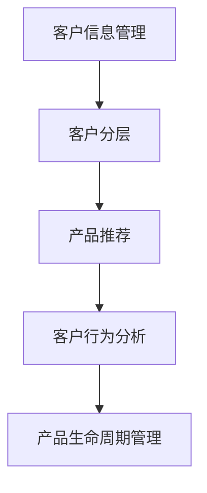
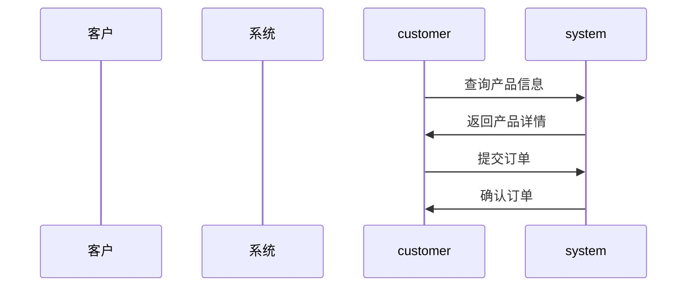

                 


# 金融产品客户生命周期管理平台

## 关键词：金融产品、客户生命周期、管理平台、系统架构、算法原理、项目实战

## 摘要：金融产品客户生命周期管理平台是金融行业数字化转型的重要组成部分，通过整合客户信息、产品生命周期和客户行为分析，实现客户全生命周期的精准管理。本文从平台背景、核心概念、算法原理、系统架构到项目实战，全面剖析该平台的构建与应用。

---

# 第一部分：金融产品客户生命周期管理平台概述

## 第1章：金融产品客户生命周期管理平台的背景与目标

### 1.1 金融行业的数字化转型

#### 1.1.1 金融行业的现状与挑战

随着金融行业的快速发展，市场竞争日益激烈。传统的客户管理模式已无法满足现代金融业务的需求。金融机构需要更加精准的客户管理策略，以提高客户满意度和忠诚度，同时降低客户流失率。

#### 1.1.2 数字化转型的必要性

数字化转型已成为金融行业不可忽视的趋势。通过引入先进的技术手段，如大数据、人工智能等，金融机构可以更好地洞察客户需求，优化业务流程，提升运营效率。

#### 1.1.3 客户生命周期管理的重要性

客户生命周期管理（Customer Lifetime Value，CLV）是企业优化客户关系、提高客户忠诚度的重要手段。通过分析客户在整个生命周期中的行为和需求，金融机构可以制定个性化的服务策略，从而提高客户满意度和业务收益。

### 1.2 客户生命周期管理的核心概念

#### 1.2.1 客户生命周期的定义与阶段划分

客户生命周期是指客户与企业之间的关系从开始到结束的全过程。通常包括以下几个阶段：获取阶段、发展阶段、成熟阶段、衰退阶段和终止阶段。

#### 1.2.2 金融产品与客户生命周期的关系

金融产品是客户生命周期管理的重要载体。不同阶段的客户可能需要不同类型的产品和服务。例如，新客户可能需要基础理财产品，而长期客户可能需要定制化的投资方案。

#### 1.2.3 平台的目标与价值

平台的目标是通过整合客户信息、产品信息和客户行为数据，实现客户全生命周期的精准管理。其价值体现在提升客户满意度、优化资源配置、提高销售效率和降低运营成本等方面。

### 1.3 平台建设的必要性与意义

#### 1.3.1 当前客户管理的痛点

传统客户管理存在数据分散、分析能力弱、个性化服务不足等问题。这些问题导致金融机构难以有效识别和满足客户需求，影响客户体验和业务增长。

#### 1.3.2 平台建设对企业竞争力的提升

通过建设客户生命周期管理平台，金融机构可以实现客户数据的集中管理和深度分析，从而制定更具针对性的营销策略，提升市场竞争力。

#### 1.3.3 平台对客户体验的优化作用

平台能够根据客户的个性化需求，提供定制化的服务和产品推荐，从而提升客户满意度和忠诚度，增强客户粘性。

---

## 第2章：客户生命周期管理平台的核心概念与联系

### 2.1 核心概念原理

#### 2.1.1 客户信息管理

客户信息管理是平台的基础功能，包括客户的基本信息、资产信息、交易记录等。通过对客户信息的整合和分析，可以为后续的客户分层和产品推荐提供数据支持。

#### 2.1.2 产品生命周期管理

产品生命周期管理包括产品的开发、销售、维护和终止等阶段。通过跟踪产品的生命周期，金融机构可以更好地规划产品策略，满足客户需求。

#### 2.1.3 客户行为分析

客户行为分析通过对客户的行为数据进行挖掘和分析，识别客户的偏好和潜在需求。例如，通过分析客户的交易记录，可以预测客户的购买倾向。

### 2.2 核心概念属性特征对比表

以下表格对比了客户信息管理、产品生命周期管理和客户行为分析的核心属性特征：

| 概念               | 属性               | 特征描述                                   |
|--------------------|--------------------|------------------------------------------|
| 客户信息管理       | 基本信息           | 姓名、身份证号、联系方式                   |
|                    | 资产信息           | 账户余额、投资组合                       |
|                    | 交易记录           | 交易时间、金额、产品类型                 |
| 产品生命周期管理   | 产品类型           | 理财产品、基金、保险等                   |
|                    | 生命周期阶段       | 产品发行、销售、持有、终止               |
| 客户行为分析       | 行为记录           | 登录记录、交易记录、咨询记录             |
|                    | 行为偏好           | 喜欢的产品类型、交易频率                 |

### 2.3 ER实体关系图

以下是一个简单的ER实体关系图，展示了客户、产品和交易之间的关系：

```mermaid
erd
    Customer {
        id: int
        name: string
        contact_info: string
        assets: float
        risk_score: float
    }
    
    Product {
        id: int
        name: string
        type: string
        lifecycle_stage: string
        risk_level: string
    }
    
    Transaction {
        id: int
        customer_id: int
        product_id: int
        amount: float
        time: datetime
    }
    
    Customer ---->> Product: "持有"
    Customer ---->> Transaction: "发起"
    Product ---->> Transaction: "被购买"
```

---

## 第3章：客户生命周期管理平台的算法原理

### 3.1 算法选择与原理

在客户生命周期管理平台中，常用的算法包括决策树、聚类分析和时间序列分析等。以下是决策树算法的简要原理：

决策树是一种基于树结构的分类和回归方法。通过构建决策树，可以将客户划分为不同的群体，每个群体具有相似的特征和行为模式。

### 3.2 算法实现步骤

以下是决策树算法的实现步骤：

1. **数据准备**：收集和整理客户数据，包括客户的基本信息、交易记录和产品持有情况等。
2. **特征选择**：根据业务需求，选择对客户分层最有意义的特征，如资产规模、交易频率等。
3. **模型训练**：使用训练数据构建决策树模型。
4. **模型评估**：通过测试数据评估模型的准确性和稳定性。
5. **模型应用**：将模型应用于实际数据，对客户进行分层和预测。

### 3.3 算法代码示例

以下是一个简单的决策树算法实现示例：

```python
from sklearn.tree import DecisionTreeClassifier
from sklearn.model_selection import train_test_split
import pandas as pd

# 加载数据
data = pd.read_csv('customer_data.csv')

# 特征选择
X = data[['assets', 'transaction_freq', 'risk_score']]
y = data['customer_segment']

# 数据分割
X_train, X_test, y_train, y_test = train_test_split(X, y, test_size=0.2, random_state=42)

# 模型训练
model = DecisionTreeClassifier()
model.fit(X_train, y_train)

# 模型预测
y_pred = model.predict(X_test)

# 模型评估
print("Accuracy:", accuracy_score(y_test, y_pred))
```

### 3.4 算法数学模型

决策树算法的核心是信息增益。信息增益的计算公式如下：

$$
\text{信息增益} = \text{熵}(S) - \sum \text{权重} \times \text{熵}(S_i)
$$

其中，$S$ 是数据集，$S_i$ 是划分后的子集，权重是子集的大小占比。

---

## 第4章：客户生命周期管理平台的系统架构设计

### 4.1 系统功能设计

以下是平台的主要功能模块：

- **客户信息管理**：包括客户基本信息的录入、修改和查询。
- **产品生命周期管理**：包括产品信息的录入、更新和生命周期监控。
- **客户行为分析**：通过分析客户的交易记录和咨询记录，识别客户的偏好和潜在需求。
- **客户分层与推荐**：根据客户特征和行为数据，进行客户分层，并推荐适合的产品和服务。

### 4.2 系统架构设计

以下是平台的系统架构图：



### 4.3 接口设计

以下是平台的主要接口：

- **客户信息查询接口**：根据客户ID查询客户的基本信息和资产信息。
- **产品信息查询接口**：根据产品ID查询产品的详细信息和生命周期阶段。
- **交易记录查询接口**：根据客户ID查询客户的交易记录和行为数据。

### 4.4 系统交互流程图

以下是系统交互流程图：



---

## 第5章：客户生命周期管理平台的项目实战

### 5.1 环境搭建

#### 5.1.1 安装Python和相关库

- 安装Python：从官方网站下载并安装Python 3.x。
- 安装必要的库：使用pip安装`pandas`, `scikit-learn`, `mermaid`, `graphviz`等库。

### 5.2 核心功能实现

#### 5.2.1 客户信息管理模块

以下是客户信息管理模块的实现代码：

```python
import pandas as pd

# 加载数据
data = pd.read_csv('customer_data.csv')

# 数据预处理
data.dropna(inplace=True)
data['customer_id'] = data['customer_id'].astype(str)

# 数据存储
data.to_csv('processed_customer_data.csv', index=False)
```

#### 5.2.2 客户分层模块

以下是客户分层模块的实现代码：

```python
from sklearn.cluster import KMeans

# 加载数据
data = pd.read_csv('processed_customer_data.csv')

# 特征选择
X = data[['assets', 'transaction_freq', 'risk_score']]

# 模型训练
model = KMeans(n_clusters=3, random_state=42)
model.fit(X)

# 预测客户分层
data['customer_segment'] = model.predict(X)

# 数据存储
data.to_csv('segmented_customer_data.csv', index=False)
```

### 5.3 案例分析与解读

#### 5.3.1 案例分析

假设我们有一个客户数据库，包含以下字段：客户ID、资产规模、交易频率和风险评分。通过客户分层模块，我们可以将客户分为三个群体：高净值客户、中净值客户和低净值客户。

#### 5.3.2 案例解读

通过客户分层，我们可以为不同群体的客户推荐不同类型的产品和服务。例如，高净值客户可以推荐高端理财产品，中净值客户可以推荐稳健型基金，低净值客户可以推荐低风险的短期理财产品。

---

## 第6章：客户生命周期管理平台的最佳实践与总结

### 6.1 最佳实践

- **数据质量管理**：确保数据的准确性和完整性，避免数据冗余和重复。
- **模型优化**：根据实际需求，不断优化模型的准确性和稳定性。
- **系统安全性**：加强系统的安全性，防止数据泄露和攻击。

### 6.2 小结

客户生命周期管理平台是金融行业数字化转型的重要工具。通过整合客户信息、产品生命周期和客户行为分析，金融机构可以实现客户全生命周期的精准管理，提升客户满意度和忠诚度，增强市场竞争力。

### 6.3 注意事项

- 在实际应用中，需注意数据隐私和合规性问题。
- 系统设计需具备可扩展性和可维护性，以应对未来业务需求的变化。

### 6.4 拓展阅读

- 《Data Mining: The Textbook》
- 《机器学习实战》
- 《金融产品创新与风险管理》

---

## 作者：AI天才研究院/AI Genius Institute & 禅与计算机程序设计艺术 /Zen And The Art of Computer Programming

---

以上是关于《金融产品客户生命周期管理平台》的技术博客文章。文章从背景、核心概念、算法原理、系统架构到项目实战，全面剖析了该平台的构建与应用。通过本文的分析和解读，读者可以深入了解客户生命周期管理平台的实现方法，并将其应用于实际业务中。

