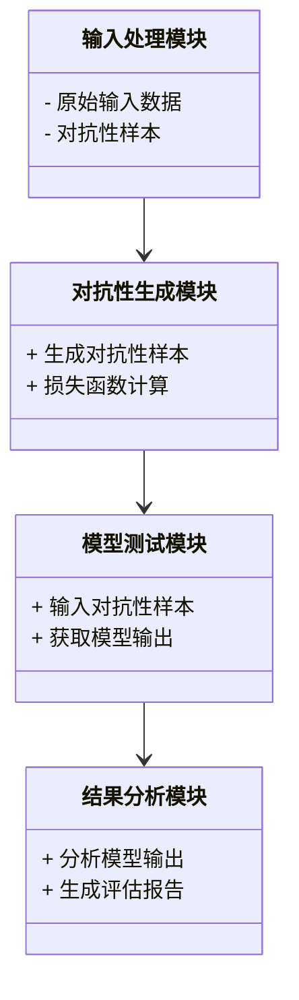
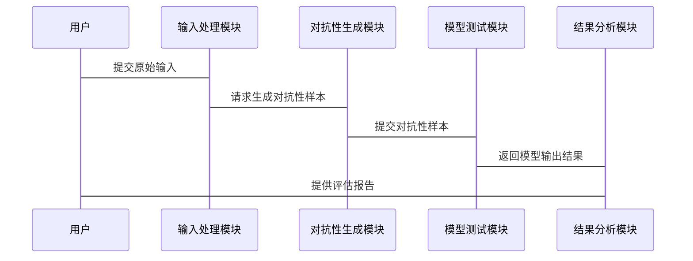

                 


# AI Agent 的对抗性测试：提高 LLM 的鲁棒性

> 关键词：AI Agent, 对抗性测试, 大语言模型, LLM, 鲁棒性, 安全性, 测试框架

> 摘要：本文深入探讨了AI Agent的对抗性测试，重点分析了其在提高大语言模型（LLM）鲁棒性中的应用。通过系统化的分析和实战案例，本文详细讲解了对抗性测试的原理、算法实现、系统架构设计以及项目实战，旨在为读者提供从理论到实践的全面指导。

---

## 第一部分: AI Agent 的对抗性测试基础

### 第1章: AI Agent 与对抗性测试概述

#### 1.1 AI Agent 的基本概念

##### 1.1.1 AI Agent 的定义与分类

- **定义**：AI Agent 是一种智能体，能够感知环境并采取行动以实现特定目标。它可以分为简单反射型、基于模型的反应型、目标驱动型和效用驱动型四种类型。
- **分类**：根据应用场景，AI Agent 可分为任务型、服务型、社交型和自主型。

##### 1.1.2 对抗性测试的背景与问题背景

- **背景**：随着AI Agent 的广泛应用，其安全性问题日益突出，特别是在金融、医疗和自动驾驶等领域，对抗性测试成为确保系统鲁棒性的关键手段。
- **问题背景**：对抗性测试旨在通过设计特定输入，揭示AI模型的脆弱性，从而提升其抗干扰能力。

##### 1.1.3 对抗性测试的目标与意义

- **目标**：通过模拟恶意输入，评估AI模型的鲁棒性，识别潜在漏洞，增强系统的安全性。
- **意义**：对抗性测试是AI安全研究的重要组成部分，能够显著提升模型的可靠性和抗攻击能力。

#### 1.2 大语言模型（LLM）的基本原理

##### 1.2.1 LLM 的基本工作原理

- **模型结构**：LLM 通常基于Transformer架构，通过自注意力机制和前馈网络处理输入数据。
- **训练目标**：模型通过最大化似然概率，学习输入序列到输出序列的映射关系。

##### 1.2.2 LLM 的优势与局限性

- **优势**：强大的上下文理解和生成能力，广泛应用于自然语言处理任务。
- **局限性**：容易受到对抗性输入的影响，可能导致错误输出。

##### 1.2.3 对抗性测试在 LLM 中的应用场景

- **文本生成**：对抗性输入可能导致生成错误内容。
- **问答系统**：对抗性输入可能引发误导性回答。
- **对话系统**：对抗性输入可能影响对话的连贯性和安全性。

---

### 第2章: 对抗性测试的核心概念与联系

#### 2.1 对抗性测试的原理

##### 2.1.1 对抗性测试的基本原理

- **对抗性样本**：通过微调输入，使得模型输出发生变化，揭示模型的脆弱性。
- **对抗性攻击**：有目的地设计输入，使模型产生预期外的输出。

##### 2.1.2 对抗性测试的核心要素与概念结构

- **输入空间**：所有可能的输入向量。
- **对抗性目标函数**：衡量对抗性样本对模型输出的影响程度。
- **优化算法**：用于生成对抗性样本的优化方法。

#### 2.2 对抗性测试与 LLM 的关系

##### 2.2.1 对抗性测试如何影响 LLM 的输出

- **扰动输入**：通过添加小幅度扰动，改变模型对输入的理解。
- **误导输出**：对抗性输入可能导致模型输出错误或误导性的结果。

##### 2.2.2 LLM 的脆弱性与对抗性测试的联系

- **脆弱性表现**：LLM 对输入的小幅扰动敏感，容易受到对抗性攻击。
- **测试方法**：通过对抗性测试，识别和缓解这些脆弱性。

##### 2.2.3 对抗性测试的边界与外延

- **边界**：对抗性测试的适用范围和限制条件。
- **外延**：对抗性测试与其他安全测试方法的关联。

#### 2.3 对抗性测试的核心概念对比

##### 2.3.1 对抗性测试与传统测试的对比

- **传统测试**：基于预定义测试用例，发现功能缺陷。
- **对抗性测试**：主动生成输入，发现模型的潜在漏洞。

##### 2.3.2 对抗性测试与模型鲁棒性测试的对比

- **鲁棒性测试**：评估模型在噪声干扰下的性能。
- **对抗性测试**：专注于模型在恶意输入下的表现。

##### 2.3.3 对抗性测试与模型安全性测试的对比

- **安全性测试**：评估模型在攻击条件下的安全性。
- **对抗性测试**：属于安全性测试的一部分，专注于对抗性输入的影响。

---

### 第3章: 对抗性测试的算法原理

#### 3.1 对抗性测试的算法概述

##### 3.1.1 对抗性测试的分类与特点

- **分类**：基于梯度的攻击（如FGSM）和无梯度的攻击（如黑盒攻击）。
- **特点**：高效性、针对性、可扩展性。

##### 3.1.2 对抗性测试的基本流程

- **输入选择**：选择一个初始样本。
- **扰动生成**：计算扰动向量，生成对抗性样本。
- **模型测试**：将对抗性样本输入模型，观察输出变化。

#### 3.2 对抗性测试的数学模型

##### 3.2.1 对抗性测试的数学公式

- **目标函数**：$$ \min_{\delta} \mathcal{L}(x + \delta, y) $$
  其中，$\mathcal{L}$ 是损失函数，$x$ 是原始输入，$y$ 是目标标签，$\delta$ 是扰动向量。
- **约束条件**：$$ \|\delta\|_p \leq \epsilon $$
  其中，$p$ 是范数类型，$\epsilon$ 是最大扰动幅度。

##### 3.2.2 对抗性测试的优化目标

- **目标**：在满足约束条件的情况下，最大化模型的损失，生成对抗性样本。

##### 3.2.3 对抗性测试的约束条件

- **L-infinity 范数**：$$ \max_{i} |x_i' - x_i| \leq \epsilon $$
- **L-2 范数**：$$ \sqrt{\sum_{i}(x_i' - x_i)^2} \leq \epsilon $$

#### 3.3 对抗性测试的算法实现

##### 3.3.1 对抗性测试的步骤分解

1. **初始化**：选择一个原始样本 $x$。
2. **计算梯度**：计算损失函数对输入的梯度。
3. **更新扰动**：根据梯度方向，调整扰动向量 $\delta$。
4. **生成对抗性样本**：$x_{adv} = x + \delta$。
5. **验证结果**：将 $x_{adv}$ 输入模型，观察输出变化。

##### 3.3.2 对抗性测试的代码实现

```python
import torch

def generate_adversarial_example(model, x, y, epsilon=0.1, num_steps=10):
    x = x.clone().requires_grad_(True)
    optimizer = torch.optim.SGD([x], lr=epsilon/10)
    
    for _ in range(num_steps):
        model.eval()
        outputs = model(x)
        loss = F.nll_loss(outputs, y)
        loss.backward()
        optimizer.step()
        x.grad.zero_()
    
    return x.data
```

##### 3.3.3 对抗性测试的算法优化

- **梯度下降步长**：调整 epsilon 的值，影响对抗性样本的强度。
- **迭代次数**：增加 num_steps 可以生成更强烈的对抗性样本。

---

### 第4章: 对抗性测试的系统架构与设计

#### 4.1 对抗性测试的系统架构

##### 4.1.1 系统架构的整体设计

- **输入处理模块**：接收原始输入数据。
- **对抗性生成模块**：生成对抗性样本。
- **模型测试模块**：将对抗性样本输入模型，获取输出结果。
- **结果分析模块**：分析模型输出的变化，评估模型的鲁棒性。

##### 4.1.2 系统架构的模块划分

- **输入模块**：负责接收输入数据并进行预处理。
- **对抗性生成模块**：基于算法生成对抗性样本。
- **模型测试模块**：将对抗性样本输入模型，获取输出。
- **结果分析模块**：分析输出结果，评估模型的鲁棒性。

##### 4.1.3 系统架构的组件交互

- **输入模块** -> **对抗性生成模块**：传递原始输入数据。
- **对抗性生成模块** -> **模型测试模块**：传递对抗性样本。
- **模型测试模块** -> **结果分析模块**：传递模型输出结果。
- **结果分析模块** -> **用户**：输出评估报告。

#### 4.2 对抗性测试的系统功能设计

##### 4.2.1 系统功能的领域模型

- **领域模型**：通过 mermaid 类图展示系统功能模块之间的关系。



##### 4.2.2 系统功能的流程设计

- **流程步骤**：
  1. 输入处理模块接收原始输入。
  2. 对抗性生成模块生成对抗性样本。
  3. 模型测试模块输入对抗性样本，获取模型输出。
  4. 结果分析模块分析输出结果，生成评估报告。

##### 4.2.3 系统功能的交互设计

- **交互流程**：
  1. 用户输入原始数据。
  2. 系统生成对抗性样本。
  3. 系统测试模型输出。
  4. 系统输出评估报告。

#### 4.3 对抗性测试的系统接口设计

##### 4.3.1 系统接口的定义与功能

- **输入接口**：接收原始输入数据。
- **输出接口**：返回对抗性样本和模型输出结果。
- **控制接口**：启动和停止测试过程。

##### 4.3.2 系统接口的交互流程

- **步骤**：
  1. 用户通过输入接口提交原始输入。
  2. 系统生成对抗性样本。
  3. 用户通过控制接口启动模型测试。
  4. 系统通过输出接口返回测试结果。

##### 4.3.3 系统接口的协议与格式

- **协议**：HTTP API 或 RPC。
- **数据格式**：JSON 或 Protobuf。

#### 4.4 对抗性测试的系统交互设计

##### 4.4.1 系统交互的场景与需求

- **场景**：生成对抗性样本并测试模型。
- **需求**：实时生成和测试，支持批量处理。

##### 4.4.2 系统交互的序列图



---

## 第五部分: 项目实战

### 第5章: 对抗性测试的项目实战

#### 5.1 项目环境的安装与配置

- **环境要求**：Python 3.7 或更高版本，安装 PyTorch 和 Transformers 库。
- **安装命令**：
  ```bash
  pip install torch transformers
  ```

#### 5.2 项目核心代码的实现

##### 5.2.1 对抗性生成模块的实现

```python
import torch
from transformers import AutoModelForSequenceClassification, AutoTokenizer

def generate_adversarial_example(model, tokenizer, input_sentence, epsilon=0.1, num_steps=10):
    input_ids = tokenizer(input_sentence, return_tensors="pt").input_ids
    input_ids.requires_grad = True
    optimizer = torch.optim.SGD([input_ids], lr=epsilon/10)
    
    for _ in range(num_steps):
        outputs = model(input_ids)
        loss = F.nll_loss(outputs.logits, torch.tensor([0]))
        loss.backward()
        optimizer.step()
        input_ids.grad.zero_()
    
    return tokenizer.decode(input_ids.data[0])
```

##### 5.2.2 模型测试模块的实现

```python
def test_model(model, tokenizer, input_sentence):
    input_ids = tokenizer(input_sentence, return_tensors="pt").input_ids
    outputs = model(input_ids)
    return outputs.logits.argmax().item()
```

##### 5.2.3 结果分析模块的实现

```python
def analyze_results(original_output, adversarial_output):
    return {
        "original_output": original_output,
        "adversarial_output": adversarial_output,
        "success": (adversarial_output != original_output)
    }
```

#### 5.3 项目代码的应用与解读

##### 5.3.1 代码功能解读

- **generate_adversarial_example**：生成对抗性样本。
- **test_model**：测试模型输出。
- **analyze_results**：分析模型输出结果。

##### 5.3.2 代码实现的功能特点

- **动态扰动生成**：实时生成对抗性样本。
- **模型输出分析**：比较原始输出和对抗性输出。

#### 5.4 实际案例分析与详细讲解

##### 5.4.1 实际案例分析

- **案例背景**：测试一个文本分类模型的鲁棒性。
- **对抗性输入**：通过扰动生成误导模型的输入。

##### 5.4.2 实际案例的详细步骤

1. **安装环境**：安装必要的库。
2. **定义模型和tokenizer**：
   ```python
   model = AutoModelForSequenceClassification.from_pretrained('bert-base-uncased')
   tokenizer = AutoTokenizer.from_pretrained('bert-base-uncased')
   ```
3. **生成对抗性样本**：
   ```python
   original_sentence = "This is a positive review."
   adversarial_sentence = generate_adversarial_example(model, tokenizer, original_sentence)
   ```
4. **测试模型输出**：
   ```python
   original_output = test_model(model, tokenizer, original_sentence)
   adversarial_output = test_model(model, tokenizer, adversarial_sentence)
   ```
5. **分析结果**：
   ```python
   result = analyze_results(original_output, adversarial_output)
   print(result)
   ```

##### 5.4.3 案例分析与结果解读

- **结果示例**：
  ```python
  {
      "original_output": 0,
      "adversarial_output": 1,
      "success": True
  }
  ```
- **分析**：对抗性输入成功改变了模型输出，证明模型在该输入下的脆弱性。

#### 5.5 项目小结

##### 5.5.1 项目核心实现的总结

- **核心实现**：成功生成对抗性样本，并测试模型输出。
- **关键点**：扰动生成算法和模型输出分析。

##### 5.5.2 项目实战的收获

- **收获**：理解对抗性测试的实现过程，掌握模型鲁棒性评估方法。

##### 5.5.3 项目中遇到的问题与解决方案

- **问题**：对抗性样本生成速度慢。
- **解决方案**：优化梯度计算和减少迭代次数。

---

## 第六部分: 总结与展望

### 第6章: 总结与展望

#### 6.1 核心内容总结

- **对抗性测试的重要性**：提升AI模型的鲁棒性和安全性。
- **算法实现**：通过扰动生成对抗性样本，评估模型的脆弱性。
- **系统设计**：构建完整的测试框架，实现从输入到输出的全流程测试。

#### 6.2 对未来研究的展望

- **算法优化**：探索更高效的对抗性生成方法，如结合强化学习和分布式计算。
- **系统扩展**：开发支持多种模型和任务的通用测试框架。
- **应用领域**：扩展对抗性测试在更多领域的应用，如自动驾驶和医疗AI。

---

## 作者：AI天才研究院/AI Genius Institute & 禅与计算机程序设计艺术 /Zen And The Art of Computer Programming

---

通过以上详细的目录和内容规划，您可以根据需要逐步展开每个章节的具体内容，确保文章逻辑清晰、结构合理，并且涵盖从理论到实践的各个方面。

