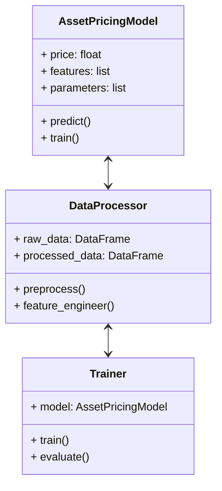
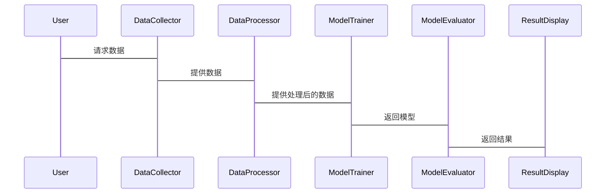

                 


```markdown
# AI辅助的资产定价模型校准

## 关键词：资产定价模型，校准，人工智能，机器学习，金融建模

## 摘要：  
随着人工智能技术的快速发展，资产定价模型的校准过程正在经历一场深刻的变革。传统的校准方法依赖于复杂的数学模型和手动调整，而AI技术的引入为这一过程带来了更高的效率和准确性。本文将系统地探讨AI辅助资产定价模型校准的核心概念、算法原理、系统架构以及实际应用案例。通过结合理论分析与实践操作，本文旨在为读者提供一个全面的理解框架，帮助他们在金融建模中更好地利用AI技术进行模型校准。

---

## 第一部分: 资产定价模型校准背景介绍

### 第1章: 资产定价模型校准概述

#### 1.1 问题背景
##### 1.1.1 资产定价模型的基本概念
资产定价模型（Asset Pricing Models）是用来确定资产在市场上的合理价格的数学模型。常见的模型包括CAPM（资本资产定价模型）、APT（ arbitrage pricing theory）和多因子模型等。这些模型通过分析市场的风险、收益以及其他相关因素来预测资产的价格。

##### 1.1.2 校准在资产定价中的重要性
校准是指将理论模型与实际市场数据相匹配的过程。准确的校准可以确保模型能够更好地反映市场的真实情况，从而提高定价的准确性。校准的过程涉及参数估计、假设检验以及模型优化等多个步骤。

##### 1.1.3 AI技术在资产定价中的应用潜力
AI技术，特别是机器学习，能够处理大量复杂的数据，并通过自动化的学习过程来优化模型。AI可以用于特征工程、参数估计以及模型预测等多个环节，极大地提高了校准的效率和准确性。

#### 1.2 问题描述
##### 1.2.1 资产定价模型校准的核心问题
校准的核心问题是如何通过历史数据和市场观察来调整模型的参数，使得模型能够更好地预测未来的资产价格。这需要解决数据选择、模型选择以及参数优化等多个问题。

##### 1.2.2 传统校准方法的局限性
传统的校准方法通常依赖于假设检验和统计推断，这种方法在面对高维数据和复杂模型时显得力不从心。此外，传统方法往往需要大量的手动操作，效率较低。

##### 1.2.3 引入AI技术的必要性
AI技术能够处理非线性关系和高维数据，适用于复杂的资产定价模型。通过机器学习算法，可以自动优化模型参数，提高校准的准确性和效率。

#### 1.3 解决方案
##### 1.3.1 AI辅助校准的基本思路
AI辅助校准的基本思路是利用机器学习算法对历史数据进行分析，提取特征，并通过优化算法来调整模型参数。这种方法可以显著提高校准的效率和准确性。

##### 1.3.2 数据驱动与模型驱动的结合
数据驱动的方法依赖于大量历史数据，而模型驱动的方法依赖于经济理论。两者的结合可以利用数据的规律性和模型的理论性，提高校准的效果。

##### 1.3.3 校准过程中的关键步骤
校准的关键步骤包括数据预处理、特征选择、模型训练、参数优化以及模型验证。每个步骤都需要仔细设计和实施，以确保校准的效果。

#### 1.4 边界与外延
##### 1.4.1 资产定价模型的适用范围
资产定价模型适用于股票、债券等标准化金融资产的定价，但对于非标准化资产（如房地产、艺术品等），模型的适用性可能受到限制。

##### 1.4.2 AI辅助校准的边界条件
AI辅助校准的有效性依赖于数据的质量和数量。在数据不足的情况下，AI模型的表现可能会受到限制。

##### 1.4.3 相关领域的扩展
AI技术在金融领域的应用不仅限于资产定价模型校准，还包括风险管理、投资组合优化、市场预测等多个方面。

#### 1.5 核心要素组成
##### 1.5.1 数据来源与处理
数据来源包括历史市场数据、公司财务数据、宏观经济指标等。数据处理包括清洗、标准化和特征提取等步骤。

##### 1.5.2 模型结构与参数
模型结构包括线性回归、随机森林、神经网络等。参数包括回归系数、树的深度、神经网络的层数等。

##### 1.5.3 校准目标与评价指标
校准的目标是使模型预测的价格尽可能接近实际价格。常用的评价指标包括均方误差（MSE）、平均绝对误差（MAE）和R平方值。

#### 1.6 本章小结
本章介绍了资产定价模型校准的基本概念和问题背景，分析了传统校准方法的局限性，并提出了利用AI技术进行辅助校准的解决方案。

---

## 第二部分: AI辅助资产定价模型校准的核心概念与联系

### 第2章: 核心概念原理

#### 2.1 AI在资产定价中的角色
##### 2.1.1 机器学习模型在定价中的应用
机器学习模型可以用于特征选择、价格预测和风险评估等多个环节。例如，随机森林和梯度提升树可以用于处理非线性关系。

##### 2.1.2 特征工程的重要性
特征工程是将原始数据转换为能够更好地反映资产价格特征的过程。常用的特征包括历史价格、成交量、技术指标等。

##### 2.1.3 模型解释性与可解释性
模型的解释性是金融领域的重要要求。尽管深度学习模型具有高预测能力，但其黑箱特性可能会影响其在金融领域的应用。

#### 2.2 校准算法的基本原理
##### 2.2.1 优化算法的选择
常用的优化算法包括梯度下降、Adam优化和牛顿法等。选择合适的优化算法可以提高校准的效率和准确性。

##### 2.2.2 参数估计与假设检验
参数估计是通过数据估计模型参数的过程。假设检验用于验证模型的显著性和合理性。

##### 2.2.3 灵敏度分析与模型验证
灵敏度分析用于评估模型参数对预测结果的影响。模型验证用于评估模型的泛化能力。

#### 2.3 核心概念对比表
##### 2.3.1 不同校准方法的对比
| 方法 | 优点 | 缺点 |
|------|------|------|
| 传统校准 | 理论基础强 | 计算复杂，效率低 |
| AI辅助校准 | 效率高，准确性高 | 需要大量数据，模型解释性差 |

##### 2.3.2 AI驱动与传统方法的优劣势分析
AI驱动方法在处理复杂数据和优化模型方面具有优势，但传统方法在模型解释性和理论基础方面更具优势。

#### 2.4 ER实体关系图
##### 2.4.1 实体关系图的构建


##### 2.4.2 关键实体间的关联分析
资产、交易数据、模型参数等实体之间的关联关系。

#### 2.5 本章小结
本章分析了AI在资产定价中的角色，探讨了校准算法的基本原理，并通过对比分析和ER图展示了核心概念之间的联系。

---

## 第三部分: AI辅助资产定价模型校准的算法原理

### 第3章: 算法原理与实现

#### 3.1 算法选择与优化
##### 3.1.1 回归分析与优化算法
线性回归用于处理线性关系，而优化算法用于调整模型参数以最小化预测误差。

##### 3.1.2 时间序列分析与预测
时间序列分析用于处理资产价格的时序数据，常用的方法包括ARIMA和GARCH。

##### 3.1.3 深度学习模型的应用
深度学习模型如LSTM用于处理时间序列数据，能够捕捉复杂的非线性关系。

#### 3.2 算法流程图
##### 3.2.1 数据预处理流程


##### 3.2.2 模型训练流程


##### 3.2.3 模型评估与优化流


#### 3.3 数学公式
##### 3.3.1 线性回归
$$ y = \beta_0 + \beta_1 x + \epsilon $$

##### 3.3.2 最小二乘法
$$ \hat{\beta} = (X^T X)^{-1} X^T y $$

##### 3.3.3 LSTM网络
$$ f_t = \text{ LSTM}(h_{t-1}, x_t) $$

#### 3.4 代码实现
##### 3.4.1 数据预处理
```python
import pandas as pd
data = pd.read_csv('price_data.csv')
```

##### 3.4.2 模型训练
```python
from sklearn.linear_model import LinearRegression
model = LinearRegression()
model.fit(X_train, y_train)
```

##### 3.4.3 模型评估
```python
from sklearn.metrics import mean_squared_error
print(mean_squared_error(y_test, model.predict(X_test)))
```

#### 3.5 本章小结
本章详细讲解了AI辅助资产定价模型校准中常用的算法，包括回归分析、时间序列分析和深度学习模型，并通过流程图和代码示例展示了算法的实现过程。

---

## 第四部分: AI辅助资产定价模型校准的系统架构与实现

### 第4章: 系统架构与实现

#### 4.1 项目介绍
##### 4.1.1 项目目标
构建一个基于AI的资产定价模型校准系统，实现高效、准确的模型校准。

##### 4.1.2 项目范围
涵盖数据采集、特征工程、模型训练、模型评估和结果展示等多个功能模块。

#### 4.2 系统功能设计
##### 4.2.1 领域模型（mermaid类图）


##### 4.2.2 系统架构（mermaid架构图）
```mermaid
container AssetPricingSystem {
    DataCollector
    DataProcessor
    ModelTrainer
    ModelEvaluator
    ResultDisplay
}
```

##### 4.2.3 系统交互（mermaid序列图）


#### 4.3 系统实现
##### 4.3.1 环境安装
```bash
pip install numpy pandas scikit-learn tensorflow
```

##### 4.3.2 核心实现
```python
import numpy as np
import pandas as pd
from sklearn.linear_model import LinearRegression
from sklearn.metrics import mean_squared_error

# 数据预处理
data = pd.read_csv('price_data.csv')
X = data[['feature1', 'feature2']]
y = data['target']

# 模型训练
model = LinearRegression()
model.fit(X, y)

# 模型评估
y_pred = model.predict(X)
print(mean_squared_error(y, y_pred))
```

#### 4.4 本章小结
本章通过系统架构设计和实现，展示了如何利用AI技术构建资产定价模型校准系统，包括数据处理、模型训练和结果展示等模块。

---

## 第五部分: 项目实战

### 第5章: 项目实战

#### 5.1 环境安装
##### 5.1.1 安装必要的Python包
```bash
pip install numpy pandas scikit-learn matplotlib
```

#### 5.2 数据获取与预处理
##### 5.2.1 数据获取
```python
import pandas as pd
data = pd.read_csv('price_data.csv')
```

##### 5.2.2 数据清洗与特征工程
```python
data.dropna(inplace=True)
data['log_return'] = np.log(data['price']).diff()
```

#### 5.3 模型实现
##### 5.3.1 线性回归模型
```python
from sklearn.linear_model import LinearRegression
model = LinearRegression()
model.fit(X_train, y_train)
```

##### 5.3.2 模型预测与评估
```python
y_pred = model.predict(X_test)
print(mean_squared_error(y_test, y_pred))
```

#### 5.4 结果分析
##### 5.4.1 模型表现分析
绘制预测值与实际值的散点图，分析模型的拟合效果。

##### 5.4.2 模型优化
通过网格搜索（Grid Search）优化模型参数，提高预测准确性。

#### 5.5 本章小结
本章通过实际项目实战，展示了AI辅助资产定价模型校准的具体实现过程，包括数据处理、模型训练和结果分析。

---

## 第六部分: 总结

### 第6章: 总结与展望

#### 6.1 本章总结
本文系统地探讨了AI辅助资产定价模型校准的核心概念、算法原理、系统架构和实际应用。通过理论分析和实践操作，展示了AI技术在金融建模中的巨大潜力。

#### 6.2 最佳实践 Tips
##### 6.2.1 数据预处理的重要性
确保数据的完整性和准确性，是模型校准成功的关键。

##### 6.2.2 模型选择与优化
根据具体问题选择合适的模型，并通过网格搜索等方法优化模型参数。

##### 6.2.3 模型解释性与可解释性
在金融领域，模型的解释性同样重要，需要在准确性和解释性之间找到平衡。

#### 6.3 注意事项
##### 6.3.1 数据泄漏问题
在数据处理过程中，需要注意防止数据泄漏，避免模型过拟合。

##### 6.3.2 模型的泛化能力
模型的泛化能力是衡量模型性能的重要指标，需要通过交叉验证等方法进行评估。

##### 6.3.3 模型的实时性
在实际应用中，模型的实时性也是需要考虑的重要因素。

#### 6.4 拓展阅读
##### 6.4.1 推荐书籍
- 《Python机器学习实战》
- 《金融数据分析与建模》

##### 6.4.2 推荐在线资源
- [Kaggle](https://www.kaggle.com)
- [Coursera](https://www.coursera.org)

#### 6.5 本章小结
本章总结了全文的主要内容，并提出了在实际应用中需要注意的事项和未来的研究方向。

---

## 作者：AI天才研究院/AI Genius Institute & 禅与计算机程序设计艺术/Zen And The Art of Computer Programming
```

