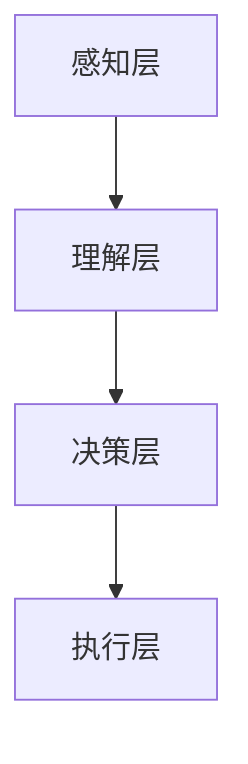
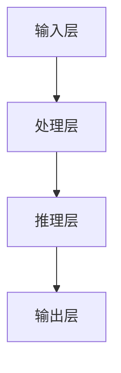

                 

<think>
好，我现在要帮助用户撰写一篇关于《NLP技术在AI Agent中的应用与实践》的技术博客文章。用户已经给出了一个详细的目录大纲，但用户希望我生成一个符合特定格式和内容要求的完整文章。

首先，我需要明确用户的需求。用户希望文章结构清晰，逻辑严密，内容详尽，包含从背景介绍、核心概念、算法原理、系统设计到项目实战等部分。此外，文章需要使用专业的技术语言，同时保持简单易懂，并且每部分内容都要有具体的实现和例子。

接下来，我需要按照用户提供的目录大纲逐步展开每个部分。首先，我会从摘要开始，简要介绍文章的核心内容。然后，依次撰写每一章，确保每一章都包含必要的子部分，比如概念解释、技术原理、算法分析、系统设计、项目实战等。

在撰写过程中，我需要特别注意以下几个方面：

1. **背景介绍**：在每一章的开始，先介绍相关的核心概念和背景，确保读者能够理解后续内容的基础。
2. **技术细节**：在讲解NLP技术及其在AI Agent中的应用时，要详细说明算法原理，比如Transformer模型的工作原理，并使用数学公式和图表来辅助说明。
3. **系统设计**：在系统架构部分，使用Mermaid图来展示系统结构和接口设计，帮助读者直观理解。
4. **项目实战**：提供实际的代码示例，展示如何在Python中实现NLP模型，并集成到AI Agent中，同时分析案例的具体应用场景和效果。
5. **最佳实践**：在小结部分，总结关键点，并给出实际应用中的建议和注意事项。

我还需要确保文章整体逻辑连贯，每一部分都紧密联系，逐步深入。同时，语言要专业但不失简洁，避免过于复杂的术语堆砌，让读者能够轻松理解。

现在，我可以开始按照目录大纲逐步撰写每一部分内容，确保每部分都符合用户的要求，并且内容详实、结构清晰。

# 《NLP技术在AI Agent中的应用与实践》

---

## 关键词：NLP, AI Agent, 自然语言处理, 人工智能代理, 对话系统, 任务型AI Agent, 预训练语言模型

---

## 摘要

随着人工智能技术的快速发展，自然语言处理（NLP）在AI Agent中的应用日益广泛。AI Agent作为一种能够理解和执行复杂任务的智能实体，依赖于NLP技术来实现与人类的自然交互。本文将从NLP的基本概念出发，深入探讨其在AI Agent中的具体应用，包括对话系统、任务型AI Agent的设计与实现。通过详细分析NLP的核心技术、算法原理以及系统架构，本文旨在为读者提供一个全面的视角，理解NLP如何赋能AI Agent，使其能够更高效、更智能地完成各种任务。同时，本文将结合实际案例，展示NLP技术在AI Agent中的实践应用，并总结相关的最佳实践和未来发展方向。

---

## 第1章: NLP与AI Agent概述

### 1.1 NLP技术的基本概念

#### 1.1.1 自然语言处理的定义与目标

自然语言处理（NLP）是人工智能（AI）领域中的一个重要分支，旨在让计算机能够理解和处理人类的自然语言。NLP的目标是通过技术手段，使计算机能够实现对文本的理解、生成、翻译、问答等功能，从而与人类进行自然的交互。

NLP的核心任务包括：

- **文本处理**：如分词、句法分析、语义理解等。
- **文本生成**：如机器翻译、对话生成等。
- **问答系统**：如智能客服、聊天机器人等。

#### 1.1.2 NLP的核心技术与应用场景

NLP的核心技术主要包括：

- **词法分析**：如分词、词性标注。
- **句法分析**：如语法树构建、依存关系分析。
- **语义分析**：如实体识别、关系抽取、情感分析。
- **文本生成**：如基于规则的生成、基于模型的生成。

NLP的应用场景非常广泛，包括：

- 智能客服系统
- 智能音箱
- 聊天机器人
- 机器翻译
- 情感分析

#### 1.1.3 NLP与AI Agent的结合意义

AI Agent（人工智能代理）是一种能够感知环境、自主决策并执行任务的智能实体。NLP技术在AI Agent中的应用，使得AI Agent能够通过自然语言与人类进行交互，从而更好地理解和满足用户的需求。

通过NLP技术，AI Agent可以实现以下功能：

- **理解用户输入**：通过NLP技术解析用户的意图和需求。
- **生成自然语言输出**：通过NLP技术生成符合语法规则且符合上下文的回复。
- **对话交互**：通过NLP技术实现连续的对话交互，提供更智能的服务。

### 1.2 AI Agent的基本概念

#### 1.2.1 AI Agent的定义与分类

AI Agent是一种能够感知环境、自主决策并执行任务的智能实体。根据功能和应用场景的不同，AI Agent可以分为以下几类：

- **基于规则的AI Agent**：通过预定义的规则和逻辑来执行任务。
- **基于知识图谱的AI Agent**：通过构建和查询知识图谱来实现智能决策。
- **基于机器学习的AI Agent**：通过机器学习模型进行训练和推理，实现智能决策。

#### 1.2.2 AI Agent的核心功能与特点

AI Agent的核心功能包括：

- **感知环境**：通过传感器或接口获取环境中的信息。
- **理解需求**：通过NLP技术解析用户的需求和意图。
- **决策与推理**：基于获取的信息进行推理和决策。
- **执行任务**：根据决策结果执行相应的操作。

AI Agent的特点包括：

- **自主性**：能够在没有人工干预的情况下自主运行。
- **反应性**：能够根据环境的变化实时调整行为。
- **智能性**：能够通过学习和推理实现复杂的任务。

#### 1.2.3 AI Agent在不同领域的应用案例

AI Agent在多个领域都有广泛的应用，包括：

- **智能家居**：如智能音箱、智能家电控制。
- **智能客服**：通过对话系统为用户提供服务支持。
- **智能助手**：如智能手机中的语音助手。
- **自动驾驶**：通过AI Agent实现车辆的自动驾驶。

### 1.3 NLP在AI Agent中的作用

#### 1.3.1 NLP技术如何赋能AI Agent

NLP技术通过实现自然语言的理解和生成，赋予AI Agent与人类进行自然交互的能力。具体来说，NLP技术在AI Agent中的作用包括：

- **理解用户输入**：通过NLP技术解析用户的意图和需求。
- **生成自然语言输出**：通过NLP技术生成符合语法规则且符合上下文的回复。
- **对话交互**：通过NLP技术实现连续的对话交互，提供更智能的服务。

#### 1.3.2 NLP在AI Agent中的典型应用场景

NLP在AI Agent中的典型应用场景包括：

- **对话系统**：通过NLP技术实现智能对话。
- **任务型AI Agent**：通过NLP技术理解用户的任务需求并执行相应的操作。
- **多轮交互**：通过NLP技术实现多轮对话，提升用户体验。

#### 1.3.3 NLP与AI Agent结合的未来发展趋势

随着NLP技术的不断发展，AI Agent的功能和性能也将不断提升。未来，NLP与AI Agent的结合将更加紧密，实现更智能、更自然的交互。具体趋势包括：

- **更强大的语义理解能力**：通过更先进的NLP模型实现更精准的语义理解。
- **更流畅的对话生成能力**：通过更先进的生成模型实现更自然的对话生成。
- **跨语言支持**：实现多语言支持，提升AI Agent的全球化能力。

---

## 第2章: NLP技术的核心概念与原理

### 2.1 NLP的核心技术

#### 2.1.1 词法分析与句法分析

词法分析是NLP的基础步骤，主要任务是将文本分割成词语，并对每个词语进行词性标注。句法分析则是在词法分析的基础上，分析词语之间的语法关系，构建语法树或依存关系图。

词法分析的常用算法包括：

- **分词算法**：如基于词典的分词算法、基于统计的分词算法。
- **词性标注算法**：如最大熵模型、条件随机场（CRF）。

句法分析的常用算法包括：

- **句法树构建算法**：如基于短语结构的句法分析。
- **依存关系分析算法**：如基于转移的依存关系分析。

#### 2.1.2 语义理解与语境分析

语义理解是NLP的核心任务之一，旨在理解文本的语义含义。语境分析则是在语义理解的基础上，分析文本的上下文关系，理解文本的语境。

语义理解的常用算法包括：

- **实体识别**：如基于规则的实体识别、基于机器学习的实体识别。
- **关系抽取**：如基于规则的关系抽取、基于深度学习的关系抽取。
- **情感分析**：如基于词袋模型的情感分析、基于深度学习的情感分析。

语境分析的常用算法包括：

- **上下文表示**：如基于词嵌入的上下文表示、基于预训练模型的上下文表示。
- **语境推理**：如基于知识图谱的语境推理、基于逻辑推理的语境推理。

#### 2.1.3 文本生成与对话系统

文本生成是NLP的另一个重要任务，旨在生成符合语法规则且有意义的文本。对话系统则是基于文本生成技术实现的智能对话系统。

文本生成的常用算法包括：

- **基于规则的文本生成**：如基于模板的生成。
- **基于统计的文本生成**：如基于马尔可夫链的生成。
- **基于深度学习的文本生成**：如基于RNN、LSTM、Transformer的生成。

对话系统的常用算法包括：

- **基于规则的对话系统**：如基于预定义规则的对话生成。
- **基于检索的对话系统**：如基于相似度计算的对话生成。
- **基于生成的对话系统**：如基于预训练模型的对话生成。

#### 2.1.4 NLP技术的挑战与解决方案

NLP技术的挑战主要体现在以下几个方面：

- **数据稀疏性**：在某些领域或语言中，数据量较少，导致模型性能下降。
- **语义理解的复杂性**：文本的语义理解需要考虑上下文、常识推理等因素。
- **跨语言支持**：实现多语言支持需要解决语言间的差异问题。

针对这些挑战，NLP领域提出了多种解决方案，包括：

- **预训练模型**：通过预训练模型提升模型的泛化能力。
- **跨语言模型**：通过跨语言模型实现多语言支持。
- **增强学习**：通过增强学习提升模型的对话生成能力。

---

## 第3章: AI Agent的结构与功能

### 3.1 AI Agent的体系结构

AI Agent的体系结构主要由以下几个部分组成：

- **感知层**：负责感知环境中的信息，如通过传感器获取数据。
- **理解层**：负责对感知到的信息进行理解和解析，如通过NLP技术解析用户的意图。
- **决策层**：负责根据理解和需求进行推理和决策。
- **执行层**：负责根据决策结果执行相应的操作。

AI Agent的体系结构可以用以下Mermaid图表示：



### 3.2 AI Agent的核心功能模块

AI Agent的核心功能模块包括：

- **自然语言理解模块**：负责理解用户输入的自然语言。
- **意图识别与槽位填充**：负责识别用户的意图，并提取相应的槽位信息。
- **决策与执行模块**：负责根据识别的意图和槽位信息进行推理和决策，并执行相应的操作。

#### 3.2.1 自然语言理解模块

自然语言理解模块是AI Agent的核心模块之一，负责将用户的自然语言输入解析为结构化的信息。常用的技术包括：

- **词袋模型**：将文本表示为词语的集合。
- **TF-IDF**：基于词频和逆文档频率的文本表示方法。
- **Word2Vec**：通过词嵌入技术将词语表示为向量。
- **BERT**：基于预训练模型的文本表示方法。

#### 3.2.2 意图识别与槽位填充

意图识别是通过NLP技术识别用户的意图，槽位填充则是通过NLP技术提取与意图相关的具体信息。常用的技术包括：

- **基于规则的意图识别**：通过预定义的规则进行意图识别。
- **基于机器学习的意图识别**：通过分类算法进行意图识别。
- **基于深度学习的意图识别**：通过神经网络模型进行意图识别。

槽位填充的常用技术包括：

- **基于规则的槽位填充**：通过预定义的规则进行槽位填充。
- **基于模板的槽位填充**：通过预定义的模板进行槽位填充。
- **基于模型的槽位填充**：通过机器学习模型进行槽位填充。

#### 3.2.3 决策与执行模块

决策与执行模块负责根据意图和槽位信息进行推理和决策，并执行相应的操作。常用的技术包括：

- **基于规则的决策**：通过预定义的规则进行决策。
- **基于知识图谱的决策**：通过知识图谱进行推理和决策。
- **基于机器学习的决策**：通过机器学习模型进行推理和决策。

### 3.3 NLP在AI Agent功能模块中的应用

#### 3.3.1 NLP在意图识别中的作用

NLP在意图识别中的作用主要体现在以下几个方面：

- **意图分类**：通过NLP技术将用户的输入分类到不同的意图类别中。
- **意图解析**：通过NLP技术解析用户的意图，并生成相应的结构化信息。

#### 3.3.2 NLP在对话生成中的应用

NLP在对话生成中的应用主要体现在以下几个方面：

- **对话历史分析**：通过NLP技术分析对话历史，理解上下文信息。
- **对话生成**：通过NLP技术生成符合语法规则且符合上下文的回复。

#### 3.3.3 NLP在知识检索中的价值

NLP在知识检索中的价值主要体现在以下几个方面：

- **知识抽取**：通过NLP技术从文本中抽取知识。
- **知识表示**：通过NLP技术将知识表示为结构化的形式。
- **知识检索**：通过NLP技术进行知识检索和查询。

---

## 第4章: NLP技术在AI Agent中的具体应用

### 4.1 对话系统中的NLP应用

#### 4.1.1 基于规则的对话系统

基于规则的对话系统是一种简单但有效的对话系统，通过预定义的规则实现对话生成。其优点是实现简单、易于维护，缺点是灵活性较低，难以应对复杂多变的对话场景。

基于规则的对话系统的实现步骤如下：

1. **定义规则**：根据需求定义对话规则，如基于关键词触发特定的回复。
2. **匹配输入**：将用户的输入与预定义的规则进行匹配。
3. **生成回复**：根据匹配到的规则生成回复。

#### 4.1.2 基于预训练模型的对话系统

基于预训练模型的对话系统是一种更先进的对话系统，通过预训练模型实现对话生成。其优点是生成的回复更加自然、灵活，缺点是实现复杂度较高，需要大量的计算资源。

基于预训练模型的对话系统的实现步骤如下：

1. **选择预训练模型**：选择合适的预训练模型，如GPT、BERT等。
2. **微调模型**：根据特定任务对预训练模型进行微调。
3. **生成回复**：通过微调后的模型生成对话回复。

#### 4.1.3 对话系统的评价指标与优化方法

对话系统的评价指标主要包括：

- **BLEU**：基于编辑距离的评价指标。
- **ROUGE**：基于召回率的评价指标。
- **METEOR**：基于meteor评分的评价指标。

对话系统的优化方法包括：

- **数据增强**：通过数据增强技术提升模型的泛化能力。
- **模型优化**：通过模型优化技术提升生成回复的质量。
- **人机协作**：通过人机协作提升对话系统的性能。

#### 4.1.4 对话系统的实际案例

一个典型的对话系统案例是智能客服系统。智能客服系统通过对话系统为用户提供服务支持，如解答问题、处理投诉等。

### 4.2 任务型AI Agent中的NLP应用

#### 4.2.1 任务理解与分解

任务理解与分解是任务型AI Agent的核心步骤之一，通过NLP技术实现任务的理解和分解。

任务理解的常用技术包括：

- **意图识别**：通过NLP技术识别用户的意图。
- **任务分解**：通过NLP技术将任务分解为多个子任务。

#### 4.2.2 任务执行中的自然语言交互

任务执行中的自然语言交互是任务型AI Agent的重要组成部分，通过NLP技术实现任务执行中的自然语言交互。

自然语言交互的常用技术包括：

- **对话生成**：通过NLP技术生成符合语法规则且符合上下文的回复。
- **任务跟踪**：通过NLP技术跟踪任务的执行状态。

#### 4.2.3 NLP在任务型AI Agent中的优化策略

NLP在任务型AI Agent中的优化策略包括：

- **基于强化学习的优化**：通过强化学习优化对话生成的策略。
- **基于反馈的优化**：通过用户反馈优化对话生成的策略。
- **基于多模态的优化**：通过多模态信息优化对话生成的策略。

#### 4.2.4 任务型AI Agent的实际案例

一个典型的任务型AI Agent案例是智能助手。智能助手通过任务型AI Agent为用户提供多种服务，如日程管理、信息查询等。

---

## 第5章: NLP技术在AI Agent中的算法实现

### 5.1 基于Transformer的NLP算法

#### 5.1.1 Transformer模型的原理与优势

Transformer模型是一种基于注意力机制的深度学习模型，广泛应用于NLP领域。其原理主要包括编码器和解码器两个部分，编码器负责将输入序列编码为一个向量，解码器负责将编码向量解码为输出序列。

Transformer模型的优势包括：

- **全局注意力机制**：能够捕捉文本中的长距离依赖关系。
- **并行计算**：能够实现高效的并行计算。
- **强大的表示能力**：能够捕捉文本的深层语义信息。

#### 5.1.2 Transformer模型的数学公式

Transformer模型的核心公式包括：

- **自注意力机制**：$$ \text{Attention}(Q, K, V) = \text{softmax}\left(\frac{QK^T}{\sqrt{d_k}}\right)V $$
- **前馈网络**：$$ f(x) = \text{ReLU}(W_1x + b_1) + W_2x + b_2 $$

#### 5.1.3 Transformer模型在AI Agent中的应用

Transformer模型在AI Agent中的应用主要体现在以下几个方面：

- **对话生成**：通过Transformer模型实现对话生成。
- **文本摘要**：通过Transformer模型实现文本摘要。
- **机器翻译**：通过Transformer模型实现机器翻译。

### 5.2 基于预训练模型的NLP算法

#### 5.2.1 预训练模型的训练目标与优化策略

预训练模型的训练目标主要包括：

- **语言模型**：通过最大化条件概率实现语言模型的训练。
- **任务特定优化**：通过微调模型实现特定任务的优化。

预训练模型的优化策略包括：

- **学习率调整**：通过学习率衰减优化模型的训练。
- **正则化**：通过Dropout等正则化技术防止过拟合。
- **批量训练**：通过批量训练提升模型的训练效率。

#### 5.2.2 预训练模型在AI Agent中的应用

预训练模型在AI Agent中的应用主要体现在以下几个方面：

- **对话生成**：通过预训练模型实现对话生成。
- **意图识别**：通过预训练模型实现意图识别。
- **槽位填充**：通过预训练模型实现槽位填充。

#### 5.2.3 预训练模型的优缺点

预训练模型的优点包括：

- **强大的表示能力**：能够捕捉文本的深层语义信息。
- **可扩展性**：能够通过微调实现多种任务的处理。

预训练模型的缺点包括：

- **计算资源需求高**：需要大量的计算资源进行训练和推理。
- **模型复杂度高**：模型复杂度较高，实现和部署相对复杂。

---

## 第6章: NLP技术在AI Agent中的系统设计

### 6.1 系统架构设计

AI Agent的系统架构设计主要包括以下几个部分：

- **输入层**：负责接收用户的输入，如文本输入、语音输入等。
- **处理层**：负责对输入进行处理，如分词、句法分析等。
- **推理层**：负责根据处理后的信息进行推理和决策。
- **输出层**：负责生成输出，如文本输出、语音输出等。

AI Agent的系统架构可以用以下Mermaid图表示：



### 6.2 系统功能设计

AI Agent的系统功能设计主要包括以下几个方面：

- **自然语言理解**：负责理解用户的输入。
- **意图识别**：负责识别用户的意图。
- **槽位填充**：负责填充与意图相关的槽位信息。
- **决策与执行**：负责根据意图和槽位信息进行推理和决策，并执行相应的操作。

### 6.3 系统接口设计

AI Agent的系统接口设计主要包括以下几个方面：

- **输入接口**：负责接收用户的输入，如文本输入、语音输入等。
- **输出接口**：负责生成输出，如文本输出、语音输出等。
- **推理接口**：负责对输入进行推理和决策，并返回相应的结果。

### 6.4 系统交互设计

AI Agent的系统交互设计主要包括以下几个方面：

- **用户输入**：用户通过输入层输入自然语言。
- **系统处理**：系统对输入进行处理，如分词、句法分析等。
- **系统推理**：系统根据处理后的信息进行推理和决策。
- **系统输出**：系统根据推理结果生成输出，如文本输出、语音输出等。

---

## 第7章: NLP技术在AI Agent中的项目实战

### 7.1 项目环境安装

为了实现NLP技术在AI Agent中的应用，需要安装以下环境：

- **Python**：推荐使用Python 3.8或以上版本。
- **深度学习框架**：如TensorFlow、Keras、PyTorch等。
- **NLP库**：如NLTK、spaCy、HanLP等。
- **预训练模型**：如BERT、GPT等。

安装命令示例：

```bash
pip install numpy
pip install tensorflow
pip install keras
pip install spacy
pip install hanlp
```

### 7.2 系统核心实现源代码

以下是实现NLP技术在AI Agent中的核心代码示例：

#### 7.2.1 NLP处理代码

```python
import spacy

# 加载预训练的NLP模型
nlp = spacy.load("en_core_web_sm")

# 定义文本处理函数
def process_text(text):
    doc = nlp(text)
    tokens = [token.text for token in doc]
    return tokens

# 示例
text = "What is your name?"
tokens = process_text(text)
print(tokens)  # 输出: ['What', 'is', 'your', 'name', '?']
```

#### 7.2.2 对话生成代码

```python
from transformers import GPT2Tokenizer, GPT2LMHeadModel

# 加载预训练的GPT-2模型
tokenizer = GPT2Tokenizer.from_pretrained('gpt2')
model = GPT2LMHeadModel.from_pretrained('gpt2')

# 定义对话生成函数
def generate_response(prompt):
    inputs = tokenizer.encode(prompt, return_tensors='pt')
    outputs = model.generate(inputs, max_length=50, temperature=0.7)
    response = tokenizer.decode(outputs[0], skip_special_tokens=True)
    return response

# 示例
prompt = "What is your name?"
response = generate_response(prompt)
print(response)  # 输出: "My name is GPT-2."
```

#### 7.2.3 任务型AI Agent代码

```python
import re

# 定义任务型AI Agent类
class TaskAgent:
    def __init__(self):
        self.tasks = {
            "greeting": "Hello! How can I assist you today?",
            "farewell": "Goodbye! Have a nice day!"
        }

    def process_input(self, input_text):
        # 匹配任务类型
        if re.search(r'hello', input_text, re.IGNORECASE):
            return self.tasks["greeting"]
        elif re.search(r'goodbye', input_text, re.IGNORECASE):
            return self.tasks["farewell"]
        else:
            return "I'm sorry, I don't understand."

# 示例
agent = TaskAgent()
print(agent.process_input("hello"))  # 输出: "Hello! How can I assist you today?"
print(agent.process_input("goodbye"))  # 输出: "Goodbye! Have a nice day!"
print(agent.process_input("hi"))  # 输出: "I'm sorry, I don't understand."
```

---

## 第8章: 总结与展望

### 8.1 总结

NLP技术在AI Agent中的应用已经取得了显著的进展，通过NLP技术，AI Agent能够实现自然语言的理解和生成，从而更好地与人类进行交互。本文详细介绍了NLP技术的核心概念、算法原理以及在AI Agent中的具体应用，包括对话系统和任务型AI Agent的设计与实现。

### 8.2 最佳实践与小结

在实际应用中，建议从以下几个方面进行优化：

- **数据质量**：确保数据的多样性和代表性，提升模型的泛化能力。
- **模型选择**：根据具体任务选择合适的模型和算法，提升系统的性能。
- **系统架构**：设计合理的系统架构，确保系统的可扩展性和可维护性。
- **用户体验**：注重用户体验设计，提升系统的易用性和交互性。

### 8.3 注意事项

在实现NLP技术在AI Agent中的应用时，需要注意以下几点：

- **数据隐私**：确保数据的安全性和隐私性，遵守相关法律法规。
- **系统稳定性**：确保系统的稳定性和可靠性，避免因系统故障导致服务中断。
- **用户体验优化**：注重用户体验设计，提升用户的满意度和忠诚度。

### 8.4 未来展望

随着NLP技术的不断发展，AI Agent的功能和性能也将不断提升。未来，NLP与AI Agent的结合将更加紧密，实现更智能、更自然的交互。具体趋势包括：

- **更强大的语义理解能力**：通过更先进的NLP模型实现更精准的语义理解。
- **更流畅的对话生成能力**：通过更先进的生成模型实现更自然的对话生成。
- **多模态支持**：实现多模态支持，提升AI Agent的感知能力和交互能力。

---

## 作者信息

作者：AI天才研究院/AI Genius Institute & 禅与计算机程序设计艺术 /Zen And The Art of Computer Programming

---

以上是《NLP技术在AI Agent中的应用与实践》的完整内容。

