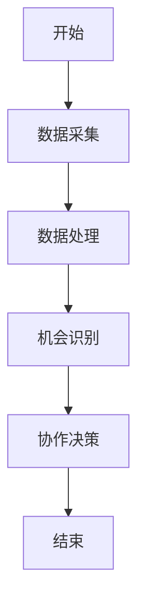

                 


# 利用多智能体AI实现动态行业转型机会识别

> 关键词：多智能体AI，动态行业转型，机会识别，协作算法，系统架构，行业应用

> 摘要：本文将深入探讨如何利用多智能体AI技术，识别和把握动态行业转型中的机会。通过分析多智能体AI的核心概念、算法原理、系统架构以及实际案例，本文将为读者提供一个全面的视角，展示如何在复杂多变的商业环境中，利用多智能体AI实现行业转型的机会识别。本文不仅适合技术专家，也适合对行业转型和AI技术感兴趣的读者。

---

## 第1章：多智能体AI与动态行业转型的背景

### 1.1 多智能体AI的起源与发展
多智能体AI（Multi-Agent AI）是指由多个智能体协作完成任务的系统。与传统的单智能体系统相比，多智能体系统能够更好地处理复杂环境中的问题，尤其是在需要分布式决策和协作的场景中。

#### 1.1.1 多智能体系统的基本概念
- **智能体（Agent）**：能够感知环境并采取行动以实现目标的实体。
- **多智能体系统（MAS）**：由多个智能体组成的系统，智能体之间通过交互完成任务。
- **协作（Collaboration）**：智能体之间通过信息共享和协作完成共同目标。

#### 1.1.2 多智能体AI的发展历程
多智能体AI的发展可以追溯到20世纪80年代。随着计算能力的提升和分布式系统的发展，多智能体技术逐渐成熟，并在多个领域得到广泛应用。

#### 1.1.3 多智能体AI的核心特点
- **分布式计算**：智能体之间通过分布式计算完成任务。
- **协作性**：智能体之间通过协作完成共同目标。
- **动态性**：系统能够适应动态变化的环境。

### 1.2 动态行业转型的背景与挑战
随着全球经济的快速发展和技术的不断进步，行业环境变得越来越复杂和动态化。企业需要不断适应变化，抓住转型机会。

#### 1.2.1 行业转型的定义与分类
- **行业转型**：指行业在技术、市场、政策等多方面发生变化，导致行业结构、商业模式等发生重大调整。
- **动态行业**：指行业环境不断变化，企业需要快速适应的行业。

#### 1.2.2 动态行业环境的特点
- **不确定性**：行业环境变化快，不确定性高。
- **复杂性**：涉及多个因素，问题复杂。
- **竞争性**：企业竞争激烈，机会窗口短暂。

#### 1.2.3 行业转型中的主要挑战
- **信息不对称**：企业难以获取足够的信息来做出决策。
- **资源分配**：如何合理分配资源以抓住转型机会。
- **协作困难**：不同部门或企业之间的协作困难。

### 1.3 多智能体AI与动态行业转型的结合
多智能体AI能够通过协作和分布式计算，帮助企业识别和把握动态行业转型中的机会。

#### 1.3.1 多智能体AI在行业转型中的作用
- **信息共享**：智能体之间共享信息，提高信息利用效率。
- **协作决策**：通过协作决策，提高决策的准确性和效率。
- **动态适应**：系统能够快速适应环境变化。

#### 1.3.2 动态机会识别的核心问题
- **机会识别**：如何识别潜在的转型机会。
- **机会评估**：如何评估机会的可行性和潜力。
- **机会捕捉**：如何快速抓住机会。

#### 1.3.3 多智能体AI与动态机会识别的结合方式
- **分布式计算**：多智能体AI通过分布式计算，快速处理大量数据。
- **协作学习**：智能体之间通过协作学习，提高机会识别的准确性。
- **博弈论模型**：利用博弈论模型，模拟不同策略下的结果，选择最优策略。

### 1.4 本章小结
本章介绍了多智能体AI的起源和发展，分析了动态行业转型的背景与挑战，并探讨了多智能体AI在动态机会识别中的作用和结合方式。

---

## 第2章：多智能体AI的核心概念与动态机会识别

### 2.1 多智能体系统的核心概念
多智能体系统由多个智能体组成，通过协作完成任务。

#### 2.1.1 多智能体系统的定义
- **智能体**：能够感知环境并采取行动的实体。
- **多智能体系统**：由多个智能体组成的系统，智能体之间通过交互完成任务。

#### 2.1.2 多智能体系统的基本组成
- **智能体**：包括感知、决策和行动模块。
- **通信协议**：智能体之间通信的规则和协议。
- **协作机制**：智能体之间协作的方式和策略。

#### 2.1.3 多智能体系统的关键特性
- **分布式计算**：智能体之间通过分布式计算完成任务。
- **协作性**：智能体之间通过协作完成共同目标。
- **动态性**：系统能够适应动态变化的环境。

### 2.2 动态机会识别的定义与特点
动态机会识别是指在动态环境下，识别和把握潜在机会的过程。

#### 2.2.1 动态机会识别的定义
- **动态机会识别**：在动态环境下，识别和把握潜在机会的过程。
- **动态性**：环境变化快，机会窗口短暂。

#### 2.2.2 动态机会识别的关键特征
- **不确定性**：环境变化快，信息不完全。
- **复杂性**：涉及多个因素，问题复杂。
- **竞争性**：企业竞争激烈，机会窗口短暂。

#### 2.2.3 动态机会识别的核心挑战
- **信息不对称**：企业难以获取足够的信息来做出决策。
- **资源分配**：如何合理分配资源以抓住机会。
- **协作困难**：不同部门或企业之间的协作困难。

### 2.3 多智能体AI与动态机会识别的关系
多智能体AI能够通过协作和分布式计算，帮助企业在动态环境下识别和把握机会。

#### 2.3.1 多智能体AI在机会识别中的作用
- **信息共享**：智能体之间共享信息，提高信息利用效率。
- **协作决策**：通过协作决策，提高决策的准确性和效率。
- **动态适应**：系统能够快速适应环境变化。

#### 2.3.2 动态机会识别的多智能体模型构建
- **智能体协作模型**：多个智能体协作完成任务。
- **博弈论模型**：模拟不同策略下的结果，选择最优策略。
- **分布式计算模型**：通过分布式计算，快速处理大量数据。

#### 2.3.3 多智能体AI与动态机会识别的结合方式
- **分布式计算**：多智能体AI通过分布式计算，快速处理大量数据。
- **协作学习**：智能体之间通过协作学习，提高机会识别的准确性。
- **博弈论模型**：利用博弈论模型，模拟不同策略下的结果，选择最优策略。

### 2.4 本章小结
本章详细阐述了多智能体系统的核心概念，并分析了动态机会识别的定义和特点，探讨了多智能体AI在动态机会识别中的作用和结合方式。

---

## 第3章：多智能体AI的算法原理与动态机会识别模型

### 3.1 多智能体协作算法
多智能体协作算法是多智能体系统的核心部分，通过协作完成任务。

#### 3.1.1 分布式计算与多智能体协作
- **分布式计算**：智能体之间通过分布式计算完成任务。
- **协作机制**：智能体之间通过协作机制完成共同目标。
- **通信协议**：智能体之间通信的规则和协议。

#### 3.1.2 多智能体博弈论模型
- **博弈论模型**：模拟不同策略下的结果，选择最优策略。
- **纳什均衡**：所有参与方都采取最优策略，达到均衡状态。
- **博弈树**：表示博弈过程的树状结构，帮助分析不同策略下的结果。

#### 3.1.3 多智能体学习算法
- **强化学习**：智能体通过与环境互动，学习最优策略。
- **协作学习**：智能体之间通过协作学习，提高学习效率。
- **转移学习**：将已有的知识迁移到新的任务中。

### 3.2 动态机会识别的数学模型
动态机会识别需要建立数学模型，描述问题的本质和解决方法。

#### 3.2.1 动态机会识别的数学公式
- **机会识别模型**：描述机会识别的过程和结果。
- **概率模型**：通过概率计算，评估机会的可能性。
- **优化模型**：通过优化算法，找到最优解决方案。

#### 3.2.2 多智能体协作的数学模型
- **协作模型**：描述智能体之间的协作关系。
- **博弈模型**：描述智能体之间的博弈关系。
- **优化模型**：描述如何通过优化算法，找到最优解决方案。

#### 3.2.3 动态机会识别的优化算法
- **贪心算法**：通过贪心策略，找到局部最优解。
- **动态规划**：通过动态规划，找到全局最优解。
- **遗传算法**：通过模拟自然选择，找到最优解。

### 3.3 多智能体AI与动态机会识别的结合算法
多智能体AI与动态机会识别的结合需要设计高效的算法，实现动态机会识别。

#### 3.3.1 多智能体协作算法在动态机会识别中的应用
- **分布式计算**：通过分布式计算，快速处理大量数据。
- **协作学习**：通过协作学习，提高机会识别的准确性。
- **博弈论模型**：通过博弈论模型，模拟不同策略下的结果，选择最优策略。

#### 3.3.2 动态机会识别的分布式计算流程
- **数据采集**：采集环境中的数据。
- **数据处理**：对数据进行处理和分析。
- **机会识别**：通过算法识别潜在机会。
- **协作决策**：智能体之间协作决策，选择最优策略。

#### 3.3.3 多智能体博弈论模型在机会识别中的应用
- **博弈树分析**：通过博弈树分析，模拟不同策略下的结果。
- **纳什均衡分析**：通过纳什均衡分析，找到最优策略。
- **策略调整**：根据环境变化，动态调整策略。

### 3.4 本章小结
本章详细阐述了多智能体协作算法的原理，并分析了动态机会识别的数学模型，探讨了多智能体AI与动态机会识别的结合算法。

---

## 第4章：多智能体AI的系统架构与动态机会识别的实现

### 4.1 多智能体AI的系统架构设计
多智能体AI系统需要设计合理的架构，以实现高效协作。

#### 4.1.1 系统功能模块划分
- **感知模块**：感知环境中的信息。
- **决策模块**：根据感知信息做出决策。
- **协作模块**：智能体之间协作完成任务。
- **通信模块**：智能体之间通信的模块。

#### 4.1.2 系统架构的层次结构
- **底层架构**：包括硬件和操作系统。
- **中间层架构**：包括智能体和协作机制。
- **上层架构**：包括应用和用户界面。

#### 4.1.3 系统组件之间的交互关系
- **通信协议**：智能体之间通信的规则和协议。
- **协作机制**：智能体之间协作的方式和策略。
- **交互关系**：智能体之间的交互关系和流程。

#### 4.1.4 系统架构设计的挑战
- **复杂性**：系统架构复杂，设计难度大。
- **动态性**：系统需要适应动态变化的环境。
- **协作性**：智能体之间需要高效协作。

### 4.2 动态机会识别的系统实现
动态机会识别需要设计高效的系统，实现动态机会识别。

#### 4.2.1 系统实现的关键步骤
- **数据采集**：采集环境中的数据。
- **数据处理**：对数据进行处理和分析。
- **机会识别**：通过算法识别潜在机会。
- **协作决策**：智能体之间协作决策，选择最优策略。

#### 4.2.2 系统实现的流程图


#### 4.2.3 系统实现的注意事项
- **数据质量**：数据采集和处理需要保证数据质量。
- **算法选择**：选择合适的算法，提高机会识别的准确性。
- **协作效率**：智能体之间的协作需要高效，减少通信延迟。

### 4.3 多智能体AI与动态机会识别的结合实现
多智能体AI与动态机会识别的结合需要设计高效的系统，实现动态机会识别。

#### 4.3.1 系统实现的案例分析
- **案例分析**：以金融科技为例，分析多智能体AI在动态机会识别中的应用。

#### 4.3.2 系统实现的关键技术
- **分布式计算**：通过分布式计算，快速处理大量数据。
- **协作学习**：通过协作学习，提高机会识别的准确性。
- **博弈论模型**：通过博弈论模型，模拟不同策略下的结果，选择最优策略。

#### 4.3.3 系统实现的代码实现
```python
# 多智能体协作算法实现
def distributed_calculate(data):
    # 分布式计算
    pass

def协作学习(data):
    # 协作学习
    pass

def博弈论模型(data):
    # 博弈论模型
    pass
```

### 4.4 本章小结
本章详细阐述了多智能体AI的系统架构设计，并分析了动态机会识别的系统实现，探讨了多智能体AI与动态机会识别的结合实现。

---

## 第5章：多智能体AI的项目实战与案例分析

### 5.1 项目背景与目标
本项目旨在利用多智能体AI技术，识别和把握动态行业转型中的机会。

#### 5.1.1 项目背景
- **行业背景**：行业环境变化快，企业需要快速适应。
- **项目目标**：利用多智能体AI技术，识别和把握动态行业转型中的机会。

#### 5.1.2 项目目标
- **机会识别**：识别潜在的转型机会。
- **机会评估**：评估机会的可行性和潜力。
- **机会捕捉**：快速抓住机会，实现转型。

### 5.2 项目实施步骤
项目实施需要按照以下步骤进行：

#### 5.2.1 环境安装
- **安装Python**：安装Python编程语言。
- **安装依赖库**：安装所需的依赖库，如numpy、pandas、scikit-learn等。

#### 5.2.2 系统核心实现
- **数据采集**：采集环境中的数据。
- **数据处理**：对数据进行处理和分析。
- **机会识别**：通过算法识别潜在机会。
- **协作决策**：智能体之间协作决策，选择最优策略。

#### 5.2.3 代码实现
```python
# 数据采集
import requests

def get_data():
    # 通过API获取数据
    response = requests.get('https://api.example.com/data')
    return response.json()

# 数据处理
import pandas as pd

def process_data(data):
    df = pd.DataFrame(data)
    return df

# 机会识别
from sklearn import svm

def identify_opportunity(data):
    # 使用SVM算法识别机会
    model = svm.SVC()
    model.fit(data)
    return model.predict(data)

# 协作决策
def make_decision(data):
    # 智能体之间协作决策
    pass
```

#### 5.2.4 实验结果与分析
- **实验结果**：通过实验验证算法的有效性。
- **结果分析**：分析实验结果，总结经验教训。

### 5.3 案例分析与经验总结
通过案例分析，总结多智能体AI在动态机会识别中的应用经验。

#### 5.3.1 案例分析
- **案例分析**：以金融科技为例，分析多智能体AI在动态机会识别中的应用。
- **案例总结**：总结案例中的经验教训，提出改进建议。

#### 5.3.2 经验总结
- **经验总结**：总结多智能体AI在动态机会识别中的应用经验。
- **改进建议**：提出改进建议，优化系统设计。

### 5.4 本章小结
本章通过项目实战和案例分析，展示了多智能体AI在动态机会识别中的应用，总结了经验教训，提出了改进建议。

---

## 第6章：多智能体AI的总结与展望

### 6.1 总结
本章总结了全文的主要内容，回顾了多智能体AI在动态机会识别中的应用。

#### 6.1.1 核心概念总结
- **多智能体AI**：由多个智能体协作完成任务的系统。
- **动态机会识别**：在动态环境下，识别和把握潜在机会的过程。

#### 6.1.2 算法原理总结
- **分布式计算**：通过分布式计算，快速处理大量数据。
- **协作学习**：通过协作学习，提高机会识别的准确性。
- **博弈论模型**：通过博弈论模型，模拟不同策略下的结果，选择最优策略。

### 6.2 展望
本章展望了多智能体AI在动态机会识别中的未来发展方向。

#### 6.2.1 未来研究方向
- **算法优化**：优化多智能体协作算法，提高效率。
- **系统架构**：设计更高效的系统架构，适应动态环境。
- **行业应用**：探索多智能体AI在更多行业的应用。

#### 6.2.2 挑战与机遇
- **挑战**：环境复杂，协作困难。
- **机遇**：技术进步，应用广泛。

### 6.3 最佳实践Tips
- **数据质量**：数据采集和处理需要保证数据质量。
- **算法选择**：选择合适的算法，提高机会识别的准确性。
- **协作效率**：智能体之间的协作需要高效，减少通信延迟。

### 6.4 小结
本章总结了全文的主要内容，并展望了多智能体AI在动态机会识别中的未来发展方向，提出了最佳实践建议。

---

## 作者：AI天才研究院/AI Genius Institute & 禅与计算机程序设计艺术 /Zen And The Art of Computer Programming

