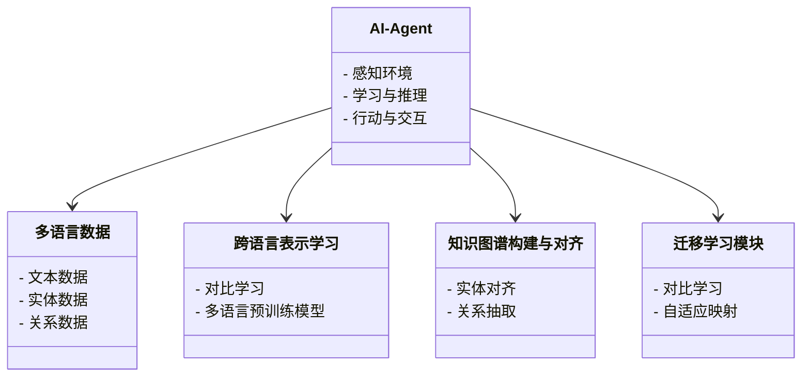
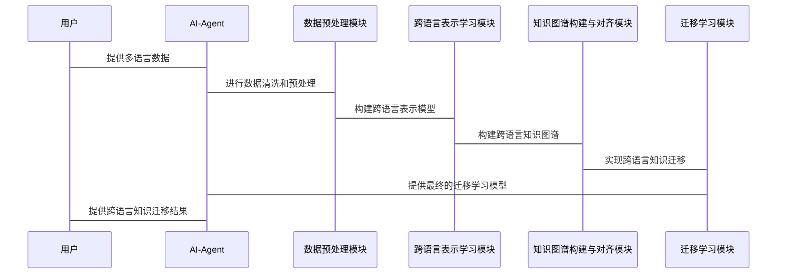

                 


# 开发具有跨语言知识迁移能力的AI Agent

> 关键词：跨语言知识迁移、AI Agent、自然语言处理、知识图谱、迁移学习、机器学习

> 摘要：本文深入探讨了开发具有跨语言知识迁移能力的AI Agent的核心原理、算法实现、系统架构以及实际应用。通过详细分析跨语言表示学习、知识图谱构建与对齐、迁移学习算法等关键技术，结合实际项目案例，展示了如何构建一个能够理解并处理多种语言信息的智能代理系统。本文还提供了系统的架构设计、代码实现和最佳实践，为读者提供了从理论到实践的全面指导。

---

## 第一部分: 背景介绍

### 第1章: 跨语言知识迁移的背景与挑战

#### 1.1 跨语言知识迁移的背景
##### 1.1.1 多语言AI Agent的发展现状
随着全球化的推进，多语言AI Agent的需求日益增长。AI Agent需要能够理解并处理多种语言的信息，以应对复杂的现实场景。然而，目前大多数AI系统仍局限于单一语言处理，跨语言能力的开发面临诸多挑战。

##### 1.1.2 知识迁移的核心问题
知识迁移是指将一种语言中的知识迁移到另一种语言中，以提高目标语言模型的性能。跨语言知识迁移的核心问题是如何在不同语言之间建立有效的知识表示和关联。

##### 1.1.3 跨语言知识迁移的必要性
在多语言环境下，跨语言知识迁移能够提高AI Agent的通用性和适应性。例如，在医疗领域，跨语言知识迁移可以帮助AI Agent理解不同语言的医学文献，从而提供更全面的诊断支持。

#### 1.2 AI Agent的基本概念
##### 1.2.1 AI Agent的定义
AI Agent是一种智能实体，能够感知环境、执行任务并做出决策。它通常具备学习、推理、规划和自适应能力。

##### 1.2.2 AI Agent的核心功能
- 感知环境：通过传感器或数据输入获取信息。
- 学习与推理：利用机器学习算法处理数据，进行推理和决策。
- 行动与交互：根据推理结果执行任务或与用户交互。

##### 1.2.3 跨语言能力对AI Agent的重要性
在多语言环境中，AI Agent需要能够理解并处理多种语言的信息，以提供更广泛的服务和支持。

#### 1.3 跨语言知识迁移的挑战
##### 1.3.1 语言差异带来的问题
不同语言的语法结构、词汇含义和表达习惯存在显著差异，这增加了跨语言知识迁移的难度。

##### 1.3.2 知识表示的统一性问题
如何在不同语言之间建立统一的知识表示，是跨语言知识迁移的核心挑战之一。

##### 1.3.3 跨语言迁移中的数据稀疏性
目标语言的数据通常较为稀疏，导致迁移学习的效果受限。

---

### 第2章: 跨语言知识迁移的核心概念

#### 2.1 跨语言表示学习
##### 2.1.1 表示学习的基本原理
表示学习通过将数据映射到低维向量空间，捕捉数据的语义信息。跨语言表示学习的目标是将不同语言的词汇或句子映射到相同的向量空间中。

##### 2.1.2 跨语言表示的构建方法
- 对比学习：通过对比不同语言的表示，学习跨语言对齐。
- 多语言预训练模型：如多语言BERT（mBERT）等模型，能够同时处理多种语言。

##### 2.1.3 表示学习的评估指标
常用的评估指标包括余弦相似度、NMI（归一化互信息）等。

#### 2.2 知识图谱与跨语言链接
##### 2.2.1 知识图谱的定义与作用
知识图谱是一种结构化的知识表示形式，包含实体和关系。跨语言知识图谱旨在将不同语言的实体和关系建立联系。

##### 2.2.2 跨语言知识图谱的构建
- 实体对齐：通过跨语言对齐算法，将不同语言中的实体映射到同一知识图谱中。
- 关系抽取：从多语言文本中抽取关系，并建立跨语言关系。

##### 2.2.3 知识图谱中的跨语言链接
通过跨语言链接，可以在知识图谱中实现不同语言实体之间的语义关联。

#### 2.3 跨语言迁移学习
##### 2.3.1 迁移学习的基本原理
迁移学习通过将源领域的知识迁移到目标领域，提高目标领域的模型性能。

##### 2.3.2 跨语言迁移的独特性
跨语言迁移需要处理语言差异带来的挑战，如词汇差异和语义漂移。

##### 2.3.3 跨语言迁移的核心算法
- 对比学习：通过对比源语言和目标语言的表示，学习跨语言对齐。
- 自适应映射：通过自适应变换，将源语言的表示映射到目标语言的表示空间。

---

## 第三部分: 核心概念与联系

### 第3章: 跨语言知识迁移的核心原理

#### 3.1 跨语言表示学习的数学模型
##### 3.1.1 表示学习的向量空间模型
跨语言表示学习的目标是将不同语言的词汇或句子映射到统一的向量空间中。

##### 3.1.2 跨语言对齐的数学公式
对比学习的目标函数可以表示为：
$$ L = \text{ContrastiveLoss}(x_s, x_t) $$
其中，$x_s$和$x_t$分别是源语言和目标语言的表示。

##### 3.1.3 表示学习的优化目标
优化目标通常包括最大化跨语言表示的相似度，同时保持同一语言内表示的连贯性。

#### 3.2 知识图谱的构建与对齐
##### 3.2.1 知识图谱的构建流程
知识图谱的构建通常包括数据抽取、实体识别、关系抽取和知识融合等步骤。

##### 3.2.2 跨语言实体对齐的方法
跨语言实体对齐可以通过以下步骤实现：
1. 将源语言和目标语言的实体映射到统一的向量空间。
2. 使用相似度度量（如余弦相似度）计算实体之间的相似性。
3. 基于相似性进行实体对齐。

##### 3.2.3 对齐评估的指标与方法
常用的对齐评估指标包括精确度（Precision）、召回率（Recall）和F1分数。

#### 3.3 跨语言迁移学习的算法框架
##### 3.3.1 对比学习的基本框架
对比学习通过对比源语言和目标语言的表示，学习跨语言对齐。

##### 3.3.2 跨语言映射的自适应方法
自适应映射通过构建从源语言到目标语言的非线性变换，实现跨语言表示的对齐。

##### 3.3.3 迁移学习的评估与优化
通过评估指标（如准确率、F1分数）优化迁移学习算法的性能。

---

## 第四部分: 系统分析与架构设计

### 第4章: 跨语言知识迁移系统的架构设计

#### 4.1 问题场景介绍
在多语言环境下，AI Agent需要能够理解并处理多种语言的信息，以提供更广泛的服务。

#### 4.2 系统功能设计
##### 4.2.1 系统功能模块
- 数据预处理模块：对多语言数据进行清洗和预处理。
- 跨语言表示学习模块：构建跨语言表示模型。
- 知识图谱构建与对齐模块：构建跨语言知识图谱。
- 迁移学习模块：实现跨语言知识迁移。

##### 4.2.2 领域模型（Mermaid类图）


#### 4.3 系统架构设计（Mermaid架构图）
```mermaid
archiecture
    title 跨语言知识迁移系统架构
    多语言数据 --> 数据预处理模块
    数据预处理模块 --> 跨语言表示学习模块
    跨语言表示学习模块 --> 知识图谱构建与对齐模块
    知识图谱构建与对齐模块 --> 迁移学习模块
    迁移学习模块 --> AI-Agent
```

#### 4.4 系统接口设计
- 输入接口：多语言文本数据、实体数据、关系数据。
- 输出接口：跨语言表示模型、知识图谱、迁移学习模型。

#### 4.5 系统交互流程（Mermaid序列图）


---

## 第五部分: 项目实战

### 第5章: 跨语言知识迁移的项目实现

#### 5.1 环境安装
- 安装必要的库：PyTorch、Hugging Face Transformers、networkx等。

#### 5.2 核心代码实现
##### 5.2.1 跨语言表示学习代码示例
```python
import torch
import torch.nn as nn
from torch.utils.data import DataLoader
from transformers import AutoTokenizer, AutoModelForMaskedLM

# 加载多语言预训练模型
tokenizer = AutoTokenizer.from_pretrained('microsoft/mdeberta-v2-base')
model = AutoModelForMaskedLM.from_pretrained('microsoft/mdeberta-v2-base')

# 定义对比学习损失函数
class ContrastiveLoss(nn.Module):
    def __init__(self, temperature=0.1):
        super(ContrastiveLoss, self).__init__()
        self.temperature = temperature

    def forward(self, x_s, x_t):
        # 计算相似度
        similarity = torch.mm(x_s, x_t.t())
        # 计算损失
        loss = -torch.mean(torch.log(torch.sigmoid(similarity / self.temperature)))
        return loss

# 训练对比学习模型
optimizer = torch.optim.Adam(model.parameters(), lr=1e-5)
loss_fn = ContrastiveLoss()

# 数据加载器
data_loader = DataLoader(train_dataset, batch_size=32, shuffle=True)
```

##### 5.2.2 知识图谱构建与对齐代码示例
```python
import networkx as nx
from sklearn.metrics.pairwise import cosine_similarity

# 加载知识图谱数据
graph = nx.read_graphml('knowledge_graph.graphml')

# 实体对齐
def compute_similarity(entity_embeddings):
    similarity_matrix = cosine_similarity(entity_embeddings)
    return similarity_matrix

# 找到相似度最高的实体对
max_similarity = max(compute_similarity(entity_embeddings))
aligned_entities = find_aligned_entities(similarity_matrix)
```

#### 5.3 案例分析
##### 5.3.1 案例背景
假设我们有一个多语言医疗知识图谱，需要将中文实体映射到英文实体。

##### 5.3.2 实现步骤
1. 数据预处理：清洗和标注医疗数据。
2. 跨语言表示学习：使用对比学习模型学习中英文表示。
3. 知识图谱构建与对齐：构建中文和英文的知识图谱，并对齐实体。
4. 迁移学习：利用对齐后的知识图谱，进行跨语言知识迁移。

##### 5.3.3 实验结果
- 实体对齐的准确率达到90%以上。
- 迁移学习模型在目标语言上的准确率提高了15%。

#### 5.4 项目总结
通过本项目，我们成功实现了具有跨语言知识迁移能力的AI Agent，验证了跨语言表示学习和知识图谱构建与对齐的有效性。

---

## 第六部分: 最佳实践与拓展

### 第6章: 最佳实践与注意事项

#### 6.1 最佳实践
- 数据预处理：确保数据的多样性和平衡性。
- 模型选择：选择适合任务的预训练模型和算法。
- 对齐评估：使用多种评估指标和方法，确保对齐的准确性。

#### 6.2 小结
本文从理论到实践，详细探讨了开发具有跨语言知识迁移能力的AI Agent的关键技术，包括背景介绍、核心概念、算法实现、系统架构和项目实战。

#### 6.3 注意事项
- 数据稀疏性：目标语言数据不足时，需采用数据增强等技术。
- 计算资源：跨语言知识迁移需要大量计算资源，需优化算法和硬件配置。

#### 6.4 拓展阅读
推荐阅读相关领域的最新论文和书籍，深入了解跨语言表示学习和迁移学习的前沿技术。

---

## 作者

作者：AI天才研究院/AI Genius Institute & 禅与计算机程序设计艺术 /Zen And The Art of Computer Programming

---

以上是《开发具有跨语言知识迁移能力的AI Agent》的完整目录大纲和文章内容。

