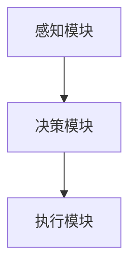

                 


# 智能汽车：AI Agent的驾驶行为分析

> 关键词：智能汽车, AI Agent, 驾驶行为分析, 人工智能, 自动驾驶

> 摘要：本文深入探讨了AI Agent在智能汽车驾驶行为分析中的应用，从理论基础到实际应用，详细分析了AI Agent的核心概念、算法原理、系统架构以及实际项目中的应用。通过案例分析和未来展望，总结了智能汽车驾驶行为分析的重要性和发展方向。

---

# 第一部分: 智能汽车与AI Agent的背景与基础

# 第1章: 背景介绍：智能汽车与AI Agent的驾驶行为分析

## 1.1 智能汽车的发展背景

### 1.1.1 智能汽车的定义与分类

智能汽车是一种结合了人工智能、大数据、云计算等技术的高级交通工具。它可以分为以下几类：
- **Level 0：无自动化**：完全由人类驾驶，系统无任何辅助功能。
- **Level 1：驾驶辅助**：系统可以提供方向盘和油门辅助，但不能同时处理转向和速度控制。
- **Level 2：部分自动化**：系统可以同时控制转向和速度，但需要驾驶员持续监督。
- **Level 3：有条件自动化**：系统可以在特定条件下完全自动驾驶，但需要驾驶员随时准备接管。
- **Level 4：高度自动化**：系统在特定区域内可以完全自动驾驶，无需驾驶员干预。
- **Level 5：完全自动化**：系统可以在任何情况下完全自动驾驶，无需驾驶员。

### 1.1.2 AI Agent在智能汽车中的作用

AI Agent（智能体）是智能汽车的核心，负责处理复杂的驾驶任务。AI Agent通过感知环境、决策和执行动作来实现自动驾驶。它能够实时处理来自摄像头、雷达、激光雷达等传感器的数据，结合预设的算法进行分析和决策。

### 1.1.3 驾驶行为分析的重要性

驾驶行为分析是智能汽车实现自动驾驶的关键。通过对驾驶员或AI Agent的驾驶行为进行分析，可以优化驾驶策略，提高安全性，减少交通事故，同时提升驾驶效率。

---

## 1.2 问题背景与描述

### 1.2.1 智能驾驶中的关键问题

智能驾驶面临以下关键问题：
- **感知问题**：如何准确感知环境，包括识别道路、车辆、行人等。
- **决策问题**：如何在复杂环境中做出最优决策。
- **执行问题**：如何将决策转化为具体的驾驶动作。

### 1.2.2 AI Agent在驾驶行为分析中的核心任务

AI Agent的核心任务包括：
- **环境感知**：通过传感器获取环境信息。
- **行为预测**：预测其他交通参与者的动作。
- **决策制定**：基于感知和预测信息做出驾驶决策。
- **行为执行**：将决策转化为具体的驾驶动作。

### 1.2.3 问题的边界与外延

- **边界**：AI Agent在特定场景下的驾驶行为分析，例如高速公路上的自动驾驶。
- **外延**：AI Agent在不同环境（如城市道路、乡村道路）中的适应性。

---

## 1.3 问题解决与技术路线

### 1.3.1 驾驶行为分析的主要方法

驾驶行为分析的主要方法包括：
- **基于规则的方法**：通过预设的规则进行决策。
- **基于机器学习的方法**：通过训练模型进行预测和决策。
- **基于深度学习的方法**：利用神经网络进行复杂场景的分析。

### 1.3.2 AI Agent的核心技术路线

AI Agent的技术路线包括：
1. **感知层**：通过传感器获取环境信息。
2. **决策层**：基于感知信息进行决策。
3. **执行层**：将决策转化为具体的驾驶动作。

### 1.3.3 技术路线的优缺点对比

| 技术路线 | 优点 | 缺点 |
|----------|------|------|
| 基于规则 | 简单易实现 | 难以应对复杂场景 |
| 机器学习 | 高度自适应 | 需要大量数据 |
| 深度学习 | 处理复杂场景能力强 | 计算资源消耗大 |

---

## 1.4 核心概念与联系

### 1.4.1 AI Agent的实体关系图（ER图）

```mermaid
er
actor: 驾驶员
agent: AI Agent
vehicle: 智能汽车
environment: 驾驶环境
action: 驾驶行为
```

---

## 1.5 本章小结

本章从智能汽车的发展背景出发，介绍了AI Agent在智能汽车中的作用，分析了驾驶行为分析的重要性，并提出了AI Agent的核心任务和技术路线。通过对比不同技术路线的优缺点，为后续的深入分析奠定了基础。

---

# 第2章: AI Agent的核心概念与原理

## 2.1 AI Agent的基本原理

### 2.1.1 AI Agent的定义与特征

AI Agent是一种能够感知环境、自主决策并执行动作的智能体。其主要特征包括：
- **自主性**：能够在没有外部干预的情况下独立运作。
- **反应性**：能够实时感知环境并做出反应。
- **学习性**：能够通过经验改进自身的决策能力。

### 2.1.2 AI Agent的类型与应用场景

AI Agent的类型包括：
- **反应式AI Agent**：基于当前感知信息做出反应。
- **认知式AI Agent**：具有推理和规划能力。
- **混合式AI Agent**：结合反应式和认知式的特点。

应用场景包括自动驾驶、智能交通管理等。

---

## 2.2 AI Agent的行为分析模型

### 2.2.1 行为分析的基本框架

行为分析的基本框架包括：
1. **感知**：通过传感器获取环境信息。
2. **决策**：基于感知信息做出驾驶决策。
3. **执行**：将决策转化为具体的驾驶动作。

### 2.2.2 行为分析的数学模型

行为分析的数学模型可以用以下公式表示：
$$
\text{决策} = f(\text{感知信息})
$$
其中，$f$ 是决策函数，$\text{感知信息}$ 是输入的环境数据。

---

## 2.3 AI Agent与驾驶环境的交互

### 2.3.1 驾驶环境的感知与建模

驾驶环境的感知包括：
- **视觉感知**：通过摄像头获取图像信息。
- **雷达感知**：通过雷达获取距离信息。
- **激光雷达感知**：通过激光雷达获取高精度的三维信息。

### 2.3.2 AI Agent的决策机制

AI Agent的决策机制包括：
- **规则-based决策**：基于预设规则做出决策。
- **学习-based决策**：基于机器学习模型做出决策。

---

## 2.4 核心概念对比表

| 概念 | 特征 | 描述 |
|------|------|------|
| AI Agent | 智能性 | 基于AI算法进行决策 |
| 驾驶行为 | 分析 | 对驾驶过程中的动作进行分析 |

---

## 2.5 本章小结

本章详细介绍了AI Agent的基本原理，包括其定义、特征、类型以及行为分析模型。通过对比不同概念，进一步明确了AI Agent在智能汽车中的作用。

---

# 第3章: 驾驶行为分析的方法

## 3.1 驾驶行为分析的基本步骤

### 3.1.1 感知与数据采集

驾驶行为分析的第一步是感知环境并采集数据。数据来源包括：
- **视觉数据**：摄像头捕捉的图像。
- **雷达数据**：雷达捕捉的距离信息。
- **激光雷达数据**：激光雷达捕捉的三维点云数据。

### 3.1.2 数据预处理

数据预处理包括：
- **去噪**：去除噪声，提高数据质量。
- **特征提取**：提取有用的特征，如车辆的位置、速度等。

### 3.1.3 行为预测与决策

行为预测与决策包括：
- **行为预测**：预测其他交通参与者的动作。
- **决策制定**：基于预测结果制定驾驶策略。

---

## 3.2 驾驶行为分析的算法实现

### 3.2.1 基于规则的驾驶行为分析

基于规则的驾驶行为分析通过预设的规则进行决策。例如：
- **保持车距**：与前车保持安全距离。
- **遵守交通规则**：按照交通信号灯行驶。

### 3.2.2 基于机器学习的驾驶行为分析

基于机器学习的驾驶行为分析通过训练模型进行预测和决策。例如：
- **分类任务**：分类交通信号灯。
- **回归任务**：预测车辆速度。

---

## 3.3 算法实现的代码示例

以下是一个基于机器学习的驾驶行为分析的Python代码示例：

```python
import numpy as np
from sklearn import svm

# 数据预处理
X = np.array([[车速, 车距], ...])
y = np.array([标签])  # 标签可以是0（正常）或1（危险）

# 训练模型
model = svm.SVC()
model.fit(X, y)

# 预测
new_X = np.array([[新的车速, 新的车距]])
预测结果 = model.predict(new_X)
```

---

## 3.4 本章小结

本章详细介绍了驾驶行为分析的基本步骤和算法实现方法，通过代码示例展示了如何利用机器学习进行驾驶行为分析。

---

# 第4章: AI Agent的决策机制分析

## 4.1 AI Agent的决策算法

### 4.1.1 基于规则的决策算法

基于规则的决策算法通过预设的规则进行决策。例如：
- **优先直行**：在没有障碍的情况下优先直行。
- **避让行人**：检测到行人时立即减速或停车。

### 4.1.2 基于机器学习的决策算法

基于机器学习的决策算法通过训练模型进行决策。例如：
- **决策树**：基于决策树进行路径选择。
- **神经网络**：基于深度学习模型进行决策。

---

## 4.2 AI Agent的决策优化

### 4.2.1 基于强化学习的决策优化

强化学习是一种有效的决策优化方法。通过定义奖励函数，AI Agent可以在复杂环境中找到最优策略。

### 4.2.2 基于遗传算法的决策优化

遗传算法是一种基于生物进化原理的优化方法。通过模拟自然选择和遗传变异，AI Agent可以找到最优的决策策略。

---

## 4.3 本章小结

本章分析了AI Agent的决策机制，介绍了基于规则和机器学习的决策算法，并探讨了强化学习和遗传算法在决策优化中的应用。

---

# 第5章: 系统架构与设计

## 5.1 系统架构设计

### 5.1.1 系统功能设计

系统功能设计包括：
- **感知模块**：负责环境感知。
- **决策模块**：负责行为分析和决策。
- **执行模块**：负责将决策转化为驾驶动作。

### 5.1.2 系统架构图



---

## 5.2 接口设计与交互

### 5.2.1 系统接口设计

系统接口设计包括：
- **感知模块接口**：与传感器进行数据交互。
- **决策模块接口**：与上层系统进行交互。
- **执行模块接口**：与车辆控制单元进行交互。

### 5.2.2 交互设计

交互设计包括：
- **驾驶员与系统交互**：驾驶员可以通过方向盘或语音指令与系统交互。
- **系统与环境交互**：系统通过传感器与环境交互。

---

## 5.3 本章小结

本章详细介绍了智能汽车驾驶行为分析系统的架构设计，包括功能设计、接口设计和交互设计。

---

# 第6章: 项目实战

## 6.1 环境安装与配置

### 6.1.1 开发环境

开发环境包括：
- **操作系统**：Linux/Windows/macOS
- **编程语言**：Python
- **框架**：TensorFlow/PyTorch

### 6.1.2 工具安装

工具安装包括：
- **安装Python**：`python --version`
- **安装TensorFlow**：`pip install tensorflow`

---

## 6.2 系统核心实现

### 6.2.1 感知模块实现

感知模块实现包括：
- **图像处理**：使用OpenCV进行图像处理。
- **数据预处理**：对感知数据进行去噪和特征提取。

### 6.2.2 决策模块实现

决策模块实现包括：
- **行为预测**：使用机器学习模型进行预测。
- **决策制定**：基于预测结果制定驾驶策略。

### 6.2.3 执行模块实现

执行模块实现包括：
- **车辆控制**：通过CAN总线控制车辆。
- **动作执行**：将决策转化为具体的驾驶动作。

---

## 6.3 代码实现与解读

以下是一个简单的驾驶行为分析的Python代码示例：

```python
import numpy as np
from sklearn import svm

# 数据预处理
X = np.array([[车速, 车距], ...])
y = np.array([标签])  # 标签可以是0（正常）或1（危险）

# 训练模型
model = svm.SVC()
model.fit(X, y)

# 预测
new_X = np.array([[新的车速, 新的车距]])
预测结果 = model.predict(new_X)

# 执行模块
if 预测结果 == 1:
    制动()
else:
    继续行驶()
```

---

## 6.4 本章小结

本章通过项目实战，详细介绍了智能汽车驾驶行为分析系统的实现过程，包括环境安装、核心模块实现和代码解读。

---

# 第7章: 案例分析与经验总结

## 7.1 典型案例分析

### 7.1.1 成功案例

成功案例：某品牌智能汽车在高速公路上成功实现自动驾驶，减少交通事故。

### 7.1.2 失败案例

失败案例：某品牌智能汽车在恶劣天气下发生事故，暴露感知模块的不足。

---

## 7.2 经验总结

经验总结包括：
- **感知模块的优化**：提高传感器的感知精度。
- **决策模块的优化**：增强AI Agent的决策能力。
- **系统架构的优化**：提高系统的可靠性和安全性。

---

## 7.3 本章小结

本章通过典型案例分析，总结了智能汽车驾驶行为分析的经验和教训，为后续的优化提供了参考。

---

# 第8章: 未来展望与挑战

## 8.1 未来发展趋势

未来发展趋势包括：
- **更高级的自动驾驶**：从Level 4向Level 5发展。
- **更智能的AI Agent**：增强AI Agent的学习和推理能力。
- **更安全的驾驶系统**：提高系统的安全性和可靠性。

---

## 8.2 当前技术的局限性

当前技术的局限性包括：
- **感知精度不足**：在恶劣天气下感知精度下降。
- **决策能力有限**：在复杂场景下决策能力不足。
- **计算资源消耗大**：深度学习模型需要大量计算资源。

---

## 8.3 未来挑战与解决方案

未来挑战包括：
- **算法优化**：如何在有限的计算资源下提高算法效率。
- **安全性提升**：如何提高系统的安全性和可靠性。
- **法律法规**：如何制定适用于自动驾驶的法律法规。

---

## 8.4 本章小结

本章展望了智能汽车驾驶行为分析的未来发展趋势，分析了当前技术的局限性，并提出了未来挑战与解决方案。

---

# 作者：AI天才研究院/AI Genius Institute & 禅与计算机程序设计艺术 /Zen And The Art of Computer Programming

---

以上是关于《智能汽车：AI Agent的驾驶行为分析》的完整文章结构和内容，涵盖了从理论到实践的各个方面，内容详实且逻辑清晰。

