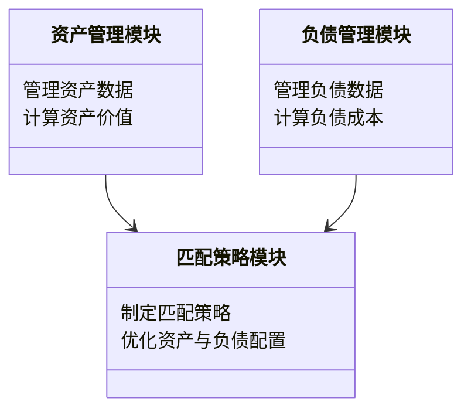
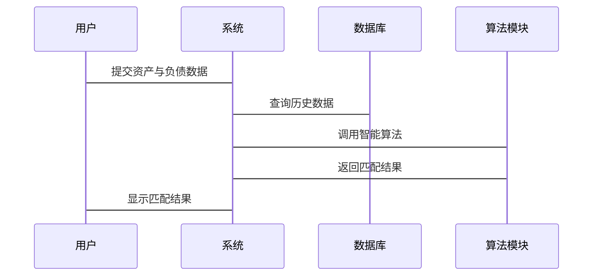

                 


# 智能资产负债匹配管理系统

## 关键词：智能资产负债匹配管理、人工智能、动态规划、强化学习、系统架构设计

## 摘要：  
智能资产负债匹配管理系统是一种结合人工智能技术的金融管理系统，旨在通过智能算法优化资产与负债的匹配效率，降低风险，提高收益。本文从背景、核心概念、算法原理、系统架构设计、项目实战等方面，详细探讨智能资产负债匹配管理系统的构建与应用，为金融行业提供新的解决方案。

---

## 第1章：智能资产负债匹配管理系统的背景与核心概念

### 1.1 资产负债匹配管理的定义与重要性

#### 1.1.1 资产与负债的基本概念
资产是指企业拥有的资源，能够为企业带来经济利益，如现金、应收账款、存货等。负债是指企业欠他人的债务，如应付账款、短期借款、长期借款等。资产负债匹配管理的核心是通过合理配置资产与负债，实现企业的财务目标。

#### 1.1.2 资产负债匹配管理的定义
资产负债匹配管理是指通过对资产和负债的合理配置与动态调整，确保企业在不同经济周期和市场环境下的财务稳定性与收益最大化。通过优化资产负债结构，企业可以降低财务风险，提高资金使用效率。

#### 1.1.3 资产负债匹配管理在企业中的重要性
在现代金融环境中，企业面临复杂的市场波动和经济不确定性。传统的资产负债管理方法难以适应快速变化的市场环境，而智能资产负债匹配管理通过引入人工智能技术，能够实时分析市场数据，动态调整资产与负债的配置，从而提高企业的财务灵活性和抗风险能力。

### 1.2 传统资产负债匹配管理的局限性

#### 1.2.1 传统资产负债匹配管理的流程
传统资产负债匹配管理主要依赖人工分析和静态模型，流程包括数据收集、分析、决策和执行。然而，这种方法存在效率低、响应慢、风险控制能力弱等问题。

#### 1.2.2 传统方法的不足与挑战
- 数据处理能力有限：传统方法难以处理海量数据，无法实时捕捉市场变化。
- 模型静态：传统模型假设市场环境不变，难以应对突发事件和市场波动。
- 风险控制不足：传统方法难以全面识别和评估潜在风险。

#### 1.2.3 传统方法与现代需求的矛盾
随着金融市场的复杂化和数字化，企业对资产负债管理的实时性、精准性和智能化提出了更高的要求。传统方法在数据处理能力、决策速度和风险控制方面已无法满足现代企业的需求。

### 1.3 智能资产负债匹配管理的提出

#### 1.3.1 智能化技术在金融领域的应用趋势
人工智能技术的快速发展为金融行业带来了新的机遇。智能算法能够处理海量数据，实时分析市场动态，为决策提供支持。

#### 1.3.2 智能资产负债匹配管理的核心优势
- 高效性：智能算法能够快速处理数据，实时调整资产负债配置。
- 精准性：通过机器学习算法，能够精准预测市场趋势，优化资产与负债的匹配。
- 风险控制：智能系统能够实时监控市场风险，及时调整策略，降低财务风险。

#### 1.3.3 智能资产负债匹配管理的适用场景
智能资产负债匹配管理系统适用于各种金融场景，包括企业日常财务管理、投资决策、风险管理等。尤其在复杂经济环境下，智能系统能够帮助企业快速应对市场变化，实现财务目标。

### 1.4 本章小结

本章介绍了智能资产负债匹配管理系统的背景和核心概念，分析了传统方法的局限性，提出了智能资产负债匹配管理的优势和适用场景，为后续章节的展开奠定了基础。

---

## 第2章：智能资产负债匹配管理系统的核心概念与联系

### 2.1 资产负债匹配管理的核心要素

#### 2.1.1 资产的分类与特征
资产可以分为流动资产、非流动资产等类别。流动资产包括现金、应收账款、存货等，具有流动性高、变现能力强的特点。非流动资产包括长期股权投资、固定资产、无形资产等，具有流动性低、变现能力弱的特点。

#### 2.1.2 负债的分类与特征
负债可以分为流动负债和非流动负债。流动负债包括短期借款、应付账款、应付职工薪酬等，具有偿付期限短、流动性强的特点。非流动负债包括长期借款、应付债券等，具有偿付期限长、流动性弱的特点。

#### 2.1.3 资产负债匹配的度量指标
常用的资产负债匹配度量指标包括资产负债率、流动比率、速动比率等。这些指标能够反映企业的财务健康状况和偿债能力。

### 2.2 智能资产负债匹配管理的原理

#### 2.2.1 智能算法在匹配管理中的应用
智能算法包括机器学习、深度学习、强化学习等。这些算法能够通过数据驱动的方式，优化资产负债匹配策略。

#### 2.2.2 数据驱动的资产负债优化
智能资产负债匹配管理系统通过收集和分析市场数据、企业财务数据，利用机器学习算法，优化资产与负债的配置，提高企业的财务效率。

#### 2.2.3 动态调整与实时反馈机制
智能系统能够实时监控市场变化和企业财务状况，动态调整资产与负债的匹配策略，并根据实际效果进行反馈，优化后续决策。

### 2.3 智能资产负债匹配管理的数学模型

#### 2.3.1 资产负债匹配的优化目标
优化目标包括最大化企业收益、最小化财务风险、保持资产与负债的动态平衡。

#### 2.3.2 数学模型的构建与求解
数学模型可以通过线性规划、非线性规划等方法构建。例如，可以使用动态规划模型来优化资产与负债的匹配策略。

#### 2.3.3 模型的适用性与限制
数学模型的适用性取决于数据质量和模型假设的合理性。模型的限制包括数据偏差、市场环境变化等。

### 2.4 核心概念对比分析

#### 2.4.1 资产与负债的属性对比
资产与负债在流动性、风险、收益等方面存在显著差异。资产的风险较低，收益稳定；负债的风险较高，成本较高。

#### 2.4.2 智能匹配与传统匹配的对比
智能匹配能够实时调整策略，适应市场变化；传统匹配方法静态，难以应对复杂环境。

#### 2.4.3 不同匹配策略的效果对比
不同的匹配策略在收益、风险、流动性等方面存在差异。企业需要根据自身需求和市场环境选择合适的策略。

### 2.5 本章小结

本章分析了智能资产负债匹配管理的核心概念，探讨了资产与负债的分类、匹配度量指标、智能算法的应用以及数学模型的构建与优化。通过对比分析，明确了智能匹配的优势和适用场景。

---

## 第3章：智能资产负债匹配管理系统的算法原理

### 3.1 基于动态规划的匹配算法

#### 3.1.1 动态规划的基本原理
动态规划是一种优化算法，通过将问题分解为子问题，逐步求解，最终得到最优解。

#### 3.1.2 动态规划在资产负债匹配中的应用
在资产负债匹配中，动态规划可以用于优化资产与负债的配置，确保企业在不同时间段的财务稳定性。

#### 3.1.3 算法的实现步骤与代码示例
```python
def dynamic_programming(asset, liability):
    n = len(asset)
    dp = [[0 for _ in range(n)] for _ in range(n)]
    for i in range(n):
        for j in range(i+1):
            if j == 0:
                dp[i][j] = asset[i] - liability[j]
            else:
                dp[i][j] = max(dp[i-1][j], dp[i][j-1])
    return dp[n-1][n-1]
```

#### 3.1.4 算法的优缺点
动态规划算法的时间复杂度较高，适用于小规模数据。在资产负债匹配中，动态规划能够有效优化资产与负债的配置，但计算量较大。

### 3.2 基于强化学习的匹配算法

#### 3.2.1 强化学习的基本原理
强化学习是一种机器学习方法，通过智能体与环境的交互，学习最优策略。

#### 3.2.2 强化学习在资产负债匹配中的应用
在资产负债匹配中，强化学习可以用于动态调整资产与负债的配置，适应市场变化。

#### 3.2.3 算法的实现步骤与代码示例
```python
class Agent:
    def __init__(self, state_space, action_space):
        self.state_space = state_space
        self.action_space = action_space
        self.model = self.build_model()

    def build_model(self):
        # 构建神经网络模型
        pass

    def act(self, state):
        # 根据状态选择动作
        pass

    def learn(self, state, action, reward, next_state):
        # 更新模型参数
        pass
```

#### 3.2.4 算法的优缺点
强化学习算法能够适应复杂环境，但训练过程较长，需要大量数据支持。在资产负债匹配中，强化学习能够实现动态调整，但计算资源消耗较大。

### 3.3 算法的比较与优化

#### 3.3.1 不同算法的优缺点对比
动态规划算法简单易懂，适用于小规模数据；强化学习算法适应性强，但计算复杂。

#### 3.3.2 算法优化的策略与方法
根据具体场景选择合适的算法，结合多种算法的优点，优化资产负债匹配策略。

### 3.4 本章小结

本章详细讲解了动态规划和强化学习在智能资产负债匹配管理中的应用，通过代码示例和优缺点分析，帮助读者理解不同算法的特点和适用场景。

---

## 第4章：智能资产负债匹配管理系统的系统分析与架构设计

### 4.1 问题场景介绍

#### 4.1.1 企业面临的资产负债匹配问题
企业在经营过程中，常常面临资产与负债不匹配的问题，导致资金链断裂、财务风险增加。

#### 4.1.2 市场环境的不确定性
经济波动、政策变化等不确定性因素，增加了资产负债匹配的难度。

### 4.2 项目介绍

#### 4.2.1 项目目标
通过智能算法优化资产与负债的配置，降低财务风险，提高企业收益。

#### 4.2.2 项目范围
包括企业内部的财务管理、投资决策、风险管理等方面。

### 4.3 系统功能设计

#### 4.3.1 领域模型图（Mermaid 类图）


### 4.4 系统架构设计

#### 4.4.1 系统架构图（Mermaid 架构图）
```mermaid
archimate
    一个中央处理单元 [智能资产负债匹配管理系统]
    一个 数据库 [企业财务数据]
    一个 用户界面 [管理界面]
    一个 API 接口 [外部数据接口]
    中央处理单元 -> 用户界面: 显示匹配结果
    中央处理单元 -> 数据库: 查询数据
    中央处理单元 -> API 接口: 获取外部数据
```

### 4.5 接口设计

#### 4.5.1 系统交互序列图（Mermaid 序列图）


### 4.6 本章小结

本章分析了智能资产负债匹配管理系统的功能需求和系统架构，通过图表展示了系统的模块构成和交互流程，为后续的实现奠定了基础。

---

## 第5章：智能资产负债匹配管理系统的项目实战

### 5.1 环境安装

#### 5.1.1 系统运行环境
- 操作系统：Linux/Windows
- 编程语言：Python 3.8+
- 开发工具：Jupyter Notebook/PyCharm
- 依赖库：NumPy、Pandas、Scikit-learn、TensorFlow

#### 5.1.2 数据准备
需要收集企业的资产与负债数据，包括各类资产和负债的金额、期限、利率等信息。

### 5.2 核心代码实现

#### 5.2.1 动态规划算法实现
```python
def dynamic_programming(asset, liability):
    n = len(asset)
    dp = [[0 for _ in range(n)] for _ in range(n)]
    for i in range(n):
        for j in range(i+1):
            if j == 0:
                dp[i][j] = asset[i] - liability[j]
            else:
                dp[i][j] = max(dp[i-1][j], dp[i][j-1])
    return dp[n-1][n-1]
```

#### 5.2.2 强化学习算法实现
```python
class Agent:
    def __init__(self, state_space, action_space):
        self.state_space = state_space
        self.action_space = action_space
        self.model = self.build_model()

    def build_model(self):
        model = Sequential()
        model.add(Dense(64, activation='relu', input_dim=self.state_space))
        model.add(Dense(self.action_space, activation='linear'))
        model.compile(optimizer='adam', loss='mean_squared_error')
        return model

    def act(self, state):
        return self.model.predict(state)[0]

    def learn(self, state, action, reward, next_state):
        target = reward + self.model.predict(next_state)[0]
        self.model.fit(state, target, epochs=1, verbose=0)
```

### 5.3 代码应用解读与分析

#### 5.3.1 动态规划算法的应用
动态规划算法通过逐步优化资产与负债的配置，确保企业在不同时间段的财务稳定性。

#### 5.3.2 强化学习算法的应用
强化学习算法通过与市场的交互，动态调整资产与负债的配置，适应市场变化。

### 5.4 案例分析

#### 5.4.1 案例背景
某企业面临资产与负债不匹配的问题，导致财务风险增加。

#### 5.4.2 案例实施步骤
1. 收集企业资产与负债数据。
2. 使用动态规划算法优化资产与负债配置。
3. 实施优化方案，降低财务风险。

#### 5.4.3 案例分析结果
通过智能资产负债匹配管理系统的优化，企业降低了财务风险，提高了资金使用效率。

### 5.5 项目小结

本章通过实际案例，展示了智能资产负债匹配管理系统的实现过程和应用效果，验证了系统的有效性和实用性。

---

## 第6章：智能资产负债匹配管理系统的最佳实践与总结

### 6.1 系统优缺点分析

#### 6.1.1 系统的优点
- 高效性：智能算法能够快速处理数据，实时调整资产负债配置。
- 精准性：通过机器学习算法，能够精准预测市场趋势，优化资产与负债的匹配。
- 风险控制：智能系统能够实时监控市场风险，及时调整策略，降低财务风险。

#### 6.1.2 系统的缺点
- 数据依赖性：系统依赖于高质量的数据，数据不足或不准确会影响系统的性能。
- 计算资源消耗大：智能算法需要大量的计算资源，尤其是在处理大规模数据时。
- 模型可解释性差：部分智能算法（如深度学习）的模型可解释性较差，影响决策的透明性。

### 6.2 系统使用建议

#### 6.2.1 数据质量管理
确保数据的准确性和完整性，建立数据清洗和预处理机制。

#### 6.2.2 算法选择与优化
根据具体场景选择合适的算法，结合多种算法的优点，优化资产负债匹配策略。

#### 6.2.3 系统维护与更新
定期更新模型和算法，适应市场变化和企业需求。

### 6.3 注意事项

#### 6.3.1 数据隐私与安全
保护企业数据的安全，防止数据泄露和滥用。

#### 6.3.2 系统稳定性
确保系统的稳定运行，避免因系统故障导致财务损失。

#### 6.3.3 人员培训
对企业的财务人员进行培训，提高他们对智能系统的理解和应用能力。

### 6.4 拓展阅读

#### 6.4.1 推荐书籍
- 《智能金融：人工智能在金融领域的应用》
- 《算法导论》
- 《机器学习实战》

#### 6.4.2 推荐在线课程
- Coursera：《金融风险管理》
- edX：《人工智能基础》
- Udemy：《Python机器学习实战》

### 6.5 本章小结

本章总结了智能资产负债匹配管理系统的优缺点，提出了系统的使用建议和注意事项，并推荐了相关的拓展阅读资料，帮助读者进一步深入学习。

---

## 作者信息

作者：AI天才研究院 & 禅与计算机程序设计艺术  
GitHub：[AI天才研究院](https://github.com/AI-Genius-Institute)  
CSDN：[禅与计算机程序设计艺术](https://blog.csdn.net/zanmeng)

---

以上是《智能资产负债匹配管理系统》的完整内容，涵盖从背景、核心概念、算法原理到系统架构设计和项目实战的各个方面。通过详细的讲解和实际案例分析，本文为读者提供了全面的智能资产负债匹配管理系统的知识和应用指南。

