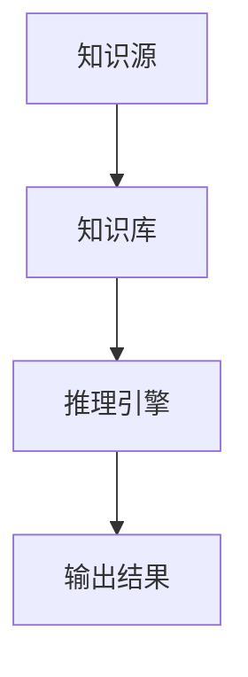
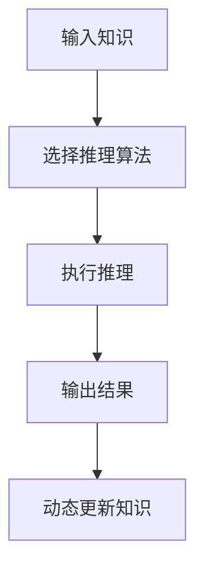
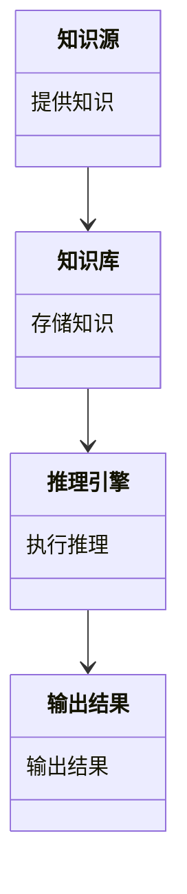
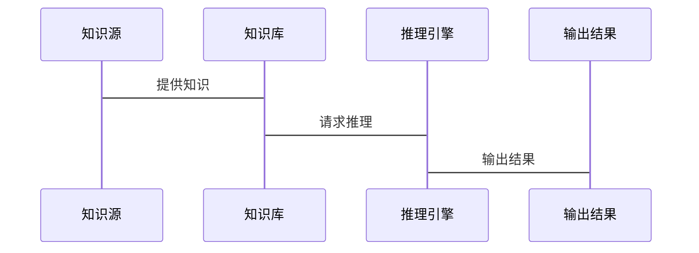

                 


```markdown
# 构建AI Agent的动态知识推理系统

> 关键词：AI Agent，动态知识推理，知识表示，推理算法，系统架构

> 摘要：本文详细探讨了构建AI Agent的动态知识推理系统的核心概念、算法原理、系统架构及项目实现。通过分析知识表示、推理机制和系统设计，结合实际案例，为读者提供了一套完整的构建方法。

---

## 第一章: AI Agent与动态知识推理系统概述

### 1.1 AI Agent的基本概念与动态知识推理的背景

#### 1.1.1 AI Agent的定义与核心功能
AI Agent（智能体）是指在计算机系统中，能够感知环境并采取行动以实现目标的实体。AI Agent的核心功能包括感知、决策、推理和行动。

- 感知：通过传感器或数据输入，获取环境中的信息。
- 决策：基于当前状态和目标，制定行动方案。
- 推理：利用知识库中的信息进行逻辑推理，得出新的结论。
- 行动：执行决策，影响环境状态。

动态知识推理是AI Agent的核心功能之一，它使智能体能够根据实时信息更新知识库，适应环境的变化。

#### 1.1.2 AI Agent的核心功能
AI Agent的核心功能可以分为以下几类：
- **感知功能**：通过传感器或接口获取环境数据。
- **推理功能**：利用知识库进行逻辑推理，得出新的结论。
- **决策功能**：基于推理结果，制定行动方案。
- **学习功能**：通过经验或新数据，更新知识库和推理模型。

#### 1.1.3 动态知识推理的必要性
在动态环境中，信息是不断变化的。AI Agent需要能够实时更新知识库，以适应新的环境条件。动态知识推理使智能体能够：
- 处理实时数据，更新知识库。
- 根据最新信息，重新推理和制定决策。
- 在不确定或模糊的环境中，做出合理的判断。

### 1.2 动态知识推理的背景与挑战

#### 1.2.1 知识动态变化的背景
在现实世界中，知识是动态变化的。例如：
- 金融市场中的股票价格实时波动。
- 气象数据的实时变化。
- 社交媒体上的信息不断更新。

AI Agent需要能够处理这些动态信息，以做出及时响应。

#### 1.2.2 动态知识推理的挑战
动态知识推理面临以下挑战：
- **知识更新的实时性**：需要快速更新知识库，以反映最新信息。
- **推理的高效性**：在动态环境中，推理过程需要高效，以避免延迟。
- **不确定性处理**：动态环境中，信息往往是不确定或模糊的。

#### 1.2.3 动态知识推理的应用场景
动态知识推理的应用场景包括：
- **金融领域**：实时分析市场动态，做出投资决策。
- **医疗领域**：实时更新患者数据，辅助诊断。
- **交通领域**：实时调整路线，优化交通流量。

### 1.3 本章小结
本章介绍了AI Agent的基本概念和动态知识推理的背景，强调了动态知识推理在AI Agent中的重要性。通过分析知识动态变化的背景，指出了动态知识推理的必要性，并探讨了其实现的挑战和应用场景。

---

## 第二章: 动态知识推理系统的核心概念与联系

### 2.1 知识表示与推理的基本原理

#### 2.1.1 知识表示的定义与方法
知识表示是将知识以计算机能够理解的形式表示出来。常见的知识表示方法包括：
- **谓词逻辑**：用谓词和逻辑连接词表示知识。
- **语义网络**：用节点和边表示概念及其关系。
- **知识图谱**：用实体和关系构建大规模的知识库。

#### 2.1.2 推理的基本原理
推理是基于知识库中的已知信息，推导出新的结论。常见的推理方法包括：
- **演绎推理**：从一般到特殊的推理。
- **归纳推理**：从特殊到一般的推理。
- **溯因推理**：从结果推导原因。

#### 2.1.3 动态知识的更新机制
动态知识的更新机制包括：
- **插入**：添加新的知识。
- **删除**：移除旧的知识。
- **更新**：修改现有知识。

### 2.2 动态知识推理系统的实体关系图



### 2.3 本章小结
本章详细介绍了动态知识推理系统的核心概念，包括知识表示和推理的基本原理，以及动态知识的更新机制。通过实体关系图，展示了系统各部分之间的关系。

---

## 第三章: 动态知识推理系统的算法原理

### 3.1 基于规则的推理算法

#### 3.1.1 规则表示方法
基于规则的推理算法通过预定义的规则进行推理。规则通常表示为：如果条件满足，则结论成立。

例如，规则可以表示为：
$$ \text{如果}(A \text{且} B) \text{则} C $$

#### 3.1.2 基于规则的推理过程
基于规则的推理过程包括以下步骤：
1. **匹配条件**：检查知识库中是否存在与规则条件匹配的事实。
2. **触发规则**：当条件匹配时，触发规则，推导出结论。
3. **更新知识库**：将结论添加到知识库中。

#### 3.1.3 规则更新机制
规则的更新机制包括：
- **新增规则**：添加新的规则。
- **修改规则**：修改现有规则。
- **删除规则**：移除不再适用的规则。

### 3.2 基于概率的推理算法

#### 3.2.1 概率推理的基本原理
概率推理基于概率论，通过计算事件发生的概率，进行推理。

例如，贝叶斯定理可以表示为：
$$ P(A|B) = \frac{P(B|A) \cdot P(A)}{P(B)} $$

#### 3.2.2 贝叶斯网络的应用
贝叶斯网络是一种有向无环图，用于表示变量之间的概率关系。

例如，一个简单的贝叶斯网络可以表示为：


#### 3.2.3 动态概率更新方法
动态概率更新方法包括：
- **马尔可夫链蒙特卡洛方法**：用于估计概率分布。
- **在线更新方法**：实时更新概率分布。

### 3.3 基于机器学习的推理算法

#### 3.3.1 机器学习在推理中的应用
机器学习可以通过训练数据，学习推理规则。

例如，监督学习可以用于分类任务：
$$ y = f(x) $$

#### 3.3.2 神经网络推理模型
神经网络推理模型通过训练数据，学习推理规则。例如，循环神经网络可以用于序列推理。

#### 3.3.3 模型的动态更新与优化
模型的动态更新与优化包括：
- **在线学习**：实时更新模型。
- **微调**：对模型进行微调，适应新数据。

### 3.4 算法流程图



### 3.5 本章小结
本章详细介绍了动态知识推理系统的算法原理，包括基于规则、概率和机器学习的推理算法。通过流程图，展示了推理过程。

---

## 第四章: 动态知识推理系统的系统分析与架构设计

### 4.1 系统分析与架构设计

#### 4.1.1 系统功能设计（领域模型）
系统功能设计包括以下模块：
- **知识源**：提供知识输入。
- **知识库**：存储知识。
- **推理引擎**：执行推理。
- **输出结果**：输出推理结果。

领域模型可以用类图表示：



#### 4.1.2 系统架构设计（架构图）
系统架构设计可以用架构图表示：


#### 4.1.3 系统接口设计
系统接口设计包括：
- **输入接口**：接收知识输入。
- **输出接口**：输出推理结果。
- **更新接口**：动态更新知识库。

#### 4.1.4 系统交互（交互流程图）
系统交互可以用序列图表示：



### 4.2 本章小结
本章详细介绍了动态知识推理系统的系统分析与架构设计，包括功能设计、架构设计、接口设计和交互流程设计。

---

## 第五章: 动态知识推理系统的项目实战

### 5.1 项目环境搭建

#### 5.1.1 环境要求
- 操作系统：Linux/Windows/MacOS
- Python版本：3.6+
- 开发工具：PyCharm/VSCode
- 依赖库：networkx, matplotlib

#### 5.1.2 安装依赖
```bash
pip install networkx matplotlib
```

### 5.2 核心代码实现

#### 5.2.1 知识库实现
```python
from collections import defaultdict

class KnowledgeBase:
    def __init__(self):
        self.knowledge = defaultdict(list)
    
    def add_fact(self, fact):
        self.knowledge[fact[0]].append(fact[1])
    
    def get_facts(self, entity):
        return self.knowledge.get(entity, [])
```

#### 5.2.2 推理引擎实现
```python
class ReasoningEngine:
    def __init__(self, knowledge_base):
        self.knowledge_base = knowledge_base
    
    def infer(self, entity):
        facts = self.knowledge_base.get_facts(entity)
        inferred_facts = []
        for fact in facts:
            inferred_facts.append((fact[0], fact[1]))
        return inferred_facts
```

#### 5.2.3 动态更新实现
```python
class DynamicReasoningSystem:
    def __init__(self):
        self.knowledge_base = KnowledgeBase()
        self.reasoning_engine = ReasoningEngine(self.knowledge_base)
    
    def update_knowledge(self, entity, value):
        self.knowledge_base.add_fact((entity, value))
    
    def get_inference(self, entity):
        return self.reasoning_engine.infer(entity)
```

### 5.3 项目实战案例

#### 5.3.1 案例分析
假设我们有一个简单的知识库，包含以下事实：
- 狗是一种动物。
- 动物需要食物。
- 狗需要水。

动态知识推理系统可以推断出：狗需要水和食物。

#### 5.3.2 代码实现
```python
# 初始化知识库
knowledge_base = KnowledgeBase()
knowledge_base.add_fact(('狗', '动物'))
knowledge_base.add_fact(('动物', '需要食物'))
knowledge_base.add_fact(('动物', '需要水'))

# 初始化推理引擎
reasoning_engine = ReasoningEngine(knowledge_base)

# 推理结果
inference = reasoning_engine.infer('狗')
print(inference)  # 输出：[('动物', '需要食物'), ('动物', '需要水')]
```

#### 5.3.3 系统优化
为了提高推理效率，可以采用以下优化措施：
- **缓存机制**：缓存频繁查询的事实。
- **索引优化**：对知识库进行索引优化，提高查询速度。
- **并行推理**：利用多线程或多进程，提高推理速度。

### 5.4 本章小结
本章通过实际案例，展示了动态知识推理系统的实现过程，包括环境搭建、核心代码实现和案例分析。通过优化措施，提高了系统的性能。

---

## 第六章: 总结与展望

### 6.1 总结
本文详细探讨了构建AI Agent的动态知识推理系统的核心概念、算法原理、系统架构及项目实现。通过分析知识表示、推理机制和系统设计，结合实际案例，为读者提供了一套完整的构建方法。

### 6.2 未来展望
未来的研究方向包括：
- **更高效的推理算法**：研究更高效的推理算法，如深度学习和强化学习。
- **动态知识图谱**：研究动态知识图谱的构建与推理。
- **多模态推理**：研究多模态数据的推理，如图像和文本的结合推理。

### 6.3 最佳实践 Tips
- **保持知识库的及时更新**：确保知识库中的信息是最新的。
- **选择合适的推理算法**：根据具体场景选择合适的推理算法。
- **优化系统性能**：通过缓存、索引优化等措施，提高系统性能。

### 6.4 本章小结
本文总结了构建AI Agent的动态知识推理系统的实现过程，并展望了未来的研究方向，同时给出了最佳实践的建议。

---

## 作者：AI天才研究院/AI Genius Institute & 禅与计算机程序设计艺术 /Zen And The Art of Computer Programming
```

