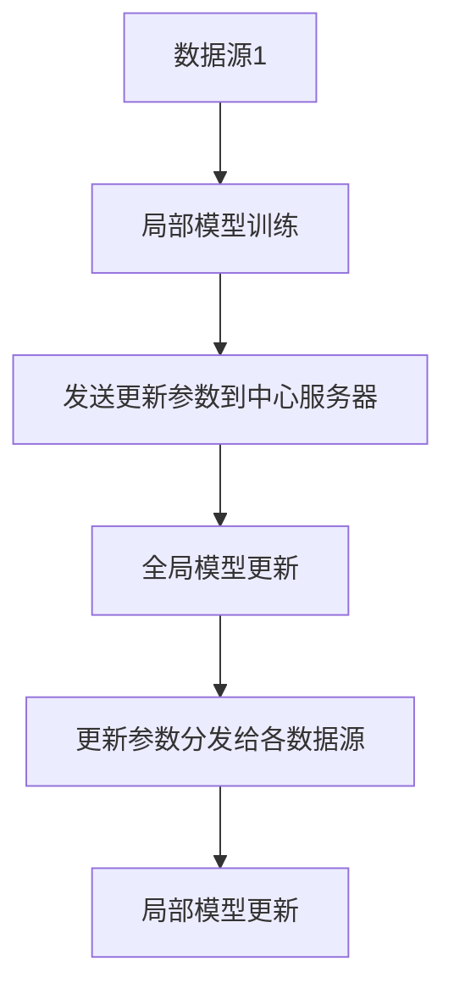
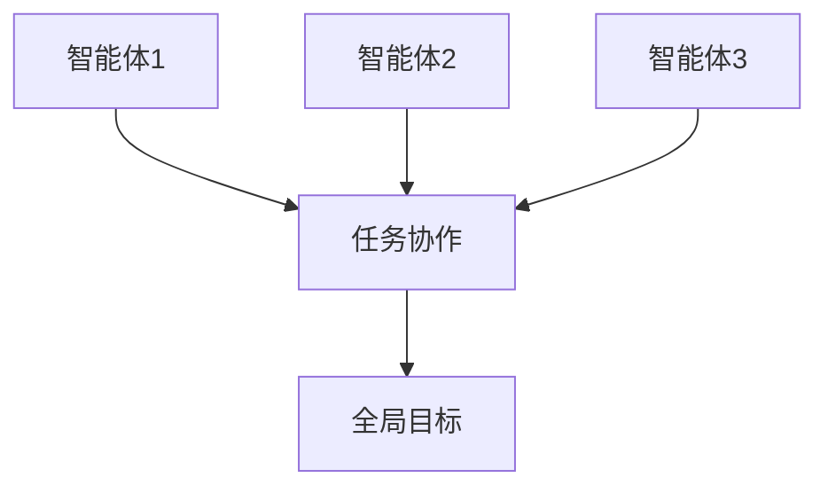
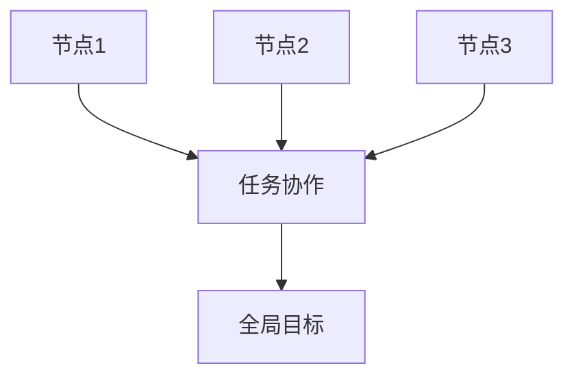
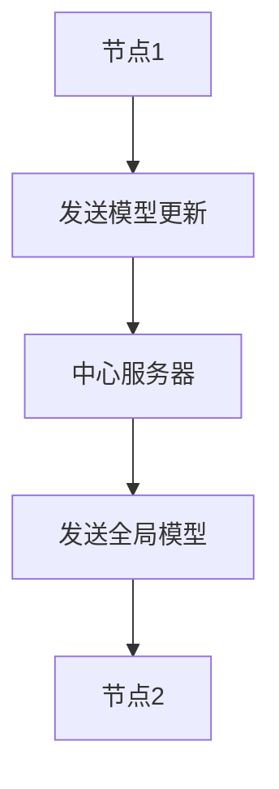

                 


# 联邦学习在分布式AI Agent系统中的应用

> **关键词**: 联邦学习, 分布式AI Agent, 分布式系统, 数据隐私, 机器学习, AI协作

> **摘要**: 本文探讨了联邦学习在分布式AI Agent系统中的应用，详细介绍了联邦学习的核心原理、算法框架、系统架构设计以及实际项目实现。文章从背景介绍、核心概念、算法实现、系统设计、项目实战到最佳实践，全面分析了联邦学习在分布式AI Agent中的应用，为读者提供了从理论到实践的完整指导。

---

## 第1章: 联邦学习与分布式AI Agent概述

### 1.1 联邦学习的核心概念

#### 1.1.1 什么是联邦学习
联邦学习（Federated Learning）是一种分布式机器学习技术，允许多个参与方在不共享原始数据的前提下，协同训练模型。其核心思想是通过局部模型更新和参数交换，实现全局模型的优化，同时保护数据隐私。

**图1.1 联邦学习的基本流程**



#### 1.1.2 分布式AI Agent的基本概念
AI Agent（智能体）是指能够感知环境、自主决策并执行任务的实体。分布式AI Agent系统由多个智能体组成，每个智能体负责特定的任务，通过通信和协作完成整体目标。

**表1.1 分布式系统与传统系统的对比**

| 特性                | 分布式系统                     | 传统集中式系统                |
|---------------------|-------------------------------|------------------------------|
| 数据分布           | 数据分布在多个节点           | 数据集中在一个中心节点       |
| 计算能力           | 各节点计算能力有限           | 中心节点计算能力强           |
| 通信机制           | 节点间需要高效通信           | 仅需中心节点与外部通信       |
| 数据隐私保护       | 数据不出域，保护隐私         | 数据可能需要集中处理，隐私风险高 |

#### 1.1.3 联邦学习在分布式系统中的作用
联邦学习为分布式AI Agent系统提供了数据隐私保护和模型协作的可能性，避免了传统集中式学习的数据泄露风险，同时实现了模型的全局优化。

---

### 1.2 联邦学习与传统机器学习的对比

#### 1.2.1 传统机器学习的特点
传统机器学习依赖于集中式数据，所有数据都需要汇总到中心服务器进行训练，这种方式虽然计算效率高，但存在数据隐私泄露的风险。

#### 1.2.2 联邦学习的独特优势
联邦学习的核心优势在于数据不出域，隐私保护强，同时能够利用分布式数据进行模型训练，提升模型的泛化能力。

#### 1.2.3 联邦学习的应用场景
联邦学习适用于多个数据源无法集中存储的场景，例如医疗数据、金融数据等，这些场景对数据隐私要求高，且需要模型协作。

---

### 1.3 分布式AI Agent系统的特点

#### 1.3.1 分布式系统的基本架构
分布式AI Agent系统通常由多个智能体组成，每个智能体负责特定的任务，通过通信和协作完成整体目标。

**图1.2 分布式AI Agent系统架构**



#### 1.3.2 AI Agent的核心功能
AI Agent具备感知环境、自主决策和执行任务的能力，能够通过通信模块与其他智能体协作。

#### 1.3.3 联邦学习在分布式系统中的应用
通过联邦学习，分布式AI Agent系统可以在不共享数据的前提下，协同训练模型，实现全局优化。

---

## 第2章: 联邦学习的核心原理

### 2.1 联邦学习的基本原理

#### 2.1.1 数据联邦化的概念
数据联邦化是指将分布的数据进行虚拟集中化处理，通过模型参数更新实现全局模型的优化。

#### 2.1.2 联邦学习的通信机制
联邦学习通过加密通信和差分隐私技术，确保数据在传输过程中不被窃取或篡改。

#### 2.1.3 联邦学习的同步策略
联邦学习通常采用同步或异步策略，同步策略保证所有节点同时更新模型，异步策略则允许节点按需更新。

---

### 2.2 联邦学习的算法框架

#### 2.2.1 基于模型平均的联邦学习
模型平均是一种常见的联邦学习方法，通过将各节点的模型参数平均，得到全局模型。

**公式2.1 模型平均算法**

$$ \theta_{global} = \frac{1}{N} \sum_{i=1}^{N} \theta_i $$

其中，$\theta_{global}$ 是全局模型参数，$N$ 是节点数量，$\theta_i$ 是第 $i$ 个节点的模型参数。

#### 2.2.2 基于模型参数更新的联邦学习
模型参数更新算法通过将各节点的梯度上传到中心服务器，更新全局模型。

**公式2.2 梯度平均算法**

$$ \theta_{global}^{new} = \theta_{global} + \eta \sum_{i=1}^{N} \Delta \theta_i $$

其中，$\eta$ 是学习率，$\Delta \theta_i$ 是第 $i$ 个节点的梯度更新。

---

### 2.3 联邦学习的安全与隐私保护

#### 2.3.1 数据隐私保护机制
联邦学习通过差分隐私技术，在模型更新过程中添加噪声，防止数据泄露。

#### 2.3.2 联邦学习中的加密技术
使用同态加密技术，确保数据在传输和计算过程中保持加密状态。

#### 2.3.3 联邦学习的匿名化处理
通过匿名化处理，确保数据中的个人身份信息无法被识别。

---

## 第3章: 分布式AI Agent系统的架构设计

### 3.1 分布式AI Agent的体系结构

#### 3.1.1 分布式系统的基本架构
分布式系统由多个节点组成，每个节点负责特定的功能。

**图3.1 分布式AI Agent系统架构**



#### 3.1.2 AI Agent的协作机制
通过通信模块，AI Agent之间可以共享模型更新和任务信息，实现协作。

#### 3.1.3 联邦学习在系统中的位置
联邦学习作为系统的核心模块，负责模型的训练和更新。

---

### 3.2 联邦学习的通信协议设计

#### 3.2.1 联邦学习的通信模型
通信模型定义了节点之间的数据交换方式和协议。

**图3.2 联邦学习通信流程**



#### 3.2.2 联邦学习的协议流程
协议流程包括模型初始化、局部训练、模型更新和全局模型发布。

#### 3.2.3 联邦学习的通信优化
通过优化通信协议，减少数据传输量，提升系统效率。

---

### 3.3 分布式AI Agent的协作机制

#### 3.3.1 协作任务的定义
协作任务是指多个智能体共同完成的任务，例如多智能体强化学习。

#### 3.3.2 协作任务的分配策略
根据任务需求和节点能力，动态分配任务。

#### 3.3.3 协作任务的执行流程
包括任务分解、任务执行和任务结果汇总。

---

## 第4章: 联邦学习的关键算法与实现

### 4.1 联邦学习的实现步骤

#### 4.1.1 环境搭建
安装必要的依赖库，例如TensorFlow、Flask等。

#### 4.1.2 模型初始化
初始化全局模型，并将模型参数分发给各个节点。

#### 4.1.3 模型训练
各节点进行局部训练，生成模型更新参数。

#### 4.1.4 模型聚合
将各节点的模型更新参数汇总，生成新的全局模型。

---

### 4.2 联邦学习的代码实现

#### 4.2.1 Python代码示例

```python
import numpy as np
import tensorflow as tf

# 全局模型初始化
global_model = tf.keras.Sequential([
    tf.keras.layers.Dense(64, activation='relu'),
    tf.keras.layers.Dense(10, activation='softmax')
])

# 模型更新函数
def update_model(global_model, local_models):
    average_weights = np.mean(local_models, axis=0)
    global_model.set_weights(average_weights)
    return global_model

# 联邦学习主程序
def federated_learning():
    # 初始化节点数量
    N = 3
    # 初始化局部模型
    local_models = [global_model.get_weights() for _ in range(N)]
    # 模型训练
    for _ in range(epochs):
        for i in range(N):
            local_models[i] = train_local_model(local_models[i])
        # 模型聚合
        global_model = update_model(global_model, local_models)
        # 更新所有节点模型
        for i in range(N):
            local_models[i] = global_model.get_weights()
    return global_model

# 执行联邦学习
federated_learning()
```

---

### 4.3 联邦学习的数学模型

#### 4.3.1 同步联邦学习的数学模型

$$ \theta_{t+1} = \theta_t + \eta \sum_{i=1}^{N} \nabla L_i(\theta_t) $$

其中，$\theta_t$ 是第 $t$ 轮的模型参数，$\eta$ 是学习率，$L_i$ 是第 $i$ 个节点的损失函数。

#### 4.3.2 异步联邦学习的数学模型

$$ \theta_{t+1} = \theta_t + \eta \nabla L_j(\theta_t) $$

其中，$j$ 是随机选择的节点索引。

---

## 第5章: 分布式AI Agent系统的交互设计

### 5.1 问题场景介绍

#### 5.1.1 多智能体协作问题
多个智能体需要协作完成任务，例如多智能体强化学习。

#### 5.1.2 数据分布问题
数据分布在多个节点，无法集中到中心服务器。

#### 5.1.3 数据隐私保护问题
数据隐私保护是分布式系统设计的重要考虑因素。

---

### 5.2 系统功能设计

#### 5.2.1 系统功能模块
系统功能模块包括数据采集、模型训练、模型更新和结果输出。

#### 5.2.2 系统功能流程
数据采集 → 模型训练 → 模型更新 → 结果输出。

#### 5.2.3 功能模块之间的关系
数据采集模块负责获取数据，模型训练模块进行局部训练，模型更新模块负责聚合模型，结果输出模块展示结果。

---

### 5.3 系统架构设计

#### 5.3.1 系统架构图


#### 5.3.2 系统组件之间的交互
数据源将数据发送给局部模型训练模块，训练完成后将更新参数发送到中心服务器，中心服务器聚合模型参数后，将全局模型参数分发给各数据源。

---

### 5.4 系统接口设计

#### 5.4.1 接口定义
定义接口`train_model`和`update_model`，分别用于局部训练和模型更新。

#### 5.4.2 接口交互流程
数据源调用`train_model`接口进行局部训练，完成后调用`update_model`接口发送更新参数。

---

## 第6章: 联邦学习在分布式AI Agent系统中的项目实战

### 6.1 环境搭建

#### 6.1.1 安装依赖
安装TensorFlow、Flask等必要的库。

```bash
pip install tensorflow flask numpy
```

#### 6.1.2 安装配置
配置本地网络环境，确保各节点之间可以通信。

---

### 6.2 系统核心实现

#### 6.2.1 Python代码实现

```python
import numpy as np
import tensorflow as tf
from flask import Flask, request, jsonify

# 定义中心服务器接口
app = Flask(__name__)

@app.route('/train', methods=['POST'])
def train():
    data = request.json['data']
    # 局部模型训练
    local_model = tf.keras.Sequential([
        tf.keras.layers.Dense(64, activation='relu'),
        tf.keras.layers.Dense(10, activation='softmax')
    ])
    local_model.compile(optimizer='adam', loss='sparse_categorical_crossentropy')
    local_model.fit(data['x'], data['y'], epochs=1)
    # 返回更新参数
    return jsonify({'weights': local_model.get_weights().tolist()})

if __name__ == '__main__':
    app.run(debug=True)
```

#### 6.2.2 代码解读
上述代码定义了一个Flask接口，接收数据并进行局部模型训练，返回更新后的模型参数。

---

### 6.3 实际案例分析

#### 6.3.1 案例背景
假设我们有三个数据源，每个数据源包含部分数据，无法集中到中心服务器。

#### 6.3.2 案例实现
通过Flask接口实现联邦学习，各数据源进行局部训练，并将模型参数发送到中心服务器。

#### 6.3.3 案例结果
中心服务器聚合模型参数，得到全局模型，并将更新后的参数分发给各数据源。

---

### 6.4 项目小结

#### 6.4.1 项目实现的关键点
- 接口设计
- 模型训练
- 模型更新

#### 6.4.2 项目实现的难点
- 数据隐私保护
- 模型收敛性分析
- 系统性能优化

---

## 第7章: 联邦学习在分布式AI Agent系统中的最佳实践

### 7.1 最佳实践

#### 7.1.1 数据预处理
确保各节点的数据格式一致，便于模型训练。

#### 7.1.2 模型选择
选择适合分布式环境的模型架构，例如轻量级模型。

#### 7.1.3 参数同步策略
根据系统需求选择同步或异步更新策略。

---

### 7.2 小结

#### 7.2.1 项目总结
通过联邦学习，我们可以在不共享数据的前提下，实现模型的协作训练，保护数据隐私。

#### 7.2.2 项目经验
在实际项目中，需要充分考虑数据分布、通信效率和模型收敛性等问题。

---

## 作者：AI天才研究院/AI Genius Institute & 禅与计算机程序设计艺术 /Zen And The Art of Computer Programming

---

本文通过详细分析联邦学习在分布式AI Agent系统中的应用，从理论到实践，全面探讨了联邦学习的核心原理、算法实现和系统设计。通过实际案例分析，读者可以深入了解如何在分布式系统中实现联邦学习，保护数据隐私，同时提升模型性能。

