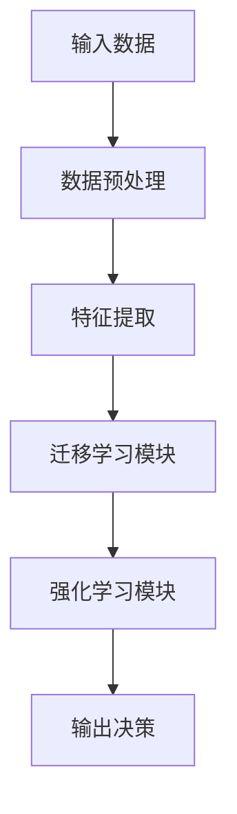
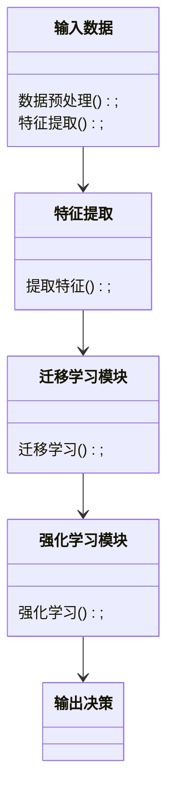
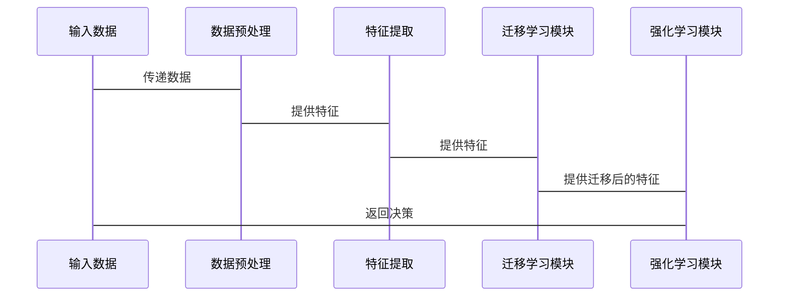

                 


# 迁移学习在AI Agent领域适应中的应用

> 关键词：迁移学习，AI Agent，适应性，强化学习，深度学习，知识蒸馏

> 摘要：本文探讨了迁移学习在AI Agent适应不同环境和任务中的应用。通过分析迁移学习的核心概念、方法及其与AI Agent适应机制的结合，展示了如何利用迁移学习提升AI Agent的灵活性和通用性。文章结合理论与实践，详细讲解了迁移学习的算法原理、系统架构设计以及实际案例，为读者提供了全面的理解和应用指导。

---

# 第1章: 迁移学习与AI Agent概述

## 1.1 迁移学习的背景与概念

### 1.1.1 迁移学习的定义与核心概念

迁移学习（Transfer Learning）是一种机器学习技术，旨在将从一个领域或任务中学到的知识应用到另一个相关领域或任务中。其核心在于发现不同任务或数据之间的共同特征或规律，从而减少新任务的学习成本。

- **核心概念**：
  - **源任务（Source Task）**：已解决的任务，提供知识的来源。
  - **目标任务（Target Task）**：需要解决的新任务。
  - **领域适配（Domain Adaptation）**：处理不同领域数据之间的差异性。
  - **任务适配（Task Adaptation）**：处理不同任务之间的差异性。

### 1.1.2 AI Agent的基本概念与特点

AI Agent（人工智能代理）是一种能够感知环境、自主决策并执行任务的智能体。其特点包括：

- **自主性**：能够自主决策，无需外部干预。
- **反应性**：能够实时感知环境并做出响应。
- **目标导向**：基于目标选择最优行动方案。
- **学习能力**：能够通过经验改进性能。

### 1.1.3 迁移学习在AI Agent中的作用

迁移学习能够帮助AI Agent快速适应新环境和任务，减少从头学习的开销。例如，训练一个AI Agent在游戏任务中表现出色后，通过迁移学习，可以让其快速适应现实世界中的类似任务。

---

## 1.2 迁移学习的理论基础

### 1.2.1 表征学习与特征提取

表征学习（Representation Learning）是迁移学习的重要基础，目标是将数据映射到一个低维特征空间，使得这些特征在不同任务中具有良好的区分性和泛化能力。

- **特征提取流程**：
  1. 对输入数据进行预处理（如归一化）。
  2. 使用神经网络提取深层特征。
  3. 对提取的特征进行调整以适应目标任务。

### 1.2.2 域适应与分布迁移

域适应（Domain Adaptation）旨在解决源域和目标域数据分布差异的问题。其核心思想是通过调整模型或数据分布，使得模型在目标域上表现良好。

- **主要方法**：
  - **对抗训练（Adversarial Training）**：通过生成对抗网络（GAN）调整数据分布。
  - **分布外推（Out-of-Distribution Generalization）**：学习跨域的共享特征。

### 1.2.3 迁移学习的核心假设与挑战

- **核心假设**：源任务和目标任务之间存在某种关联性。
- **主要挑战**：
  - 数据分布差异。
  - 任务目标差异。
  - 过度依赖源任务的知识。

---

## 1.3 AI Agent的适应机制

### 1.3.1 知识表示与推理

知识表示是AI Agent理解和推理的基础。常用的表示方法包括符号逻辑、知识图谱和神经网络表示。

- **符号逻辑表示**：通过逻辑规则表示知识，适用于推理任务。
- **知识图谱表示**：通过图结构表示实体间的关系，适用于复杂知识表示。

### 1.3.2 行为决策与策略优化

AI Agent的行为决策通常基于强化学习（Reinforcement Learning）框架，通过策略优化（Policy Optimization）来提升决策能力。

- **策略优化方法**：
  - **策略梯度（Policy Gradient）**：直接优化策略的参数。
  - **Q-learning**：通过值函数（Q-value）指导决策。

### 1.3.3 环境交互与反馈机制

AI Agent通过与环境交互获得反馈，不断调整行为策略。反馈机制包括奖励（Reward）和惩罚（Penalty）。

- **反馈机制设计**：
  - 奖励设计应与目标一致。
  - 惩罚设计应避免误导性反馈。

---

# 第2章: 迁移学习的核心概念与方法

## 2.1 迁移学习的主要方法

### 2.1.1 直接迁移

直接迁移（Direct Transfer）是最简单的迁移学习方法，适用于源任务和目标任务高度相似的情况。

- **实现步骤**：
  1. 在源任务上训练模型。
  2. 直接使用该模型在目标任务上进行预测。

### 2.1.2 数据增强

数据增强（Data Augmentation）是通过增加数据多样性来提升模型泛化能力的方法。

- **常见数据增强方法**：
  - 图像旋转、缩放、裁剪。
  - 文本替换、同义词替换。

### 2.1.3 知识蒸馏

知识蒸馏（Knowledge Distillation）是一种通过教师模型（Teacher）指导学生模型（Student）学习的方法。

- **实现步骤**：
  1. 训练教师模型。
  2. 使用教师模型的预测作为标签，训练学生模型。

### 2.1.4 对抗迁移

对抗迁移（Adversarial Transfer）通过对抗训练来调整数据分布。

- **对抗网络结构**：
  - 生成器（Generator）：生成适应目标任务的数据。
  - 判别器（Discriminator）：区分源域和目标域的数据。

---

## 2.2 迁移学习的评估指标

### 2.2.1 分类任务中的迁移性能

- **准确率（Accuracy）**：正确分类的比例。
- **精确率（Precision）**：预测正确的正例比例。
- **召回率（Recall）**：预测出的正例占实际正例的比例。

### 2.2.2 回归任务中的迁移效果

- **均方误差（MSE）**：预测值与真实值的平方差的平均值。
- **决定系数（R²）**：回归模型的拟合优度。

### 2.2.3 多任务学习中的迁移评估

- **任务间相关性**：任务之间的关联性越高，迁移效果越好。
- **共享特征的稳定性**：共享特征在不同任务中的表现是否一致。

---

## 2.3 迁移学习与深度学习的结合

### 2.3.1 基于深度学习的迁移方法

- **预训练模型（Pre-trained Models）**：如BERT、ResNet等。
- **微调（Fine-tuning）**：在目标任务上进一步优化模型参数。

### 2.3.2 预训练模型的应用

- **图像分类**：使用ImageNet预训练模型进行迁移。
- **自然语言处理**：使用BERT进行文本分类、问答等任务。

### 2.3.3 迁移学习中的模型压缩

- **模型剪枝（Pruning）**：删除冗余的神经元或连接。
- **模型蒸馏（Distillation）**：小模型学习大模型的知识。

---

# 第3章: AI Agent的适应性分析

## 3.1 AI Agent的任务适应性

### 3.1.1 任务分解与迁移

- **任务分解**：将复杂任务分解为多个子任务。
- **子任务迁移**：分别对子任务进行迁移学习。

### 3.1.2 任务优先级的动态调整

- **动态优先级**：根据环境变化调整任务执行顺序。
- **优先级迁移**：将源任务的优先级策略迁移到目标任务。

### 3.1.3 多任务学习在AI Agent中的应用

- **联合训练**：同时训练多个任务，共享底层特征。
- **任务权重调整**：根据目标任务的重要性调整学习权重。

---

## 3.2 环境适应性分析

### 3.2.1 环境建模与迁移

- **环境表示**：使用马尔可夫决策过程（MDP）建模环境。
- **环境迁移**：通过调整模型参数适应新环境。

### 3.2.2 环境反馈的迁移学习

- **反馈机制迁移**：将源环境的反馈机制迁移到目标环境。
- **环境特征提取**：提取环境的共享特征进行迁移。

### 3.2.3 知识的迁移与积累

- **知识表示**：使用知识图谱表示环境中的实体和关系。
- **知识积累**：通过迁移学习不断积累新知识。

---

## 3.3 知识迁移与应用

### 3.3.1 知识表示的迁移

- **符号逻辑迁移**：将符号逻辑规则迁移到新任务。
- **神经网络表示迁移**：迁移神经网络的深层特征。

### 3.3.2 知识蒸馏在AI Agent中的应用

- **教师模型**：训练一个教师模型掌握所需知识。
- **学生模型**：通过蒸馏技术学习教师模型的知识。

### 3.3.3 知识图谱的构建与迁移

- **知识图谱构建**：通过爬取和推理构建知识图谱。
- **知识图谱迁移**：将知识图谱迁移到新任务中。

---

# 第4章: 迁移学习与强化学习的结合

## 4.1 迁移强化学习的理论基础

### 4.1.1 强化学习的基本概念

- **状态（State）**：环境的当前情况。
- **动作（Action）**：AI Agent的决策。
- **奖励（Reward）**：对动作的反馈。

### 4.1.2 迁移强化学习的定义

- **定义**：将源任务的强化学习经验迁移到目标任务。
- **核心思想**：利用源任务的策略或价值函数指导目标任务的学习。

---

## 4.2 迁移强化学习的算法原理

### 4.2.1 策略迁移（Policy Transfer）

- **策略迁移方法**：
  - 直接迁移（Direct Transfer）：直接使用源任务的策略。
  - 适应性迁移（Adaptive Transfer）：调整策略以适应目标任务。

### 4.2.2 值函数迁移（Value Function Transfer）

- **值函数迁移方法**：
  - 直接迁移：直接使用源任务的价值函数。
  - 对抗迁移：通过对抗训练调整价值函数。

### 4.2.3 迁移强化学习的数学模型

- **策略表示**：$\pi_{\theta}(a|s)$，表示在状态$s$下选择动作$a$的概率。
- **值函数表示**：$V_{\phi}(s)$，表示状态$s$的价值。

---

## 4.3 迁移强化学习的算法实现

### 4.3.1 算法流程

1. 在源任务上训练策略$\pi_{\theta}$和价值函数$V_{\phi}$。
2. 将$\pi_{\theta}$和$V_{\phi}$迁移到目标任务。
3. 在目标任务上进行微调，优化模型参数。

### 4.3.2 实现代码示例

```python
import torch
import torch.nn as nn

# 源任务训练
source_policy = PolicyNetwork()
source_policy.train()

# 目标任务迁移
target_policy = PolicyNetwork()
target_policy.load_state_dict(source_policy.state_dict())

# 微调训练
optimizer = torch.optim.Adam(target_policy.parameters())
for epoch in epochs:
    optimizer.zero_grad()
    # 计算损失并反向传播
    loss.backward()
    optimizer.step()
```

---

## 4.4 迁移强化学习的实际应用

### 4.4.1 游戏AI

- **应用案例**：将游戏任务中的策略迁移到现实世界中的类似任务。
- **优势**：减少从头训练的时间和成本。

### 4.4.2 自动驾驶

- **应用案例**：将模拟环境中的驾驶经验迁移到真实道路。
- **优势**：加快自动驾驶模型的训练速度。

---

# 第5章: 系统性分析与架构设计方案

## 5.1 系统分析

### 5.1.1 问题场景介绍

- **问题描述**：AI Agent需要在多个环境中执行任务。
- **目标**：设计一个通用的迁移学习框架，支持多种任务和环境。

### 5.1.2 项目介绍

- **项目名称**：基于迁移学习的AI Agent适应系统。
- **目标**：提升AI Agent在不同环境中的适应能力。

---

## 5.2 系统功能设计

### 5.2.1 领域模型（Domain Model）

- **功能**：表示和处理不同领域的知识。
- **设计**：使用知识图谱表示领域知识。

### 5.2.2 迁移学习模块（Transfer Learning Module）

- **功能**：实现迁移学习算法。
- **设计**：支持多种迁移学习方法，如对抗迁移、知识蒸馏等。

### 5.2.3 强化学习模块（Reinforcement Learning Module）

- **功能**：实现强化学习算法。
- **设计**：支持策略迁移和值函数迁移。

---

## 5.3 系统架构设计

### 5.3.1 系统架构图



### 5.3.2 类图（Class Diagram）



---

## 5.4 系统接口设计

### 5.4.1 输入接口

- **输入数据格式**：JSON格式的数据。
- **接口功能**：接收输入数据并进行预处理。

### 5.4.2 输出接口

- **输出格式**：JSON格式的决策。
- **接口功能**：输出AI Agent的决策结果。

---

## 5.5 系统交互设计

### 5.5.1 交互流程

1. 输入数据经过预处理模块。
2. 特征提取模块提取特征。
3. 迁移学习模块进行迁移学习。
4. 强化学习模块生成决策。
5. 输出决策结果。

### 5.5.2 交互序列图



---

# 第6章: 迁移学习在AI Agent中的实际应用

## 6.1 项目实战

### 6.1.1 环境安装

- **安装Python**：确保Python版本为3.6以上。
- **安装依赖库**：安装PyTorch、TensorFlow等深度学习库。

### 6.1.2 核心实现

```python
import torch
import torch.nn as nn
import torch.optim as optim

class迁移学习模型(nn.Module):
    def __init__(self):
        super(迁移学习模型, self).__init__()
        self.conv1 = nn.Conv2d(3, 6, 5)
        self.pool = nn.MaxPool2d(2, 2)
        self.conv2 = nn.Conv2d(6, 16, 5)
        self.fc1 = nn.Linear(16 * 5 * 5, 120)
        self.fc2 = nn.Linear(120, 10)

    def forward(self, x):
        x = self.pool(F.relu(self.conv1(x)))
        x = self.pool(F.relu(self.conv2(x)))
        x = x.view(-1, 16 * 5 * 5)
        x = F.relu(self.fc1(x))
        x = self.fc2(x)
        return x

model = 迁移学习模型()
criterion = nn.CrossEntropyLoss()
optimizer = optim.SGD(model.parameters(), lr=0.001)

# 迁移学习训练
for epoch in range(10):
    for batch_x, batch_y in dataloader:
        outputs = model(batch_x)
        loss = criterion(outputs, batch_y)
        loss.backward()
        optimizer.step()
```

### 6.1.3 代码应用解读与分析

- **代码功能**：定义迁移学习模型并进行训练。
- **关键部分**：迁移学习模型的定义和训练过程。
- **优化点**：使用预训练模型和微调策略提升性能。

### 6.1.4 实际案例分析

- **案例描述**：将图像分类任务迁移到目标检测任务。
- **实现步骤**：
  1. 在源任务上预训练模型。
  2. 在目标任务上进行微调。

---

## 6.2 项目小结

### 6.2.1 项目总结

- **核心成果**：实现了基于迁移学习的AI Agent适应系统。
- **技术亮点**：结合迁移学习和强化学习，提升了系统的适应能力。

### 6.2.2 项目经验

- **经验总结**：迁移学习能够显著减少新任务的学习成本。
- **注意事项**：选择合适的迁移方法和模型设计至关重要。

---

# 第7章: 总结与展望

## 7.1 总结

迁移学习在AI Agent领域适应中的应用具有重要意义。通过迁移学习，AI Agent能够快速适应新环境和任务，显著提升其灵活性和通用性。

## 7.2 展望

未来，迁移学习在AI Agent中的应用将更加广泛。研究方向包括：

- **多模态迁移学习**：结合视觉、听觉等多种模态信息。
- **自适应强化学习**：实现更高效的策略迁移和价值函数迁移。
- **动态环境适应**：应对动态变化的环境和任务。

---

# 作者

作者：AI天才研究院/AI Genius Institute & 禅与计算机程序设计艺术/Zen And The Art of Computer Programming

