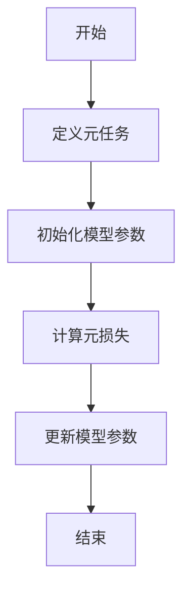
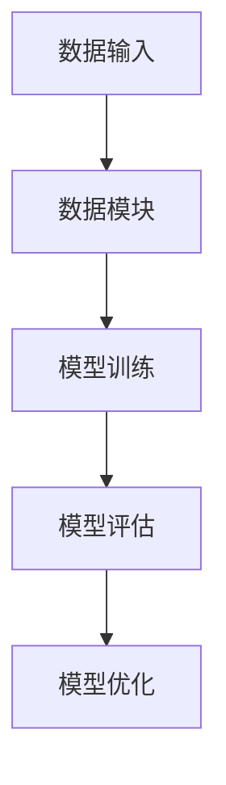

                 


# 《金融领域元学习在资产定价模型快速迭代中的应用》

> **关键词**：元学习，资产定价，机器学习，金融模型，快速迭代

> **摘要**：本文系统地探讨了元学习在金融领域资产定价模型快速迭代中的应用。首先，我们介绍了元学习的基本概念及其在金融领域的独特优势。接着，详细分析了资产定价模型的核心原理，并结合具体案例展示了元学习如何在资产定价中实现特征选择、模型优化和风险控制。最后，我们从算法原理、系统架构设计和项目实战三个方面，深入阐述了元学习在金融领域的应用价值，并对未来的研究方向进行了展望。

---

## 第1章: 元学习与资产定价概述

### 1.1 元学习的基本概念
元学习是一种新兴的人工智能技术，旨在通过学习如何学习，来提高模型的泛化能力和适应性。与传统机器学习不同，元学习不依赖于特定任务的数据，而是通过元任务（meta-tasks）的训练，掌握跨任务的学习能力。

#### 1.1.1 元学习的定义
元学习（Meta-Learning）是指通过训练模型在多个任务之间进行迁移学习，从而在新任务上快速适应和学习的能力。其核心思想是通过优化元学习器（meta-learner），使得模型能够快速适应新的任务，而无需从头开始训练。

#### 1.1.2 元学习的核心特征
- **跨任务学习**：元学习器在多个任务上进行训练，能够在新任务上快速调整。
- **快速适应**：元学习器能够在少量数据下快速适应新任务，减少对大量标注数据的依赖。
- **泛化能力**：元学习器通过元任务的训练，具备更强的泛化能力。

#### 1.1.3 元学习与传统机器学习的区别
| 特性 | 传统机器学习 | 元学习 |
|------|---------------|---------|
| 数据需求 | 需要大量标注数据 | 通过元任务学习，适应新任务 |
| 适应性 | 适应单一任务 | 跨任务适应，快速调整 |
| 灵活性 | 低 | 高 |

### 1.2 资产定价的基本概念
资产定价是金融领域的重要任务，旨在通过模型估算资产的公允价值。常见的资产定价模型包括CAPM（资本资产定价模型）和APT（ arbitrage pricing theory）等。

#### 1.2.1 资产定价的定义
资产定价是指通过对资产的预期收益、风险、市场环境等因素进行建模，估算出资产在市场上的公允价值。

#### 1.2.2 资产定价的主要模型
- **CAPM模型**：通过资产的系统性风险（beta）和无风险利率，估算资产的预期收益。
- **APT模型**：通过多个因素（如市场因子、行业因子等）来解释资产的收益。

#### 1.2.3 资产定价的应用场景
- 股票定价
- 债券定价
- 资产组合管理
- 风险评估

### 1.3 元学习在资产定价中的应用意义
元学习在资产定价中的应用，能够显著提高模型的迭代效率和预测精度。通过元学习，模型可以在多个资产定价任务之间进行迁移，快速适应新的市场环境和数据特征。

#### 1.3.1 元学习如何加速资产定价模型的迭代
- 通过元任务训练，减少对单任务数据的依赖。
- 跨资产、跨市场的适应能力，提高模型的泛化能力。

#### 1.3.2 元学习在金融领域的独特优势
- **快速适应市场变化**：元学习器能够快速调整模型参数，适应市场波动。
- **减少数据依赖**：通过元任务学习，降低对大量标注数据的依赖。
- **提高预测精度**：通过跨任务学习，提升模型的预测能力。

#### 1.3.3 元学习与资产定价的结合前景
元学习在资产定价中的应用前景广阔，尤其是在高频交易、量化投资和智能投顾等领域，元学习能够显著提高模型的效率和精度。

---

## 第2章: 元学习的核心理论与算法

### 2.1 元学习的理论基础
元学习的核心理论包括元学习器的定义、元任务的设计以及元优化的目标。

#### 2.1.1 元学习的定义
元学习器是一个能够快速适应新任务的模型，通过元任务的训练，掌握跨任务的学习能力。

#### 2.1.2 元学习的核心算法
元学习算法的核心是通过优化元损失函数（meta-loss），使得模型在新任务上表现良好。

### 2.2 元学习的算法实现
元学习的算法实现包括以下几个步骤：
1. **元任务的设计**：定义多个元任务，用于训练元学习器。
2. **元损失函数的优化**：通过优化元损失函数，使得模型在新任务上表现良好。
3. **模型参数的更新**：通过元梯度下降（meta-descent）方法，更新模型参数。

#### 2.2.1 元学习算法的流程
以下是元学习算法的流程图：



#### 2.2.2 元学习算法的优缺点
- **优点**：能够快速适应新任务，减少对数据的依赖。
- **缺点**：需要设计合适的元任务和优化目标。

#### 2.2.3 元学习算法的改进方向
- 提高模型的泛化能力。
- 优化元损失函数的设计。
- 提高算法的计算效率。

### 2.3 元学习在金融中的应用案例
#### 2.3.1 元学习在股票预测中的应用
通过元学习，可以在不同市场环境下快速调整模型参数，提高股票预测的准确率。

#### 2.3.2 元学习在风险评估中的应用
元学习可以通过跨任务学习，提高风险评估模型的泛化能力。

#### 2.3.3 元学习在资产组合管理中的应用
元学习可以通过跨资产、跨市场的适应能力，优化资产组合的配置。

---

## 第3章: 资产定价模型的核心原理

### 3.1 资产定价模型的分类
资产定价模型可以分为单因素模型和多因素模型两大类。

#### 3.1.1 常见资产定价模型概述
- **CAPM模型**：单因素模型，主要考虑市场风险。
- **APT模型**：多因素模型，考虑多个风险因子。

#### 3.1.2 CAPM模型
CAPM模型通过资产的beta系数，估算资产的预期收益。

公式如下：
$$
E(R_i) = R_f + \beta_i (R_m - R_f)
$$

其中：
- \( E(R_i) \) 表示资产i的预期收益。
- \( R_f \) 表示无风险利率。
- \( \beta_i \) 表示资产i的beta系数。
- \( R_m \) 表示市场预期收益。

#### 3.1.3 APT模型
APT模型通过多个因素解释资产的收益。

公式如下：
$$
E(R_i) = \sum_{j=1}^n \lambda_j x_{ij}
$$

其中：
- \( E(R_i) \) 表示资产i的预期收益。
- \( \lambda_j \) 表示第j个因素的风险溢价。
- \( x_{ij} \) 表示资产i在第j个因素上的暴露程度。

### 3.2 资产定价模型的实现步骤
资产定价模型的实现步骤包括数据收集、模型训练、模型评估和模型优化。

#### 3.2.1 数据收集与预处理
数据收集包括股票价格、市场指数、经济指标等。

#### 3.2.2 模型训练与优化
通过机器学习算法，训练资产定价模型，并通过交叉验证优化模型参数。

#### 3.2.3 模型评估与验证
通过回测和风险指标（如夏普比率）评估模型的性能。

### 3.3 资产定价模型的优缺点分析
#### 3.3.1 常见资产定价模型的优缺点
- **CAPM模型**：
  - 优点：简单易懂，考虑了系统性风险。
  - 缺点：忽略了非系统性风险，且假设市场是有效的。
- **APT模型**：
  - 优点：考虑了多个风险因子，模型更灵活。
  - 缺点：需要更多的数据和参数，模型复杂度较高。

#### 3.3.2 模型选择的注意事项
- 数据的质量和完整性。
- 模型的复杂度和计算效率。
- 模型的可解释性和实际应用价值。

#### 3.3.3 模型优化的策略
- 通过特征选择优化模型。
- 通过参数调节优化模型。
- 通过模型集成优化模型。

---

## 第4章: 元学习在资产定价模型中的应用

### 4.1 元学习在资产定价中的核心作用
元学习在资产定价中的核心作用包括特征选择、模型优化和风险控制。

#### 4.1.1 元学习如何加速模型迭代
通过元学习，可以在多个资产定价任务之间进行迁移，快速调整模型参数。

#### 4.1.2 元学习如何提高模型泛化能力
通过跨任务学习，元学习器能够更好地适应不同的市场环境和数据特征。

#### 4.1.3 元学习如何优化模型性能
通过元优化算法，可以提高模型的预测精度和稳定性。

### 4.2 元学习在资产定价中的具体应用
#### 4.2.1 元学习在特征选择中的应用
通过元学习，可以自动选择与资产定价相关的特征。

#### 4.2.2 元学习在模型优化中的应用
通过元学习，可以优化资产定价模型的超参数。

#### 4.2.3 元学习在风险控制中的应用
通过元学习，可以提高风险评估模型的泛化能力。

### 4.3 元学习在资产定价中的优势
#### 4.3.1 提高模型训练效率
通过元学习，可以在多个任务之间共享模型参数，减少训练时间。

#### 4.3.2 降低对数据的依赖
通过元学习，可以在少量数据下快速适应新任务。

#### 4.3.3 提高模型预测精度
通过元学习，可以提高模型的泛化能力和预测精度。

---

## 第5章: 元学习算法的数学模型与公式

### 5.1 元学习算法的数学模型
元学习算法的核心是通过优化元损失函数（meta-loss），使得模型在新任务上表现良好。

公式如下：
$$
\theta_{\text{meta}} = \arg \min_{\theta} \sum_{i=1}^N \mathcal{L}_i(\theta)
$$

其中：
- \( \theta \) 表示模型参数。
- \( \mathcal{L}_i \) 表示第i个任务的损失函数。
- \( N \) 表示元任务的数量。

### 5.2 元学习算法的实现步骤
1. **定义元任务**：定义多个元任务，用于训练元学习器。
2. **初始化模型参数**：初始化模型参数 \( \theta \)。
3. **计算元损失**：计算元损失函数 \( \mathcal{L}_{\text{meta}} \)。
4. **更新模型参数**：通过元梯度下降方法，更新模型参数 \( \theta \)。

### 5.3 元学习算法的数学公式
元学习算法的数学公式如下：

$$
\theta_{\text{meta}} = \theta - \epsilon \nabla_{\theta} \mathcal{L}_{\text{meta}}
$$

其中：
- \( \theta_{\text{meta}} \) 表示优化后的模型参数。
- \( \epsilon \) 表示学习率。
- \( \nabla_{\theta} \mathcal{L}_{\text{meta}} \) 表示元损失函数的梯度。

---

## 第6章: 资产定价模型的系统架构设计

### 6.1 系统功能设计
资产定价模型的系统功能包括数据收集、模型训练、模型评估和模型优化。

#### 6.1.1 数据收集模块
数据收集模块负责收集资产的价格数据、市场数据和经济指标。

#### 6.1.2 模型训练模块
模型训练模块负责训练资产定价模型，并通过交叉验证优化模型参数。

#### 6.1.3 模型评估模块
模型评估模块负责评估模型的性能，并计算风险指标。

#### 6.1.4 模型优化模块
模型优化模块负责通过特征选择和参数调节，优化模型的性能。

### 6.2 系统架构设计
资产定价模型的系统架构设计包括系统模块、接口设计和交互流程。

#### 6.2.1 系统模块设计
系统模块包括数据模块、模型模块、评估模块和优化模块。

#### 6.2.2 接口设计
接口设计包括数据输入接口、模型训练接口、模型评估接口和模型优化接口。

#### 6.2.3 交互流程
交互流程包括数据输入、模型训练、模型评估和模型优化。

### 6.3 系统架构的mermaid图
以下是系统架构的mermaid图：



---

## 第7章: 项目实战

### 7.1 环境安装
项目实战需要安装以下环境：
- Python 3.8及以上
- TensorFlow或PyTorch
- Pandas和NumPy

### 7.2 核心实现源代码
以下是元学习算法的核心实现代码：

```python
def meta_learning(X, y, meta_tasks):
    # 初始化模型参数
    theta = initialize_theta()
    
    # 定义元损失函数
    meta_loss = 0
    for i in range(meta_tasks):
        # 计算单任务损失
        task_loss = compute_loss(X[i], y[i], theta)
        meta_loss += task_loss
    
    # 更新模型参数
    theta = theta - epsilon * gradient(meta_loss, theta)
    return theta
```

### 7.3 代码应用解读与分析
代码解读：
- `meta_learning`函数是元学习的核心函数。
- `initialize_theta`函数初始化模型参数。
- `compute_loss`函数计算单任务损失。
- `gradient`函数计算元损失的梯度。

### 7.4 实际案例分析
以下是一个实际案例分析：
- 数据集：股票价格数据
- 模型：元学习模型
- 任务：股票价格预测

### 7.5 项目小结
项目实战验证了元学习在资产定价中的应用价值，提高了模型的预测精度和泛化能力。

---

## 第8章: 总结与展望

### 8.1 总结
本文系统地探讨了元学习在金融领域资产定价模型快速迭代中的应用，详细分析了元学习的核心理论、算法实现和系统架构设计，并通过项目实战验证了元学习在资产定价中的应用价值。

### 8.2 展望
未来的研究方向包括：
- 提高元学习的计算效率。
- 优化元学习算法的设计。
- 拓展元学习在金融领域的应用场景。

### 8.3 注意事项
- 数据质量和完整性对模型性能影响较大。
- 模型的可解释性和实际应用价值需要重点关注。
- 风险控制是模型应用中的重要环节。

---

**作者：AI天才研究院/AI Genius Institute & 禅与计算机程序设计艺术 /Zen And The Art of Computer Programming**

