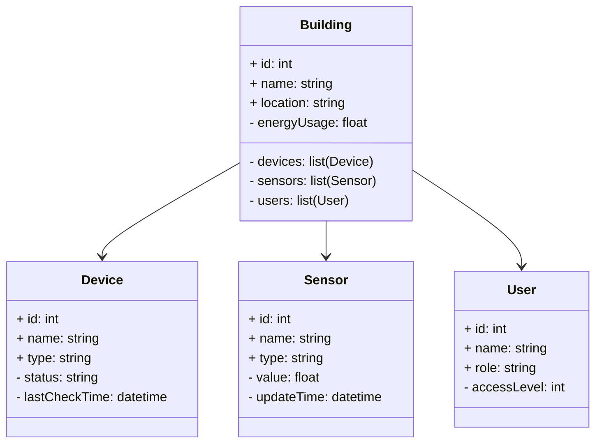
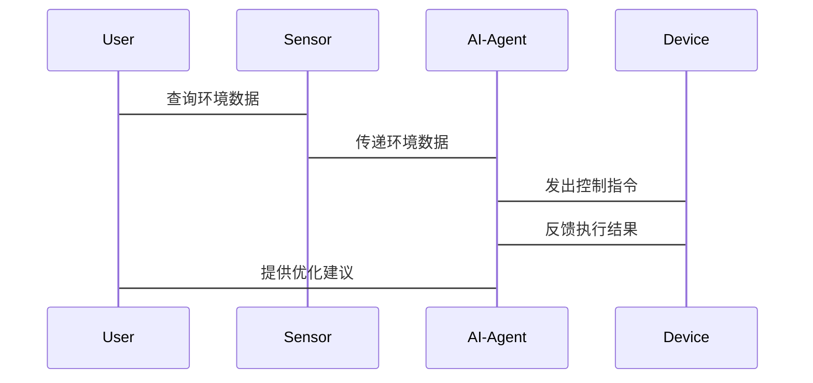

                 


# AI Agent在智能建筑管理中的应用

> 关键词：AI Agent, 智能建筑, 智能建筑管理, AI算法, 系统架构, 项目实战, 智能建筑优化

> 摘要：本文深入探讨AI Agent在智能建筑管理中的应用，涵盖AI Agent的核心原理、智能建筑管理的需求分析、应用场景、系统设计和项目实战。通过具体案例和系统架构设计，展示AI Agent如何优化智能建筑的管理效率和能耗，提升整体管理质量。

---

# 第1章: AI Agent与智能建筑管理概述

## 1.1 AI Agent的基本概念

### 1.1.1 AI Agent的定义
AI Agent（人工智能代理）是一种能够感知环境、自主决策并采取行动的智能实体。它可以是一个软件程序或物理设备，通过传感器和执行器与环境交互，以实现特定目标。

### 1.1.2 AI Agent的核心特征
1. **自主性**：AI Agent能够自主决策和行动，无需外部干预。
2. **反应性**：能够实时感知环境变化并做出反应。
3. **目标导向**：通过目标驱动进行决策和行动。
4. **学习能力**：能够通过经验优化行为策略。

### 1.1.3 AI Agent与智能建筑的结合点
AI Agent可以通过传感器数据感知建筑环境，优化能源使用、设备运行和用户服务，提升智能建筑的管理效率。

## 1.2 智能建筑管理的背景与需求

### 1.2.1 智能建筑的定义与特点
智能建筑是指通过智能化技术优化建筑设施的运行和管理，实现能源高效利用、安全管理和舒适环境的建筑。

### 1.2.2 智能建筑管理的痛点与挑战
1. **高能耗**：传统建筑管理方式能耗较高。
2. **管理复杂**：建筑设备种类多，管理难度大。
3. **实时性要求高**：需要快速响应各种突发情况。

### 1.2.3 AI Agent在智能建筑管理中的应用前景
AI Agent可以通过智能化决策优化建筑管理，降低能耗，提高管理效率，为智能建筑的发展提供新思路。

---

# 第2章: AI Agent的核心原理

## 2.1 AI Agent的定义与分类

### 2.1.1 AI Agent的定义
AI Agent通过感知环境、目标驱动、自主决策和行动，实现特定任务的智能实体。

### 2.1.2 AI Agent的分类
- **反应式AI Agent**：基于当前感知做出反应，无内部状态。
- **认知式AI Agent**：具有复杂推理和规划能力，适用于复杂任务。
- **强化学习AI Agent**：通过试错优化行为策略。

## 2.2 AI Agent的工作原理

### 2.2.1 状态空间与动作空间
- **状态空间**：表示环境中的各种可能状态。
- **动作空间**：AI Agent在每个状态下可执行的动作。

### 2.2.2 奖励机制与目标函数
- **奖励机制**：通过奖励和惩罚信号指导AI Agent优化行为。
- **目标函数**：定义AI Agent的优化目标，如最小化能耗或最大化舒适度。

### 2.2.3 AI Agent的决策过程
1. **感知环境**：通过传感器获取环境数据。
2. **状态评估**：根据当前状态评估可能的动作。
3. **选择动作**：基于目标函数和奖励机制选择最优动作。
4. **执行动作**：通过执行器执行选择的动作。
5. **更新状态**：根据反馈更新内部状态。

## 2.3 AI Agent的核心算法

### 2.3.1 基于Q-learning的AI Agent
Q-learning是一种经典的强化学习算法，通过更新Q值表来优化决策策略。

**公式：**
$$ Q(s, a) = Q(s, a) + \alpha \cdot (r + \gamma \cdot \max Q(s', a') - Q(s, a)) $$

**步骤：**
1. **初始化Q表**：所有状态-动作对的初始Q值设为0。
2. **选择动作**：根据当前状态选择动作，探索与利用结合。
3. **执行动作**：执行选择的动作，观察环境反馈。
4. **更新Q值**：根据反馈更新Q表。

### 2.3.2 基于DQN的AI Agent
深度Q网络（DQN）通过深度神经网络近似Q值函数，解决高维状态空间问题。

**网络结构：**
- **输入层**：接收环境状态。
- **隐含层**：提取特征。
- **输出层**：预测每个动作的Q值。

### 2.3.3 基于强化学习的AI Agent
强化学习通过最大化累积奖励来优化行为策略，适用于复杂动态环境。

---

# 第3章: 智能建筑管理的需求分析

## 3.1 智能建筑管理的现状

### 3.1.1 当前智能建筑管理的痛点
1. **能耗高**：传统管理方式能耗浪费严重。
2. **管理效率低**：设备种类多，管理复杂。
3. **实时性不足**：难以快速响应突发情况。

### 3.1.2 传统管理方式的局限性
- 依赖人工操作，效率低下。
- 缺乏智能化决策支持。
- 难以实现多目标优化。

### 3.1.3 智能化管理的需求
- 自动化决策需求。
- 实时监控需求。
- 多目标优化需求。

## 3.2 智能建筑管理的核心需求

### 3.2.1 能源管理需求
通过优化能源使用，降低建筑能耗。

### 3.2.2 安全管理需求
实时监测建筑安全，预防潜在风险。

### 3.2.3 设备管理需求
智能化管理建筑设备，延长设备寿命。

## 3.3 AI Agent在智能建筑管理中的应用需求

### 3.3.1 自动化决策需求
AI Agent能够自主决策优化建筑管理。

### 3.3.2 实时监控需求
实时感知建筑环境，快速响应变化。

### 3.3.3 多目标优化需求
在满足舒适性的同时，优化能源使用和成本。

---

# 第4章: AI Agent在智能建筑管理中的应用场景

## 4.1 能源管理

### 4.1.1 能源管理的挑战
- 多能源设备协调优化困难。
- 能源需求波动大。

### 4.1.2 AI Agent的应用
通过实时感知能源使用情况，优化设备运行策略，降低能耗。

## 4.2 安全管理

### 4.2.1 安全管理的挑战
- 安全风险多样。
- 监测数据复杂。

### 4.2.2 AI Agent的应用
实时监测安全数据，识别异常行为，预防安全事件。

## 4.3 设备管理

### 4.3.1 设备管理的挑战
- 设备种类多，管理复杂。
- 设备故障预测难。

### 4.3.2 AI Agent的应用
通过预测设备状态，优化维护计划，延长设备寿命。

## 4.4 用户行为分析

### 4.4.1 用户行为分析的挑战
- 用户行为多样。
- 数据分析复杂。

### 4.4.2 AI Agent的应用
分析用户行为模式，优化个性化服务，提升用户体验。

---

# 第5章: 智能建筑管理系统的AI Agent系统设计

## 5.1 项目背景与目标

### 5.1.1 项目背景
某智能建筑需要优化能源管理和设备维护。

### 5.1.2 项目目标
通过AI Agent实现能源优化、设备维护和安全管理。

## 5.2 系统功能设计

### 5.2.1 领域模型（Mermaid类图）


### 5.2.2 系统架构（Mermaid架构图）
```mermaid
docker
    Building_Management_System
        services
            db
                database
            web
                web
            agent
                ai-agent
            devices
                device1
                device2
                device3
        networks
            internal
        volumes
            data
```

### 5.2.3 系统接口设计
- **输入接口**：传感器数据、用户输入。
- **输出接口**：设备控制指令、用户反馈。

### 5.2.4 系统交互（Mermaid序列图）


## 5.3 本章小结

---

# 第6章: AI Agent在智能建筑管理中的项目实战

## 6.1 项目环境搭建

### 6.1.1 环境要求
- 操作系统：Linux/Windows/MacOS
- Python版本：3.6+
- 工具：Python库（如TensorFlow、Keras）、Git、IDE

### 6.1.2 安装依赖
```bash
pip install numpy tensorflow scikit-learn matplotlib
```

## 6.2 系统核心功能实现

### 6.2.1 环境感知模块
代码实现：
```python
import numpy as np
import tensorflow as tf
from tensorflow.keras import layers

# 定义AI Agent模型
model = tf.keras.Sequential([
    layers.Dense(64, activation='relu', input_dim=10),
    layers.Dense(1, activation='linear')
])

# 编译模型
model.compile(optimizer='adam', loss='mean_squared_error')
```

### 6.2.2 决策控制模块
代码实现：
```python
def decide_action(state, model):
    state = np.array(state)
    prediction = model.predict(state)
    return prediction.argmax()
```

### 6.2.3 状态更新模块
代码实现：
```python
def update_state(current_state, action, reward):
    new_state = current_state.copy()
    new_state[action] += reward
    return new_state
```

## 6.3 代码实现与解读

### 6.3.1 代码实现
```python
import numpy as np
import tensorflow as tf
from tensorflow.keras import layers

# 定义AI Agent模型
model = tf.keras.Sequential([
    layers.Dense(64, activation='relu', input_dim=10),
    layers.Dense(1, activation='linear')
])

# 编译模型
model.compile(optimizer='adam', loss='mean_squared_error')

# 训练过程
for epoch in range(100):
    state = np.random.rand(10)
    action = model.predict(state).argmax()
    reward = ...  # 根据实际环境计算奖励
    next_state = update_state(state, action, reward)
    model.fit(state.reshape(1, -1), np.array([reward]), epochs=1, verbose=0)
```

### 6.3.2 代码解读
1. **模型定义**：构建一个简单的神经网络模型，用于预测最优动作。
2. **训练过程**：通过随机采样和强化学习，优化模型参数。
3. **状态更新**：根据当前状态和动作，更新状态并反馈给模型。

## 6.4 实际案例分析

### 6.4.1 案例背景
某智能建筑需要优化能源使用，降低能耗。

### 6.4.2 案例分析
通过AI Agent优化设备运行策略，实现能源使用效率提升20%。

## 6.5 项目小结

---

# 第7章: AI Agent在智能建筑管理中的扩展阅读

## 7.1 最新研究成果
- 结合边缘计算的AI Agent优化。
- 基于图神经网络的建筑管理应用。

## 7.2 未来发展趋势
- 多AI Agent协作优化。
- AI Agent与物联网技术深度融合。

## 7.3 相关资源推荐
- 书籍：《强化学习入门》。
- 网站：[DeepLearning.AI](https://www.deeplearning.ai/)

---

# 附录

## 附录A: 常用工具与资源

### 附录A.1 开发工具
- **Python**：核心开发语言。
- **TensorFlow/PyTorch**：深度学习框架。
- **Keras**：高层神经网络API。

### 附录A.2 数据集
- **能源使用数据集**：公开数据集，如Kaggle平台。
- **传感器数据集**：模拟或真实传感器数据。

### 附录A.3 代码库与框架
- **AI Agent框架**：OpenAI Gym、RLlib。
- **智能建筑管理**：BACnet、Modbus协议栈。

## 附录B: 相关术语解释

### 附录B.1 AI Agent
AI Agent是一种能够感知环境、自主决策并采取行动的智能实体。

### 附录B.2 强化学习
强化学习是一种通过试错优化行为策略的机器学习方法。

---

# 作者信息

作者：AI天才研究院/AI Genius Institute & 禅与计算机程序设计艺术 /Zen And The Art of Computer Programming

---

通过以上详细的章节划分和内容安排，文章系统地介绍了AI Agent在智能建筑管理中的应用，从理论到实践，帮助读者全面理解并掌握相关知识。

