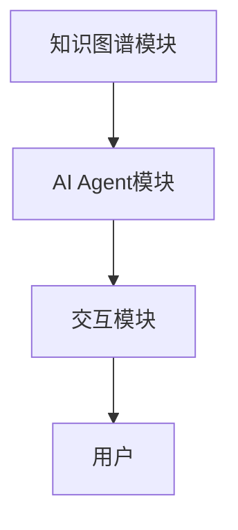

                 


# AI Agent的知识图谱集成方案

> 关键词：AI Agent，知识图谱，知识表示，语义理解，智能交互

> 摘要：本文系统阐述了AI Agent与知识图谱集成的核心原理、设计方法和应用场景。通过知识图谱的构建与管理，结合AI Agent的智能交互能力，提出了知识图谱驱动的AI Agent设计方案，并详细探讨了系统的架构设计、实现方法和优化策略。文章内容涵盖背景介绍、核心概念、算法原理、系统架构、项目实战和未来展望，旨在为AI Agent的知识图谱集成提供全面的技术参考。

---

## 第1章: 知识图谱与AI Agent概述

### 1.1 知识图谱的基本概念

知识图谱是一种以图结构形式表示知识的语义网络，节点表示实体或概念，边表示实体之间的关系。知识图谱通过构建大规模的结构化数据，帮助计算机理解和推理复杂的语义信息。

#### 1.1.1 知识图谱的定义
知识图谱（Knowledge Graph）是由Google于2012年首次提出的，是一种以图结构表示实体及其关系的数据模型。知识图谱的核心目标是将分散在互联网上的结构化数据整合为一个统一的语义网络，从而为搜索引擎、智能问答等应用提供更精准的知识支持。

#### 1.1.2 知识图谱的特点
知识图谱具有以下特点：
- **语义性**：通过实体和关系的语义信息，构建可理解的知识网络。
- **层次性**：支持多粒度的知识表达，从宏观概念到微观实例。
- **动态性**：支持实时更新和扩展，适应数据变化。
- **关联性**：通过关系链连接实体，支持复杂语义推理。

#### 1.1.3 知识图谱的构建方法
知识图谱的构建过程包括数据采集、预处理、实体识别、关系抽取和知识融合等步骤。常用的知识图谱构建方法包括：
- **基于规则的方法**：通过人工定义规则进行实体识别和关系抽取。
- **基于统计的方法**：利用统计学习模型自动提取实体和关系。
- **基于深度学习的方法**：使用神经网络模型（如BERT、Graph Neural Networks）进行端到端的知识抽取。

### 1.2 AI Agent的基本概念

AI Agent（人工智能代理）是一种能够感知环境、自主决策并执行任务的智能实体。AI Agent可以通过传感器获取信息，通过动作执行器与环境交互，具备问题求解、规划、推理和学习能力。

#### 1.2.1 AI Agent的定义
AI Agent是指在计算机系统中，通过感知环境、自主决策并执行任务的智能实体。AI Agent可以是软件程序、机器人或其他智能设备。

#### 1.2.2 AI Agent的类型
AI Agent可以分为以下几种类型：
- **简单反射型Agent**：基于当前感知直接执行预定义动作。
- **基于模型的反射型Agent**：维护环境模型，根据模型进行决策。
- **目标驱动型Agent**：基于目标进行规划和推理。
- **效用驱动型Agent**：基于效用函数进行决策优化。

#### 1.2.3 AI Agent的应用场景
AI Agent广泛应用于以下场景：
- 智能问答系统
- 智能推荐系统
- 自动化控制
- 机器人交互
- 智能监控

### 1.3 知识图谱与AI Agent的集成背景

知识图谱与AI Agent的集成能够充分发挥知识图谱的语义表达能力和AI Agent的智能交互能力，为智能系统提供更强大的知识支持和决策能力。

#### 1.3.1 知识图谱与AI Agent的结合必要性
- 知识图谱为AI Agent提供丰富的语义知识，增强其理解和推理能力。
- AI Agent通过知识图谱实现智能问答、语义理解等高级功能。

#### 1.3.2 集成带来的优势
- 提高AI Agent的知识表达能力，支持复杂的语义推理。
- 增强AI Agent的上下文理解和对话能力。
- 提供可解释的知识支持，提升系统的可信赖性。

#### 1.3.3 当前研究现状
目前，知识图谱与AI Agent的集成研究主要集中在以下方面：
- 知识图谱驱动的智能问答系统
- 基于知识图谱的语义理解与对话系统
- 知识图谱与机器学习的结合

### 1.4 本章小结
本章介绍了知识图谱和AI Agent的基本概念，分析了它们的集成背景和优势，为后续内容奠定了基础。

---

## 第2章: 知识图谱的核心概念与构建

### 2.1 知识图谱的构建流程

知识图谱的构建是一个复杂的过程，涉及数据采集、预处理、实体识别、关系抽取和知识融合等多个步骤。

#### 2.1.1 数据采集与预处理
- 数据来源：结构化数据（数据库）、半结构化数据（网页文本）、非结构化数据（自然语言文本）。
- 数据清洗：去除噪音数据，确保数据质量。

#### 2.1.2 实体识别与抽取
- 实体识别：从文本中识别出实体（如人名、地名、组织名）。
- 抽取方法：基于规则、统计学习、深度学习。

#### 2.1.3 关系抽取与构建
- 关系抽取：从文本中抽取实体之间的关系（如“是”、“属于”、“位于”）。
- 关系构建：将抽取的关系组织成图结构。

### 2.2 知识图谱的存储与管理

知识图谱的存储与管理是构建知识图谱的重要环节，需要考虑数据结构、存储效率和查询性能。

#### 2.2.1 数据库的选择
- 图数据库：Neo4j、RDF三元组数据库（如Jena）。
- 关系型数据库：适用于小型知识图谱存储。

#### 2.2.2 知识图谱的存储结构
- RDF三元组：（主语、谓词、宾语）的形式表示知识。
- 图结构：通过节点和边表示实体和关系。

#### 2.2.3 知识图谱的更新与维护
- 数据更新：定期更新知识图谱，保持数据的准确性和及时性。
- 数据融合：将多源数据融合到统一的知识图谱中。

### 2.3 知识图谱的可视化

知识图谱的可视化是理解和分析知识图谱的重要手段，常用的可视化工具包括Graphviz、Gephi等。

#### 2.3.1 知识图谱的可视化工具
- 图形化工具：Graphviz、Gephi。
- 可视化编程库：D3.js、NetworkX。

#### 2.3.2 知识图谱的可视
知识图谱的可视化通常采用节点和边的形式，通过颜色、大小、布局等方式展示实体和关系的层次结构和关联性。

---

## 第3章: AI Agent的原理与设计

### 3.1 AI Agent的原理

AI Agent的核心原理包括感知、决策和执行三个环节。

#### 3.1.1 感知环境
- 通过传感器获取环境信息。
- 解析环境信息，提取有用的信息。

#### 3.1.2 决策与推理
- 基于感知的信息，结合知识库进行推理。
- 制定决策策略。

#### 3.1.3 执行动作
- 根据决策结果，通过执行器执行动作。
- 反馈执行结果，更新知识库。

### 3.2 AI Agent的设计

AI Agent的设计需要考虑系统的功能需求、性能需求和扩展需求。

#### 3.2.1 系统功能设计
- 知识表示：将知识图谱中的实体和关系表示为系统可理解的形式。
- 语义理解：通过自然语言处理技术理解用户输入的语义信息。
- 智能交互：实现人机交互，支持对话和问答。

#### 3.2.2 系统架构设计
- 分层架构：分为感知层、决策层和执行层。
- 面向服务架构：通过服务化设计，提高系统的扩展性和复用性。

---

## 第4章: 知识图谱与AI Agent的集成原理

### 4.1 知识图谱与AI Agent的集成方法

知识图谱与AI Agent的集成方法包括知识表示、语义理解和智能交互三个步骤。

#### 4.1.1 知识表示
- 将知识图谱中的实体和关系表示为系统可理解的形式。
- 使用知识图谱的语义信息增强AI Agent的知识库。

#### 4.1.2 语义理解
- 通过自然语言处理技术理解用户输入的语义信息。
- 基于知识图谱进行语义推理和关联分析。

#### 4.1.3 智能交互
- 实现人机对话，支持问答、推荐和解释性交互。
- 通过知识图谱提供可信赖的知识支持。

### 4.2 知识图谱与AI Agent的集成流程

知识图谱与AI Agent的集成流程包括数据准备、知识表示、语义理解和智能交互四个步骤。

#### 4.2.1 数据准备
- 收集和整理知识图谱数据。
- 确保数据的准确性和完整性。

#### 4.2.2 知识表示
- 将知识图谱中的实体和关系表示为系统可理解的形式。
- 使用知识图谱的语义信息增强AI Agent的知识库。

#### 4.2.3 语义理解
- 通过自然语言处理技术理解用户输入的语义信息。
- 基于知识图谱进行语义推理和关联分析。

#### 4.2.4 智能交互
- 实现人机对话，支持问答、推荐和解释性交互。
- 通过知识图谱提供可信赖的知识支持。

---

## 第5章: 知识图谱在AI Agent中的应用

### 5.1 知识图谱在AI Agent中的应用场景

知识图谱在AI Agent中的应用场景包括智能问答、语义理解、推荐系统和对话系统。

#### 5.1.1 智能问答
- 基于知识图谱实现智能问答系统，提供精准的知识检索和推理。

#### 5.1.2 语义理解
- 通过知识图谱理解用户的意图，支持多轮对话和上下文理解。

#### 5.1.3 推荐系统
- 基于知识图谱进行个性化推荐，提供更精准的内容推荐。

#### 5.1.4 对话系统
- 通过知识图谱增强对话系统的知识库，提升对话的深度和广度。

### 5.2 知识图谱驱动的智能问答系统

知识图谱驱动的智能问答系统通过基于知识图谱的语义理解实现精准的知识检索和推理。

#### 5.2.1 系统架构
- 用户输入：用户提出问题。
- 语义理解：基于知识图谱理解用户意图。
- 知识检索：从知识图谱中检索相关知识。
- 结果生成：生成回答。

#### 5.2.2 关键技术
- 基于知识图谱的语义理解：通过自然语言处理技术理解用户意图。
- 知识图谱检索：基于语义理解从知识图谱中检索相关信息。

---

## 第6章: 系统架构与设计

### 6.1 系统架构设计

系统架构设计需要考虑知识图谱的存储、AI Agent的交互和系统的扩展性。

#### 6.1.1 系统功能模块
- 知识图谱模块：负责知识图谱的存储、查询和更新。
- AI Agent模块：负责感知环境、决策和执行。
- 交互模块：负责人机交互，支持问答和对话。

#### 6.1.2 系统架构图



### 6.2 系统接口设计

系统接口设计需要考虑模块之间的交互和数据流。

#### 6.2.1 知识图谱接口
- 查询接口：提供基于关键词或条件的知识图谱查询接口。
- 更新接口：提供知识图谱的更新接口，支持新增、删除和修改操作。

#### 6.2.2 AI Agent接口
- 感知接口：提供环境感知接口，支持传感器数据的获取。
- 决策接口：提供基于知识图谱的决策接口，支持语义理解和知识推理。

### 6.3 系统交互流程

系统交互流程包括用户输入、知识图谱查询、AI Agent决策和执行。

#### 6.3.1 用户输入
- 用户通过交互模块输入问题或指令。

#### 6.3.2 知识图谱查询
- AI Agent模块通过知识图谱模块查询相关知识。

#### 6.3.3 AI Agent决策
- 基于知识图谱查询结果进行决策。

#### 6.3.4 系统执行
- 根据决策结果执行相关操作。

---

## 第7章: 项目实战

### 7.1 环境配置

项目实战需要配置开发环境，包括安装必要的工具和库。

#### 7.1.1 安装Python
- 安装Python 3.x及以上版本。
- 安装必要的Python库：numpy、pandas、networkx、requests。

#### 7.1.2 安装知识图谱工具
- 安装图数据库：Neo4j。
- 安装知识图谱构建工具：RDF4j。

### 7.2 核心代码实现

核心代码实现包括知识图谱的构建、AI Agent的实现和交互模块的开发。

#### 7.2.1 知识图谱构建代码

```python
from networkx import Graph

def build_knowledge_graph():
    g = Graph()
    g.add_node("Alice")
    g.add_node("Bob")
    g.add_edge("Alice", "Bob", weight=1)
    return g

knowledge_graph = build_knowledge_graph()
```

#### 7.2.2 AI Agent实现代码

```python
class AI-Agent:
    def __init__(self, knowledge_graph):
        self.knowledge_graph = knowledge_graph

    def perceive(self, input):
        # 感知环境，返回语义理解结果
        pass

    def decide(self, semanticUnderstanding):
        # 基于知识图谱进行决策
        pass

    def execute(self, decision):
        # 执行决策
        pass
```

### 7.3 项目小结

项目实战部分通过具体的代码实现，展示了知识图谱与AI Agent集成的实现过程。通过实际操作，读者可以更好地理解知识图谱与AI Agent的集成方法。

---

## 第8章: 最佳实践与未来展望

### 8.1 最佳实践

知识图谱与AI Agent的集成需要遵循以下最佳实践：
- 数据质量管理：确保知识图谱数据的准确性和完整性。
- 系统可扩展性：设计模块化的系统架构，便于功能扩展。
- 安全性设计：保护知识图谱中的敏感信息，防止数据泄露。

### 8.2 未来展望

知识图谱与AI Agent的集成未来将朝着以下方向发展：
- 智能化：结合大语言模型，实现更强大的语义理解和对话能力。
- 实时化：支持实时知识更新和动态推理。
- 多模态化：结合图像、视频等多种数据源，实现更丰富的知识表示。

---

## 附录

### 附录A: 参考资料

- 知识图谱相关文献
- AI Agent相关文献
- 系统架构设计参考文档

### 附录B: 工具推荐

- 知识图谱构建工具：Neo4j、RDF4j。
- AI Agent开发框架：Rasa、Dialogflow。

---

作者：AI天才研究院/AI Genius Institute & 禅与计算机程序设计艺术 /Zen And The Art of Computer Programming

