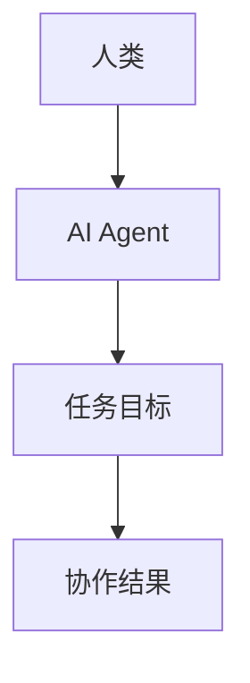
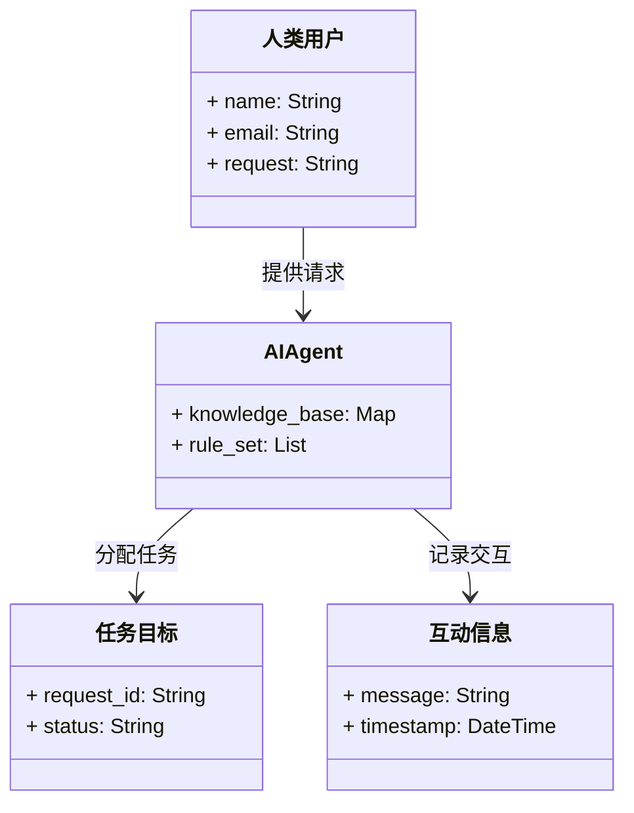
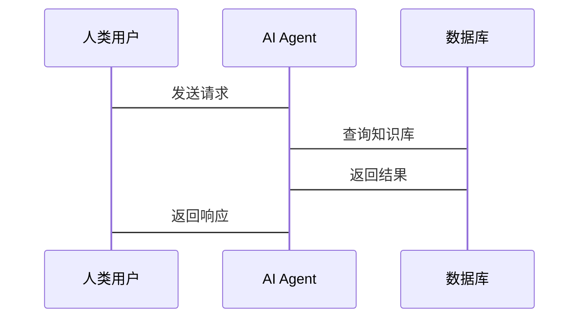

                 


# 人机协作：设计AI Agent与人类的配合模式

---

## 关键词：
人机协作, AI Agent, 协作模式, 系统架构, 项目实战

---

## 摘要：
人机协作是人工智能领域的重要研究方向，旨在设计AI Agent与人类高效配合的工作模式。本文从理论基础、协作模式、技术实现、项目实战和未来趋势五个方面，系统地探讨了人机协作的设计方法。通过分析AI Agent的决策机制、协作模型以及实际应用场景，本文提出了优化协作模式的关键策略，并提供了详细的数学模型和系统架构设计。最后，结合实际案例，本文总结了人机协作中的最佳实践和未来发展方向。

---

## 第一部分：人机协作的理论基础

### 第1章：人机协作的基本概念

#### 1.1 问题背景与问题描述

##### 1.1.1 人机协作的背景
人机协作（Human-Machine Collaboration）是指人类与人工智能系统（AI Agent）共同完成任务的过程。随着AI技术的快速发展，人机协作的应用场景日益广泛，例如智能客服、自动驾驶、医疗辅助诊断等领域。然而，如何设计高效的协作模式，使人类与AI Agent能够互补优势、协同工作，仍是一个需要深入研究的难题。

##### 1.1.2 问题的提出与定义
在人机协作中，AI Agent需要具备以下核心能力：
- **理解能力**：能够理解人类的需求、意图和情感。
- **决策能力**：能够在复杂场景中做出合理的决策。
- **协作能力**：能够与人类或其他AI Agent协同完成任务。

人机协作的核心问题在于如何实现AI Agent与人类之间的高效通信与协调，确保双方在协作过程中能够实时互动、共同优化任务完成效果。

##### 1.1.3 人机协作的核心要素与边界
人机协作的核心要素包括：
1. **人类参与者**：人类在协作过程中扮演决策者或执行者的角色。
2. **AI Agent**：AI Agent负责处理复杂任务或提供辅助支持。
3. **协作环境**：包括物理环境或数字环境，如操作系统、网络等。
4. **协作目标**：协作任务的具体目标和约束条件。

人机协作的边界在于，AI Agent需要在不干预人类决策的前提下，提供足够的支持和建议，同时能够根据人类的反馈动态调整协作策略。

#### 1.2 人机协作的核心概念

##### 1.2.1 人机协作的定义
人机协作是一种通过人类与AI Agent的互动，共同完成特定任务的合作模式。其本质是通过优化信息流和决策过程，实现人机双方的高效配合。

##### 1.2.2 人机协作的属性特征对比表
以下是人机协作与其他协作模式的对比：

| 特性            | 人机协作 | 人人协作 | 机机协作 |
|-----------------|----------|----------|----------|
| 参与者          | 人类 + AI | 人类 + 人类 | AI + AI |
| 信息处理方式    | 智能化    | 半智能化   | 完全自动化 |
| 决策主体        | 人类主导  | 双向主导   | AI主导   |
| 协作复杂度      | 高       | 中       | 高       |

##### 1.2.3 实体关系图（ER图）分析
以下是人机协作的核心实体关系图：

```mermaid
er
    actor: 人类用户
    agent: AI Agent
    interaction: 互动信息
    task: 任务目标
    constraint: 约束条件

    actor -|> interaction: 提供输入
    agent -|> interaction: 提供输出
    interaction -|> task: 支持任务完成
    task -|> constraint: 遵循约束条件
```

---

### 第2章：AI Agent的基本原理

#### 2.1 AI Agent的定义与类型

##### 2.1.1 AI Agent的定义
AI Agent是一种能够感知环境、自主决策并执行任务的智能实体。它能够通过传感器获取信息，利用算法处理信息，并通过执行器与环境交互。

##### 2.1.2 AI Agent的分类
AI Agent可以分为以下几类：
1. **简单反射型AI Agent**：基于规则进行决策，适用于简单任务。
2. **基于模型的AI Agent**：利用内部模型进行决策，适用于复杂任务。
3. **学习型AI Agent**：通过机器学习算法不断优化决策策略。

##### 2.1.3 不同类型AI Agent的特点
以下是不同类型AI Agent的特点对比：

| 类型            | 简单反射型 | 基于模型的 | 学习型 |
|-----------------|------------|------------|--------|
| 决策方式        | 基于规则   | 基于模型   | 基于学习 |
| 适用场景        | 简单任务   | 复杂任务   | 动态任务 |
| 决策能力        | 低         | 中         | 高     |

#### 2.2 AI Agent的决策机制

##### 2.2.1 基于规则的决策
基于规则的决策是一种简单但有效的决策方式。例如，在智能客服系统中，AI Agent可以根据预设的规则库为用户提供标准化的解决方案。

##### 2.2.2 基于学习的决策
基于学习的决策利用机器学习算法，通过训练数据优化决策模型。例如，在医疗辅助诊断中，AI Agent可以通过深度学习模型预测疾病的可能性。

##### 2.2.3 混合型决策机制
混合型决策机制结合了基于规则和基于学习的优势，适用于复杂任务。例如，在自动驾驶中，AI Agent可以根据规则进行初步判断，同时通过学习模型优化决策。

#### 2.3 AI Agent的通信与协作

##### 2.3.1 AI Agent之间的通信方式
AI Agent之间可以通过消息队列（如Kafka）或API接口进行通信。

##### 2.3.2 人机之间的通信方式
人类与AI Agent可以通过自然语言处理技术（如NLP）进行交互。

##### 2.3.3 协作过程中的信息交换
以下是人机协作中的信息交换流程：



---

## 第二部分：人机协作的协作模式

### 第3章：人机协作的模式分析

#### 3.1 协作模式的分类

##### 3.1.1 人主导型协作
在人主导型协作中，人类是主要决策者，AI Agent负责提供支持和建议。例如，在法律咨询中，律师主导决策，AI Agent提供案例检索和法律条文分析。

##### 3.1.2 机主导型协作
在机主导型协作中，AI Agent是主要决策者，人类负责监督和修正。例如，在自动驾驶中，AI Agent主导驾驶决策，人类驾驶员负责应急处理。

##### 3.1.3 人机共主导型协作
在人机共主导型协作中，人类和AI Agent共同决策，根据任务复杂度动态调整决策权。例如，在金融投资中，人类投资者和AI Agent共同制定投资策略。

#### 3.2 不同协作模式的特点

##### 3.2.1 人主导型协作的特点
- 人类决策权高
- AI Agent提供辅助支持
- 适用于需要人类直觉和创造力的任务

##### 3.2.2 机主导型协作的特点
- AI Agent决策权高
- 人类负责监督和修正
- 适用于规则明确且复杂的任务

##### 3.2.3 人机共主导型协作的特点
- 人类和AI Agent共同决策
- 根据任务动态调整决策权
- 适用于复杂性和创新性并存的任务

#### 3.3 协作模式的选择与优化

##### 3.3.1 协作模式选择的依据
协作模式的选择取决于任务的复杂度、人类的参与度以及AI Agent的能力。例如，简单任务可以选择人主导型协作，复杂任务可以选择机主导型协作，创新任务可以选择人机共主导型协作。

##### 3.3.2 协作模式的优化方法
- 根据任务动态调整决策权
- 提供实时反馈和优化建议
- 定期评估协作效果并改进

##### 3.3.3 协作模式的动态调整
协作模式的动态调整可以通过以下步骤实现：
1. **监控任务状态**：实时跟踪任务的进展和复杂度。
2. **评估协作效果**：根据任务目标和人类反馈，评估当前协作模式的有效性。
3. **调整协作策略**：根据评估结果，动态调整决策权和协作方式。

---

## 第三部分：人机协作的技术实现

### 第4章：人机协作的算法原理

#### 4.1 协作算法的数学模型

##### 4.1.1 协作过程中的信息传递
以下是协作过程中的信息传递模型：

$$
\text{协作结果} = f(\text{人类输入}, \text{AI Agent输入})
$$

##### 4.1.2 协作决策的优化
协作决策的优化可以通过以下目标函数实现：

$$
\min_{\theta} \sum_{i=1}^{n} (y_i - f(x_i, \theta))^2
$$

其中，$y_i$ 是实际输出，$f(x_i, \theta)$ 是模型预测值，$\theta$ 是模型参数。

##### 4.1.3 协作过程中的反馈机制
反馈机制是优化协作过程的关键。以下是反馈机制的数学表达式：

$$
\text{反馈} = \frac{\text{实际结果} - \text{预测结果}}{\text{预测结果}}
$$

#### 4.2 协作算法的实现步骤

##### 4.2.1 环境感知
AI Agent通过传感器或API获取环境信息。

##### 4.2.2 信息处理
AI Agent利用算法对信息进行处理，生成决策建议。

##### 4.2.3 人类反馈
人类根据AI Agent的建议，提供反馈或调整决策。

##### 4.2.4 决策执行
AI Agent根据最终决策执行操作，并将结果反馈给人类。

---

## 第四部分：人机协作的项目实战

### 第5章：人机协作的实际应用

#### 5.1 项目背景介绍
以智能客服系统为例，设计一个基于人机协作的解决方案。

#### 5.2 系统功能设计

##### 5.2.1 领域模型
以下是智能客服系统的领域模型：



##### 5.2.2 系统架构设计
以下是系统架构设计图：


##### 5.2.3 系统接口设计
以下是系统接口设计：

```http
POST /api/v1/agent/request
Content-Type: application/json

{
    "request": "如何重置密码？",
    "user_id": "123"
}
```

##### 5.2.4 系统交互设计
以下是系统交互流程图：



#### 5.3 项目实战：智能客服系统的实现

##### 5.3.1 环境安装
需要安装以下工具：
- Python 3.8+
- Flask框架
- NLTK库

##### 5.3.2 核心实现源代码
以下是AI Agent的核心实现代码：

```python
class AIAgent:
    def __init__(self, knowledge_base):
        self.knowledge_base = knowledge_base
        self.rule_set = []

    def process_request(self, request):
        # 基于规则的决策
        for rule in self.rule_set:
            if rule.matches(request):
                return rule.apply(request)
        # 基于学习的决策
        response = self.predict(request)
        return response

    def predict(self, request):
        # 简单示例，实际应用中应替换为具体的机器学习模型
        return self.knowledge_base.get(request, "抱歉，我无法回答您的问题。")
```

##### 5.3.3 代码应用解读与分析
上述代码展示了AI Agent的核心功能：
1. **初始化**：加载知识库和规则集。
2. **处理请求**：根据规则集和预测模型生成响应。
3. **预测**：简单示例展示了基于知识库的预测逻辑。

##### 5.3.4 实际案例分析
以下是智能客服系统的实际案例分析：
1. **用户请求**：用户发送“如何重置密码？”
2. **AI Agent处理**：AI Agent首先检查规则集，发现匹配规则，返回“请前往设置页面重置密码。”
3. **反馈优化**：如果用户反馈“找不到设置页面”，AI Agent将进一步查询知识库，返回具体的操作步骤。

---

## 第五部分：人机协作的未来趋势

### 第6章：人机协作的未来展望

#### 6.1 人机协作的未来发展方向

##### 6.1.1 通用AI Agent的实现
未来，通用AI Agent将成为可能，能够适应多种场景和任务。

##### 6.1.2 边缘计算与人机协作
随着边缘计算的发展，人机协作将更加实时和高效。

#### 6.2 人机协作中的注意事项

##### 6.2.1 数据隐私与安全
人机协作需要确保数据的隐私和安全，避免信息泄露。

##### 6.2.2 人类信任与接受度
人类对AI Agent的信任度是协作成功的关键，需要通过透明化和可解释性来提升信任。

#### 6.3 未来研究方向

##### 6.3.1 人机协作的伦理问题
未来研究需要关注人机协作中的伦理问题，例如AI Agent的决策责任归属。

##### 6.3.2 人机协作的动态优化
研究如何实现协作过程的动态优化，以应对复杂和多变的任务环境。

---

## 作者：AI天才研究院/AI Genius Institute & 禅与计算机程序设计艺术 /Zen And The Art of Computer Programming

---

以上是《人机协作：设计AI Agent与人类的配合模式》的技术博客文章的完整内容，涵盖了从理论到实践的各个方面，为读者提供了深入的理解和实用的指导。

